# RLHF平替算法DPO篇

- [RLHF平替算法DPO篇](#rlhf平替算法dpo篇)
  - [一、DPO vs RLHF？](#一dpo-vs-rlhf)
  - [二、介绍一下 DPO的损失函数？](#二介绍一下-dpo的损失函数)
  - [三、DPO 微调流程 ?](#三dpo-微调流程-)
  - [四、说一下 DPO 是如何简化 RLHF 的？](#四说一下-dpo-是如何简化-rlhf-的)
  - [五、DPO的第0步loss是固定的么？如果固定的话，值是多少？](#五dpo的第0步loss是固定的么如果固定的话值是多少)
  - [六、DPO是一个on-policy还是off-policy的算法，以及这样的算法有什么优劣？](#六dpo是一个on-policy还是off-policy的算法以及这样的算法有什么优劣)
  - [七、DPO公式是由PPO的objective公式推导过来的，为什么DPO是off-policy算法，而PPO是on-policy算法，到底哪一步推导出了问题？](#七dpo公式是由ppo的objective公式推导过来的为什么dpo是off-policy算法而ppo是on-policy算法到底哪一步推导出了问题)
  - [八、DPO为什么会在学习过程中training positive的概率和training negative的概率都同时下降？](#八dpo为什么会在学习过程中training-positive的概率和training-negative的概率都同时下降)
  - [九、在什么情况下DPO exactly 数学上等同于 PPO？](#九在什么情况下dpo-exactly-数学上等同于-ppo)
  - [十、DPO的变体有哪些，主要解决DPO的什么问题？](#十dpo的变体有哪些主要解决dpo的什么问题)
  - [十一、DPO训练后的模型为什么会输出越来越长？](#十一dpo训练后的模型为什么会输出越来越长)
  - [十二、DPO训练可能会出现什么问题？](#十二dpo训练可能会出现什么问题)
  - [十三、讲一下DPO和PPO，DPO和PPO有什么区别？](#十三讲一下dpo和ppodpo和ppo有什么区别)
  - [代码解释](#代码解释)
    - [1. DPO损失函数 代码实现？](#1-dpo损失函数-代码实现)
    - [2. DPO 批次训练过程 代码实现？](#2-dpo-批次训练过程-代码实现)
    - [3. LM的交叉熵计算 代码实现？](#3-lm的交叉熵计算-代码实现)
  - [致谢](#致谢)

## 一、DPO vs RLHF？

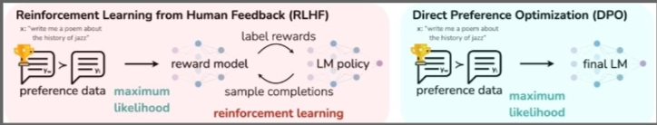

上图左边是RLHF算法，右边为DPO算法，两图的差异对比即可体现出DPO的改进之处。

1. RLHF算法:**包含奖励模型(reward model)和策略模型(policy model，也称为演员模型，actor model)**，基于偏好数据以及强化学习不断迭代优化策略模型的过程。
2. DPO算法:**不包含奖励模型和强化学习过程，直接通过偏好数据进行微调，将强化学习过程直接转换为SFT过程**，因此整个训练过程简单、高效，**主要的改进之处体现在于损失函数**。

> ps:

1. 偏好数据，可以表示为三元组(提示语prompt, 良好回答chosen, 一般回答rejected)。论文中的chosen表示为下标w(即win)，rejected表示为下标l(即lose)

2. RLHF常使用PPO作为基础算法，整体流程包含了4个模型，且通常训练过程中需要针对训练的actor model进行采样，因此训练起来，稳定性、效率、效果不易控制。

- a. actor model/policy model: 待训练的模型，通常是SFT训练后的模型作为初始化
- reference model: 参考模型，也是经SFT训练后的模型进行初始化，且通常与actor model是同一个模型，且模型冻结，不参与训练，其作用是在强化学习过程中，保障actor model与reference model的分布差异不宜过大。
- reward model: 奖励模型，用于提供每个状态或状态动作对的即时奖励信号。
- Critic model: 作用是估计状态或状态动作对的长期价值，也称为状态值函数或动作值函数。

3. DPO算法仅包含RLHF中的两个模型，即演员模型(actor model)以及参考(reference model)，且训练过程中不需要进行数据采样。

## 二、介绍一下 DPO的损失函数？

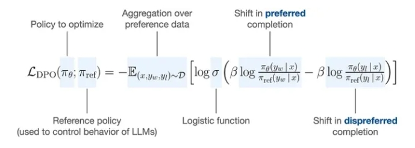
> DPO损失函数

如何将RLHF的Reward model过程简化为上式，作者花了大量篇幅进行了推导，感兴趣的读者可以参考附件DPO的论文。

**DPO算法的目的是最大化奖励模型(此处的奖励模型即为训练的策略)，使得奖励模型对chosen和rejected数据的差值最大，进而学到人类偏好。**

上式的后半部分通过对数函数运算规则，可以进行如下转化。

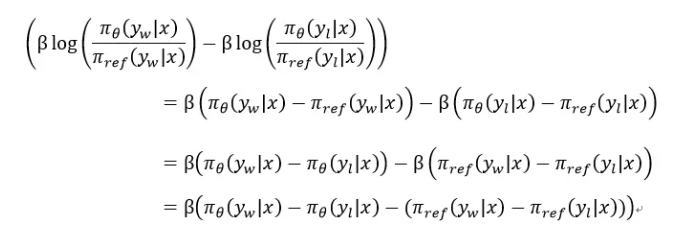
> Loss 公式转换

转化后的公式和源代码中的计算函数中的公式是一致的。

其中左半部分是训练的policy模型选择chosen优先于rejected，右半部分是冻结的reference模型选择chosen优先于rejected，二者的差值可类似于KL散度，保障actor模型的分布与reference模型的分布不会有较大的差异。

## 三、DPO 微调流程 ?

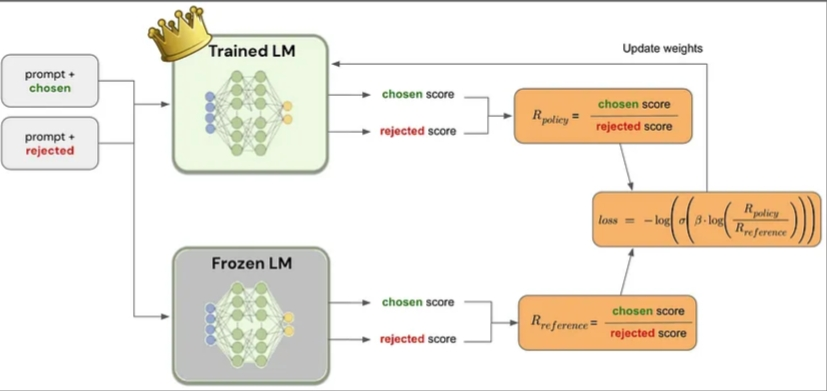
> DPO微调流程

上图展示了DPO微调的大致流程，其中Trained LM即为策略模型，Frozen LM即为参考模型，二者均是先进行SFT微调得到的模型进行初始化，其中Trained LM需要进行训练，Frozen LM不参与训练。

两个模型分别针对chosen和rejected进行预测获取对应的得分，再通过DPO的损失函数进行损失计算，进而不断的迭代优化。

## 四、说一下 DPO 是如何简化 RLHF 的？

- RLHF 是如何训练？

RLHF 一般会分 2 步:

1. 第一步是训练 reward model。训练数据是同一个 prompt 的 2 个回答，让人或 GPT4 标注哪个回答更好，reward model 会去优化如下的 loss：

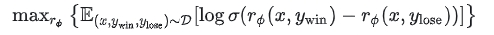

其中 r 就是 reward model 用来给回答打分。D 是训练数据集，x 是 prompt，$y_{win}$ 和 $y_{loss}$ 分别是好的回答和不好的回答。也就是说，要尽可能让好的回答的得分比不好的回答高，拉大他们之间的差别。

2. 第二步是用 RL 算法来提升模型的得分。使用的 loss 是：

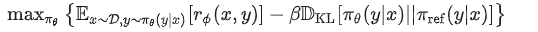

其中 $π_θ$ 是我们在训练的 LLM，$π_{ref}$ 是训练的初始值。这个 loss 意思是希望 LLM 输出的回答的评分能尽可能高，同时 $π_θ$ 不要偏离 $π_{ref}$ 太多，保证它还能正常做回答，不要训成一个评分很高但是回答乱码的东西。

- DPO 优化策略？

DPO 的作者们意识到，后面的这个式子是有显式解的。因为：

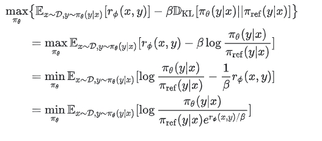

如果我们归一化一下分母，即取

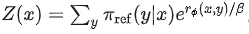

也就可以构造出一个新的概率分布：

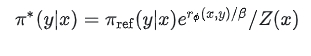

那么上式变成了：

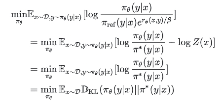

由于 KL 散度在 2 个分布相等时取最小值，我们得到了这样的结论：RLHF 训练希望得到的最优的概率分布就是 $π^{*}$。

另一个角度来说，由 $π^{*}$ 的公式，我们相当于是得到了 r 和 $π^{*}$ 的关系，那么是否我们可以把训练 r 转化成直接去训练 $π^{*}$ 呢？

简单转换一下 $π^{*}$ 的定义式，可以得到：

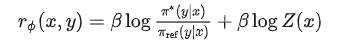

带入最上面优化 r 的 loss，也就有了：

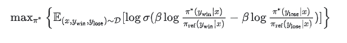

或者说，我们可以直接用这个 loss 去求 $π_θ$:

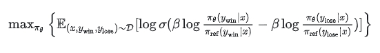

这就是 DPO 的 loss。DPO 通过以上的公式转换把 RLHF 无损地转化为了 SFT，在训练的时候不再需要同时跑 4 个模型（reward model, ref model, critic, actor），而是只用跑 actor 和 ref 2 个模型，甚至由于不再在线采数据，ref model 的输出可以预先存下来，训练的时候重复使用。

## 五、DPO的第0步loss是固定的么？如果固定的话，值是多少？

是固定的，因为DPO loss 为：

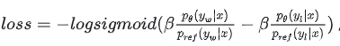

其中 yw 是positive的y，而 yl 是negative的y。那么开始的时候由于优化的网络参数等于reference的网络参数，因此

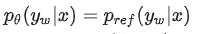

同理可得

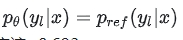

故

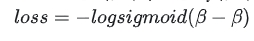

这个数应该=0.693。

## 六、DPO是一个on-policy还是off-policy的算法，以及这样的算法有什么优劣？

DPO是一个off-policy的算法，因为训练DPO的pair数据不一定来自ref policy或者sft policy。优势是不需要对模型进行采样，然后标注，直接可以拿已有的数据集进行训练，这样的情况下包括采样的成本和标注的成本都可以节约。劣势是效果很难保证，尤其是你的模型本身能力和发布的pair数据不匹配的时候。相比而言，PPO是一个on-policy的算法，整体效果会比DPO要好。

可以参考：

> 强化学习中on-policy 与off-policy有什么区别？
> 
> https://www.zhihu.com/question/57159315/answer/2226476385

## 七、DPO公式是由PPO的objective公式推导过来的，为什么DPO是off-policy算法，而PPO是on-policy算法，到底哪一步推导出了问题？

在DPO公式推导中，由目标公式：

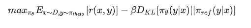

推导出optimal policy

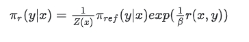

在公式中其实 $π_ref$ 应该是随着模型更新而一直改变的，但是真正实现的时候一般使用 $π_sft$ 代替。那么就导致了DPO从on-policy变成了off-policy的方法。DPO面临着RL领域经典的state distribution shift的问题，从而效果会不如PPO。除此之外由于DPO中 $π_ref$ 和 $π_sft$ 有KL散度的限制，所以state distribution shift的问题不会像传统RL中那么大，所以整体上还是work的。

> 补：经修正，相比于不加KL散度或者传统bandit算法算是分布差异小，但整体分布差异仍然很大（约25左右），如图：

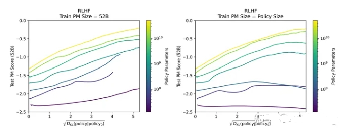
> KL散度的差异和Test PM Score变化图

## 八、DPO为什么会在学习过程中training positive的概率和training negative的概率都同时下降？

因为DPO的loss是BT loss，是maximize training set中positive和negative的gap。那从公式上它就无法保证training positive的概率是一直上升的。那继续探究它背后的原因，主要和采样的方式以及DPO loss组成相关，

首先还是把DPO loss列出来：

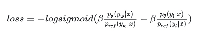

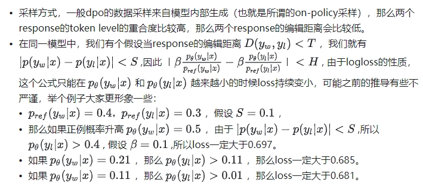

整个数学的过程可能不那么严谨，但也是给大家一个形象的视角来看这个问题。

附计算代码：

```s
import numpy as np
x = 0.00001
x_ref = 0.4
y = 0.0
y_ref = 0.3
beta = 0.1
gap =  beta * (x / x_ref - y / y_ref)
print(gap)
log_sigmoid_value_pos = -np.log(1 / (1 + np.exp(-gap)))
print(log_sigmoid_value_pos)
```

## 九、在什么情况下DPO exactly 数学上等同于 PPO？

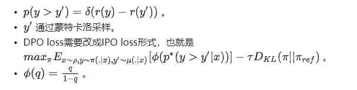

> 参考论文IPO， A General Theoretical Paradigm to Understand Learning from Human Preferences ，细节证明可以看IPO。

## 十、DPO的变体有哪些，主要解决DPO的什么问题？

- RSO [1]：由于DPO的蒙特卡洛采样很难达到，所以其实DPO几乎是off-policy的采样方式，RSO主要从DPO的采样方式来解决DPO的问题。
- Iterative DPO [2]：同样由于DPO的蒙特卡洛采样很难达到，所以通过on-policy的方式采样来替代off-policy的采样。
- IPO [3]：由于BT model的目标是最大化正负response的reward gap，但其实其中忽略了真实情况下我们组的pair可能会有噪音，那么无限去扩大reward gap其实是不准确的，也就是overfit了preference的pair数据，那么解决方案是需要限制这个gap的范围。
- DPOP [4]：由于LLM model很难区分编辑距离较小的pair，那么当持续去区分这批case的时候，模型效果会崩塌，现象是正例子和负例子的概率都往下掉。那么DPOP用了一个新项来惩罚正例往下掉的pair，使得正例概率继续提升。

> [1] Liu T, Zhao Y, Joshi R, et al. Statistical rejection sampling improves preference optimization[J]. arXiv preprint arXiv:2309.06657, 2023.
> 
> [2] Yuan W, Pang R Y, Cho K, et al. Self-rewarding language models[J]. arXiv preprint arXiv:2401.10020, 2024.
> 
> [3] Azar M G, Rowland M, Piot B, et al. A general theoretical paradigm to understand learning from human preferences[J]. arXiv preprint arXiv:2310.12036, 2023.
> 
> [4] Pal A, Karkhanis D, Dooley S, et al. Smaug: Fixing Failure Modes of Preference Optimisation with DPO-Positive[J]. arXiv preprint arXiv:2402.13228, 2024.

## 十一、DPO训练后的模型为什么会输出越来越长？

并不是一定会越来越长。如果你尝试用所有正例子的response都比负例子的短，那么也会输出越来越短。究其原因，是由于数据构造原因导致的DPO后训练后的模型输出越来越长。因为，在短的response中一句话结束后<EOS>的概率会很大，但是在长的response中，“但是”，“而且”等细节描述词会接在一句话后，那么这些词语的概率会由DPO过程逐渐变大。

## 十二、DPO训练可能会出现什么问题？

- **梯度爆炸或消失**: 由于 DPO 更直接地优化策略目标函数，可能导致策略更新过快或过剧，从而导致梯度爆炸或消失的问题。
- **收敛性问题**: DPO 没有像 PPO 那样的机制来限制策略更新，因此可能在训练过程中出现不稳定或策略崩溃的情况。
- **探索和利用之间的平衡问题**: 由于 DPO 直接最小化目标函数，可能会倾向于过早地进行利用，导致探索不足，从而无法找到全局最优解。

## 十三、讲一下DPO和PPO，DPO和PPO有什么区别？

- DPO 和 PPO
  - PPO (Proximal Policy Optimization): PPO 是一种强化学习算法，采用了策略优化方法。它的目标是通过限制策略更新的幅度来避免策略剧烈变化，减小策略崩溃的风险。具体做法是通过剪裁损失函数，确保策略变化在一个较小的范围内，从而提高训练的稳定性。PPO 的核心是引入了一种近端目标函数，利用优势函数更新策略，兼顾了策略的探索和收敛。
  - DPO (Direct Policy Optimization): DPO 是一种最近提出的算法，旨在简化传统强化学习中的策略优化问题。它的主要思想是通过直接最小化目标函数来优化策略，而不是像 PPO 一样通过对数比率和剪裁损失函数来进行策略更新。DPO 采用了更直接的优化方式，简化了策略更新的过程。
- 区别：
  - 策略更新: PPO 通过限制策略变化幅度（例如剪裁）来实现稳定训练，而 DPO 更倾向于直接优化目标函数。
  - 稳定性和效率: PPO 通常能够保持较高的稳定性，但训练效率可能较低；DPO 则更高效，但可能在一定程度上牺牲了训练的稳定性。

## 代码解释

### 1. DPO损失函数 代码实现？

```s
def preference_loss(policy_chosen_logps: torch.FloatTensor,
                    policy_rejected_logps: torch.FloatTensor,
                    reference_chosen_logps: torch.FloatTensor,
                    reference_rejected_logps: torch.FloatTensor,
                    beta: float,
                    label_smoothing: float = 0.0,
                    ipo: bool = False,
                    reference_free: bool = False) -> Tuple[torch.FloatTensor, torch.FloatTensor, torch.FloatTensor]:
    # policy_chosen_logps: 训练模型对于chosen经过log后logits
	# policy_rejected_logps: 训练模型对于rejected经过log后logits
	# reference_chosen_logps: 训练模型对于chosen经过log后logits
	# reference_rejected_logps: 训练模型对于rejected经过log后logits
	# beta: policy和reference的差异性控制参数
	
	# actor模型选择chosen优先于rejected
    pi_logratios = policy_chosen_logps - policy_rejected_logps
	# reference模型选择chosen优先于rejected
    ref_logratios = reference_chosen_logps - reference_rejected_logps

    if reference_free:
        ref_logratios = 0
	
	# 差值可类似于KL散度，保障actor模型的分布与reference模型的分布不会有较大的差异
    logits = pi_logratios - ref_logratios  # also known as h_{\pi_\theta}^{y_w,y_l}

    if ipo:
        losses = (logits - 1/(2 * beta)) ** 2  # Eq. 17 of https://arxiv.org/pdf/2310.12036v2.pdf
    else:
        # Eq. 3 https://ericmitchell.ai/cdpo.pdf; label_smoothing=0 gives original DPO (Eq. 7 of https://arxiv.org/pdf/2305.18290.pdf)
		# label_smoothing为0，对应的DPO论文的算法
        losses = -F.logsigmoid(beta * logits) * (1 - label_smoothing) - F.logsigmoid(-beta * logits) * label_smoothing
	
	# chosen和rejected的奖励
    chosen_rewards = beta * (policy_chosen_logps - reference_chosen_logps).detach()
    rejected_rewards = beta * (policy_rejected_logps - reference_rejected_logps).detach()

    return losses, chosen_rewards, rejected_rewards
```

### 2. DPO 批次训练过程 代码实现？

```s
def get_batch_metrics(self, batch: Dict[str, Union[List, torch.LongTensor]], loss_config: DictConfig, train=True):
	"""Compute the SFT or DPO loss and other metrics for the given batch of inputs."""

	if loss_config.name in {'dpo', 'ipo'}:
		# policy模型针对chosen和rejected进行预测
		policy_chosen_logps, policy_rejected_logps = self.concatenated_forward(self.policy, batch)
		with torch.no_grad():
			# reference模型针对chosen和rejected进行预测
			reference_chosen_logps, reference_rejected_logps = self.concatenated_forward(self.reference_model, batch)

		if loss_config.name == 'dpo':
			loss_kwargs = {'beta': loss_config.beta, 'reference_free': loss_config.reference_free, 'label_smoothing': loss_config.label_smoothing, 'ipo': False}
		elif loss_config.name == 'ipo':
			loss_kwargs = {'beta': loss_config.beta, 'ipo': True}
		else:
			raise ValueError(f'unknown loss {loss_config.name}')
		# 损失计算
		losses, chosen_rewards, rejected_rewards = preference_loss(
			policy_chosen_logps, policy_rejected_logps, reference_chosen_logps, reference_rejected_logps, **loss_kwargs)

		reward_accuracies = (chosen_rewards > rejected_rewards).float()

	elif loss_config.name == 'sft':
		policy_chosen_logits = self.policy(batch['chosen_input_ids'], attention_mask=batch['chosen_attention_mask']).logits.to(torch.float32)
		policy_chosen_logps = _get_batch_logps(policy_chosen_logits, batch['chosen_labels'], average_log_prob=False)

		losses = -policy_chosen_logps

	return losses.mean()
```

### 3. LM的交叉熵计算 代码实现？

```s
def _get_batch_logps(logits: torch.FloatTensor, labels: torch.LongTensor, average_log_prob: bool = False) -> torch.FloatTensor:
    # 经模型后的logits进行批量计算logps
	
    assert logits.shape[:-1] == labels.shape
	
	# 基于先前的token预测下一个token
    labels = labels[:, 1:].clone()
    logits = logits[:, :-1, :]
    loss_mask = (labels != -100)

    # dummy token; we'll ignore the losses on these tokens later
    labels[labels == -100] = 0
	
	# 交叉熵函数
    per_token_logps = torch.gather(logits.log_softmax(-1), dim=2, index=labels.unsqueeze(2)).squeeze(2)

    if average_log_prob:
        return (per_token_logps * loss_mask).sum(-1) / loss_mask.sum(-1)
    else:
        return (per_token_logps * loss_mask).sum(-1)
```

## 致谢

- LLM面面观之RLHF平替算法DPO https://zhuanlan.zhihu.com/p/680734930
- RLHF：https://blog.csdn.net/v_JULY_v/article/details/128579457
- DPO论文: https://arxiv.org/pdf/2305.18290v2.pdf
- DPO代码: https://github.com/eric-mitchell/direct-preference-optimization
- DPO理解1：https://medium.com/@joaolages/direct-preference-optimization-dpo-622fc1f18707
- DPO理解2: https://zhuanlan.zhihu.com/p/66
- 大模型的面试题系列-6 https://zhuanlan.zhihu.com/p/685948009
- 大模型的面试题系列-14 https://zhuanlan.zhihu.com/p/687067338
- 大模型的面试题系列-15 https://zhuanlan.zhihu.com/p/687182820
- 大模型的面试题系列-20 https://zhuanlan.zhihu.com/p/688164780