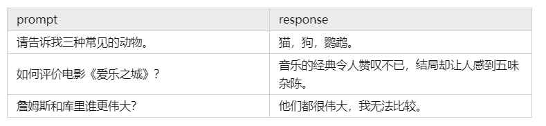
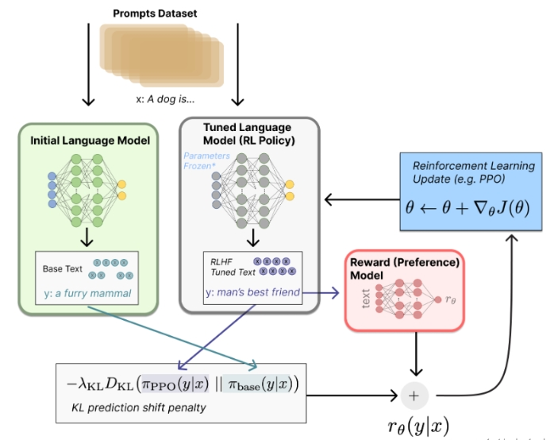

# 大模型（LLMs）强化学习—— PPO 面

- [大模型（LLMs）强化学习—— PPO 面](#大模型llms强化学习-ppo-面)
  - [一、大语言模型RLHF中的PPO主要分哪些步骤？](#一大语言模型rlhf中的ppo主要分哪些步骤)
  - [二、举例描述一下 大语言模型的RLHF？](#二举例描述一下-大语言模型的rlhf)
  - [三、大语言模型RLHF 采样篇](#三大语言模型rlhf-采样篇)
    - [3.1 什么是 PPO 中 采样过程？](#31-什么是-ppo-中-采样过程)
    - [3.2 介绍一下 PPO 中 采样策略？](#32-介绍一下-ppo-中-采样策略)
    - [3.3 PPO 中 采样策略中，如何评估“收益”？](#33-ppo-中-采样策略中如何评估收益)
  - [四、在PPO过程中，reward model的效果上会有什么问题？](#四在ppo过程中reward-model的效果上会有什么问题)
  - [五、如何解决reward model的OOD的问题？](#五如何解决reward-model的ood的问题)
  - [六、RLHF中PPO有什么问题，为什么大家都设计很多方法去替代它？](#六rlhf中ppo有什么问题为什么大家都设计很多方法去替代它)
  - [七、PPO 思路介绍？](#七ppo-思路介绍)
  - [八、介绍在线PPO训练？](#八介绍在线ppo训练)
  - [九、介绍PPO模块构成](#九介绍ppo模块构成)
  - [十、在训练过程中，如果奖励曲线出现剧烈抖动，可以考虑以下几个因素对此进行优化？](#十在训练过程中如果奖励曲线出现剧烈抖动可以考虑以下几个因素对此进行优化)
  - [参考](#参考)

## 一、大语言模型RLHF中的PPO主要分哪些步骤？

大语言模型RLHF中的PPO 分为：

1. 采样
2. 反馈
3. 学习

对应的实现逻辑如下：

```s
policy_model = load_model()

for k in range(20000):
    # 采样（生成答案）
    prompts = sample_prompt()
    data = respond(policy_model, prompts)
    
    # 反馈（计算奖励）
    rewards = reward_func(reward_model, data)
    
    # 学习（更新参数）
    for epoch in range(4):
        policy_model = train(policy_model, prompts, data, rewards)
```

## 二、举例描述一下 大语言模型的RLHF？

**大语言模型的RLHF，实际上是模型先试错再学习的过程**。

大语言模型的RLHF 好比是：老师与学生的角色

- 我们扮演着老师的角色，给出有趣的问题。模型则会像小学生一样，不断尝试给出答案。
- 模型会根据我们给出的问题，写出它觉得正确的答案，但是这些答案不一定是真的答案，需要我们结合正确答案进行打分。如果它表现得好，就会给予它高声赞扬；如果它表现不佳，我们则会给予它耐心的指导和反馈，帮助它不断改进，直到达到令人满意的水平。

## 三、大语言模型RLHF 采样篇

### 3.1 什么是 PPO 中 采样过程？

PPO 中 采样过程：学生回答问题的过程，是模型根据提示（prompt）输出回答（response）的过程，或者说是模型自行生产训练数据的过程。

> eg:


### 3.2 介绍一下 PPO 中 采样策略？

PPO 中 采样工作 通过一种 **策略（policy）**：**policy由两个模型组成，一个叫做演员模型（Actor），另一个叫做评论家模型（Critic）。它们就像是学生大脑中的两种意识，一个负责决策，一个负责总结得失**。


> 演员：我们想要训练出来的大模型。在用PPO训练它之前，它就是RLHF的第一步训练出来的SFT（Supervised Fine-Tuning）model。**输入一段上下文，它将输出下一个token的概率分布**  。<br/>
> 评论家：强化学习的辅助模型，**输入一段上下文，它将输出下一个token的“收益”**。

### 3.3 PPO 中 采样策略中，如何评估“收益”？

从下一个token开始，模型能够获得的总奖励（浮点数标量）。这里说的奖励包括Reward Model给出的奖励。

## 四、在PPO过程中，reward model的效果上会有什么问题？

在模型PPO过程中，reward model的准确率逐渐下降，这就是俗称的reward model的OOD问题，因为reward model的训练样本一般来自sft模型的responses，那么在PPO过程中，policy model刚开始和sft生成的response很相似，所以reward model准确率较高，但是在逐渐偏离sft的时候，reward model的准确率会持续下降，这基本就是现阶段reward model的主要问题。我个人认为AGI过程中，一定需要一个generalize 很强的reward model，就是所谓的global reward model or world model. 

## 五、如何解决reward model的OOD的问题？

现阶段解决reward model的OOD普遍解决方法，就是Llama2 [1]的做法，也就是在训练过一段时间RLHF以后，重新对policy采样pair对，人标数据然后继续训练reward model。但这种方式就是太费人力，感觉并不是持久之道。

除此之外也有一些paper试图解决这个问题：

- 比如Secrets of RLHF in Large Language Models Part II: Reward Modeling [2]中，通过meta learning的方式解决这个问题，整体思想就是由于policy model在reward model训练情况下会向reward 高的方向更新，所以reward model应该对reward高的response pair更有区分度，所以设置gradient更新逐渐倾向于对reward高分training response pair倾斜。这种方法比较make sense，但实际中，由于缺少对模型on policy的采样，效果不太好。
- West-of-N: Synthetic Preference Generation for Improved Reward Modeling [3] 这篇文章跟Llama2的方式相似，区别就是不再用人进行标记，而是通过reward model本身对新的模型on policy pair进行打分，取一个query的response set中最高的分数和最低的分数数据组pair，加入到reward model的训练中。个人感觉这种方式的采样，虽然通过on policy采样加强rm的泛化能力，但实际上上限受原先rm model的能力影响。

个人觉得如何做出泛化能力比较强的rm会是一个比较难，也是比较限制模型发展的问题。

- [1]Touvron H, Martin L, Stone K, et al. Llama 2: Open foundation and fine-tuned chat models[J]. arXiv preprint arXiv:2307.09288, 2023.
- [2]Wang B, Zheng R, Chen L, et al. Secrets of rlhf in large language models part ii: Reward modeling[J]. arXiv preprint arXiv:2401.06080, 202
- [3]Pace A, Mallinson J, Malmi E, et al. West-of-N: Synthetic Preference Generation for Improved Reward Modeling[J]. arXiv preprint arXiv:2401.12086, 2024.

## 六、RLHF中PPO有什么问题，为什么大家都设计很多方法去替代它？

1. Notable Complexity: 由于PPO中需要4个模型同时加载在GPU中，policy model，ref policy model，value model，reward model。所以会占用很多GPU机器。
2. Online learning problem, 除此之外，由于模型是online 采样，在policy过batch samples的时候，reward model会空置，在reward model给pair打分的时候，policy model也会空置，那么GPU利用率会不高。
3. PPO的调超参数会比较困难，需要一些炼丹高手和经验去做。

## 七、PPO 思路介绍？

以SFT为初始策略，基于RM对策略打分，使用强化学习优化策略，得到强化版本的模型PPO。

1. 训练的目标是使得PPO生成的答案能够获得高回报。
2. 训练的方法是根据RM的打分来更新PPO的参数。
3. 为了防止模型被RM过度优化，需要在奖励中增加了一个KL惩罚，保持学到的模型PPO与初始策略SFT模型相差不至太远。
4. 同时，可以在优化目标的梯度中混入一些预训练梯度，进一步保证学习到的模型保留SFT的通用能力。具体的方法可以参考论文instructGPT。

## 八、介绍在线PPO训练？

随着SFT被优化，得到的PPO模型生成的回复越来越符合人类偏好，最开始训练得到的奖励模型在这种高质量回复上不够鲁棒。为了缓解这个问题，参考论文Anthropic LLM，可以进一步采用在线迭代训练：使用每一轮强化学习得到的最好的PPO模型生成比较数据进行人工标注。将新的比较数据与已有的数据混合，重新训练一个新的奖励模型，最后用新的奖励模型进行新一轮的PPO训练。



## 九、介绍PPO模块构成

PPO是强化学习中一种基于AC架构（Actor-Critic）的优化方法，其前身是TRPO，PPO通过引入重要性采样（Importance Sampling）来缓解 on policy 模型一次采样数据只能更新一次模型的问题，提升了数据利用率和模型训练速度。

在 LLM 的训练中，使用 PPO 需要同时载入 4 个模型：

- **Actor Model**：Actor模型是用于进化训练的生成模型。它负责生成策略，根据当前状态选择动作的概率分布。
- **Critic Model**：Critic模型是用于进化训练的评判模型。它负责估计状态值函数或状态-动作值函数，提供对策略的评估和指导。
- **Ref Model**：Ref模型是参照模型，用于通过KL散度来限制Actor模型的训练方向。它的作用是提供一个参考策略，确保Actor模型的更新在一定的范围内，避免过大的策略变化。
- **Reward Model**：Reward模型是奖励模型，用于指导Actor的进化。它可以提供额外的奖励信号或指导信息，帮助Actor模型更好地优化策略。

其中Actor model和Ref model是RLHF第一个阶段有监督微调模型的两个副本，Reward model和Critic model是奖励模型的两个副本。

为了节省显存，通常会将 actor / critic 共享一个 backbone，这样只用同时载入 3 个模型。

## 十、在训练过程中，如果奖励曲线出现剧烈抖动，可以考虑以下几个因素对此进行优化？

- **KL Penalty**：适当调大 KL可以帮助稳定训练（可使用动态调整 KL 系数策略）。
- **Reward Model**：使用一个更稳定的 RM 能够有效缓解这种问题。
- **Reward Scaling**：reward 的归一化对训练稳定有着很重要的作用。
- **Batch Size**：适当增大 batch_size 有助于训练稳定。


## 参考

- Asynchronous Methods for Deep Reinforcement Learning (2016): https://arxiv.org/abs/1602.01783
- Proximal Policy Optimization Algorithms (2017):https://arxiv.org/abs/1707.06347
- Fine-Tuning Language Models from Human Preferences (2020): https://arxiv.org/abs/1909.08593
- Learning to Summarize from Human Feedback (2022) :https://arxiv.org/abs/2009.01325
- LLM预训练之RLHF（一）：RLHF及其变种 https://zhuanlan.zhihu.com/p/657045745
- 拆解大语言模型RLHF中的PPO https://zhuanlan.zhihu.com/p/645225982
- 大模型的面试题系列-8 https://zhuanlan.zhihu.com/p/686257197
- 大模型的面试题系列-12 https://zhuanlan.zhihu.com/p/686773718
- 大模型的面试题系列-13 https://zhuanlan.zhihu.com/p/686978224
- 大模型训练流程（四）强化学习 https://blog.csdn.net/qq_43243579/article/details/136224803
 
