# 大模型（LLMs）强化学习——RLHF及其变种面

- [大模型（LLMs）强化学习——RLHF及其变种面](#大模型llms强化学习rlhf及其变种面)
  - [一、介绍一下 LLM的经典预训练Pipeline？](#一介绍一下-llm的经典预训练pipeline)
  - [二、预训练（Pre-training）篇](#二预训练pre-training篇)
    - [2.1 具体介绍一下 预训练（Pre-training）？](#21-具体介绍一下-预训练pre-training)
  - [三、有监督微调（Supervised Tinetuning）篇](#三有监督微调supervised-tinetuning篇)
    - [3.1 具体介绍一下 有监督微调（Supervised Tinetuning）？](#31-具体介绍一下-有监督微调supervised-tinetuning)
    - [3.2 有监督微调（Supervised Tinetuning）的训练数据格式是什么样？](#32-有监督微调supervised-tinetuning的训练数据格式是什么样)
    - [3.3 预训练（Pre-training） vs 有监督微调（Supervised Tinetuning）区别？](#33-预训练pre-training-vs-有监督微调supervised-tinetuning区别)
  - [四、对齐（Alignment）篇](#四对齐alignment篇)
    - [4.1 简单介绍一下 对齐（Alignment）？](#41-简单介绍一下-对齐alignment)
  - [五、Reinforcement Learning with Human Feedback (RLHF)篇](#五reinforcement-learning-with-human-feedback-rlhf篇)
    - [5.1 简单介绍一下 RLHF 流程？](#51-简单介绍一下-rlhf-流程)
    - [5.2 如何在在预训练好的模型上进行有监督微调？](#52-如何在在预训练好的模型上进行有监督微调)
    - [5.3 如何在有监督微调模型基础上创建一个RM模型？](#53-如何在有监督微调模型基础上创建一个rm模型)
    - [5.4 如何基于RM模型使用PPO算法微调SFT模型？](#54-如何基于rm模型使用ppo算法微调sft模型)
    - [5.5 instructGPT的原理，讲讲rlhf和reward？](#55-instructgpt的原理讲讲rlhf和reward)
  - [六、LLaMA 2 的 RLHF 篇](#六llama-2-的-rlhf-篇)
    - [6.1 介绍一下 LLaMA 2 的 RLHF？](#61-介绍一下-llama-2-的-rlhf)
    - [6.2 LLaMA 2 中 Margin Loss 的 实现逻辑？](#62-llama-2-中-margin-loss-的-实现逻辑)
    - [6.3 LLaMA 2 中 两个RM模型 的 实现逻辑？](#63-llama-2-中-两个rm模型-的-实现逻辑)
    - [6.4 LLaMA 2 中 拒绝采样 逻辑？](#64-llama-2-中-拒绝采样-逻辑)
  - [七、 RLHF 替代方案篇](#七-rlhf-替代方案篇)
    - [7.1 为什么需要 RLHF 替代方案？](#71-为什么需要-rlhf-替代方案)
    - [7.2 RLHF 有哪些替代方案？](#72-rlhf-有哪些替代方案)
      - [替代方案 1：Constitutional AI: Harmlessness from AI Feedback](#替代方案-1constitutional-ai-harmlessness-from-ai-feedback)
      - [替代方案 2：The Wisdom of Hindsight Makes Language Models Better Instruction Followers](#替代方案-2the-wisdom-of-hindsight-makes-language-models-better-instruction-followers)
      - [替代方案 3：Direct Preference Optimization: Your Language Model is Secretly a Reward Model](#替代方案-3direct-preference-optimization-your-language-model-is-secretly-a-reward-model)
      - [替代方案 4：Reinforced Self-Training (ReST) for Language Modeling](#替代方案-4reinforced-self-training-rest-for-language-modeling)
      - [替代方案 5：RLAIF: Scaling Reinforcement Learning from Human Feedback with AI Feedback](#替代方案-5rlaif-scaling-reinforcement-learning-from-human-feedback-with-ai-feedback)
  - [八、 RLHF 实践篇](#八-rlhf-实践篇)
    - [8.1 RLHF 训练过程，怎么选取最优 checkpoint？](#81-rlhf-训练过程怎么选取最优-checkpoint)
  - [参考](#参考)

## 一、介绍一下 LLM的经典预训练Pipeline？

目前基于Transformer decoder的LLM，比如ChatGPT、LLaMA、baichuan等，通常都会有基于预训练的base模型和在base模型至少使用RLHF微调的Chat模型，Chat模型的训练一般都包括如下三个步骤：预训练，有监督微调和对齐。

1. 在预训练阶段，模型会从大量无标注文本数据集中学习通用知识；
2. 使用「有监督微调」（SFT）优化模型以更好地遵守特定指令；
3. 使用对齐技术使LLM可以更有用且更安全地响应用户提示。

## 二、预训练（Pre-training）篇

### 2.1 具体介绍一下 预训练（Pre-training）？

预训练（Pre-training）：利用数十亿到数万亿个token的庞大文本语料库 对模型继续 预训练，使 模型 能够 根据提供的文本来预测「下一个单词」。

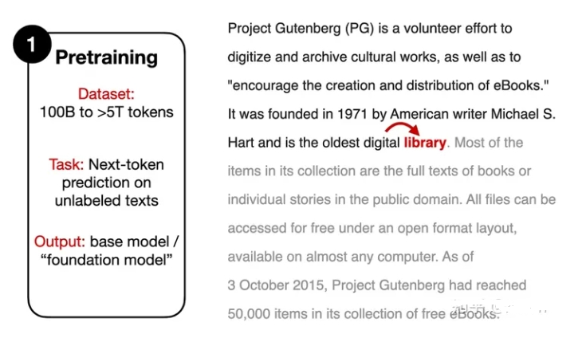

## 三、有监督微调（Supervised Tinetuning）篇

### 3.1 具体介绍一下 有监督微调（Supervised Tinetuning）？

有监督微调（Supervised Tinetuning）:虽然 SFT 训练目标和 预训练（Pre-training）类似，也是 需要模型 预测「下一个单词」，但是需要人工标注的指令数据集，其中模型的输入是一个指令（根据任务的不同，也可能包含一段输入文本），输出为模型的预期回复内容。

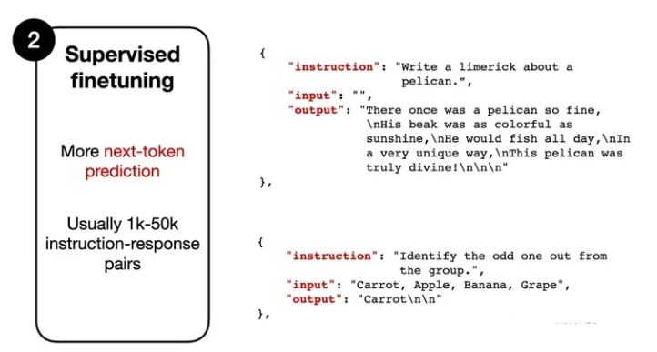

### 3.2 有监督微调（Supervised Tinetuning）的训练数据格式是什么样？

> Instruction: "Write a limerick about a pelican."
> 
> 指令：“写一首关于鹈鹕的打油诗。“
> 
> Output: "There once was a pelican so fine..."
> 
> 输出：“从前有一只鹈鹕很好...“

模型会把“Write a limerick about a pelican”作为输入，逐个token进行预测，输出“There once was a pelican so fine...”

### 3.3 预训练（Pre-training） vs 有监督微调（Supervised Tinetuning）区别？

- 相同点：
  - 训练目标相同：模型需要根据提供的文本来预测「下一个单词」；
- 不同点：
  - 训练数据量不同：有监督微调（Supervised Tinetuning）需要训练数据量比 预训练（Pre-training） 小很多；
  - 训练数据格式不同：有监督微调（Supervised Tinetuning）需要人工标注的训练数据，预训练（Pre-training） 不需要；

## 四、对齐（Alignment）篇

### 4.1 简单介绍一下 对齐（Alignment）？

对齐（Alignment）：通过微调的方式，将语言模型与人类的偏好、价值观进行对齐，这也是RLHF机制发挥的地方。

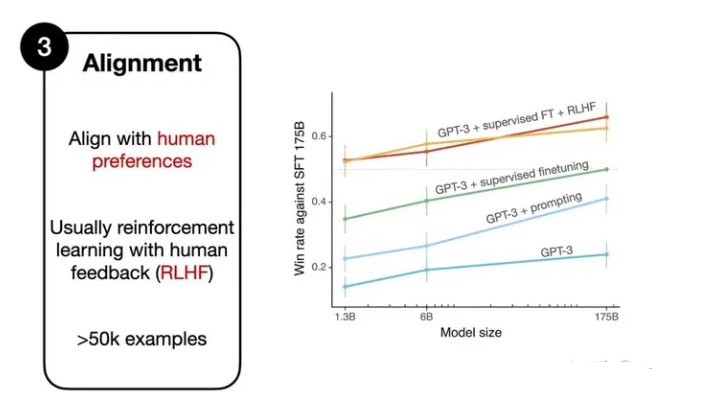

## 五、Reinforcement Learning with Human Feedback (RLHF)篇

### 5.1 简单介绍一下 RLHF 流程？

1. 在预训练好的模型上进行「有监督微调」（SFT）；
2. 在有监督微调模型基础上创建一个reward model（RM）模型；
3. 基于RM模型使用PPO算法微调SFT模型；

### 5.2 如何在在预训练好的模型上进行有监督微调？

先收集一个Prompts集合，并要求标注人员写出高质量的回复，然后使用该数据集以监督的方式微调预训练的基础模型。

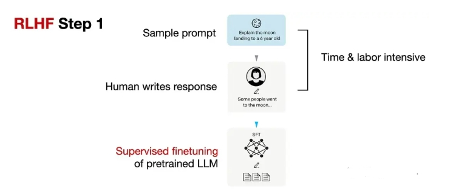

### 5.3 如何在有监督微调模型基础上创建一个RM模型？

对于每个Prompt，要求有监督微调后的LLM生成四到九个回复，再由标注人员根据个人偏好对所有回复进行排序。虽然排序过程很耗时，但工作量还是比第一步的有监督数据集构建要少一些。

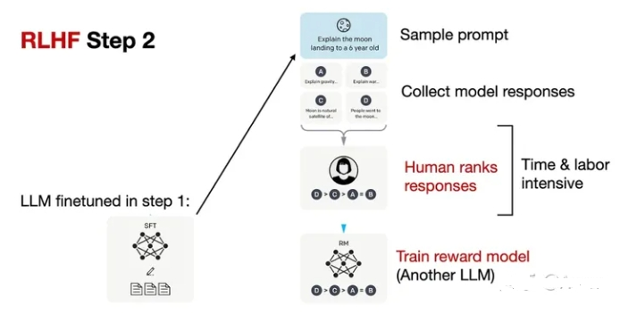

在处理排序数据时，使用了一个奖励模型RM，RM来自RLHF第一步的「有监督微调语言模型」（SFT），SFT的输出通过一个回归层（单个输出节点）转换为奖励分数，即可称为RM模型。

### 5.4 如何基于RM模型使用PPO算法微调SFT模型？

基于RM模型使用proximal policy optimization (PPO)算法微调SFT模型

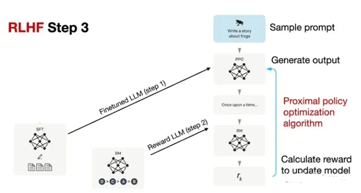

### 5.5 instructGPT的原理，讲讲rlhf和reward？

instructGPT是一种基于强化学习的文本生成模型，其核心原理涉及两个概念：RLHF（Reinforcement Learning from Human Feedback）和reward shaping（奖励塑造）。

- RLHF：在训练instructGPT时，首先使用有人类生成的示例对模型进行预训练。然后，通过与人类评估者进行交互，收集评估结果，以创建一个用于强化学习的数据集。该数据集包含了人类评估者对生成结果的评分或反馈，用于指导模型的强化学习训练。
- Reward shaping：为了更好地引导模型的训练，reward shaping用于调整模型的奖励信号。通过将人类评估者的反馈与模型生成的文本进行比较，可以计算出一个差异度量，用作奖励信号的一部分。这样，模型可以根据这个奖励信号进行训练，并进行强化学习的训练。模型根据当前的状态（对话历史）生成文本，并通过奖励信号来评估生成文本的质量。模型的目标是最大化预期累积奖励，从而生成更高质量的文本。

通过RLHF和reward shaping的结合，instructGPT能够通过人类评估者的反馈指导模型的生成过程，并逐步提升生成文本的质量和一致性。

## 六、LLaMA 2 的 RLHF 篇

### 6.1 介绍一下 LLaMA 2 的 RLHF？

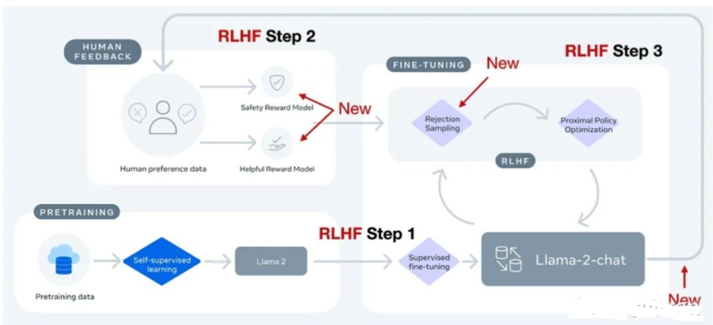

Llama-2-chat在第一步RLHF微调上使用相同的指令数据，但在**第二步使用了两个奖励模型；通过多个阶段的不断进化，奖励模型也会根据Llama-2-chat模型出现的错误进行更新；并且增加了拒绝采样（rejection sampling）步骤**。

### 6.2 LLaMA 2 中 Margin Loss 的 实现逻辑？

- 标准InstructGPT 中 RLHF PPO方法 思路：**对同一个提示下的4-9个模型输出并进行排序**。

> eg：四个回复的排序结果为A<C< D<B，那么就可以得到六个对比结果：A < C，A < D ，A < B，C < D，C < B，D < B

- Llama 2 的 Margin Loss：**每次只能看到两个（而非4-9个）回复并进行对比，但新增了一个边际（margin）标签，对比结果可以为「显著更好」（significantly better）和「好的不明显」（negligibly better）**

在排序训练时中，Llama 2相比InstructGPT增加了边际损失：

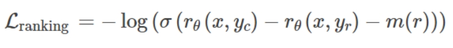

> 其中，rθ（x，y）是提示x和生成的回复y的标量分数输出; θ为模型权重; σ是将层输出转换为范围从0到1的分数的逻辑S形函数; yc是由标注人员选择的更优回复; yr是较差的回复。m(r)可以调节两个回复之间的差值，如果对比结果为「显著更好」，则会增加梯度值，加快更新速度。

### 6.3 LLaMA 2 中 两个RM模型 的 实现逻辑？

Llama 2中的两个奖励模型：
- 侧重「有用性」（helpfulness）
- 「安全性」（safety）

用于模型优化的最终奖励函数会将两个分数进行线性组合。

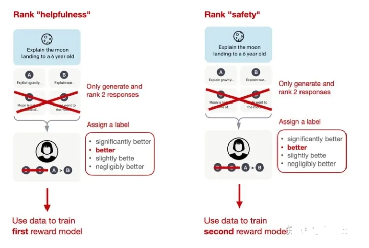

### 6.4 LLaMA 2 中 拒绝采样 逻辑？

Llama 2 使用了一个训练流水线，**同时使用PPO和拒绝采样算法**，迭代地产生多个RLHF模型（从RLHF-V1到RLHF-V5），模型在拒绝采样时会得到K个输出，并使用最高奖励的输出更新梯度，而PPO每次只基于单样本进行更新。

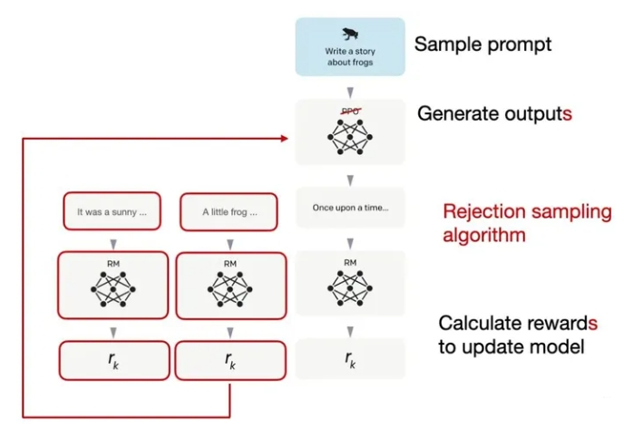

在监督微调的初始阶段之后，模型只使用拒绝采样进行训练，然后再结合拒绝采样和PPO。

## 七、 RLHF 替代方案篇

### 7.1 为什么需要 RLHF 替代方案？

虽然 RLHF在InstructGPT和Llama 2论文中被证明是有效的，但是RLHF的过程是比较复杂的。

### 7.2 RLHF 有哪些替代方案？

#### 替代方案 1：Constitutional AI: Harmlessness from AI Feedback

> 论文名称：Constitutional AI: Harmlessness from AI Feedback
> 论文链接：https://arxiv.org/abs/2212.08073

论文 提出了一种基于人类提供的规则列表的自我训练机制。与前面提到的InstructGPT论文类似，也使用了强化学习方法。

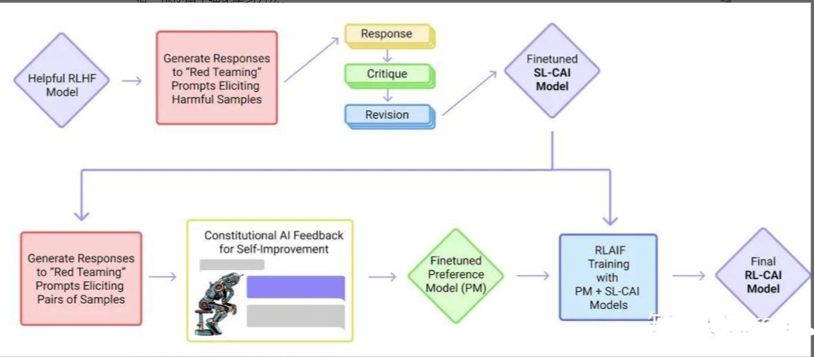

上图中的「红队」（Red Team）指的是测试目标系统的防御能力，即外部或内部专家模拟潜在对手的过程，通过模仿现实世界攻击者的战术、技术和程序来挑战、测试并最终改进系统。

#### 替代方案 2：The Wisdom of Hindsight Makes Language Models Better Instruction Followers

> 论文名称：The Wisdom of Hindsight Makes Language Models Better Instruction Followers
> 
> 论文链接：https://arxiv.org/abs/2302.05206

论文提出了一种基于重新标记的监督微调方法HIR，该方法在12个BigBench任务上优于RLHF。

HIR是如何工作的？简而言之，HIR方法包括两个步骤，即采样和训练。在采样步骤中，Prompt和指令输入给LLM来获取答案，根据对齐得分，在训练阶段适当的地方重新标注指令；然后，重新标记的指令和原始的Prompt用于微调LLM。使用这种重新标记的方法，研究人员有效地将失败案例（LLM创建的输出与原始指令不匹配的案例）转化为有用的训练数据，用于监督学习。

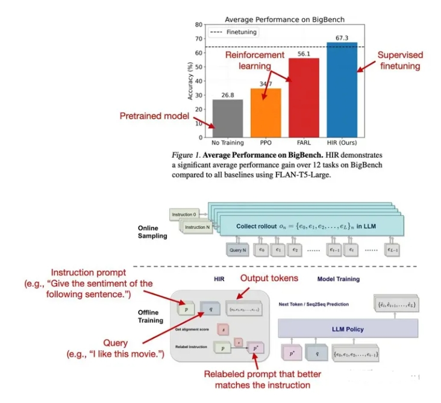

#### 替代方案 3：Direct Preference Optimization: Your Language Model is Secretly a Reward Model

> 论文名称：Direct Preference Optimization: Your Language Model is Secretly a Reward Model
> 
> 论文链接：https://arxiv.org/abs/2305.18290

直接偏好优化（DPO）是具有PPO的RLHF的替代方案，其中研究人员表明，在RLHF中拟合奖励模型的交叉熵损失可以直接用于微调LLM。根据他们的基准，使用DPO更有效，而且在响应质量方面通常也优于RLHF/PPO。

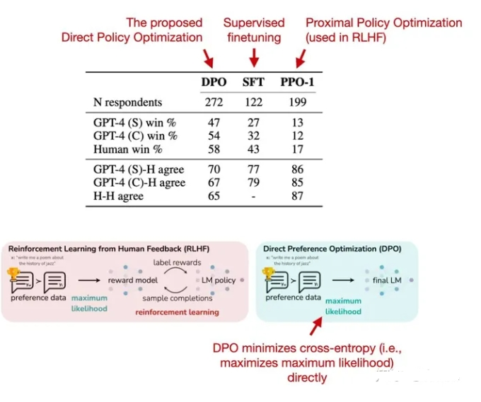

#### 替代方案 4：Reinforced Self-Training (ReST) for Language Modeling

> 论文名称：Reinforced Self-Training (ReST) for Language Modeling
> 
> 论文链接：https://arxiv.org/abs/2308.08998

ReST是人类反馈强化学习（RLHF）的一种替代方案，它使LLM与人类偏好保持一致。ReST使用采样方法创建改进的数据集，在质量越来越高的子集上迭代训练，以完善其奖励函数。根据作者的说法，与标准的在线RLHF方法（如具有近端策略优化的RLHF，PPO）相比，ReST通过离线生成训练数据集实现了更高的效率，但缺少与InstructGPT或Llama 2中使用的标准RLHF PPO方法的全面比较。

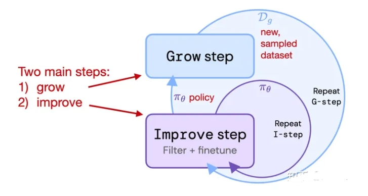

#### 替代方案 5：RLAIF: Scaling Reinforcement Learning from Human Feedback with AI Feedback

> 论文名称：RLAIF: Scaling Reinforcement Learning from Human Feedback with AI Feedback
> 
> 论文链接：https://arxiv.org/abs/2309.00267

最近的人工智能反馈强化学习（RLAIF）研究表明，RLHF中奖励模型训练的评级不一定必须由人类提供，而是可以由LLM生成（此处：PaLM 2）。标注人员在一半的案例中更喜欢RLAIF模型，也就意味着两个模型的差距并不大，RLHF和RLAIF都大大优于纯通过监督指令微调训练的模型。

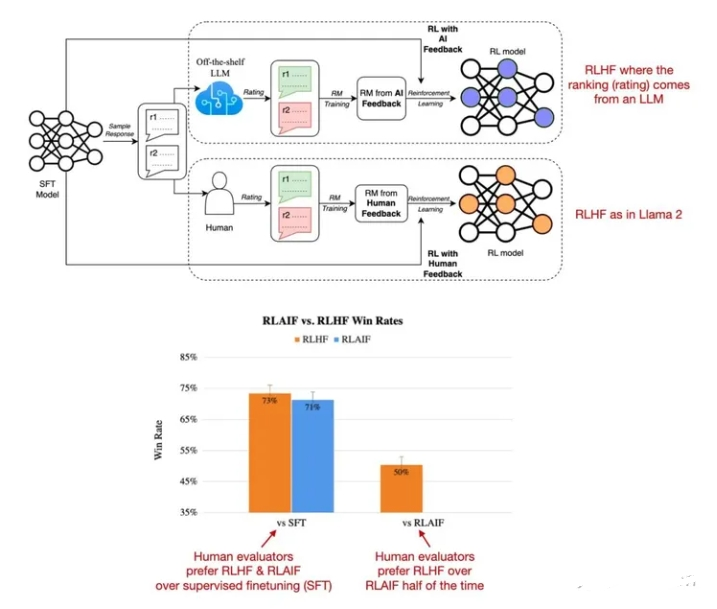

这项研究的结果非常有用和有趣，因为它基本上意味着我们可能能够使基于RLHF的训练更加高效和容易。然而，这些RLAIF模型在专注于信息内容的安全性和真实性的定性研究中的表现还有待观察，而人类偏好研究仅部分捕捉到了这一点。

## 八、 RLHF 实践篇

### 8.1 RLHF 训练过程，怎么选取最优 checkpoint？

- 动机

RLHF 训练过程，因为 Reward Model 输出的只是一个近似奖励（Proxy Reward），

导致不能完全相信训练过程中的 Reward 变化，**“更高” 的 Reward 不一定意味着 “更好” 的效果**。

可以看这一张图片：

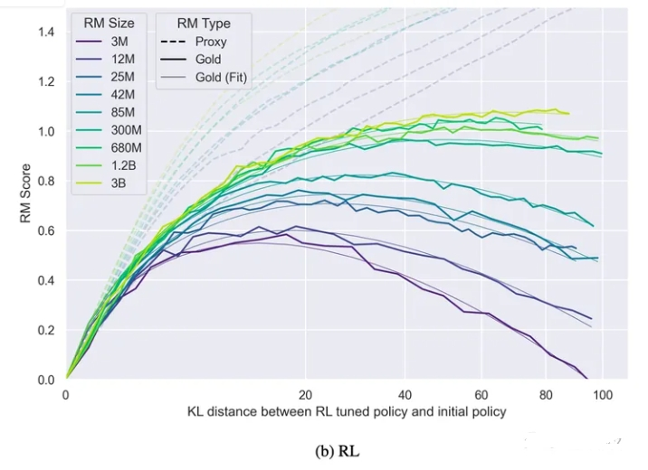
> 注：横轴为训练模型 & 初始模型之间的KL，纵轴为 reward 分数；虚线是近似 reward（RM 打出的分数），实线是真实的 reward（大多数情况下无法直接获得）

从上图可以看到：**随着「训练模型」和「初始模型」之间的 KL（可简单理解为差异）越大，模型的「真实分数」会先逐步提升，到达某个峰值后逐渐减小（图中实线），但「近似分数」（由 Reward Model 打出来的分数）却一直在稳步上升（图中虚线），显然，在「真实分数」曲线的「最高点」就是我们所期望得到「最优模型」的时间点**。

但，现在的问题是：**根本无法获得「真实分数」，我们该如何找到这个「最高点」呢？**

- 真实 Reward 的估算公式

我们假定：**真实 reward 曲线与「当前模型和初始模型」之间的 KL 存在某种关系**。

由于 KL 是一个可以被实时计算的数值，如果我们能够找出这种存在的「关系」，那我们就能找出真实 reward 的最高点对应的 KL 值是多少，从而找出最优模型。

OpenAI 帮我们找到了这个计算公式：

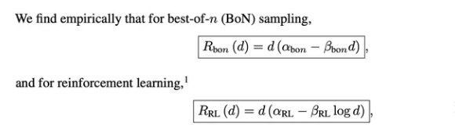
>不同训练方法对应的公式稍有不同

其中，BON（best of n）也叫 reject sampling，RL 使用 PPO，我们发现不同的训练方式对应的公式也稍有不同。

> BON 指先让模型生成一堆 response，再利用 RM 从中挑出最好的几个回复用于后续模型训练。 
> 公式里最关键的就是 3 个参数：α 、β 和 d。 
> d 被定义为初始模型和当前模型的 KL 开根号，这个比较好算； 
> 剩下的就是 α 和 β 该等于多少。

论文中表明：α 和 β 这 2 个值跟「Reward Model 大小」和「Reward Model 训练数据规模」等因素有关。

- α 和 β 的值

制变量法，为了探究 RM 的大小和 α、β之间的关系，

实验中固定了 actor 模型的大小（1.2B）、训练 RM 所用的数据集大小（9w条），

下图是使用 BON 作为训练方法，不同 RM 大小的实验结果：

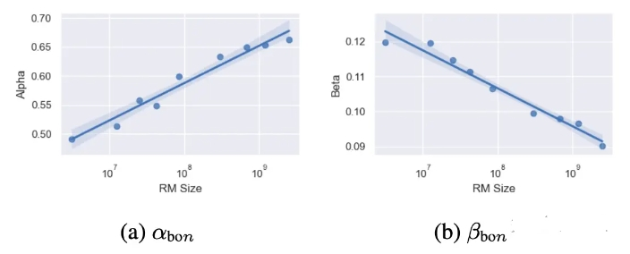
> 不同 RM 规模对应的 α 和 β 的值

根据图中给的点，挑选 1e7、1e8 和 1e9 这 3 个规模对应的 α 和 β 值，

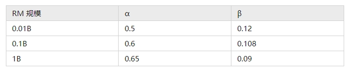

将上述参数代入 R_bon(d) 公式，并尝试绘制 reward 曲线图，结果如下：

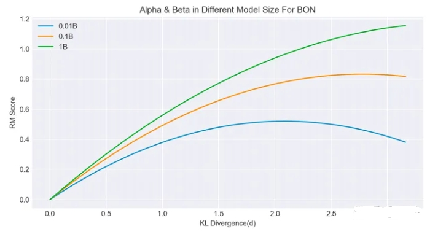
> 3 种 RM 规模在 0 到 3.5 KL 区间内对应的真实 reward 曲线图

曲线图的走势和论文中大致相同，证明该公式有效。

从图中我们大致可以得出以下几个结论：

1. **相同训练数据下，Reward Model 越大 actor 模型能够获得更高的真实 reward**。
2. **Reward Mode 越大，能够支持模型在「不偏离真实奖励的路途上走更远」，即在更大的 KL 处发生下降转折**。

当然，论文中的数据存在一定的局限性，不一定在所有的任务、所有的规模下都适用，

不过这种研究 scaling law 的思路，以及提出用 KL 来作为一种可能衡量「学习程度」的指标是非常有意义的。

除了上述这 2 个 R 和 KL 之间的计算公式外，论文中还提了一些其他有借鉴意义的经验性结论。

- Reward Model 训练数据集的 Scaling Law

为了探究 RM Dataset 的规模对最终模型的影响，实验中固定在 12M 的 RM 下进行实验，结果如下：

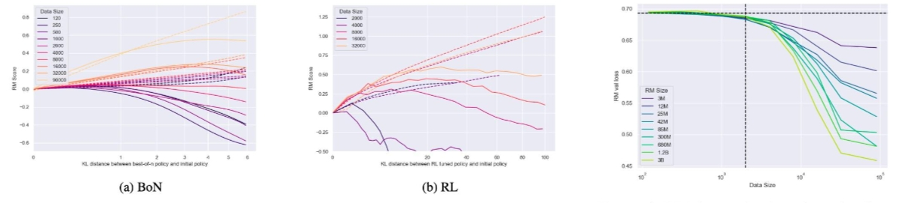

从上图中可以看到，RM 数据集越大对最终的提升就越大（这很直觉），但数据集最少也需要超过 2000。

因为如果训练数据量低于 2k，无论 RM 在哪个规模、无论使用 BON 还是 RL，对模型最终的提升都非常小。

当然，论文中 2k 这个数字只是在 3M~3B 大小的模型下得出的结论，

至于更大的模型大小是否还符合 2k 这个下限我们就不得而知。

- Policy Model 的 Scaling Law

探究完了 RM 的 Scaling Law，论文中还对 Policy Model 的大小做了对比实验。

文中选用 1.2B 和 6B 这 2 个大小的模型进行对比，固定 RM 大小为 12M，结果如下：

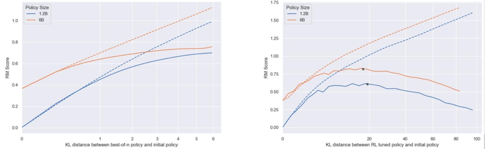
> 1.2B 和 6B 在 2 种不同训练方式下的对比实验

从上图可以得出 2 个结论：

1. **Policy Model 越大，利用 RM 做提升的收益就越小**：在 BON 下，1.2B 模型提升大约为 0.7 分（0 -> 0.7），6B 模型提升大约为 0.35 分（0.4 -> 0.75），不过这是因为越大的模型初始分就较高导致提升没有那么大，绝对分数上来看还是模型越大越好的;
2. **无论模型规模如何，最优 Reward 对应的 KL 值是一样的**：这一点比较反直觉，我们通常会认为较大的模型应该能够更快的 hacking 掉 reward model，应该在更小的 KL 处就达到最高的 reward 峰值，但实验结果并非如此（在 RL 实验中 2 个峰值对应的 KL 几乎重合）。

## 参考

- Asynchronous Methods for Deep Reinforcement Learning (2016): https://arxiv.org/abs/1602.01783
- Proximal Policy Optimization Algorithms (2017):https://arxiv.org/abs/1707.06347
- Fine-Tuning Language Models from Human Preferences (2020): https://arxiv.org/abs/1909.08593
- Learning to Summarize from Human Feedback (2022) :https://arxiv.org/abs/2009.01325
- LLM预训练之RLHF（一）：RLHF及其变种 https://zhuanlan.zhihu.com/p/657045745
- 拆解大语言模型RLHF中的PPO https://zhuanlan.zhihu.com/p/645225982
- 八、 RLHF 实践篇
  - RLHF 训练中，如何挑选最好的 checkpoint？ https://zhuanlan.zhihu.com/p/664575712
  - Scaling Laws for Reward Model Overoptimization  https://arxiv.org/pdf/2210.10760.pdf
