# 强化学习在自然语言处理下的应用篇

- [强化学习在自然语言处理下的应用篇](#强化学习在自然语言处理下的应用篇)
  - [一、强化学习基础面](#一强化学习基础面)
    - [1.1 介绍一下强化学习？](#11-介绍一下强化学习)
    - [1.2 介绍一下强化学习 的 状态（States） 和 观测（Observations）？](#12-介绍一下强化学习-的-状态states-和-观测observations)
    - [1.3 强化学习 有哪些 动作空间（Action Spaces），他们之间的区别是什么？](#13-强化学习-有哪些-动作空间action-spaces他们之间的区别是什么)
    - [1.4 强化学习 有哪些 Policy策略？](#14-强化学习-有哪些-policy策略)
    - [1.5 介绍一下 强化学习 的 轨迹？](#15-介绍一下-强化学习-的-轨迹)
    - [1.6 介绍一下 强化学习 的 奖赏函数？](#16-介绍一下-强化学习-的-奖赏函数)
    - [1.7 介绍一下 强化学习问题？](#17-介绍一下-强化学习问题)
  - [二、RL发展路径（至PPO）](#二rl发展路径至ppo)
    - [2.1 介绍一下 强化学习 中 优化方法 Value-based？](#21-介绍一下-强化学习-中-优化方法-value-based)
    - [2.2 介绍一下 强化学习 中 贝尔曼方程？](#22-介绍一下-强化学习-中-贝尔曼方程)
    - [2.3 介绍一下 强化学习 中 优势函数Advantage Functions？](#23-介绍一下-强化学习-中-优势函数advantage-functions)
  - [致谢](#致谢)

## 一、强化学习基础面

### 1.1 介绍一下强化学习？

强化学习（Reinforcement Learning）是一种时序决策学习框架，通过智能体和环境交互 

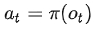

得到的奖励 

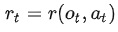

从而来优化策略 π，使其能够在环境中自主学习。

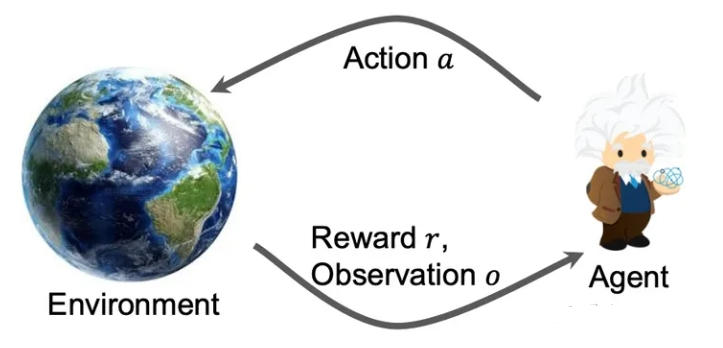

### 1.2 介绍一下强化学习 的 状态（States） 和 观测（Observations）？

- 状态（States）：对于世界状态的完整描述
- 观测（Observations）：对于一个状态的部分描述，可能会缺失一些信息。当O=S时，称O为完美信息/fully observed；O<S时，称O为非完美信息/partially observed。

### 1.3 强化学习 有哪些 动作空间（Action Spaces），他们之间的区别是什么？

- 离散动作空间：当智能体只能采取有限的动作，如下棋/文本生成
- 连续动作空间：当智能体的动作是实数向量，如机械臂转动角度

其区别会影响policy网络的实现方式。

### 1.4 强化学习 有哪些 Policy策略？

- 确定性策略Deterministic Policy： at = u(st)，连续动作空间
- 随机性策略Stochastic Policy： at ~ π(·|st) ，离散动作空间

### 1.5 介绍一下 强化学习 的 轨迹？

- 轨迹：指的是状态和行动的序列

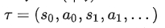

1. 状态转换函数（transition function）：

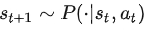

2. 初始状态是从初始状态分布中采样的，一般表示为

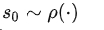

### 1.6 介绍一下 强化学习 的 奖赏函数？

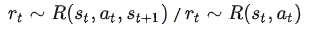

智能体的目标是最大化**行动轨迹的累计奖励**：

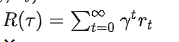

### 1.7 介绍一下 强化学习问题？

- 核心问题：选择一种策略从而最大化 **预期收益**

1. 假设环境转换和策略都是随机的，则T步行动轨迹概率：

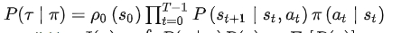

2. 预期收益：

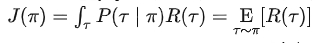

3. 核心优化问题：找到最优策略

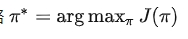

## 二、RL发展路径（至PPO）

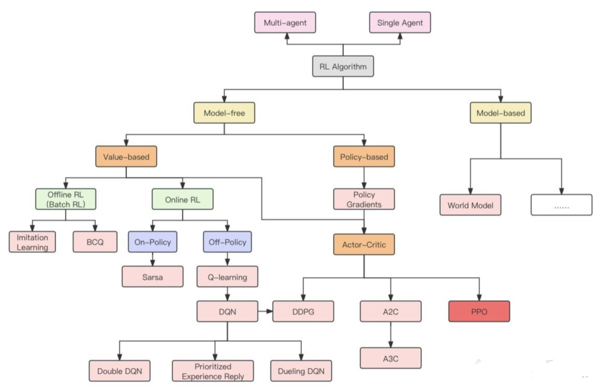

### 2.1 介绍一下 强化学习 中 优化方法 Value-based？

- value-based：状态的值 V(s) 或者 状态行动对(state-action pair) 的值Q(s,a) ，作为一种累积奖赏的估计，可以通过最大化值函数来优化得到最优策略

1. 最优值函数（Optimal Value Function）：

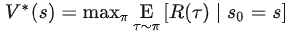

2. 最优动作-值函数（Optimal Action-Value Function）：

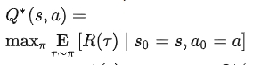

最优动作： 

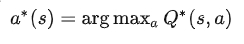

3. 两者的关系：

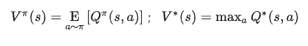

### 2.2 介绍一下 强化学习 中 贝尔曼方程？

- 中心思想：当前值估计=当前奖赏+未来值估计

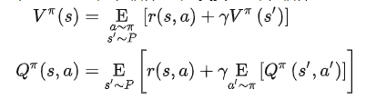

所以，最优值函数的贝尔曼公式为：

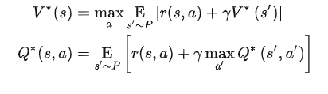

### 2.3 介绍一下 强化学习 中 优势函数Advantage Functions？

强化学习中，有时不需要知道一个行动的绝对好坏，而只需要知道它相对于其他action的相对优势。即

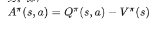

## 致谢

- RL in NLP：强化学习在自然语言处理下的应用 https://zhuanlan.zhihu.com/p/669524673

