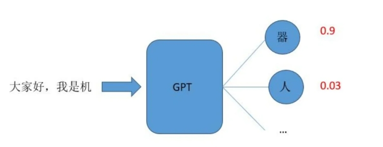
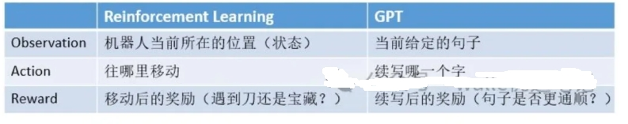
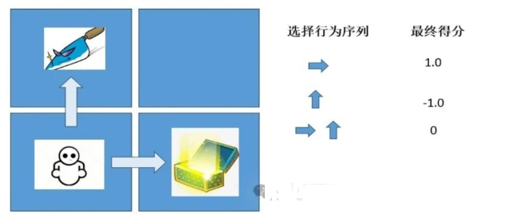
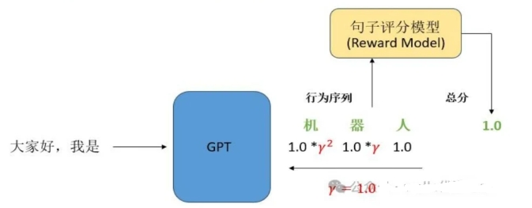
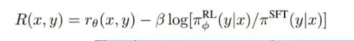
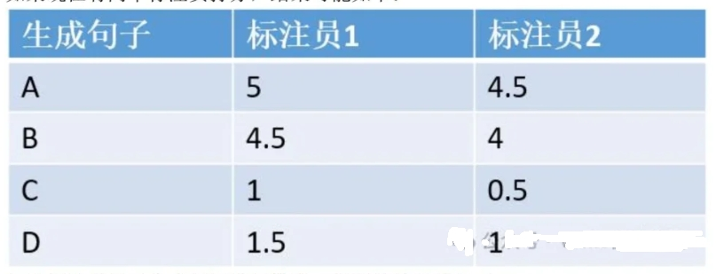
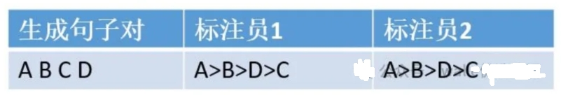
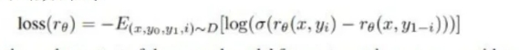
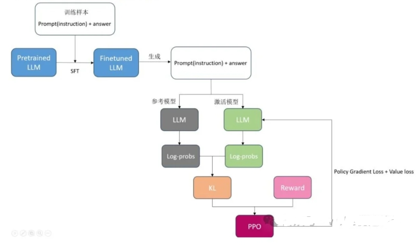
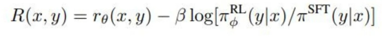

# 大模型（LLMs）强化学习面

- [大模型（LLMs）强化学习面](#大模型llms强化学习面)
  - [1 简单介绍强化学习？](#1-简单介绍强化学习)
  - [2 简单介绍一下 RLHF？](#2-简单介绍一下-rlhf)
  - [3 奖励模型需要和基础模型一致吗？](#3-奖励模型需要和基础模型一致吗)
  - [4 RLHF 在实践过程中存在哪些不足？](#4-rlhf-在实践过程中存在哪些不足)
  - [5 如何解决 人工产生的偏好数据集成本较高，很难量产问题？](#5-如何解决-人工产生的偏好数据集成本较高很难量产问题)
  - [6 如何解决三个阶段的训练（SFT-\>RM-\>PPO）过程较长，更新迭代较慢问题？](#6-如何解决三个阶段的训练sft-rm-ppo过程较长更新迭代较慢问题)
  - [7 如何解决 PPO 的训练过程同时存在4个模型（2训练，2推理），对计算资源的要求较高 问题？](#7-如何解决-ppo-的训练过程同时存在4个模型2训练2推理对计算资源的要求较高-问题)
  - [8 强化学习跟大语言模型的本质联系是什么？](#8-强化学习跟大语言模型的本质联系是什么)
  - [9 大语言模型与强化学习的本质联系？](#9-大语言模型与强化学习的本质联系)
  - [10 GPT 到底是基于概率的还是基于价值?](#10-gpt-到底是基于概率的还是基于价值)
  - [11 强化学习究竟是如何与大语言模型做结合的?](#11-强化学习究竟是如何与大语言模型做结合的)
  - [12 强化学习与大模型的结合在公式中是如何体现?](#12-强化学习与大模型的结合在公式中是如何体现)
  - [13 强化学习与大模型的结合的好处?](#13-强化学习与大模型的结合的好处)
  - [14 reward 模型训练步骤中，为什么这一步骤在标注数据过程中不让人直接打分，而是去标排列序列呢?](#14-reward-模型训练步骤中为什么这一步骤在标注数据过程中不让人直接打分而是去标排列序列呢)
  - [15 reward 模型的 loss 是怎么计算的?](#15-reward-模型的-loss-是怎么计算的)
  - [16 直接用训练 reward model 的数据精调模型，而不用强化学习，是否可行?为什么?](#16-直接用训练-reward-model-的数据精调模型而不用强化学习是否可行为什么)
    - [16.1 reward模型、强化学习、SFT分别的作用?](#161-reward模型强化学习sft分别的作用)
    - [16.2 reward 模型、强化学习、SFT之间如何配合?](#162-reward-模型强化学习sft之间如何配合)
  - [17 假如 reward model 不太准，怎么办?](#17-假如-reward-model-不太准怎么办)
  - [18 chatGPT 强化学习训练阶段还有什么改进的空间和思路吗?](#18-chatgpt-强化学习训练阶段还有什么改进的空间和思路吗)
  - [19 现阶段LLM的对齐阶段分为sft和rlhf阶段，我们可以跳过sft阶段直接进行rlhf么？](#19-现阶段llm的对齐阶段分为sft和rlhf阶段我们可以跳过sft阶段直接进行rlhf么)
  - [致谢](#致谢)

## 1 简单介绍强化学习？

强化学习：（Reinforcement Learning）一种机器学习的方法，**通过从外部获得激励来校正学习方向从而获得一种自适应的学习能力**。

## 2 简单介绍一下 RLHF？

基于人工反馈的强化学习（Reinforcement Learning from Human Feedback，RLHF）：**构建人类反馈数据集，训练一个激励模型，模仿人类偏好对结果打分**，这是GPT-3后时代大语言模型越来越像人类对话核心技术。

## 3 奖励模型需要和基础模型一致吗？

不同实现方式似乎限制不同。（待实践确认）colossal-ai的coati中需要模型有相同的tokenizer，所以选模型只能从同系列中找。在ppo算法实现方式上据说trlx是最符合论文的。

## 4 RLHF 在实践过程中存在哪些不足？

1. 不足点1：人工产生的偏好数据集成本较高，很难量产；
2. 不足点2：三个阶段的训练（SFT->RM->PPO）过程较长，更新迭代较慢；
3. 不足点3：PPO 的训练过程同时存在4个模型（2训练，2推理），对计算资源的要求较高。

## 5 如何解决 人工产生的偏好数据集成本较高，很难量产问题？

- 解决方法：AI 专家替代派
- 代表方法：

1. [RLAIF](https://arxiv.org/pdf/2212.08073.pdf)

该方法的**核心在于通过AI 模型监督其他 AI 模型，即在SFT阶段，从初始模型中采样，然后生成自我批评和修正，然后根据修正后的反应微调原始模型**。 在 RL 阶段，从微调模型中采样，使用一个模型来评估生成的样本，并从这个 AI 偏好数据集训练一个偏好模型。 然后使用偏好模型作为奖励信号对 RL 进行训练，即 RL from AI Feedback（RLAIF）。

2. [RRHF](https://arxiv.org/abs/2304.05302)

RRHF(Rank Response from Human Feedback) 不需要强化学习，可以利用不同语言模型生成的回复，包括 ChatGPT、GPT-4 或当前的训练模型。RRHF通过对回复进行评分，并通过排名损失来使回复与人类偏好对齐。RRHF 通过通过排名损失使评分与人类的偏好（或者代理的奖励模型）对齐。RRHF 训练好的模型可以同时作为生成语言模型和奖励模型使用

## 6 如何解决三个阶段的训练（SFT->RM->PPO）过程较长，更新迭代较慢问题？

- 解决方法：微调数据优化派
  - 方法介绍：该类方法的核心在于仅仅通过优质数据集的获取和产生，以训练得到一个效果较好的 SFT 模型，而无需进行 RM 和 PPO 的训练。
- 代表方法：

1. [LIMA](https://arxiv.org/pdf/2305.11206.pdf)

LIMA(Less Is More for Alignment) 即浅层对齐假说，即一个模型的知识和能力几乎完全是在预训练中学习的，而对齐则是教会它与用户交互时如何选择子分布。如果假说正确，对齐主要有关于学习方式，那么该假说的一个推论是，人们可以用相当少的样本充分调整预训练的语言模型。因此，该工作假设，对齐可以是一个简单的过程，模型学习与用户互动的风格或格式，以揭示在预训练中已经获得的知识和能力。

2. [MAYBE ONLY 0.5% DATA IS NEEDED](https://arxiv.org/abs/2305.09246)

本文主要从数据角度来探讨如何降低 LLM 训练阶段的成本，提高数据效率。为了实现该目的，作者通过从现有数据中识别出最有价值的核心样本来帮助模型获取下游任务的知识，并仅用少量数据来实现可比甚至更好的性能。

## 7 如何解决 PPO 的训练过程同时存在4个模型（2训练，2推理），对计算资源的要求较高 问题？

- 解决方法：训练过程改造派
  - 方法介绍：该类方法通常通过改造模型的训练方式（如只保留SFT和RM），以提高训练效率并减少训练成本。
- 代表方法：

1. [RAFT](https://arxiv.org/pdf/2304.06767.pdf)

RAFT（Reward rAnked FineTuning），它基于关于通过奖励和监督微调对样本进行排序的组合的形式。

2. [DPO](https://arxiv.org/pdf/2305.18290.pdf)

DPO(Direct Preference Optimization) 提出了一种使用二进制交叉熵目标来精确优化LLM的方法，以替代基于 RL HF 的优化目标，从而大大简化偏好学习 pipeline。

## 8 强化学习跟大语言模型的本质联系是什么？

其实简单来说，基于概率就是将行为量化为「概率」，基于价值就是将行为量化为「值」，具体来讲:

- 1) 基于概率:是强化学习中最直接的一种，他能通过感官分析所处的环境，直接输出下一步要采取的各种动作的概率，然后根据概率采取行动，所以每种动作都有可能被选中，只是可能性不同；在训练的时候，好行为的概率值将被不断提高(向右走，0.75)，差行为的概率将被不断降低(向上走，0.25)
- 2) 基于价值的方法输出则是所有动作的价值，我们会根据最高价值来选着动作好行为的行为值将被不断提高(向右走，1分)，差行为的行为值将被不断降低(向上走，-1)，相比基于概率的方法，基于价值的决策部分更为铁定，毫不留情，就选价值最高的;而基于概率的，即使某个动作的概率最高，但是还是不一定会选到他。

两种策略输入一样，都是多选择得分高的行为，少选择得分低的行为，只是输出的形式不一样(概率v.s.值)

## 9 大语言模型与强化学习的本质联系？

大语言模型都是生成式任务，也就是给定一段话的前提下，预测这段话的下一个字是什么;而如何进行下一个字预测，通常是通过词表中各个词的概率来反映。那么我们将大语言模型代入强化学习视角:

“给定的一段话”就是我们当前的状态，“预测下一个词”就是我们将要进行的行动，而大语言模型就是机器人本身。

## 10 GPT 到底是基于概率的还是基于价值?

通过第一个问题我们可以知道，大语言模型，例如 GPT等，他们的采样过程其实和基于概率的决策过程非常一致;即在给定一个句子的情况下(状态)，选择其后面紧接哪一个词(行为)是最优的。



因此，将R中基于概率的训练过程应用到训练GPT生成任务里，就显得很自然了，我们来看看下面的这张表。



## 11 强化学习究竟是如何与大语言模型做结合的?

瓦力想要拿到宝藏，通常需要做出 N 次行为选择。

如下图所示，不同的行为选择序列得到的得分:假设拿到宝藏得1分，碰到刀得-1分，其余情况不加分也不扣分。



在这种情况下我们最终只有一个得分和N个行为，但是最终L更新需要每个行为都要有对应的分数，我们该如何把这一个总得分对应的分配给所有的行为(也就是多种路径)呢?

在瓦力选择路径的过程中会产生N个行为,但实际每次完整的路径只有一个得分;那么如果把总得分和每次的路径(行为)是如何对应的呢?这里引出强化学习中的概念--折扣奖励(discountreward)这里存在一些猜测，可能是越靠近最末端的行为对得分的影响越大;也可能是越靠前的行为对得分的影响越大,于是我们根据实际情况与猜测为每一次行为就乘以1次折扣因子 Y。

同样，代入大语言模型视角，在生成一个完整句子的过程中，也会依次选择N个词:但我们只会对最后生成的完整句子进行打总分;这里我们在生成每个词是默认生成的每个词都同等得重要，因此大语言模型的折扣因子取1.0。



## 12 强化学习与大模型的结合在公式中是如何体现?

通过加入概率差异(KL Penalty)以稳定 RL 训练

根据 0penAI 的 [Learning to summarize from human feedback]的论文，除了最终生成句子的得分基础外，在每生成一个词/字的时候，需要计算L模型和 SFT 模型在生成当前词/字的概率差异，以此来当作生成当前词/字的当前步奖励。



## 13 强化学习与大模型的结合的好处?

- 1) 避免模型重复输出相同的一个字;
- 2) 限制 RL不要探索的离一开始的模型太远。

SFT的作用是控制生成的句子通顺度，RL Model的作用是控制生成句子的偏好概率差异相当于在句子通顺度和人类偏好中取了一个平衡。但是理论上来说，如果RM足够的强大，其实可以完全放开概率限制并让其自由探索。

## 14 reward 模型训练步骤中，为什么这一步骤在标注数据过程中不让人直接打分，而是去标排列序列呢?

受不同标注员主观因素影响，比起绝对的分数，相对的顺序更利于模型预测。这里举个例子，假设我们想让模型说出对榴莲的评价，模型生成了ABCD四个句子，而我们想要训练一个对榴莲都生成正面评价的reward模型:

```s
A：榴莲具有浓郁香味和奶油般的口感。
B：成熟的榴莲可以有甜美的味道，对一些人而言，这是其吸引之处。
C：榴莲的强烈气味是一些人无法忍受的。
D：一些人可能不喜欢榴莲的奶油质地和特殊口感。
```

如果现在有两个标注员打分，结果可能如下:



如果标注员只对生成好坏进行排序，得到的结果则如下:



显而易见，对于打分的情况，模型是很容易疑惑的，到底应该是几分;而排序基本能得到统一的结果，更利于模型学习。

## 15 reward 模型的 loss 是怎么计算的?

reward模型训练步骤中，我们需要标注员对生成的句子进行排序，那么排序的结果怎么计算 loss 呢?

> 此处引出Rank Loss 

A>B>D>C;我们需要训练其对应的打分模型，模假定根据第五个问题中的排序型生成的分要满足 r(A)>r(B)>r(D)>r(C)。

此处直接上损失函数公式:



其中，yi 代表排序排在 y1-i 前面的所有句子。

我们代入上面的例子A>B>D>C :

```s
1.loss=r(A)-r(B)+r(A)-r(c)+r(A)-r(D)+r(B)- r(D)++r(D)-r(c)
2.loss =-loss
```

为了更好得归一化差值,每两项差值都需要过一个 sigmoid 函数,将值拉到 01 之间。

下面我们来解释一下 1oss 前面的负号是什么含义: **这个 1oss 设计的目的是期望模型能够最大化 好句子得分和坏句子得分的差值。而梯度下降做的是最小化操作，所以我们对 loss 取负数，就可以实现最大化差值的效果了。**

## 16 直接用训练 reward model 的数据精调模型，而不用强化学习，是否可行?为什么?

### 16.1 reward模型、强化学习、SFT分别的作用?

- SFT: 基于有监督知识微调大语言模型，用于生成句子
- reward 模型: 通过对不同偏好进行排序标注，再用reward 模型来学习偏好强化学习:作为探索大语言模型生成句子的学习方式，用于控制大语言模型生成的偏好

### 16.2 reward 模型、强化学习、SFT之间如何配合?

下面是的图可以比较直观的说明



## 17 假如 reward model 不太准，怎么办?

这里提供一种思路，大家可以再延申去想一下''

- **减少reward 的影响**：参照第四个问题中的公式，我们把调和率调低一些



## 18 chatGPT 强化学习训练阶段还有什么改进的空间和思路吗?

解决方案可以从四个方向考虑:

1. **数据**: 数据增强工作，比如数据合成、数据扩增、self-train、模拟数据、领域迁移来扩充人工产生的数据集，从而减少对人工产生数据的需求。
2. **采样优化**:通过主动学习(通过不确定性采样、多样性采样等算法选择那些对模型训练最有帮助的样本进行标注)等算法选择最具价值的样本重新标注再加入训练。
3. **模型优化**:通过在线学习(利用实际用户交互数据改进模型)、在LLM微3调过程中加入强化学习损失等方法优化模型。
4. **简化人工**:建立可通用的人工规则进行自训练或直接用模型的评分;人工规则通过众包或者协作机制提高效率，并通过科学的审核机制规避不合理标注等。

## 19 现阶段LLM的对齐阶段分为sft和rlhf阶段，我们可以跳过sft阶段直接进行rlhf么？

现阶段来看是不太可能的。跟sft可以类比的是RL中的模仿学习，RLHF就是在此基础上纯跟环境交互的RL。那么和LLM对齐阶段相似的过程有两个，第一是alpha-go，第二个是自动驾驶。它们两个现实中的人工智能技术，开始的时候都是先做模仿学习，第二步进行跟环境交互的强化学习。他们都有个共同特点，就是环境复杂，模型如果纯进行RL的话，搜索空间过于庞大，消耗资源较多。尽管alpha-go后续有zero-alpha-go算法，但是建立的基础是reward model是客观的，且不计成本的进行空间搜索。在LLM环境下，由于不存在天然的reward model，所以建立reward model的人工成本较大，所以不适合不计成本的空间搜索。所以利用sft首先做模仿学习缩小搜索空间，再利用RLHF进行进一步对齐是必要的。

## 致谢

- 基于RLHF的一些改进 https://zhuanlan.zhihu.com/p/656750083
- 大模型的面试题系列-9 https://zhuanlan.zhihu.com/p/686357384
