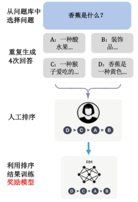
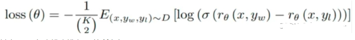

# reward 篇

- [reward 篇](#reward-篇)
  - [1 介绍一下 RM模型？](#1-介绍一下-rm模型)
  - [2 为什么需要 RM模型？](#2-为什么需要-rm模型)
  - [3 RM模型训练数据如何构建？](#3-rm模型训练数据如何构建)
  - [4 reward 模型训练步骤中，为什么这一步骤在标注数据过程中不让人直接打分，而是去标排列序列呢?](#4-reward-模型训练步骤中为什么这一步骤在标注数据过程中不让人直接打分而是去标排列序列呢)
  - [5 reward 模型的 loss 是怎么计算的?](#5-reward-模型的-loss-是怎么计算的)
  - [5 直接用训练 reward model 的数据精调模型，而不用强化学习，是否可行?为什么?](#5-直接用训练-reward-model-的数据精调模型而不用强化学习是否可行为什么)
    - [5.1 reward模型、强化学习、SFT分别的作用?](#51-reward模型强化学习sft分别的作用)
    - [5.2 reward 模型、强化学习、SFT之间如何配合?](#52-reward-模型强化学习sft之间如何配合)
  - [6 假如 reward model 不太准，怎么办?](#6-假如-reward-model-不太准怎么办)
  - [7 使用多少数据能够训练好一个RM？](#7-使用多少数据能够训练好一个rm)
  - [8 RM 模型的大小限制？](#8-rm-模型的大小限制)
  - [9 RM 模型架构是怎么样？](#9-rm-模型架构是怎么样)
  - [10 奖励模型的损失函数为什么会比较答案的排序，而不是去对每一个答案的具体分数做一个回归？](#10-奖励模型的损失函数为什么会比较答案的排序而不是去对每一个答案的具体分数做一个回归)
  - [11 奖励模型中每个问题对应的答案数量即K值为什么选 9 更合适，而不是选择 4 呢？](#11-奖励模型中每个问题对应的答案数量即k值为什么选-9-更合适而不是选择-4-呢)

## 1 介绍一下 RM模型？

RM模型:奖励模型，目的是刻画大模型的输出是否在人类看来表现不错，即人类偏好对齐。

## 2 为什么需要 RM模型？

因为指令微调后的模型输出可能不符合人类偏好，所以需要利用强化学习优化模型，而奖励模型是强化学习的关键一步，所以需要训练奖励模型。

1.模型输出可能不符合人类偏好

上一篇讲的SFT只是将预训练模型中的知识给引导出来的一种手段，而在SFT 数据有限的情况下，我们对模型的引导能力就是有限的。这将导致预训练模型中原先错误或有害的知识没能在 SFT 数据中被纠正，从而出现「有害性」或「幻觉」的问题。

2.需要利用强化学习优化模型

一些让模型脱离昂贵标注数据，自我进行迭代的方法被提出，比如：RLHF，DPO，RLHF是直接告诉模型当前样本的（好坏）得分，DPO 是同时给模型一条好的样本和一条坏的样本。最终目的是告知模型什么是好的数据，什么是不好的数据，将大模型训练地更加符合人类偏好。

3.设计有效的奖励模型是强化学习的关键一步

- 设计有效的奖励模型是 RLHF 的关键一步，因为没有简单的数学或逻辑公式可以切实地定义人类的主观价值。
- 在进行RLHF时，需要奖励模型来评估语言大模型（actor model）回答的是好是坏，这个奖励模型通常比被评估的语言模型小一些（deepspeed的示例中，语言大模型66B，奖励模型只有350M）。奖励模型的输入是prompt+answer的形式，让模型学会对prompt+answer进行打分。
- 奖励模型的目标是构建一个文本质量对比模型，对于同一个提示词，SFT 模型给出的多个不同输出结果的质量进行排序。

## 3 RM模型训练数据如何构建？

奖励模型的训练数据是人工对问题的每个答案进行排名，如下图所示：



对于每个问题，给出若干答案，然后工人进行排序，而奖励模型就是利用排序的结果来进行反向传播训练。

## 4 reward 模型训练步骤中，为什么这一步骤在标注数据过程中不让人直接打分，而是去标排列序列呢?

受不同标注员主观因素影响，比起绝对的分数，相对的顺序更利于模型预测。这里举个例子，假设我们想让模型说出对榴莲的评价，模型生成了ABCD四个句子，而我们想要训练一个对榴莲都生成正面评价的reward模型:

```s
A：榴莲具有浓郁香味和奶油般的口感。
B：成熟的榴莲可以有甜美的味道，对一些人而言，这是其吸引之处。
C：榴莲的强烈气味是一些人无法忍受的。
D：一些人可能不喜欢榴莲的奶油质地和特殊口感。
```

如果现在有两个标注员打分，结果可能如下:


如果标注员只对生成好坏进行排序，得到的结果则如下:


显而易见，对于打分的情况，模型是很容易疑惑的，到底应该是几分;而排序基本能得到统一的结果，更利于模型学习。

## 5 reward 模型的 loss 是怎么计算的?

reward模型训练步骤中，我们需要标注员对生成的句子进行排序，那么排序的结果怎么计算 loss 呢?

> 此处引出Rank Loss 

A>B>D>C;我们需要训练其对应的打分模型，模假定根据第五个问题中的排序型生成的分要满足 r(A)>r(B)>r(D)>r(C)。

此处直接上损失函数公式:



其中 $r_ϕ$ 就是 reward model 用来给回答打分。D 是训练数据集，x 是 prompt，$y_{win}$ 和 $y_{lose}$ 分别是好的回答和不好的回答。也就是说，要尽可能让好的回答的得分比不好的回答高，拉大他们之间的差别。

我们代入上面的例子A>B>D>C :

```s
1.loss=r(A)-r(B)+r(A)-r(c)+r(A)-r(D)+r(B)- r(D)++r(D)-r(c)
2.loss =-loss
```

为了更好得归一化差值,每两项差值都需要过一个 sigmoid 函数,将值拉到 01 之间。

下面我们来解释一下 1oss 前面的负号是什么含义: **这个 1oss 设计的目的是期望模型能够最大化 好句子得分和坏句子得分的差值。而梯度下降做的是最小化操作，所以我们对 loss 取负数，就可以实现最大化差值的效果了。**

## 5 直接用训练 reward model 的数据精调模型，而不用强化学习，是否可行?为什么?

### 5.1 reward模型、强化学习、SFT分别的作用?

- SFT: 基于有监督知识微调大语言模型，用于生成句子
- reward 模型: 通过对不同偏好进行排序标注，再用reward 模型来学习偏好强化学习:作为探索大语言模型生成句子的学习方式，用于控制大语言模型生成的偏好

### 5.2 reward 模型、强化学习、SFT之间如何配合?

下面是的图可以比较直观的说明


## 6 假如 reward model 不太准，怎么办?

这里提供一种思路，大家可以再延申去想一下''

- **减少reward 的影响**：参照第四个问题中的公式，我们把调和率调低一些


## 7 使用多少数据能够训练好一个RM？

- 在 OpenAI Summarize 的任务中，使用了 6.4w 条]偏序对进行训练。
- 在 InstructGPT 任务中，使用了 3.2w 条 [4~9] 偏序对进行训练。
- 在 StackLlama 任务中，使用了 10w 条 Stack Exchange 偏序对进行训练。
- 从上述工作中，我们仍无法总结出一个稳定模型需要的最小量级，这取决于具体任务。
- 但至少看起来，5w 以上的偏序对可能是一个相对保险的量级。

## 8 RM 模型的大小限制？

Reward Model 的作用本质是给生成模型的生成内容进行打分，所以 Reward Model 只要能理解生成内容即可。
关于 RM 的规模选择上，目前没有一个明确的限制：

- Summarize 使用了 6B 的 RM，6B 的 LM。
- InstructGPT 使用了 6B 的 RM，175B 的 LM。
- DeepMind 使用了 70B 的 RM，70B LM。

不过，一种直觉的理解是：判分任务要比生成认为简单一些，因此可以用稍小一点的模型来作为 RM。

## 9 RM 模型架构是怎么样？

奖励模型（RM 模型）将 SFT 模型最后一层的 softmax 去掉，即最后一层不用 softmax，改成一个线性层。RM 模型的输入是问题和答案，输出是一个标量即分数。

由于模型太大不够稳定，损失值很难收敛且小模型成本较低，因此，RM 模型采用参数量为 6B 的模型，而不使用 175B 的模型。

## 10 奖励模型的损失函数为什么会比较答案的排序，而不是去对每一个答案的具体分数做一个回归？

每个人对问题的答案评分都不一样，无法使用一个统一的数值对每个答案进行打分，训练标签不好构建。如果采用对答案具体得分回归的方式来训练模型，会造成很大的误差。但是，每个人对答案的好坏排序是基本一致的。通过排序的方式避免了人为的误差。

## 11 奖励模型中每个问题对应的答案数量即K值为什么选 9 更合适，而不是选择 4 呢？

- 进行标注的时候，需要花很多时间去理解问题，但答案之间比较相近，假设 4 个答案进行排序要 30 秒时间，那么 9 个答案排序可能就 40 秒就够了。9 个答案与 4 个答案相比生成的问答对多了 5 倍，从效率上来看非常划算；
- K=9时，每次计算 loss 都有 36 项rθ​(x,y)需要计算，RM 模型的计算所花时间较多，但可以通过重复利用之前算过的值（也就是只需要计算 9 次即可），能节约很多时间。


