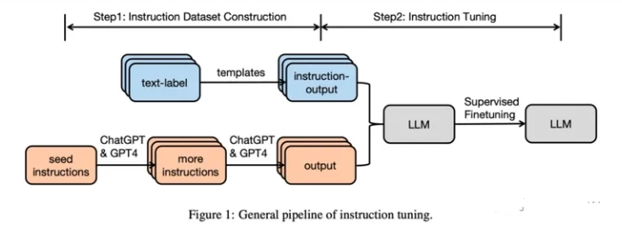
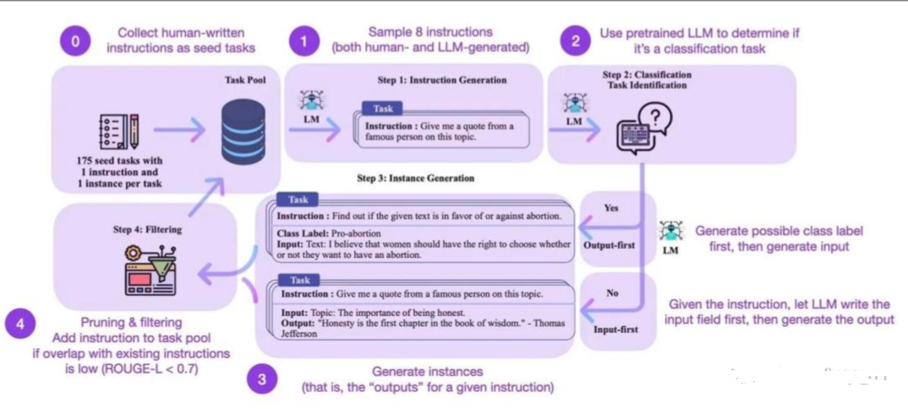
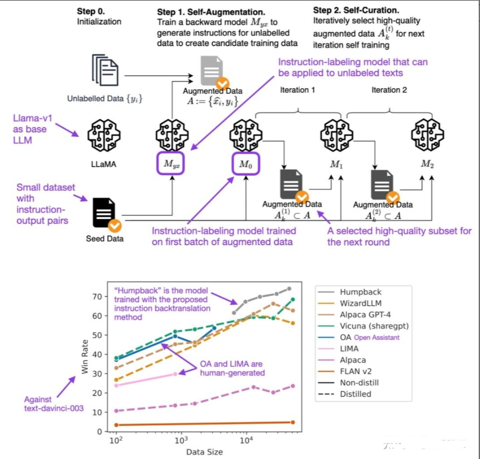

# 大模型（LLMs）LLM生成SFT数据方法面

- [大模型（LLMs）LLM生成SFT数据方法面](#大模型llmsllm生成sft数据方法面)
  - [四、大模型微调数据集格式篇](#四大模型微调数据集格式篇)
  - [一、SFT数据集如何生成？](#一sft数据集如何生成)
  - [二、Self-Instruct 篇](#二self-instruct-篇)
    - [2.1 什么是 Self-Instruct ？](#21-什么是-self-instruct-)
    - [2.2 Self-Instruct 处理思路？](#22-self-instruct-处理思路)
  - [三、Backtranslation 篇](#三backtranslation-篇)
    - [3.1 什么是 Backtranslation？](#31-什么是-backtranslation)
  - [参考](#参考)

## 四、大模型微调数据集格式篇

大模型微调时，数据集的格式通常取决于微调的具体目标和应用场景。根据搜索结果，常见的微调数据集格式主要包括以下几种：

1. 指令跟随格式

- 介绍：这种格式的数据集以指令和输出对的形式存在，用户输入一个指令，模型根据指令生成相应的输出结果。
- 数据存储方式：数据集通常采用JSON文件格式存储，例如Alpaca-52k数据集，它包含了52000条指令数据。
- Instruction/Output格式：包含一个指令和一个对应的输出。

```s
    #instruction: 什么是三原色？
    #output: 三原色是红、蓝、黄。
```

> 注： Instruction/Input/Output格式：包含一个指令、一个输入和一个输出，适用于需要模型处理输入并生成输出的场景。

> 示例

```s
    #instruction: 检查这个句子的拼写和语法错误
    #input: 他吃完饭离开了餐厅。
    #output: 这句话中有两个拼写错误。正确的句子应该是：“他吃完饭后离开了餐厅”。
```

2. 多轮对话格式

- 介绍：这种格式模拟用户和模型之间的多轮对话，模型通过与用户的交互来满足用户的需求。
- 数据存储方式：数据集通常采用JSON文件格式存储，例如 belle_chat_ramdon_10k.json，该样例数据是从 multiturn_chat_0.8M 采样出 1 万条，并且做了格式转换。主要是展示多轮数据怎么训练，不保证效果。
- conversations格式：一个对话内容。

```json
[
  {
    "conversations": [
      {
        "from": "human",
        "value": "用户指令"
      },
      {
        "from": "gpt",
        "value": "模型回答"
      }
    ],
    "system": "系统提示词（选填）",
    "tools": "工具描述（选填）"
  }
]
```

> 示例

```s
[
 {
  "id": "77771",
  "conversations": [
   {
    "from": "human",
    "value": "写一篇关于气候变化对海洋生态的影响的文章。\n"
   },
   {
    "from": "gpt",
    "value": "好的，以下是你要求的文章：\n气候变化对海洋生态的影响\n气候变化对海洋生态产生了广泛的影响。全球变暖导致海洋温度上升，这可能会对许多水生生物的生存、繁殖和迁移造成巨大的影响。另外，海洋酸化也是一个问题，因为大气中二氧化碳的增加导致海水中的pH值下降，使得许多生物的外骨骼变得脆弱，从而影响它们的生存和繁殖。\n此外，气候变化还会引起海平面上升，这不仅对海岸线和沿海居民产生影响，还会对许多海洋生物的栖息地造成影响。一些岛屿上的陆地生物面临几乎完全消失的风险，而另一些生物范围则会扩大到更广泛的领域，这可能会导致新的竞争和生态平衡的改变。\n总之，气候变化并不只是一个地球气温的问题，它对海洋生态系统产生了广泛和深远的影响。\n"
   },
   {
    "role": "human",
    "content": "从刚刚的文章中提取出气候变化对海洋生物繁殖的影响。\n"
   },
   {
    "from": "gpt",
    "value": "文章已经提到过气候变化会对海洋生物的生存、繁殖和迁移造成影响。例如，海洋酸化会使得许多生物的外骨骼变得脆弱，进而影响它们的生存和繁殖。此外，海洋温度上升也可能会对很多生物的生存和繁殖产生负面影响。"
   }
  ]
 },...
]
```

- id：对话 id
- conversations：对话内容 【List】
  - from： 说话人 （human|gpt）
  - value：说话内容

3. 其他辅助格式

- 包括纯文本文档格式、文本总结数据集、根据纯文本生成对话的数据集等。
- 这些格式不易直接转化为对话形式，但可以通过特定的处理转换为指令跟随或多轮对话的格式。

在构建微调数据集时，需要考虑数据来源、数据质量、数据规模和相似性等因素，以确保数据集能够有效地帮助模型学习特定任务的格式和规律。微调数据集的规模通常比预训练数据集小得多，典型的规模在几MB到1GB左右。此外，微调数据集的构建还可能涉及到数据收集、数据清洗、数据增强等处理步骤，以及可能需要使用到的特定标记（如StartToken、PadToken、EndToken等）来帮助模型更好地理解数据。

## 一、SFT数据集如何生成？

SFT数据集构建通常有两种方法：人工标注和使用LLM（比如GPT-4）来生成的，人工标注对于构建垂直领域比较合适，可以减少有偏数据，但是成本略高；使用LLM生成，可以在短时间内生成大量数据。

SFT数据集构建以及SFT微调Pipeline如下图所示：



## 二、Self-Instruct 篇

### 2.1 什么是 Self-Instruct ？

Self-Instruct（https://arxiv.org/abs/2212.10560）：一个通过预训练语言模型自己引导自己来提高的指令遵循能力的框架。

### 2.2 Self-Instruct 处理思路？

- 步骤1：作者从 175个种子任务中随机抽取 8 条自然语言指令作为示例，并提示InstructGPT生成更多的任务指令。
- 步骤2：作者确定步骤1中生成的指令是否是一个分类任务。如果是，他们要求 InstructGPT 根据给定的指令为输出生成所有可能的选项，并随机选择特定的输出类别，提示 InstructGPT 生成相应的“输入”内容。对于不属于分类任务的指令，应该有无数的“输出”选项。作者提出了“输入优先”策略，首先提示 InstructGPT根据给定的“指令”生成“输入”，然后根据“指令”和生成的“输入”生成“输出”。
- 步骤3：基于第 2 步的结果，作者使用 InstructGPT 生成相应指令任务的“输入”和“输出”，采用“输出优先”或“输入优先”的策略。
- 步骤4：作者对生成的指令任务进行了后处理(例如，过滤类似指令，去除输入输出的重复数据)，最终得到52K条英文指令



## 三、Backtranslation 篇

### 3.1 什么是 Backtranslation？

回译在传统的机器学习中是一种数据增强方法，比如从中文翻译成英文，再从英文翻译会中文，这样生成的中文与原来的中文在语义上是一致的，但是文本不同；然而SFT数据生成的回译（https://arxiv.org/abs/2308.06259）则是通过输出来生成指令，具体步骤如下图所示：




## 参考

- LLM（二）| LIMA：在1k高质量数据上微调LLaMA1-65B，性能超越ChatGPT  https://zhuanlan.zhihu.com/p/657752327