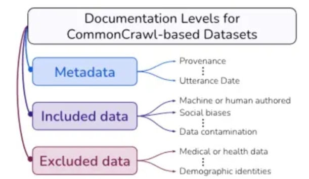

# 大模型数据集汇总

## 一、预训练数据集

### 1.1 C4

> 数据清洗 URL: https://github.com/google-research/text-to-text-transfer-transformer/tree/main/t5/data
> 
> 记录问题 URL: https://github.com/allenai/c4-documentation
> 
> 下载 URL: https://github.com/allenai/allennlp/discussions/5056
> 
> 检索 URL: https://c4-search.apps.allenai.org/
> 
> Paper: https://arxiv.org/pdf/2104.08758.pdf

2021 EMNLP，T5的训练语料，2021年 4 月

- 数据来源：巨型爬虫数据 Common Crawl 做清洗后得到的语料库 C4
- 数据规模：C4是可用的最大语言数据集之一，收集了来自互联网上超过3.65亿个域的超过1560亿个token。

- 元数据：互联网域名/网站、言论日期、地理位置
- 包括的数据
  - 机器生成的文本、基准数据污染、C4.EN中的人口统计偏差
- 排除的数据（要明白过滤器的危害）
  - 描述被排除的文档、哪些人口统计身份被排除、哪些人的英语被包括在内

### 1.2 ROOTS

> 下载 URL: https://huggingface.co/bigscience-data
> 
> 清洗 URL: https://github.com/bigscience-workshop/data-preparation
> 
> the Responsible Open-science Open-collaboration Text Sources (ROOTS)

NeurIPS 2022，BLOOM 的训练语聊

- 数据规模：一个1.6TB的数据集跨越了59种语言(46种自然语言，13种编程语言)，用于训练拥有1760亿个参数的BigScience大型公开科学多语言开放访问(BLOOM)语言模型。(BigScience Workshop, 2022)
  - 62%的文本来自社区选择和记录的语言数据源列表
  - 38％的文本来自经过预处理的网络爬取数据集OSCAR, 并通过母语人士的帮助进行了过滤

### 1.3 Pile

2020年，825G的语料

> Url (处理代码): https://github.com/EleutherAI/the-pile
> 
> Paper: https://arxiv.org/abs/2101.00027

Pile：一个面向训练大规模语言模型的825 GiB英语文本语料库。Pile由22个多样化的高质量子集构成，包括现有的和新构建的子集，许多子集来自学术或专业来源。作者对GPT-2和GPT-3在Pile上的未调优性能进行了评估，结果显示这些模型在许多组成部分上都存在困难，比如学术写作。相反，使用Pile训练的模型在Pile的所有组成部分上都比Raw CC和CC-100都有显著的改进，并提高了下游评估的性能。通过深入的探索性分析，作者记录了数据的一些潜在问题，供潜在用户参考。

- 网络数据
  - Pile-CC： 使用 jusText提取 Common Crawl。过滤实现使用针对 OpenWebText2 数据集进行训练的 fasttext 分类器。仅处理可用 Common Crawl 数据的一小部分；我们将 2013 年至 2020 年的 url 列表分成 3679 个块，然后处理 22 个随机块。
  - OpenWebText2⭐️：是 Pile 提出的信数据集，从所有截至2020年4月的 Reddit 提交中提取了URL及其相关的元数据。URL进行了去重，每个唯一的URL都具有相关提交元数据列表和聚合分数。聚合分数小于 3 的 URL 被删除。然后使用 Newspaper 对链接进行了爬取和处理。使用 DataSketch 库的内存 MinHashLSH 在文档级别执行了去重操作。生成了过滤后和原始版本，原始版本仅通过URL进行了去重。过滤版本包含了17103059个文档的65。86GB未压缩文本。原始版本更大，包含了69547149个文档的193.89GB未压缩文本。
  - Stack Exchange⭐️：来自问答网站 stackexchange，每个问题只保留回答点赞数大于三的前三个回答，并组织成 QA 问答对的形式，最终得到 365 个类别下的15622475篇文档。
  - Wikipedia (English): 英文 wiki 数据集，使用TensorFlow数据集中的wikipedia/20200301.en数据集。在每篇文章的正文前加上标题，中间用两个换行符隔开。
- 学术数据
  - PubMed Central⭐️：PubMed Central（PMC）是美国国家生物技术信息中心（NCBI）运营的生物医学文章在线存储库PubMed的子集，为近500万篇出版物提供开放的全文访问。
  - ArXiv⭐️：通过arXiv的S3批量源文件访问下载了截至2020年7月的所有论文的TEX源代码，并使用pandoc 1.19.2.4将这些源文件转换为Markdown。在转换过程中出现错误的论文被丢弃。这一过程产生了总共1,264,405篇论文。
  - FreeLaw⭐️: 法院意见数据。
  - USPTO Backgrounds⭐️: 专利相关的数据集。
  - PubMed Abstracts⭐️: 生物医学领域的标题和摘要。
  - PhilPapers⭐️: 哲学相关的论文。
  - NIH Grand ABstracts: ExPORTER⭐️: 美国国立卫生研究院(NIH)经费数据库。
- 书籍数据
  - Books3：Books3是一个图书数据集，包含有小说和非小说，相比于 BookCorpus2 大了一个数量级。
  - Project Gutenberg: 西方古典文学的数据集，风格与线代文学很不同。
  - BookCorpus2⭐️: 是 BookCorpus 的扩充，有 17868 本书，由于 BookCorpus2 的都是没出版的，因此不会跟 Books3 和 Project Gutenberg 的重叠。
- 对话数据
  - OpenSubtitles: 电视和电影的英文字幕。
  - Ubuntu IRC⭐️: Ubuntu IRC 数据集是从 Freenode IRC 聊天服务器上所有 Ubuntu 相关频道的公开聊天记录中派生出来的。聊天记录数据6提供了一个建模实时人类交互的机会，这种交互具有其他社交媒体模式通常不具备的自发性。
  - EuroParl: 一个多语言平行语料库，最初是为了机器翻译而引入的。
  - YouTube Subtitles⭐️: YouTube字幕数据集是从YouTube上人工生成的封闭字幕中收集的文本平行语料库。除了提供多语言数据外，YouTube字幕还是教育内容、流行文化和自然对话的来源。
  - Hacker News⭐️: 用户提交的文章被定义为“满足一个人的知识好奇心的任何事物”，但提交的文章往往集中在计算机科学和创业主题上。用户可以评论提交的故事，导致评论树讨论和批评提交的故事。我们会抓取、解析和包含这些评论树，因为作者相信它们提供了高质量的讨论和辩论的细分主题。
- 其它数据
  - Github⭐️：github 的代码数据，用两步进行收集1. 收集所需仓库和其元数据的列表 2. 从每个仓库中提取用于语言建模的所有文本数据。
  - DeepMind Mathematics: 由代数、算术、微积分、数论和概率等主题的数学问题集合组成。
  - Enron Emails: 电子邮件数据集。

### 1.4 WuDaoCorpora

2021年

> url: https://data.baai.ac.cn/details/WuDaoCorporaText
> 
> paper: https://www.sciencedirect.com/science/article/pii/S2666651021000152

- 规模：3TB training data and 1.08T trillion Chinese characters，包含有 822 million Web pages
  - 有‘content’字段
  - 有’index’字段：which field it belongs
- 以下是数据清理的具体步骤：
  - 在文本提取之前，会评估每个数据源的质量，并忽略文本密度低于70%的网页。
  - 由于网页文本转载现象普遍存在，使用simhash算法删除重复内容。
  - 少量文字的网页通常意味着它们不包含有意义的句子。这些网页不适合用于训练语言模型。如果一个网页包含少于10个汉字，会忽略它。
  - 脏话、煽动性评论和其他非法内容等敏感信息会对建设和谐、积极的社会环境产生不利影响。排除包含上述内容的网页。
  - 为了最大程度地保护每个人的隐私安全，使用正则表达式匹配私人信息（如身份证号码、电话号码、QQ号码、电子邮件地址等），并从数据集中删除它们。
  - 不完整的句子在模型训练中可能会出现问题。使用标点符号（如句号、感叹号、问号、省略号）来分隔提取出的文本，并删除最后一段，有时最后一段可能是不完整的。
  - 由于某些网页违反了W3C标准，从这些网页提取的文本可能会乱码。为了排除语料库中的乱码内容，我们过滤掉高频乱码词汇的网页，并使用解码测试进行二次检查。
  - 由于简体和繁体中都有汉字，将这些繁体汉字转换为简体汉字，以使的语料库中字符格式统一。
  - 为了保证提取的文本流畅，从网页中删除那些异常符号（如表情符号、标志等）。
  - 为了避免的数据集中存在过长的非中文内容，我们排除那些包含超过十个连续非中文字符的网页。
  - 由于网页标识符（如HTML、层叠样式表（CSS）和Javascript）对语言模型训练没有帮助，从提取的文本中删除它们。
  - 由于用空格分隔两个汉字是不必要的，删除每个句子中的所有空格，以规范化的语料库。

## 二、微调数据集

### 2.1 [Alpaca_GPT4](https://github.com/Instruction-Tuning-with-GPT-4/GPT-4-LLM)

- 介绍：微软论文《INSTRUCTION TUNING WITH GPT-4》开源的数据集。亮点是利用 GPT-4 生成的 Alpaca 数据，并做了中文的翻译。由于GPT4比GPT3.5强大很多的，因此质量自然会更高。

### 2.2 [belle_data](https://github.com/LianjiaTech/BELLE/tree/main/data/10M)

规模很大、类型也较多的数据集

- School Math：包含约25万条中文数学题数据，包含解题过程。
- Multiturn Chat：包含约80万条用户与助手的多轮对话。
- Generated Chat：包含约40万条给定角色的多轮对话。
- train_2M_CN：包含约200万条与Alpaca类似生成的多样化指令任务数据。

这些数据都是由ChatGPT生成，部分质量是不过关的，需要自己好好筛选一下。

### 2.3 [COIG](https://huggingface.co/datasets/BAAI/COIG)

规模很大，类型很全的数据集

- 翻译指令数据集：基于开源数据集精选得到，并通过DeepL高质量翻译、并进行人工验证+人工修正
- 考试指令数据集：中国高考、中考、公务员考试得到，可用作思维链 (CoT) 语料库
- 价值对齐数据集：「中文世界的价值观念不同于英语世界的价值观」，作者构建了与普世华人价值观match的数据集，也是通过 self-instruct 生成的
- 反事实校正数据集：构建了反事实校正多轮聊天数据集（CCMC）。CCMC 数据集包括学生和老师之间的 5 轮角色扮演聊天，以及他们所参考的相应知识。教师根据基本事实知识生成响应，并在每一轮中纠正学生问题或陈述中的事实错误或不一致之处
- 代码指令数据集：Leetcode 数据集，包含有代码到文本和文本到代码

总体来说，这份数据集质量非常高，需要我们好好根据任务进行挑选。

## 三、强化学习数据集

1. 多样性：例如在 Self-Instruct 论文中，会使用 ROUGE 指标，过滤掉生成的指令与已有指令重合的指令。
2. 高质量：使用 ChatGPT 生成数据，自然训练出来的模型就是模仿 ChatGPT 的回复风格。然而，ChatGPT（指 GPT3.5）自身的缺点包括浓浓的机翻味道、文绉绉的、不够活泼可爱，其次中文生成不够流畅。一种思路是使用 PPL 等指标筛选出生成的指令和回复，计算困惑度 Perplexity。Perplexity 低的通常是不流畅的，可以将低于一定阈值的去掉。
3. 启发式：例如过滤掉问题是中文但回答是英文的，过滤掉生成的指令包含需要外部知识库的情况。

## 四、数据清洗方案如何更好？

## 致谢

- 大模型训练语料篇—已有大规模数据集： C4 / Pile / ROOTS / Wudao https://zhuanlan.zhihu.com/p/639998600

