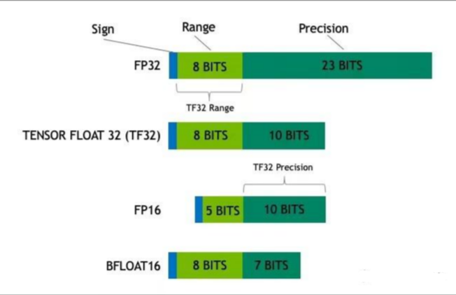

# 大模型（LLMs）显存问题面

- [大模型（LLMs）显存问题面](#大模型llms显存问题面)
  - [1 大模型大概有多大，模型文件有多大?](#1-大模型大概有多大模型文件有多大)
  - [2 能否用4 \* v100 32G训练vicuna 65b？](#2-能否用4--v100-32g训练vicuna-65b)
  - [3 如果就是想要试试65b模型，但是显存不多怎么办？](#3-如果就是想要试试65b模型但是显存不多怎么办)
  - [4 nB模型推理需要多少显存？](#4-nb模型推理需要多少显存)
  - [5 nB模型训练需要多少显存？](#5-nb模型训练需要多少显存)
  - [6 如何 估算模型所需的RAM？](#6-如何-估算模型所需的ram)
    - [6.1 模型本身](#61-模型本身)
    - [6.2 CUDA kernel](#62-cuda-kernel)
    - [6.3 batch大小](#63-batch大小)
    - [6.4 batch size 为50，int8精度下的Llama-6B所占显存为多少？](#64-batch-size-为50int8精度下的llama-6b所占显存为多少)
  - [7 如何评估你的显卡利用率](#7-如何评估你的显卡利用率)
    - [7.1 flops比值法](#71-flops比值法)
    - [7.2 throughout估计法](#72-throughout估计法)
    - [7.3 torch profiler分析法](#73-torch-profiler分析法)
    - [总结](#总结)
  - [8 测试你的显卡利用率 实现细节篇](#8-测试你的显卡利用率-实现细节篇)
    - [8.1 如何查看多机训练时的网速？](#81-如何查看多机训练时的网速)
    - [8.2 如何查看服务器上的多卡之间的NVLINK topo？](#82-如何查看服务器上的多卡之间的nvlink-topo)
    - [8.3 如何查看服务器上显卡的具体型号?](#83-如何查看服务器上显卡的具体型号)
    - [8.4 如何查看训练时的flops？（也就是每秒的计算量）](#84-如何查看训练时的flops也就是每秒的计算量)
    - [8.5 如何查看对deepspeed的环境配置是否正确？](#85-如何查看对deepspeed的环境配置是否正确)
    - [8.6 tf32格式有多长？](#86-tf32格式有多长)
    - [8.7 哪里看各类显卡算力比较？](#87-哪里看各类显卡算力比较)
    - [8.8 （torch profiler）如何查看自己的训练中通信开销？](#88-torch-profiler如何查看自己的训练中通信开销)

## 1 大模型大概有多大，模型文件有多大?

一般放出来的模型文件都是fp16的，假设是一个 n B的模型，那么模型文件占 2n G，fp16加载到显存里做推理也是占 2n G，对外的pr都是 10n 亿参数的模型。

## 2 能否用4 * v100 32G训练vicuna 65b？

不能。

- 首先，llama 65b的权重需要5* v100 32G才能完整加载到GPU。
- 其次，vicuna使用flash-attention加速训练，暂不支持v100，需要turing架构之后的显卡。

（刚发现fastchat上可以通过调用train脚本训练vicuna而非train_mem，其实也是可以训练的）

## 3 如果就是想要试试65b模型，但是显存不多怎么办？

最少大概50g显存，可以在llama-65b-int4（gptq）模型基础上LoRA[6]，当然各种库要安装定制版本的。

## 4 nB模型推理需要多少显存？

考虑模型参数都是fp16，2nG的显存能把模型加载。

## 5 nB模型训练需要多少显存？

基础显存：模型参数+梯度+优化器，总共16nG。

activation占用显存，和max len、batch size有关

> 解释：优化器部分必须用fp32（似乎fp16会导致训练不稳定），所以应该是2+2+12=16，参考ZeRO论文。

> 注以上算数不够直观，举个例子？

7B的vicuna在fsdp下总共160G显存勉强可以训练。（按照上面计算7*16=112G是基础显存）

所以全量训练准备显存20nG大概是最低要求，除非内存充足，显存不够offload内存补。

## 6 如何 估算模型所需的RAM？

首先，我们需要了解如何根据参数量估计模型大致所需的 RAM，这在实践中有很重要的参考意义。我们需要通过估算设置 batch_size，设置模型精度，选择微调方法和参数分布方法等。

大模型所需要的考虑的显存包括三个部分：**模型本身，CUDA kernel，batch大小**

### 6.1 模型本身

模型本身需要的 RAM 大致分三个部分：模型参数、梯度、优化器参数

- 模型参数：等于参数量 * 每个参数所需内存

首先考虑精度对所需内存的影响：

1. fp32 精度，一个参数需要 32 bits, 4 bytes.
2. fp16 精度，一个参数需要 16 bits, 2 bytes.
3. int8 精度，一个参数需要 8 bits, 1 byte.

> 注： <br/>
> 对于 fp32，LLaMA-6B 需要 6B*4 bytes = 24GB内存 <br/>
> 对于 int8，LLaMA-6B 需要 6B*1 byte = 6GB

- 梯度：同上，等于参数量*每个梯度参数所需内存。

- 优化器参数：不同的优化器所储存的参数量不同。

对于常用的 AdamW 来说，需要储存两倍的模型参数（用来储存一阶和二阶momentum）。

> 注： <br/>
> fp32 的 LLaMA-6B，AdamW 需要 6B*8 bytes = 48 GB <br/>
> int8 的 LLaMA-6B，AdamW 需要 6B*2 bytes = 12 GB

### 6.2 CUDA kernel

除此之外，CUDA kernel 也会占据一些 RAM，大概 1.3GB 左右，查看方式如下。

```s
    > torch.ones((1，1)).to("cuda")
    > print_gpu_utilization()
    >>>
    GPU memory occupied: 1343 MB
```

### 6.3 batch大小

首先需要计算batch中每个instance的中间变量内存。

等于用中间计算参数量 *每个参数所需内存 * batch size。

### 6.4 batch size 为50，int8精度下的Llama-6B所占显存为多少？

1. 模型本身

- 模型参数：对于 int8，LLaMA-6B 需要 6B *1 byte = 6GB
- 梯度：同上，6GB
- 优化器参数：int8 的 LLaMA-6B，AdamW 需要 6B* 1 bytes * 2= 12 GB
- CUDA kernel :  1.3GB
- int 8精度下 Llama-6B：  6GB+6GB+12GB+1.3GB = 25.3GB

2. batch

- LLaMA的架构：

hidden_size = 4096, intermediate_size =11008, num_hidden_layers = 32, context_length = 2048

每个实例：

(4096 +11008) * 2048 *32 * 1byte = 990MB

那么batch size为50

990MB * 50 = 48.3GB

那么最终batch size 为50，int8精度下的Llama-6B所占显存为 

25.3GB + 48.3GB = 73.6GB

刚好一张 A100（80GB RAM），在batch size 为50，int8精度的设定下可以进行Llama-6B全参数微调。

那么其他的情况大家也都可以根据实际精度，模型大小、中间变量计算以及batch来类推了。

## 7 如何评估你的显卡利用率

zero3如果没有nvlink，多卡训练下会变慢。但是一直不知道究竟会变得多慢，下面给出几种方法来评估自己在训练时发挥了多少gpu性能，以及具体测试方法。

### 7.1 flops比值法

- 测试工具：deepspeed
- 参考数据：nvidia公布的显卡fp16峰值计算速度（tensor core）

```s
    gpu利用率 = 实测的flops/显卡理论上的峰值flops
```

> 举例：deepspeed实测flops 100tflops，而用的是A100卡理论峰值312tflops，可以得到GPU利用率只有 32.05%

### 7.2 throughout估计法

- 测试工具：手动估算 或者 deepspeed
- 参考数据：论文中的训练速度或者吞吐量

```s
    吞吐量 = example数量/秒/GPU * max_length
```

```s
    gpu利用率 = 实际吞吐量 / 论文中的吞吐量（假设利用率100%）
```

> 举例：
> 实测训练时处理样本速度为 3 example/s，一共有4卡，max length 2048，则吞吐量为 1536 token/s/gpu
> 根据llama论文知道，他们训练7B模型的吞吐量约为 3300 token/s/gpu，那么GPU利用率只有46.54%

### 7.3 torch profiler分析法

- 测试工具：torch profiler 及 tensorboard
- 参考数据：无

利用torch profiler记录各个函数的时间，将结果在tensorboard上展示，在gpu kenel视图下，可以看到tensor core的利用率，比如30%

### 总结

以上三种方法，在笔者的实验中能得到差不多的利用率指标。

从准确性上看，方案三 > 方案一 > 方案二

从易用性上看，方案二 > 方案一 > 方案三

如果不想改代码就用方案二估算自己的训练速度是不是合理的，如果想精确分析训练速度的瓶颈还是建议使用方案三。


## 8 测试你的显卡利用率 实现细节篇

### 8.1 如何查看多机训练时的网速？

iftop命令，看网速很方便。

### 8.2 如何查看服务器上的多卡之间的NVLINK topo？

```s
    $ nvidia-smi topo -m
```

### 8.3 如何查看服务器上显卡的具体型号?

```s
    cd /usr/local/cuda/samples/1_Utilities/deviceQuery
    make
    ./deviceQuery
```

### 8.4 如何查看训练时的flops？（也就是每秒的计算量）

理论上，如果flops比较低，说明没有发挥出显卡的性能。

如果基于deepspeed训练，可以通过配置文件很方便的测试

```s
{
  "flops_profiler": {
    "enabled": true,
    "profile_step": 1,
    "module_depth": -1,
    "top_modules": 1,
    "detailed": true,
    "output_file": null
    }
}
```

> 参考：https://www.deepspeed.ai/tutorials/flops-profiler/

### 8.5 如何查看对deepspeed的环境配置是否正确？

```s
    $ ds_report
```

### 8.6 tf32格式有多长？

19位



### 8.7 哪里看各类显卡算力比较？

https://lambdalabs.com/gpu-benchmarks

### 8.8 （torch profiler）如何查看自己的训练中通信开销？

用pytorch profiler查看，下面给出基于transformers的一种快捷的修改方式。

>https://github.com/yqhu/profiler-workshop/blob/c8d4a7c30a61cc7b909d89f88f5fd36b70c55769/hf_training_trainer_prof.py

用记录的pt.trace.json文件放到tensorboard上，可以看出tensor core的利用率。

根据实践经验，使用deepspeed zero3时，pcie版本的卡很大部分时间都在通信上，AllGather和ReduceScatter的时间超过tensor core计算的时间，所以flops上不去。
