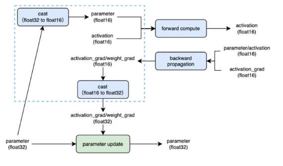
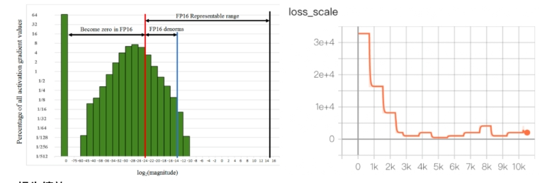

# 图解分布式训练（五） ——  AMP混合精度训练 详细解析

- [图解分布式训练（五） ——  AMP混合精度训练 详细解析](#图解分布式训练五---amp混合精度训练-详细解析)
  - [为什么需要 AMP混合精度训练？](#为什么需要-amp混合精度训练)
  - [一、什么是自动混合精度训练(AMP)](#一什么是自动混合精度训练amp)
  - [二、为什么需要自动混合精度？](#二为什么需要自动混合精度)
  - [三、混合精度训练的优点是什么？](#三混合精度训练的优点是什么)
  - [四、混合精度训练的缺点是什么？](#四混合精度训练的缺点是什么)
  - [五、混合精度训练的关键技术是什么？](#五混合精度训练的关键技术是什么)
  - [六、介绍一下 混合精度训练 动态损失缩放？](#六介绍一下-混合精度训练-动态损失缩放)
  - [七、如何在PyTorch中使用自动混合精度？](#七如何在pytorch中使用自动混合精度)
  - [八、如何使用 AMP混合精度训练 ？](#八如何使用-amp混合精度训练-)
    - [8.1 AMP混合精度训练 代码](#81-amp混合精度训练-代码)
    - [8.2 AMP混合精度训练 完整代码](#82-amp混合精度训练-完整代码)
  - [参考](#参考)

## 为什么需要 AMP混合精度训练？

PyTorch 1.6版本今天发布了，带来的最大更新就是自动混合精度。release说明的标题是：

Stable release of automatic mixed precision (AMP).New Beta features include a TensorPipe backend for RPC, memory profiler, and several improvements to distributed training for both RPC and DDP.

可见自动混合精度正是PyTorch 1.6的最大更新。这就带来了几个问题：

- 什么是自动混合精度训练？
- 为什么需要自动混合精度？
- 如何在PyTorch中使用自动混合精度？

## 一、什么是自动混合精度训练(AMP)

我们知道神经网络框架的计算核心是Tensor，也就是那个从scaler -> array -> matrix -> tensor 维度一路丰富过来的tensor。在PyTorch中，我们可以这样创建一个Tensor：

```s
>>> import torch

>>> gemfield = torch.zeros(70,30)
>>> gemfield.type()
'torch.FloatTensor'

>>> syszux = torch.Tensor([1,2])
>>> syszux.type()
'torch.FloatTensor'
```

可以看到默认创建的tensor都是FloatTensor类型。而在PyTorch中，一共有10种类型的tensor：

- torch.FloatTensor (32-bit floating point)
- torch.DoubleTensor (64-bit floating point)
- torch.HalfTensor (16-bit floating point 1)
- torch.BFloat16Tensor (16-bit floating point 2)
- torch.ByteTensor (8-bit integer (unsigned))
- torch.CharTensor (8-bit integer (signed))
- torch.ShortTensor (16-bit integer (signed))
- torch.IntTensor (32-bit integer (signed))
- torch.LongTensor (64-bit integer (signed))
- torch.BoolTensor (Boolean)

由此可见，默认的Tensor是32-bit floating point，这就是32位浮点型精度的Tensor。

**自动混合精度的关键词有两个：自动、混合精度**。这是由PyTorch 1.6的torch.cuda.amp模块带来的：

```s
  from torch.cuda.amp import autocast as autocast
```

混合精度预示着有不止一种精度的Tensor，那在PyTorch的AMP模块里是几种呢？2种：**torch.FloatTensor和torch.HalfTensor**；

自动预示着Tensor的dtype类型会自动变化，也就是框架按需自动调整tensor的dtype（其实不是完全自动，有些地方还是需要手工干预）；

**torch.cuda.amp** 的名字意味着这个功能只能在cuda上使用，事实上，这个功能正是NVIDIA的开发人员贡献到PyTorch项目中的。而只有支持Tensor core的CUDA硬件才能享受到AMP的好处（比如2080ti显卡）。Tensor Core是一种矩阵乘累加的计算单元，每个Tensor Core每个时钟执行64个浮点混合精度操作（FP16矩阵相乘和FP32累加），英伟达宣称使用Tensor Core进行矩阵运算可以轻易的提速，同时降低一半的显存访问和存储。

因此，在PyTorch中，当我们提到自动混合精度训练，我们说的就是在NVIDIA的支持Tensor core的CUDA设备上使用torch.cuda.amp.autocast （以及torch.cuda.amp.GradScaler）来进行训练。咦？为什么还要有torch.cuda.amp.GradScaler？

## 二、为什么需要自动混合精度？

这个问题其实暗含着这样的意思：为什么需要自动混合精度，也就是torch.FloatTensor和torch.HalfTensor的混合，而不全是torch.FloatTensor？或者全是torch.HalfTensor？

如果非要以这种方式问，那么答案只能是，在某些上下文中torch.FloatTensor有优势，在某些上下文中torch.HalfTensor有优势呗。答案进一步可以转化为，相比于之前的默认的torch.FloatTensor，torch.HalfTensor有时具有优势，有时劣势不可忽视。

torch.HalfTensor的优势就是存储小、计算快、更好的利用CUDA设备的Tensor Core。因此训练的时候可以减少显存的占用（可以增加batchsize了），同时训练速度更快；

torch.HalfTensor的劣势就是：数值范围小（更容易Overflow / Underflow）、舍入误差（Rounding Error，导致一些微小的梯度信息达不到16bit精度的最低分辨率，从而丢失）。

可见，当有优势的时候就用torch.HalfTensor，而为了消除torch.HalfTensor的劣势，我们带来了两种解决方案：

1. 梯度scale，这正是上一小节中提到的torch.cuda.amp.GradScaler，通过放大loss的值来防止梯度的underflow（这只是BP的时候传递梯度信息使用，真正更新权重的时候还是要把放大的梯度再unscale回去）；
2. 回落到torch.FloatTensor，这就是混合一词的由来。那怎么知道什么时候用torch.FloatTensor，什么时候用半精度浮点型呢？这是PyTorch框架决定的，在PyTorch 1.6的AMP上下文中，如下操作中tensor会被自动转化为半精度浮点型的torch.HalfTensor：

```s
  __matmul__
  addbmm
  addmm
  addmv
  addr
  baddbmm
  bmm
  chain_matmul
  conv1d
  conv2d
  conv3d
  conv_transpose1d
  conv_transpose2d
  conv_transpose3d
  linear
  matmul
  mm
  mv
  prelu
```



## 三、混合精度训练的优点是什么？

- 减少显存
- 占用加快训练速度:通信量
- 减半;计算性能翻倍。

## 四、混合精度训练的缺点是什么？

- 数据溢出
- 舍入误差

## 五、混合精度训练的关键技术是什么？

- float32主权重备份
- 动态损失缩放

## 六、介绍一下 混合精度训练 动态损失缩放？

- 介绍：即损失标度。这会将梯度也放大1024倍，大大降只需要将损失乘以某个大数字 (如1024)，低了梯度发生下溢的几率。计算出梯度后，只需将其除以1024就可以得到准确值。
- 动态选择损失标度 介绍：发生溢出，跳过优化器更新，损失标度减半;连续N个steps没有发生溢出，损失标度翻倍



## 七、如何在PyTorch中使用自动混合精度？

答案就是autocast + GradScaler。

1. autocast

正如前文所说，需要使用torch.cuda.amp模块中的autocast 类。使用也是非常简单的：

```s
from torch.cuda.amp import autocast as autocast

# 创建model，默认是torch.FloatTensor
model = Net().cuda()
optimizer = optim.SGD(model.parameters(), ...)

for input, target in data:
    optimizer.zero_grad()

    # 前向过程(model + loss)开启 autocast
    with autocast():
        output = model(input)
        loss = loss_fn(output, target)

    # 反向传播在autocast上下文之外
    loss.backward()
    optimizer.step()
```

可以使用autocast的context managers语义（如上所示），也可以使用decorators语义。 当进入autocast的上下文后，上面列出来的那些CUDA ops 会把tensor的dtype转换为半精度浮点型，从而在不损失训练精度的情况下加快运算。刚进入autocast的上下文时，tensor可以是任何类型，你不要在model或者input上手工调用.half() ，框架会自动做，这也是自动混合精度中“自动”一词的由来。

另外一点就是，autocast上下文应该只包含网络的前向过程（包括loss的计算），而不要包含反向传播，因为BP的op会使用和前向op相同的类型。

还有的时候呀，你的代码在autocast上下文中会报如下的错误：

```s
Traceback (most recent call last):
......
  File "/opt/conda/lib/python3.7/site-packages/torch/nn/modules/module.py", line 722, in _call_impl
    result = self.forward(*input, **kwargs)
......
RuntimeError: expected scalar type float but found c10::Half
```

对于RuntimeError: expected scalar type float but found c10::Half，这估计是个bug。你可以在tensor上手工调用.float()来让type匹配。

2. GradScaler

但是别忘了前面提到的梯度scaler模块呀，需要在训练最开始之前实例化一个GradScaler对象。因此PyTorch中经典的AMP使用方式如下：

```s
from torch.cuda.amp import autocast as autocast

# 创建model，默认是torch.FloatTensor
model = Net().cuda()
optimizer = optim.SGD(model.parameters(), ...)

# 在训练最开始之前实例化一个GradScaler对象
scaler = GradScaler()

for epoch in epochs:
    for input, target in data:
        optimizer.zero_grad()

        # 前向过程(model + loss)开启 autocast
        with autocast():
            output = model(input)
            loss = loss_fn(output, target)

        # Scales loss. 为了梯度放大.
        scaler.scale(loss).backward()

        # scaler.step() 首先把梯度的值unscale回来.
        # 如果梯度的值不是 infs 或者 NaNs, 那么调用optimizer.step()来更新权重,
        # 否则，忽略step调用，从而保证权重不更新（不被破坏）
        scaler.step(optimizer)

        # 准备着，看是否要增大scaler
        scaler.update()
```

scaler的大小在每次迭代中动态的估计，为了尽可能的减少梯度underflow，scaler应该更大；但是如果太大的话，半精度浮点型的tensor又容易overflow（变成inf或者NaN）。所以动态估计的原理就是在不出现inf或者NaN梯度值的情况下尽可能的增大scaler的值——在每次scaler.step(optimizer)中，都会检查是否又inf或NaN的梯度出现：

- 如果出现了inf或者NaN，scaler.step(optimizer)会忽略此次的权重更新（optimizer.step() )，并且将scaler的大小缩小（乘上backoff_factor）；
- 如果没有出现inf或者NaN，那么权重正常更新，并且当连续多次（growth_interval指定）没有出现inf或者NaN，则scaler.update()会将scaler的大小增加（乘上growth_factor）。

## 八、如何使用 AMP混合精度训练 ？

### 8.1 AMP混合精度训练 代码

1. Trainer 训练类 

```s
  class Trainer:
    ...
     def train(self, train_loader, dev_loader=None, train_sampler=None):
        ...
        # 设置 AMP混合精度训练
        if self.args.use_amp:
            scaler = torch.cuda.amp.GradScaler()
        if self.args.local_rank == 0:
            start = time.time()
        for epoch in range(1, self.args.epochs + 1):
            train_sampler.set_epoch(epoch)
            for step, batch_data in enumerate(train_loader):
                self.model.train()
                # 使用 AMP混合精度训练 
                if self.args.use_amp:
                    with torch.cuda.amp.autocast():
                        logits, label = self.on_step(batch_data)
                        loss = self.criterion(logits, label)
                        torch.distributed.barrier()
                        scaler.scale(loss).backward()
                        scaler.step(self.optimizer)
                        scaler.update()
                else:
                    logits, label = self.on_step(batch_data)
                    loss = self.criterion(logits, label)
                    torch.distributed.barrier()
                    loss.backward()
                    self.optimizer.step()
                ...
        if self.args.local_rank == 0:
            end = time.time()
            print("耗时：{}分钟".format((end - start) / 60))
        if not self.args.dev and self.args.local_rank == 0:
            torch.save(self.model.state_dict(), self.args.ckpt_path)
```

2. Args 参数类

```s
class Args:
    ...
    local_rank = None
    local_world_size = None
    device_ids = None
    rank = None
    dev = False
    use_amp = True
```

3. main_worker 主函数

```s
def main_worker(local_rank, local_world_size):
    # =======================================
    # 设置参数
    ...
    dist.init_process_group(backend="nccl", init_method="tcp://localhost:12345", world_size=local_world_size, rank=local_rank)

    n = torch.cuda.device_count() // local_world_size
    device_ids = [local_rank]
    print(
        f"[{os.getpid()}] rank = {local_rank}, "
        + f"world_size = {local_world_size}, n = {n}, device_ids = {device_ids} \n", end=''
    )

    torch.cuda.set_device(local_rank)

    args = Args()
    args.local_world_size = local_world_size
    args.local_rank = local_rank
    args.device_ids = device_ids
    args.rank = local_rank
    tokenizer = BertTokenizer.from_pretrained(args.model_path)
    ...
    # 第三步：封装模型
    model.cuda()
    model = torch.nn.parallel.DistributedDataParallel(model, device_ids=args.device_ids)

    ...
    model.cuda(args.local_rank)
    model = torch.nn.parallel.DistributedDataParallel(model, device_ids=args.device_ids)
    ...
    if args.local_rank == 0:
        print(report)
    # =======================================

    # =======================================
    dist.destroy_process_group()
    # =======================================

```

### 8.2 AMP混合精度训练 完整代码

```s
import os
import time
import json
import random
import torch
import torch.nn as nn
import numpy as np
import torch.distributed as dist
import torch.multiprocessing as mp

from collections import Counter
from tqdm import tqdm
from sklearn.metrics import classification_report
from torch.utils.data import DataLoader, Dataset
from transformers import BertForMaskedLM, BertTokenizer, BertForSequenceClassification, BertConfig, AdamW

def set_seed(seed=123):
    """
    设置随机数种子，保证实验可重现
    :param seed:
    :return:
    """
    random.seed(seed)
    torch.manual_seed(seed)
    np.random.seed(seed)
    torch.cuda.manual_seed_all(seed)

def get_data():
    with open("data/train.json", "r", encoding="utf-8") as fp:
        data = fp.read()
    data = json.loads(data)
    return data

def load_data():
    data = get_data()
    return_data = []
    # [(文本， 标签id)]
    for d in data:
        text = d[0]
        label = d[1]
        return_data.append(("".join(text.split(" ")).strip(), label))
    return return_data

class ClsDataset(Dataset):
    def __init__(self, data):
        self.data = data

    def __len__(self):
        return len(self.data)

    def __getitem__(self, index):
        return self.data[index]

class Collate:
    def __init__(self,
                 tokenizer,
                 max_seq_len,
                 ):
        self.tokenizer = tokenizer
        self.max_seq_len = max_seq_len

    def collate_fn(self, batch):
        input_ids_all = []
        token_type_ids_all = []
        attention_mask_all = []
        label_all = []
        for data in batch:
            text = data[0]
            label = data[1]
            inputs = self.tokenizer.encode_plus(text=text,
                                                max_length=self.max_seq_len,
                                                padding="max_length",
                                                truncation="longest_first",
                                                return_attention_mask=True,
                                                return_token_type_ids=True)
            input_ids = inputs["input_ids"]
            token_type_ids = inputs["token_type_ids"]
            attention_mask = inputs["attention_mask"]
            input_ids_all.append(input_ids)
            token_type_ids_all.append(token_type_ids)
            attention_mask_all.append(attention_mask)
            label_all.append(label)

        input_ids_all = torch.tensor(input_ids_all, dtype=torch.long)
        token_type_ids_all = torch.tensor(token_type_ids_all, dtype=torch.long)
        attention_mask_all = torch.tensor(attention_mask_all, dtype=torch.long)
        label_all = torch.tensor(label_all, dtype=torch.long)
        return_data = {
            "input_ids": input_ids_all,
            "attention_mask": attention_mask_all,
            "token_type_ids": token_type_ids_all,
            "label": label_all
        }
        return return_data

def build_optimizer(model, args):
    no_decay = ['bias', 'LayerNorm.weight']
    optimizer_grouped_parameters = [
        {'params': [p for n, p in model.named_parameters() if not any(nd in n for nd in no_decay)],
         'weight_decay': args.weight_decay},
        {'params': [p for n, p in model.named_parameters() if any(nd in n for nd in no_decay)],
         'weight_decay': 0.0}
    ]

    # optimizer = AdamW(model.parameters(), lr=learning_rate)
    optimizer = AdamW(optimizer_grouped_parameters, lr=args.learning_rate)
    return optimizer

class Trainer:
    def __init__(self,
                 args,
                 config,
                 model,
                 criterion,
                 optimizer):
        self.args = args
        self.config = config,
        self.model = model
        self.criterion = criterion
        self.optimizer = optimizer

    def on_step(self, batch_data):
        label = batch_data["label"].cuda()
        input_ids = batch_data["input_ids"].cuda()
        token_type_ids = batch_data["token_type_ids"].cuda()
        attention_mask = batch_data["attention_mask"].cuda()
        output = self.model(input_ids=input_ids,
                            token_type_ids=token_type_ids,
                            attention_mask=attention_mask,
                            labels=label)
        logits = output[1]
        return logits, label

    def loss_reduce(self, loss):
        rt = loss.clone()
        dist.all_reduce(rt, op=dist.ReduceOp.SUM)
        rt /= self.args.local_world_size
        return rt

    def output_reduce(self, outputs, targets):
        output_gather_list = [torch.zeros_like(outputs) for _ in range(self.args.local_world_size)]
        # 把每一个GPU的输出聚合起来
        dist.all_gather(output_gather_list, outputs)

        outputs = torch.cat(output_gather_list, dim=0)
        target_gather_list = [torch.zeros_like(targets) for _ in range(self.args.local_world_size)]
        # 把每一个GPU的输出聚合起来
        dist.all_gather(target_gather_list, targets)
        targets = torch.cat(target_gather_list, dim=0)
        return outputs, targets

    def train(self, train_loader, dev_loader=None, train_sampler=None):
        gloabl_step = 1
        best_acc = 0.
        if self.args.use_amp:
            scaler = torch.cuda.amp.GradScaler()
        if self.args.local_rank == 0:
            start = time.time()
        for epoch in range(1, self.args.epochs + 1):
            train_sampler.set_epoch(epoch)
            for step, batch_data in enumerate(train_loader):
                self.model.train()
                if self.args.use_amp:
                    with torch.cuda.amp.autocast():
                        logits, label = self.on_step(batch_data)
                        loss = self.criterion(logits, label)
                        torch.distributed.barrier()
                        scaler.scale(loss).backward()
                        scaler.step(self.optimizer)
                        scaler.update()
                else:
                    logits, label = self.on_step(batch_data)
                    loss = self.criterion(logits, label)
                    torch.distributed.barrier()
                    loss.backward()
                    self.optimizer.step()
                if self.args.local_rank == 0:
                    print("【train】 epoch：{}/{} step：{}/{} loss：{:.6f}".format(
                        epoch, self.args.epochs, gloabl_step, self.args.total_step, loss
                    ))
                gloabl_step += 1
                if self.args.dev:
                    if gloabl_step % self.args.eval_step == 0:
                        loss, accuracy = self.dev(dev_loader)
                        if self.args.local_rank == 0:
                            print("【dev】 loss：{:.6f} accuracy：{:.4f}".format(loss, accuracy))
                            if accuracy > best_acc:
                                best_acc = accuracy
                                print("【best accuracy】 {:.4f}".format(best_acc))
                                torch.save(self.model.state_dict(), self.args.ckpt_path)
        if self.args.local_rank == 0:
            end = time.time()
            print("耗时：{}分钟".format((end - start) / 60))
        if not self.args.dev and self.args.local_rank == 0:
            torch.save(self.model.state_dict(), self.args.ckpt_path)

    def dev(self, dev_loader):
        self.model.eval()
        correct_total = 0
        num_total = 0
        loss_total = 0.
        with torch.no_grad():
            for step, batch_data in tqdm(enumerate(dev_loader)):
                logits, label = self.on_step(batch_data)
                loss = self.criterion(logits, label)
                torch.distributed.barrier()
                loss = self.loss_reduce(loss)
                loss_total += loss
                logits, label = self.output_reduce(logits, label)
                logits = logits.detach().cpu().numpy()
                label = label.view(-1).detach().cpu().numpy()
                num_total += len(label)
                preds = np.argmax(logits, axis=1).flatten()
                correct_num = (preds == label).sum()
                correct_total += correct_num

        return loss_total, correct_total / num_total

    def test(self, model, test_loader, labels):
        self.model = model
        self.model.eval()
        preds = []
        trues = []
        with torch.no_grad():
            for step, batch_data in enumerate(test_loader):
                logits, label = self.on_step(batch_data)
                torch.distributed.barrier()
                logits, label = self.output_reduce(logits, label)
                label = label.view(-1).detach().cpu().numpy().tolist()
                logits = logits.detach().cpu().numpy()
                pred = np.argmax(logits, axis=1).flatten().tolist()
                trues.extend(label)
                preds.extend(pred)
        report = classification_report(trues, preds, target_names=labels)
        return report

class Args:
    model_path = "/mnt/kaimo/data/pretrain/bert-base-chinese"
    ckpt_path = "output/multi-gpu-distributed-mp-amp-cls.pt"
    max_seq_len = 128
    ratio = 0.92
    device = torch.device("cuda" if torch.cuda.is_available else "cpu")
    train_batch_size = 32
    dev_batch_size = 32
    weight_decay = 0.01
    epochs = 1
    learning_rate = 3e-5
    eval_step = 50
    local_rank = None
    local_world_size = None
    device_ids = None
    rank = None
    dev = False
    use_amp = True

def main_worker(local_rank, local_world_size):
    # =======================================
    # 设置参数
    set_seed()
    label2id = {
        "其他": 0,
        "喜好": 1,
        "悲伤": 2,
        "厌恶": 3,
        "愤怒": 4,
        "高兴": 5,
    }
    dist.init_process_group(backend="nccl", init_method="tcp://localhost:12345", world_size=local_world_size,
                            rank=local_rank)

    n = torch.cuda.device_count() // local_world_size
    device_ids = [local_rank]
    print(
        f"[{os.getpid()}] rank = {local_rank}, "
        + f"world_size = {local_world_size}, n = {n}, device_ids = {device_ids} \n", end=''
    )

    torch.cuda.set_device(local_rank)

    args = Args()
    args.local_world_size = local_world_size
    args.local_rank = local_rank
    args.device_ids = device_ids
    args.rank = local_rank
    tokenizer = BertTokenizer.from_pretrained(args.model_path)
    # =======================================

    # =======================================
    # 加载数据集
    data = load_data()
    # 取1万条数据出来
    data = data[:10000]
    random.shuffle(data)
    train_num = int(len(data) * args.ratio)
    train_data = data[:train_num]
    dev_data = data[train_num:]

    collate = Collate(tokenizer, args.max_seq_len)
    train_dataset = ClsDataset(train_data)
    train_sampler = torch.utils.data.distributed.DistributedSampler(train_dataset)
    train_loader = DataLoader(train_dataset,
                              batch_size=args.train_batch_size,
                              num_workers=2,
                              collate_fn=collate.collate_fn,
                              sampler=train_sampler)
    total_step = len(train_loader) * args.epochs
    args.total_step = total_step
    dev_dataset = ClsDataset(dev_data)
    dev_sampler = torch.utils.data.distributed.DistributedSampler(dev_dataset)
    dev_loader = DataLoader(dev_dataset,
                            batch_size=args.dev_batch_size,
                            shuffle=False,
                            num_workers=2,
                            collate_fn=collate.collate_fn,
                            sampler=dev_sampler)
    test_loader = dev_loader
    # =======================================

    # =======================================
    # 定义模型、优化器、损失函数
    config = BertConfig.from_pretrained(args.model_path, num_labels=6)
    model = BertForSequenceClassification.from_pretrained(args.model_path,
                                                          config=config)
    # 第三步：封装模型
    model.cuda()
    model = torch.nn.parallel.DistributedDataParallel(model, device_ids=args.device_ids)

    criterion = torch.nn.CrossEntropyLoss()
    optimizer = build_optimizer(model, args)
    # =======================================

    # =======================================
    # 定义训练器，进行训练、验证和测试
    trainer = Trainer(args,
                      config,
                      model,
                      criterion,
                      optimizer)

    trainer.train(train_loader, dev_loader, train_sampler)

    labels = list(label2id.keys())
    config = BertConfig.from_pretrained(args.model_path, num_labels=6)
    model = BertForSequenceClassification.from_pretrained(args.model_path, config=config)
    model.cuda(args.local_rank)
    model = torch.nn.parallel.DistributedDataParallel(model, device_ids=args.device_ids)
    model.load_state_dict(torch.load(args.ckpt_path))
    report = trainer.test(model, test_loader, labels)
    if args.local_rank == 0:
        print(report)
    # =======================================

    # =======================================
    dist.destroy_process_group()
    # =======================================

if __name__ == '__main__':
    import argparse
    parser = argparse.ArgumentParser()
    parser.add_argument("--local_world_size", type=int, default=1)
    p_args = parser.parse_args()
    # 第零步：启动进程
    mp.spawn(main_worker, nprocs=p_args.local_world_size, args=(p_args.local_world_size,))

```

## 参考

1. Pytorch自动混合精度(AMP)训练   https://blog.csdn.net/ytusdc/article/details/122152244
2. PyTorch的自动混合精度（AMP） https://zhuanlan.zhihu.com/p/165152789
3. OpenMMLab 中混合精度训练 AMP 的正确打开方式 
4. 由浅入深的混合精度训练教程 由浅入深的混合精度训练教程
5. Pytorch amp 混合精度训练相关 https://zhuanlan.zhihu.com/p/347721293


