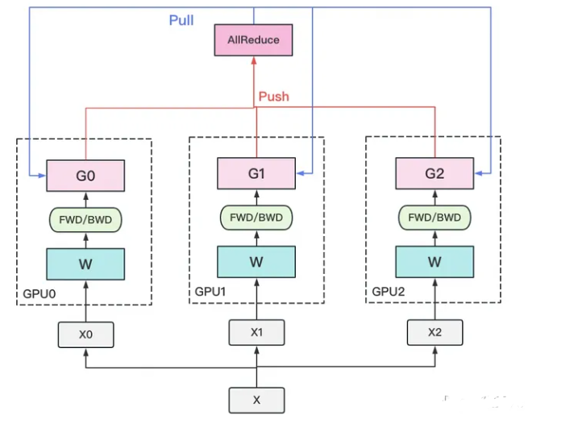
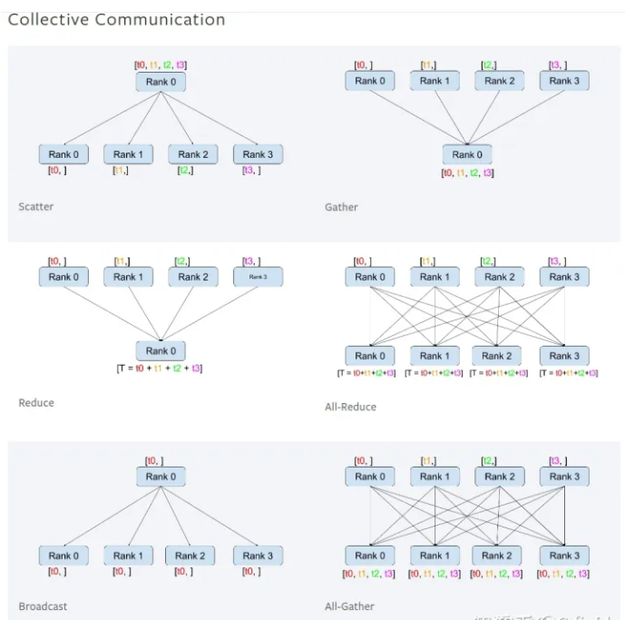

# 图解分布式训练（二） —— nn.DataParallel

- [图解分布式训练（二） —— nn.DataParallel](#图解分布式训练二--nndataparallel)
  - [为什么需要nn.DataParallel？](#为什么需要nndataparallel)
  - [一、pytorch中的GPU操作默认是什么样？](#一pytorch中的gpu操作默认是什么样)
  - [二、介绍一下 nn.DataParallel 函数？](#二介绍一下-nndataparallel-函数)
  - [三、nn.DataParallel 函数 处理逻辑 介绍一下？](#三nndataparallel-函数-处理逻辑-介绍一下)
  - [四、nn.DataParallel 函数 常见问题及解答 有哪些？](#四nndataparallel-函数-常见问题及解答-有哪些)
    - [4.1 多GPU计算减少了程序运行的时间？](#41-多gpu计算减少了程序运行的时间)
    - [4.2 如何保存和加载多GPU训练模型呢？](#42-如何保存和加载多gpu训练模型呢)
    - [4.3 为什么第一块卡的显存会占用的更多一些？](#43-为什么第一块卡的显存会占用的更多一些)
    - [4.4 直接使用nn.DataParallel的时候，训练采用多卡训练，会出现一个warning？](#44-直接使用nndataparallel的时候训练采用多卡训练会出现一个warning)
    - [4.5 device\_ids 0 被占用问题](#45-device_ids-0-被占用问题)
  - [五、nn.DataParallel 函数 参数更新方式 ？](#五nndataparallel-函数-参数更新方式-)
  - [六、nn.DataParallel 函数 优点 介绍一下？](#六nndataparallel-函数-优点-介绍一下)
  - [七、nn.DataParallel 函数 缺点 介绍一下？](#七nndataparallel-函数-缺点-介绍一下)
  - [八、nn.DataParallel 函数 实战？](#八nndataparallel-函数-实战)
  - [参考](#参考)

## 为什么需要nn.DataParallel？

多GPU并行训练的原理就是将模型参数和数据分布到多个GPU上，同时利用多个GPU计算加速训练过程。具体实现需要考虑以下两个问题：

数据如何划分？因为模型需要处理的数据通常很大，将所有数据放入单个GPU内存中可能会导致内存不足，因此我们需要将数据划分到多个GPU上。一般有两种划分方式：

- 数据并行：将数据分割成多个小批次，每个GPU处理其中的一个小批次，然后将梯度汇总后更新模型参数。
- 模型并行：将模型分解成多个部分，每个GPU处理其中一个部分，并将处理结果传递给其他GPU以获得最终结果。

计算如何协同？因为每个GPU都需要计算模型参数的梯度并将其发送给其他GPU，因此需要使用同步机制来保证计算正确性。一般有两种同步方式：

- 数据同步：在每个GPU上计算模型参数的梯度，然后将梯度发送到其他GPU上进行汇总，最终更新模型参数。
- 模型同步：在每个GPU上计算模型参数的梯度，然后将模型参数广播到其他GPU上进行汇总，最终更新模型参数。

## 一、pytorch中的GPU操作默认是什么样？

pytorch中的GPU操作默认是**异步的**，当调用函数需要使用 GPU 时，该函数操作 就会 进入 特定设备队列中等待执行，正因为此， pytorch 支持 并行计算。不过 pytorch并行计算 的效果对调用者是不可见。

Pytorch中的多GPU并行计算是数据级并行，相当于开了多个进程，每个进程自己独立运行，然后再整合在一起。

```s
    device_ids = [0, 1]
    net = torch.nn.DataParallel(net, device_ids=device_ids)
```

## 二、介绍一下 nn.DataParallel 函数？

> nn.DataParallel 函数
```s
    torch.nn.DataParallel(module, device_ids=None, output_device=None, dim=0)
```

- 函数参数：
  - module：即模型，此处注意，虽然输入数据被均分到不同gpu上，但每个gpu上都要拷贝一份模型；
  - device_ids：即参与训练的gpu列表，例如三块卡， device_ids = [0，1，2]；
  - output_device：指定输出gpu，一般省略。在省略的情况下，默认为第一块卡，即索引为0的卡。此处有一个问题，输入计算是被几块卡均分的，但输出loss的计算是由这一张卡独自承担的，这就造成这张卡所承受的计算量要大于其他参与训练的卡。

> 使用实例
```s
    net = torch.nn.Linear(100,1)
    print(net)
    print('---------------------')
    net = torch.nn.DataParallel(net, device_ids=[0,3])
    print(net)
```

> 输出
```s
    Linear(in_features=10, out_features=1, bias=True)
    ---------------------
    DataParallel(
    (module): Linear(in_features=10, out_features=1, bias=True)
    )
```

> 注：从输出结果可以看到nn.DataParallel()包裹起来了。然后我们就可以使用这个net来进行训练和预测了，它将自动在第0块GPU和第3块GPU上进行并行计算，然后自动的把计算结果进行了合并。

## 三、nn.DataParallel 函数 处理逻辑 介绍一下？

1. 若干块计算GPU，如图中GPU0~GPU2；1块梯度收集GPU，如图中AllReduce操作所在GPU。
2. 在每块计算GPU上都拷贝一份完整的模型参数。
3. 把一份数据X（例如一个batch）均匀分给不同的计算GPU。
4. 每块计算GPU做一轮FWD和BWD后，算得一份梯度G。
5. 每块计算GPU将自己的梯度push给梯度收集GPU，做聚合操作。这里的聚合操作一般指梯度累加。当然也支持用户自定义。
6. 梯度收集GPU聚合完毕后，计算GPU从它那pull下完整的梯度结果，用于更新模型参数W。更新完毕后，计算GPU上的模型参数依然保持一致。
7. 聚合再下发梯度的操作，称为AllReduce。



> 注：前文说过，实现DP的一种经典编程框架叫“参数服务器”，在这个框架里，计算GPU称为Worker，梯度聚合GPU称为Server。在实际应用中，为了尽量减少通讯量，一般可选择一个Worker同时作为Server。比如可把梯度全发到GPU0上做聚合。需要再额外说明几点：
> 1. 1个Worker或者Server下可以不止1块GPU。
> 2. Server可以只做梯度聚合，也可以梯度聚合+全量参数更新一起做

## 四、nn.DataParallel 函数 常见问题及解答 有哪些？

### 4.1 多GPU计算减少了程序运行的时间？

虽然 使用 nn.DataParallel 函数 能够进行多GPU运算，但是 会导致 程序花费的时间 不减反增，这是为什么呢？

在 第三节 提到，nn.DataParallel 函数 会将 每个batch 数据 平均分配到 不同 device 上 进行并行计算，计算完再返回来合并。这导致GPU之间的开关和通讯过程占了大部分的时间开销。

> 注：可以使用watch -n 1 nvidia-smi这个命令来查看每1s各个GPU的运行情况，如果发现每个GPU的占用率均低于50%，基本可以肯定使用多GPU计算所花的时间要比单GPU计算花的时间更长了。

### 4.2 如何保存和加载多GPU训练模型呢？

在 第三节 提到，nn.DataParallel 函数 会在 每个 device 上 复制一个模型，这样就导致 训练的不是一个模型 ，而是 多个模型，那么 如何 保持和加载 这些模型呢？


```s
net = torch.nn.Linear(10,1)  # 先构造一个网络
net = torch.nn.DataParallel(net, device_ids=[0,3])  #包裹起来
torch.save(net.module.state_dict(), './networks/multiGPU.h5') #保存网络

# 加载网络
new_net = torch.nn.Linear(10,1)
new_net.load_state_dict(torch.load("./networks/multiGPU.h5"))
```

因为DataParallel实际上是一个nn.Module，所以我们在保存时需要多调用了一个net.module，模型和优化器都需要使用net.module来得到实际的模型和优化器。

### 4.3 为什么第一块卡的显存会占用的更多一些？

最后一个参数output_device一般情况下是省略不写的，那么默认就是在device_ids[0]，也就是第一块卡上，也就解释了为什么第一块卡的显存会占用的比其他卡要更多一些。

进一步说也就是当调用nn.DataParallel的时候，只是在input数据是并行的，但是output loss却不是这样的，每次都会在第一块GPU相加计算，这就造成了第一块GPU的负载远远大于剩余其他的显卡。

### 4.4 直接使用nn.DataParallel的时候，训练采用多卡训练，会出现一个warning？

```s
    UserWarning: Was asked to gather along dimension 0, but all input tensors were scalars; 
    will instead unsqueeze and return a vector.
```

首先说明一下：

每张卡上的loss都是要汇总到第0张卡上求梯度，更新好以后把权重分发到其余卡。但是为什么会出现这个warning，这其实和nn.DataParallel中最后一个参数dim有关，其表示tensors被分散的维度，默认是0，nn.DataParallel将在dim0（批处理维度）中对数据进行分块，并将每个分块发送到相应的设备。单卡的没有这个warning，多卡的时候采用nn.DataParallel训练会出现这个warning，由于计算loss的时候是分别在多卡计算的，那么返回的也就是多个loss，你使用了多少个gpu，就会返回多少个loss。（有人建议DataParallel类应该有reduce和size_average参数，比如用于聚合输出的不同loss函数，最终返回一个向量，有多少个gpu，返回的向量就有几维。）

关于这个问题在pytorch官网的issues上有过讨论，下面简单摘出一些: https://github.com/pytorch/pytorch/issues/9811

似乎一看，这么求平均loss确实有不合理的地方。那么有什么好的解决办法呢，可以使用size_average=False，reduce=True作为参数。每个GPU上的损失将相加，但不除以GPU上的批大小。然后将所有平行损耗相加，除以整批的大小，那么不管几块GPU最终得到的平均loss都是一样的。

那pytorch贡献者也实现了这个loss求平均的功能，即通过gather的方式来求loss平均：https://github.com/pytorch/pytorch/pull/7973/commits/c285b3626a7a4dcbbddfba1a6b217a64a3f3f3be

如果它们在一个有2个GPU的系统上运行，DP将采用多GPU路径，调用gather并返回一个向量。如果运行时有1个GPU可见，DP将采用顺序路径，完全忽略gather，因为这是不必要的，并返回一个标量。

### 4.5 device_ids 0 被占用问题

在运行此DataParallel模块之前，并行化模块必须在device_ids [0]上具有其参数和缓冲区。在执行DataParallel之前，会首先把其模型的参数放在device_ids[0]上，一看好像也没有什么毛病，其实有个小坑。我举个例子，服务器是八卡的服务器，刚好前面序号是0的卡被别人占用着，于是你只能用其他的卡来，比如你用2和3号卡，如果你直接指定device_ids=[2, 3]的话会出现模型初始化错误，类似于module没有复制到在device_ids[0]上去。那么你需要在运行train之前需要添加如下两句话指定程序可见的devices，如下：

```s
    os.environ["CUDA_DEVICE_ORDER"] = "PCI_BUS_ID"
    os.environ["CUDA_VISIBLE_DEVICES"] = "2, 3"
```

这两行代码后的意思：device_ids[0]默认是第2号卡，模型也会初始化在第2号卡上了，而不会占用第0号卡了。这里简单说一下设置上面两行代码后，那么对这个程序而言可见的只有2和3号卡，和其他的卡没有关系，这是物理上的号卡，逻辑上来说其实是对应0和1号卡，即device_ids[0]对应的就是第2号卡，device_ids[1]对应的就是第3号卡。

当然要保证上面这两行代码需要定义在下面这两行代码之前，一般放在train.py中import一些package之后：

```s
    device_ids = [0, 1]
    net = torch.nn.DataParallel(net, device_ids=device_ids)
```

那么在训练过程中，优化器同样可以使用nn.DataParallel，如下两行代码：

```s
    optimizer = torch.optim.SGD(net.parameters(), lr=lr)
    optimizer = nn.DataParallel(optimizer, device_ids=device_ids)
```

## 五、nn.DataParallel 函数 参数更新方式 ？

1. DataLoader把数据通过多个worker读到主进程的内存中；
2. 通过tensor的split语义，将一个batch的数据切分成多个更小的batch，然后分别送往不同的cuda设备；
3. 在不同的cuda设备上完成前向计算，网络的输出被gather到主cuda设备上（初始化时使用的设备），loss而后在这里被计算出来；
4. loss然后被scatter到每个cuda设备上，每个cuda设备通过BP计算得到梯度；
5. 然后每个cuda设备上的梯度被reduce到主cuda设备上，然后模型权重在主cuda设备上获得更新；
6. 在下一次迭代之前，主cuda设备将模型参数broadcast到其它cuda设备上，完成权重参数值的同步。

> 注：broadcast是主进程将相同的数据分发给组里的每一个其它进程；scatter是主进程将数据的每一小部分给组里的其它进程；gather是将其它进程的数据收集过来；reduce是将其它进程的数据收集过来并应用某种操作（比如SUM）在gather和reduce概念前面还可以加上all，如all_gather，all_reduce，那就是多对多的关系了



## 六、nn.DataParallel 函数 优点 介绍一下？

nn.DataParallel是PyTorch提供的一种数据并行方式，适用于单机多GPU的情况，使用非常方便，只需要在模型前加上nn.DataParallel即可。nn.DataParallel的优点是使用简单、易于理解，而且能够充分利用多个GPU进行训练。

## 七、nn.DataParallel 函数 缺点 介绍一下？

- 内存占用：nn.DataParallel会将整个模型复制到每个GPU上，因此需要占用大量的GPU内存。当模型非常大时，可能会导致内存不足。
- 数据通信：nn.DataParallel使用的是数据并行方式，需要将每个GPU上的梯度进行汇总，因此需要进行大量的数据通信，可能会导致训练速度的下降。
- 要求所有的GPU都在同一个节点上（不支持分布式）。
- 不能使用Apex进行混合精度训练。

## 八、nn.DataParallel 函数 实战？

```s
r''' DP 分布式训练
    其实 DP 分布式训练 异常的简单 在使用torch.nn.DataParallel()进行分布式训练时 只需要注意以下几点即可:
    1. 关于 model 加载到GPU器件上的时机 : model的处理顺序最好遵循以下的步骤 : 首先是 get model  然后是 model.to(device)  最后是use DP. 
        补充一句, model一般不是纯model 而是 modelwithloss 也就是说在你 get model 时 获取的模型不仅仅只有网络模型, 同时也包含用于计算的loss的模型(比如检测头)
    2. 关于 训练数据 加载到GPU器件上的时机 : 用于训练的数据为了方便 我们在这里统一称其为batch, 其实在这个batch数据中, 并非仅含有网络的输入数据input, 
        大部分情况下也会含有用于训练的标记数据target -- (batch由input和target两类数据构成), 而加载一个batch的数据到GPU器件中的时机, 
        最好选择在训练的一个iter过程中的model进行forward之前, 完成batch数据加载到器件( 也就是 to(device) ）的操作 --- 这里需要注意的是, 
        不是训练的一个epoch过程 而是训练的一个iter过程.
        补: 整个train的过程包含很多个epoch, 而一个epoch的过程又包含很多个iter, 一个epoch过程的iter数量等于: 数据集样本数量 / batch_size (drop_last=T or F 这个数值不一样的) 这个这里不解释
        有问题可以去看看d2的代码.
    3. 关于batch_size与GPU数量的对应 : 一般而言batch_size的数量大于或等于GPU的数量 如果batch_size大于GPU的数量, 则要保证batch_size可以被GPU数整除
        但是, 如果你需要设置的batch_size数不能被GPU数整除, 你需要进行以下操作:
        (1) 确定主GPU分得的样本数量 (2) 确定其他GPU所分得的样本数量 (3) 对data_parallel进行改写, 添加chunk_size的功能, 具体参见CenterTrack项目中的data_parallel.py
    4. 关于DataParallel()的参数设置以及使用 : 
        module - 用于并行训练的model, 使用的前提是model已经被加载到器件中( 且已经被加载到device[0]中, 就这一点官方给出的说法可以参考如下)
                 The parallelized :attr:`module` must have its parameters and buffers on ``device_ids[0]`` 
                 before running this :class:`~torch.nn.DataParallel`module.
        device_ids - 参与训练的 GPU id 
        output_device - 指定用于汇总梯度的 GPU id 默认为 device_ids[0]
        dim - 默认为0 这个不需要改动
  '''

# 使用 DP 进行并行训练的核心主干代码 
import torch
import torch.nn as nn
import torch.optim as optim

gpus = [0, 1, 2, 3]
torch.cuda.set_device('cuda:{}'.format(gpus[0]))

train_dataset = ... # build train dataset

train_loader = torch.utils.data.DataLoader(train_dataset, batch_size=...)
# batch_size 的设置 最好要能被 GPU 数量 整除，如果不能,则要重新改动一下 data_parallel 即可 
# 改动的代码参见 centertrack 中的 data_parallel ---- 其实就是添加了一个 chunk_size 的功能
 
model = ...# get model or you can get model-with-loss
model = nn.DataParallel(model.to(device), device_ids=gpus, output_device=gpus[0])# model to device and use DP

optimizer = optim.SGD(model.parameters()) # get optimizer

for epoch in range(100):
   for batch_idx, (images, target) in enumerate(train_loader):
      images = images.cuda(non_blocking=True)
      target = target.cuda(non_blocking=True)# 一般这里可以合并为一个功能 就是输出的是一个 batch 包括输入数据 input 和 训练标记数据 target
      ...
      output = model(images)
      loss = criterion(output, target)# 一般这里也可以合并为一个功能 就是将model和loss合并为一个整体的模型 modelwithloss 然后同时输出 output 和 loss
      ...
      optimizer.zero_grad()
      loss.backward()
      optimizer.step()
```


## 参考

1. Pytorch多GPU计算之torch.nn.DataParallel() https://blog.csdn.net/wangkaidehao/article/details/104411682
2. Pytorch的nn.DataParallel https://zhuanlan.zhihu.com/p/102697821
3. Pytorch的nn.DataParallel详细解析 https://zhuanlan.zhihu.com/p/393857045
4. 一文搞定分布式训练：dataparallel、distirbuted、deepspeed、accelerate、transformers、horovod: https://zhuanlan.zhihu.com/p/628022953
5. 图解大模型训练之：数据并行上篇(DP, DDP与ZeRO)： https://zhuanlan.zhihu.com/p/617133971

