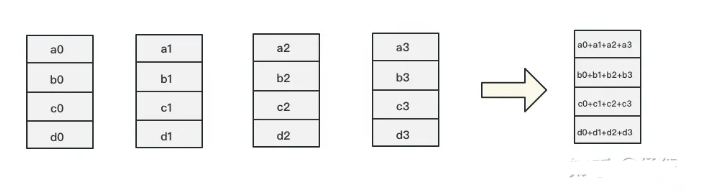
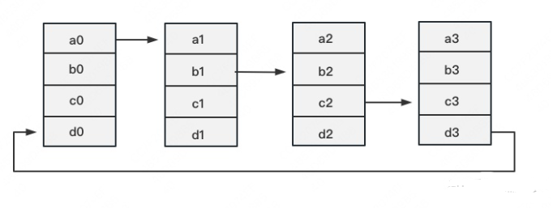
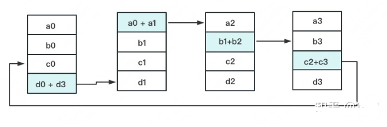
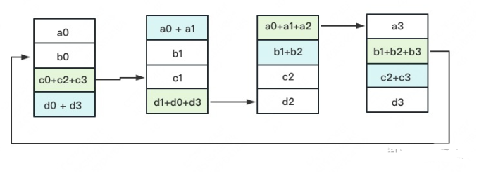
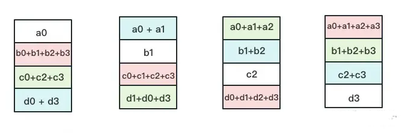
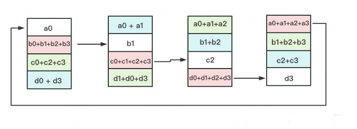
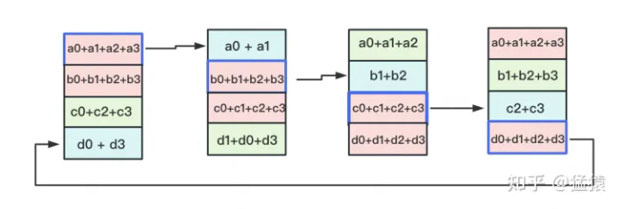
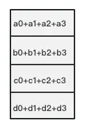
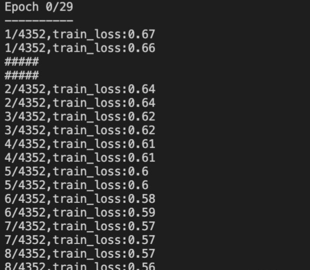

# 图解分布式训练（三） ——  nn.parallel.DistributedDataParallel 

- [图解分布式训练（三） ——  nn.parallel.DistributedDataParallel](#图解分布式训练三---nnparalleldistributeddataparallel)
  - [为什么需要 nn.parallel.DistributedDataParallel ？](#为什么需要-nnparalleldistributeddataparallel-)
  - [一、什么是 DistributedDataParallel 核心 —— Ring-AllReduce？](#一什么是-distributeddataparallel-核心--ring-allreduce)
    - [1.1 Ring-AllReduce 介绍](#11-ring-allreduce-介绍)
    - [1.2 Reduce-Scatter](#12-reduce-scatter)
    - [1.3 All-Gather](#13-all-gather)
  - [二、nn.parallel.DistributedDataParallel 函数 介绍一下？](#二nnparalleldistributeddataparallel-函数-介绍一下)
  - [三、nn.parallel.DistributedDataParallel 函数 如何多卡加速训练？](#三nnparalleldistributeddataparallel-函数-如何多卡加速训练)
  - [四、nn.parallel.DistributedDataParallel 实现流程介绍一下？](#四nnparalleldistributeddataparallel-实现流程介绍一下)
  - [五、nn.parallel.DistributedDataParallel 参数更新介绍一下？](#五nnparalleldistributeddataparallel-参数更新介绍一下)
  - [六、nn.DataParallel(以下简称DP) vs DistributedDataParallel(以下简称DDP)介绍一下？](#六nndataparallel以下简称dp-vs-distributeddataparallel以下简称ddp介绍一下)
  - [七、DistributedDataParallel(以下简称DDP) 优点有哪些？](#七distributeddataparallel以下简称ddp-优点有哪些)
  - [八、DistributedDataParallel(以下简称DDP) 缺点有哪些？](#八distributeddataparallel以下简称ddp-缺点有哪些)
  - [参考](#参考)


## 为什么需要 nn.parallel.DistributedDataParallel ？

多GPU并行训练的原理就是将模型参数和数据分布到多个GPU上，同时利用多个GPU计算加速训练过程。具体实现需要考虑以下三个问题：

1. **数据如何划分？**因为模型需要处理的数据通常很大，将所有数据放入单个GPU内存中可能会导致内存不足，因此我们需要将数据划分到多个GPU上。一般有两种划分方式：

- 数据并行：将数据分割成多个小批次，每个GPU处理其中的一个小批次，然后将梯度汇总后更新模型参数。
- 模型并行：将模型分解成多个部分，每个GPU处理其中一个部分，并将处理结果传递给其他GPU以获得最终结果。

2. **计算如何协同？**因为每个GPU都需要计算模型参数的梯度并将其发送给其他GPU，因此需要使用同步机制来保证计算正确性。一般有两种同步方式：

- 数据同步：在每个GPU上计算模型参数的梯度，然后将梯度发送到其他GPU上进行汇总，最终更新模型参数。
- 模型同步：在每个GPU上计算模型参数的梯度，然后将模型参数广播到其他GPU上进行汇总，最终更新模型参数。

3. DP 只支持 单机多卡场景，在 多机多卡 场景 下，DP 的 通讯问题将被放大。

- DDP首先要解决的就是通讯问题：将Server上的通讯压力均衡转到各个Worker上。实现这一点后，可以进一步去Server，留Worker。

## 一、什么是 DistributedDataParallel 核心 —— Ring-AllReduce？

上节讲到 DP 只支持 单机多卡场景，主要原因是 DP 无法数据并行中通讯负载不均的问题， 而 DDP 能够解决 该问题 的 核心在于 **Ring-AllReduce**。它由百度最先提出，非常有效地解决了数据并行中通讯负载不均的问题，使得DDP得以实现。

### 1.1 Ring-AllReduce 介绍

假设有4块GPU，每块GPU上的数据也对应被切成4份。AllReduce的最终目标，就是让每块GPU上的数据都变成箭头右边汇总的样子。



Ring-ALLReduce则分两大步骤实现该目标：Reduce-Scatter和All-Gather。

### 1.2 Reduce-Scatter

- 介绍：定义网络拓扑关系，使得每个GPU只和其相邻的两块GPU通讯。每次发送对应位置的数据进行累加。每一次累加更新都形成一个拓扑环，因此被称为Ring。

然后你对该问题一丝不解，没事，下文将用图例把详细步骤介绍清楚。





一次累加完毕后，蓝色位置的数据块被更新，被更新的数据块将成为下一次更新的起点，继续做累加操作。





3次更新之后，每块GPU上都有一块数据拥有了对应位置完整的聚合（图中红色）。此时，Reduce-Scatter阶段结束。进入All-Gather阶段。目标是把红色块的数据广播到其余GPU对应的位置上。

### 1.3 All-Gather

如名字里Gather所述的一样，这操作里依然按照“相邻GPU对应位置进行通讯”的原则，但对应位置数据不再做相加，而是直接替换。All-Gather以红色块作为起点。





以此类推，同样经过3轮迭代后，使得每块GPU上都汇总到了完整的数据，变成如下形式：



## 二、nn.parallel.DistributedDataParallel 函数 介绍一下？

> nn.parallel.DistributedDataParallel 函数
```s
    CLASS torch.nn.parallel.DistributedDataParallel(
        module, device_ids=None, output_device=None, 
        dim=0, broadcast_buffers=True, process_group=None, bucket_cap_mb=25, 
        find_unused_parameters=False, check_reduction=False
    )
```

- 函数参数
  - module是要放到多卡训练的模型；
  - device_ids数据类型是一个列表, 表示可用的gpu卡号;
  - output_devices数据类型也是列表,表示模型输出结果存放的卡号(如果不指定的话,默认放在0卡,这也是为什么多gpu训练并不是负载均衡的,一般0卡会占用的多,这里还涉及到一个小知识点——如果程序开始加os.environ["CUDA_VISIBLE_DEVICES"] = "2, 3", 那么0卡(逻辑卡号)指的是2卡(物理卡号))。
  - dim指按哪个维度进行数据的划分,默认是输入数据的第一个维度,即按batchsize划分(设数据数据的格式是B, C, H, W)

## 三、nn.parallel.DistributedDataParallel 函数 如何多卡加速训练？

DDP在各进程梯度计算完成之,各进程需要将梯度进行汇总平均；然后再由 rank=0 的进程,将其 broadcast 到所有进程后,各进程用该梯度来独立的更新参数，**而 DP是梯度汇总到GPU0,反向传播更新参数,再广播参数给其他剩余的GPU**。由于DDP各进程中的模型,初始参数一致 (初始时刻进行一次 broadcast),而每次用于更新参数的梯度也一致,因此,各进程的模型参数始终保持一致。**而在DP中,全程维护一个 optimizer,对各个GPU上梯度进行求,而在主卡进行参数更新,之后再将模型参数 broadcast 到其他GPU**

## 四、nn.parallel.DistributedDataParallel 实现流程介绍一下？

1. init_process_group初始化进程组(如果需要进行前面提到的小组内集体通信,用new_group创建子分组)

```s
    # 初始化使用nccl后端,官网还提供了‘gloo’作为backend,俺觉得知道nccl是用来GPU之间进行通信的就可以
    torch.distributed.init_process_group(backend="nccl")
```

2. 使用DistributedSampler(改dataloader中sampler=train_sampler)

```s
    # train_dataset就是自己的数据集
    train_sampler = torch.utils.data.distributed.DistributedSampler(train_dataset)
    dataloader = DataLoader(dataset, batch_size=batch_size, shuffle = (train_sampler is None), sampler=train_sampler, pin_memory=False)
```

> 注：pin_memory(固定内存)设为True会加速训练(但官网给到但参数设置是False)。

3. 创建DDP模型进行分布式训练

```s
    # DDP是all-reduce的,即汇总不同 GPU 计算所得的梯度,并同步计算结果。all-reduce 后不同 GPU 中模型的梯度均为 all-reduce 之前各GPU梯度的均值。
    model = torch.nn.parallel.DistributedDataParallel(model, device_ids=[args.local_rank], output_device=args.local_rank, find_unused_parameters=True)
```

4. 执行python train.py时需加参数

```s
    $ python -m torch.distributed.run --nnodes=1 --nproc_per_node=2 --node_rank=0  --master_port=6005 train.py
```

> 注：相较于DP, DDP传输的数据量更少,因此速度更快,效率更高。

- 整体代码汇总

```s
    ###DDP

    # 引入包
    import argparse
    import torch.distributed as dist

    # 设置可选参数
    parser = argparse.ArgumentParser()
    parser.add_argument('--local_rank', default=0, type=int,
                        help='node rank for distributed training')
    args = parser.parse_args()
    # print(args.local_rank)
    dist.init_process_group(backend='nccl')


    # 1.上面讲到的初始化进程组
    dist.init_process_group(backend='nccl')
    torch.cuda.set_device(args.local_rank)

    # 2.使用DistributedSampler
    train_sampler = torch.utils.data.distributed.DistributedSampler(train_dataset)
    dataloader = DataLoader(dataset, batch_size=batch_size, shuffle = (train_sampler is None), sampler=train_sampler, pin_memory=False)

    # 3.创建DDP模型进行分布式训练
    model = nn.parallel.DistributedDataParallel(model, device_ids=[args.local_rank], output_device=args.local_rank, find_unused_parameters=True)

    # 4.命令行开始训练 --nproc_per_node参数指定为当前主机创建的进程数(比如我当前可用但卡数是2 那就为这个主机创建两个进程,每个进程独立执行训练脚本)
    # 我是单机多卡, 所以nnode=1, 就是一台主机, 一台主机上--nproc_per_node个进程
    python -m torch.distributed.run --nnodes=1 --nproc_per_node=2 --node_rank=0  --master_port=6005 train.py
```



## 五、nn.parallel.DistributedDataParallel 参数更新介绍一下？

1. process group中的训练进程都起来后，rank为0的进程会将网络初始化参数broadcast到其它每个进程中，确保每个进程中的网络都是一样的初始化的值（默认行为，你也可以通过参数禁止）；
2. 每个进程各自读取各自的训练数据，DistributedSampler确保了进程两两之间读到的是不一样的数据；
3. 前向和loss的计算如今都是在每个进程上（也就是每个cuda设备上）独立计算完成的；网络的输出不再需要gather到master进程上了，这和DP显著不一样；
4. 反向阶段，梯度信息通过all-reduce的MPI原语，将每个进程中计算到的梯度reduce到每个进程；也就是backward调用结束后，每个进程中的param.grad都是一样的值；注意，为了提高all-reduce的效率，梯度信息被划分成了多个buckets；
5. 更新模型参数阶段，因为刚开始模型的参数是一样的，而梯度又是all reduced的，这样更新完模型参数后，每个进程/设备上的权重参数也是一样的。因此，就无需DP那样每次迭代后需要同步一次网络参数，这个阶段的broadcast操作就不存在了！注意，Network中的Buffers (比如BatchNorm数据) 需要在每次迭代中从rank为0的进程broadcast到进程组的其它进程上。

## 六、nn.DataParallel(以下简称DP) vs DistributedDataParallel(以下简称DDP)介绍一下？

1. **DDP通过多进程实现的**。也就是说操作系统会为每个GPU创建一个进程,从而避免了Python解释器GIL带来的性能开销。而DataParallel()是通过单进程控制多线程来实现的。还有一点,DDP也不存在前面DP提到的负载不均衡问题。
2. **参数更新的方式不同**。DDP在各进程梯度计算完成之后,各进程需要将梯度进行汇总平均,然后再由 rank=0 的进程,将其 broadcast 到所有进程后,各进程用该梯度来独立的更新参数而 DP是梯度汇总到GPU0,反向传播更新参数,再广播参数给其他剩余的GPU。由于DDP各进程中的模型,初始参数一致 (初始时刻进行一次 broadcast),而每次用于更新参数的梯度也一致,因此,各进程的模型参数始终保持一致。而在DP中,全程维护一个 optimizer,对各个GPU上梯度进行求平均,而在主卡进行参数更新,之后再将模型参数 broadcast 到其他GPU.相较于DP, DDP传输的数据量更少,因此速度更快,效率更高。
3. **DDP支持 all-reduce(指汇总不同 GPU 计算所得的梯度,并同步计算结果),broadcast,send 和 receive 等等**。通过 MPI 实现 CPU 通信,通过 NCCL 实现 GPU 通信,缓解了“写在前面“提到的进程间通信有大的开销问题。

## 七、DistributedDataParallel(以下简称DDP) 优点有哪些？

DistributedDataParallel是PyTorch提供的一种更加高级的多GPU并行训练方式，适用于多机多GPU的情况。DistributedDataParallel使用了数据并行和模型并行两种方式，通过将模型参数和梯度分布到不同的GPU上来充分利用多个GPU进行训练。DistributedDataParallel的优点是在内存占用和数据通信方面优于nn.DataParallel，能够更加高效地利用多个GPU进行训练。

## 八、DistributedDataParallel(以下简称DDP) 缺点有哪些？

使用DistributedDataParallel需要一定的分布式编程经验，使用也相对比较复杂。

## 参考

1. torch.nn.parallel.DistributedDataParallel： https://pytorch.org/docs/stable/generated/torch.nn.parallel.DistributedDataParallel.html#torch.nn.parallel.DistributedDataParallel
2. DataParallel & DistributedDataParallel分布式训练: https://zhuanlan.zhihu.com/p/206467852
3. 【NLP相关】PyTorch多GPU并行训练（DataParallel和DistributedDataParallel介绍、单机多卡和多机多卡案例展示）：https://blog.csdn.net/qq_41667743/article/details/128200356
4. 一文搞定分布式训练：dataparallel、distirbuted、deepspeed、accelerate、transformers、horovod: https://zhuanlan.zhihu.com/p/628022953
