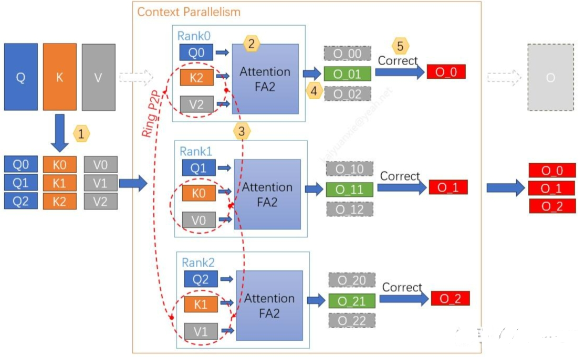
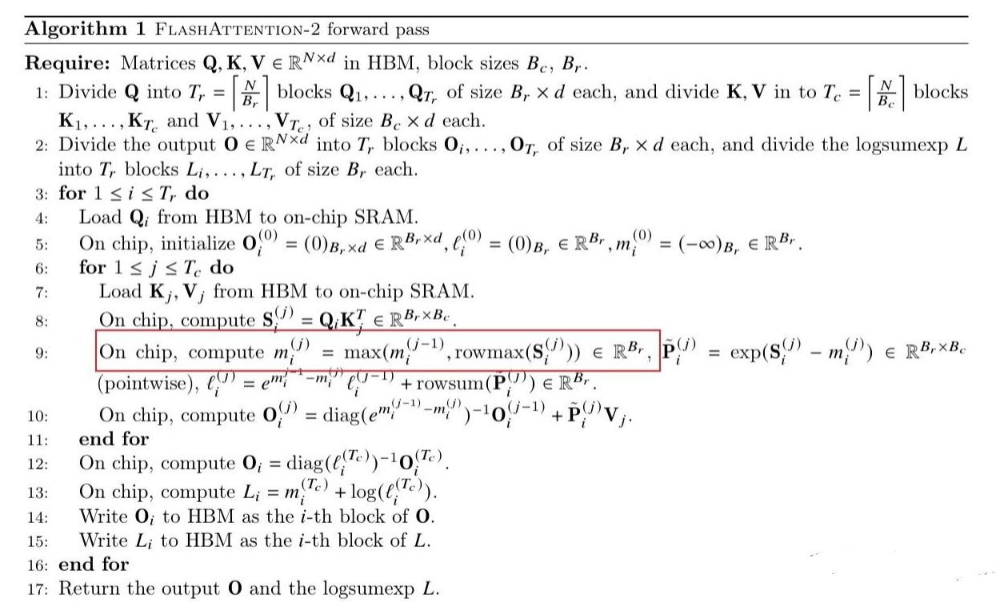
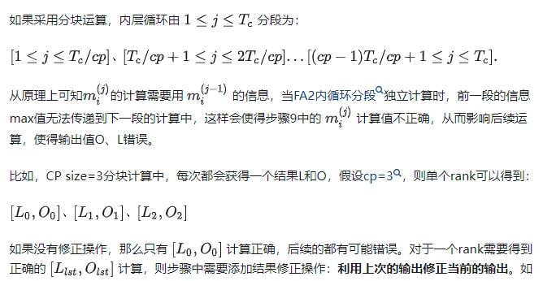
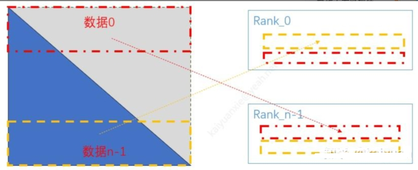

# Megatron-LM 篇

- [Megatron-LM 篇](#megatron-lm-篇)
  - [1、Activation Recomputation是怎么实现的?](#1activation-recomputation是怎么实现的)
  - [2、Megatron中的OverlappedDistributed Optimizer 是如何实现的?](#2megatron中的overlappeddistributed-optimizer-是如何实现的)
  - [3、Megatron-LM 中 Context Parallel 篇](#3megatron-lm-中-context-parallel-篇)
    - [3.1 介绍一下 Megatron-LM 中 Context Parallel 实现原理？](#31-介绍一下-megatron-lm-中-context-parallel-实现原理)
    - [3.2 介绍一下 Megatron-LM 中 Context Parallel 实现步骤？](#32-介绍一下-megatron-lm-中-context-parallel-实现步骤)
    - [3.3 cp依然是FA的计算逻辑，为何分块FA计算为何需要修正？](#33-cp依然是fa的计算逻辑为何分块fa计算为何需要修正)
    - [3.4 cp介绍里面说，相比ring-attention增加了负载均衡的处理逻辑，如何实现的？](#34-cp介绍里面说相比ring-attention增加了负载均衡的处理逻辑如何实现的)
    - [3.5 cp的性能如何？相比其它序列并行优劣如何？](#35-cp的性能如何相比其它序列并行优劣如何)
  - [致谢](#致谢)

## 1、Activation Recomputation是怎么实现的?

在Megatron模型中，激活值重计算(ActivationCheckpointing)是一种优化技术，用于减少在训练深度学习模型时所需的内存量。这种技术的核心思想是在前向传播过程中不立即计算某些层的激活值，而是在需要这些激活值进行反向传播时才计算它们。

具体来说，当模型进行前向传播时，传统的方法是计算每一层的激活值并保存下来，以便后续层使用或用于反向传播。然而，这样做会消耗大量的内存资源。激活值重计算技术通过跳过一些中间层的激活值计算，直到这些激活值真正需要用于计算梯度时才进行计算。这大大减少了在任何给定时间点需要存储的激活值数量，从而允许更大的批量大小(batch size)和更深层次的模型训练。

Megatron模型利用激活值重计算技术，结合其他内存优化技术(如ZeRO优化)，使得在有限的GPU内存中训练大型模型成为可能。这种方法特别适用于那些具有很多层和复杂结构的模型，如Transformer架构，它们在训练时通常需要大量的内存资源。

总的来说，激活值重计算是一种有效的内存管理策略，它通过延迟计算和存储激活值来优化训练过程使得可以在资源受限的环境中训练更大的模型。

## 2、Megatron中的OverlappedDistributed Optimizer 是如何实现的?

Overlapped Distributed Optimizer是Megatron项目中新增的一种优化器，旨在解决分布式训练中通信瓶颈的问题。它通过一种新颖的梯度和优化器状态分片策略，实现了计算和通信之间的高度并行性，从而提高了训练效率。

下面是 Overlapped Distributed Optimizer 的具体实现方法:

- 梯度和优化器状态分片:0verlappedDistributed Optimizer将模型参数分片成多个Buckets，每个 Bucket 包含一组完整的模型参数。每个 Bucket 被进一步划分为与数据并行组(dataparallelgroup)的rank数目相同的分片(shards)。每个rank负责处理一个shard，并且在训练过程中，数据并行组之间的ranks 会交换所需的梯度。
- 高效的通信机制:为了减少通信开销Overlapped Distributed Optimizer 在局部缓冲区(localbuffer)中初始化了一个名为 PartitionedParameter 的缓冲区，其大小等于当前rank 负责的所有参数的大小总和。相应的梯度被存储在另一个名为 Partitioned Gradient 的缓冲区中。这样,每个rank 可以在本地更新其负责的参数分片，而不需要全局的通信操作。
- 计算与通信的重叠:Overlapped DistributedOptimizer 通过在梯度计算和通信之间实现重叠来提高硬件资源的利用率。当一个参数的梯度计算完成后，它会立即被复制到对应的 Bucket 位置。一旦一个 Bucket 中的所有参数梯度都收集完毕就执行一次 ReduceScatter操作来交换梯度。这样，可以在等待通信操作完成的同时进行其他计算任务，减少了因通信而造成的等待时间。
- 内存优化:Overlapped Distributed Optimizer通过避免额外的内存分配和GPU内存拷贝来减少内存占用。例如，在初始化时，它会分配一个名为ParameterBuffer的缓冲区，并将所有模型参数实际放置在其中。这样，通过 AlGather 重构完整参数时，可以直接引用 ParameterBuffer中的相应位置，避免了临时内存分配和减少GPU内存拷贝。

## 3、Megatron-LM 中 Context Parallel 篇

### 3.1 介绍一下 Megatron-LM 中 Context Parallel 实现原理？

在Megtron-LM框架中，CP实现主要思想有两点：

1. 用Flash-attention2方式进行分块运算， 最后对分块结果进行修正。
2. 设备之间用ring的方式传递KV值来获得分块运算的结果，原理类似ring-attention；

### 3.2 介绍一下 Megatron-LM 中 Context Parallel 实现步骤？

1. **数据切分**：根据cp_size(示例=3)大小，将数据切分，每个rank拿到对应分片数据；
2. **分块attention计算**：计算分块数据的self-attention值（图中用FA2计算），获得单步数据；
3. **KV数据交换**：rank之间搭建ring网络结构，每个rank与相邻rank交换KV数据；
4. **单步计算修正**：计算完attention后，需要对输出中间值L进行修正，保证输出正确；
5. **计算最终输出**：算完所有的分块attention后，对最终结果O进行修正、合并。

每个rank拿到分块结果O_与不采用CP并行的结果O对应部分相等；步骤2与3可以同时进行。



### 3.3 cp依然是FA的计算逻辑，为何分块FA计算为何需要修正？

因为分块计算与原结果不相等，需要修正。在Megatron的self-attention计算用的FA2原理，计算的步骤如下（Forward部分）：





### 3.4 cp介绍里面说，相比ring-attention增加了负载均衡的处理逻辑，如何实现的？

如果是解决下角的计算不均衡的问题，大概是这样一个交替对偶的方式，如下所示，如果按照均等数据切分，rank_0拿到的数据0部分，对称（对偶）的rank_n-1拿到最后一个数据块；经过下三角mask后，由于掩膜外值不需要计算, rank0计算量非常少，rank_n-1计算量最大。现在让rank_0的一半计算数据与rank_n-1计算数据对换，类似的rank_1与rank_n-2对换，那么能够一定程度上平衡计算。



在CP的从代码来看，其先进行了对称处理，最后移除causal masking中不必要的计算。涉及的步骤包括：

- 当QKV分块进行第一次运算时，按照causal模式的FA2计算；
- 当QKV分块计算循环次数i<= rank_idx时，KV丢弃sequence后半部分内容，进行“no_mask”的FA2运算；
- 当循环次数i>rank_idx时，Q值丢弃sequence前半部分内容，进行“no_mask”的FA2运算；

### 3.5 cp的性能如何？相比其它序列并行优劣如何？

Megatron-LM 中 Context Parallel 的工作原理是什么？

首先看一下cp对单rank的性能影响：

- 计算量：CP切分的attention计算与整体的attention计算的计算量近乎一样，但多了 2CP-1 次修改操作；
- 通信量：增加了p2p通信，通信总量为 2 * b * sq * np * hd * (cp-1)/cp 个单位
- 内存：假设每个rank只有一个buffer大小，QKV输入的显存变为 b∗sq∗np∗hd∗5/cp 个单位单说显存：cp本身是用来降低单GPU的显存压力的，但是代码里面的一些设置并不是太科学，比如P2P通信的buffer，源码摘取出来是这样的：

```s
# 定义
p2p_comm_buffers = [None for _ in range(cp_size)]

# 创建
p2p_comm_buffers[i+1] = torch.empty_like(p2p_comm_buffers[i])

# 使用
kv_inputs[i%2] = p2p_comm_buffers[i]
```

这样一来，K、V在设备rank上面都有一个完整的数据buffer，如果不及时清理，那么显存总量就上去了。相似问题还有K、V 计算buffer（解决双流异步计算问题）    

```s
q_inputs = [None, None]  # 双份
kv_inputs = [None, None] # 双份
```

虽然显存优化存在一些代码层面的问题（可能节约空间不大），但cp的计算得益于使用了整块的FA2，不需要单独实现一个新的FA2，调用CUDA（cuDNN）里面已有的优化kernel即可。就工程而言，相比其它的分布式序列并行（修改FA2计算过程实现并行的方法）更省力。细粒度的话，cp_size 可以设置得与FA2循环数Tr/Tc一样大。

## 致谢

- Megatron-LM 中 Context Parallel 的工作原理是什么？  https://www.zhihu.com/question/637961859/answer/3504038957
