# 图解分布式训练（一） —— 流水线并行（Pipeline Parallelism）

- [图解分布式训练（一） —— 流水线并行（Pipeline Parallelism）](#图解分布式训练一--流水线并行pipeline-parallelism)
  - [为什么需要流水线并行（Pipeline Parallelism）？](#为什么需要流水线并行pipeline-parallelism)
  - [一、流水线并行（Pipeline Parallelism） 优化目标是什么？](#一流水线并行pipeline-parallelism-优化目标是什么)
  - [二、图解 流水线并行（Pipeline Parallelism）模型并行 必要性？](#二图解-流水线并行pipeline-parallelism模型并行-必要性)
  - [三、流水线并行（Pipeline Parallelism） 图解？](#三流水线并行pipeline-parallelism-图解)
    - [3.1 切分micro-batch](#31-切分micro-batch)
    - [3.2 re-materialization（active checkpoint）](#32-re-materializationactive-checkpoint)
  - [四、流水线并行（Pipeline Parallelism）优缺点？](#四流水线并行pipeline-parallelism优缺点)
    - [4.1 GPU数量 VS 模型大小](#41-gpu数量-vs-模型大小)
    - [4.2 GPU数量 VS 训练速度](#42-gpu数量-vs-训练速度)
      - [4.2.1 关掉NVlinks](#421-关掉nvlinks)
      - [4.2.2 开启NVlinks，并寻找最佳M](#422-开启nvlinks并寻找最佳m)
      - [4.2.3 Gpipe下时间消耗分布](#423-gpipe下时间消耗分布)
  - [致谢](#致谢)

## 为什么需要流水线并行（Pipeline Parallelism）？

回顾ChatGPT的发展历程，我们可以总结出大语言模型（LLM）取得惊艳效果的要点（重要性从高到低排序）：
   
1. 愿意烧钱，且接受“烧钱 != 好模型”的现实
2. 高质量的训练语料
3. **高效的分布式训练框架**和**充沛优质的硬件资源**
4. **算法的迭代创新**

在大模型训练这个系列里，我们将一起探索学习几种经典的分布式并行范式，包括**流水线并行（Pipeline Parallelism）**，**数据并行（Data Parallelism）**和**张量并行（Tensor Parallesim）**。

**微软开源的分布式训练框DeepSpeed，融合了这三种并行范式，开发出3D并行的框架，实现了千亿级别模型参数的训练**。

本篇文章将探索流水线并行，经典的流水线并行范式有Google推出的Gpipe，和微软推出的PipeDream。两者的推出时间都在2019年左右，大体设计框架一致。主要差别为：在梯度更新上，Gpipe是同步的，PipeDream是异步的。异步方法更进一步降低了GPU的空转时间比。虽然PipeDream设计更精妙些，但是Gpipe因为其“够用”和浅显易懂，更受大众欢迎（torch的pp接口就基于Gpipe）。因此本文以Gpipe作为流水线并行的范例进行介绍。

本文内容包括：

1. 优化目标
2. 模型并行
3. 流水线并行
   1. 切分micro-batch
   2. Re-materialization (active checkpoint)
4. 实验效果
   1. GPU数量 VS 模型大小
   2. GPU数量 VS 训练速度
   3. Gpipe下单GPU的时间消耗分析

## 一、流水线并行（Pipeline Parallelism） 优化目标是什么？

**当你从单卡穷人变成多卡富翁时，你做分布式训练的总体目标是什么呢？**（虽然手握一张A100怎么能是穷呢）

- **能训练更大的模型**。理想状况下，模型的大小和GPU的数量成线性关系。即GPU量提升x倍，模型大小也能提升x倍。
- **能更快地训练模型**。理想状况下，训练的速度和GPU的数量成线性关系。即GPU量提升x倍，训练速度也能提升x倍。

这是目标，也是难点，难在于：

- 训练更大的模型时，每块GPU里不仅要存模型参数，还要存中间结果（用来做Backward）。而更大的模型意味着需要更多的训练数据，进一步提高了中间结果的大小。加重了每块GPU的内存压力。我们将在下文详细分析这一点。（对应着GPU中的内存限制）
- 网络通讯开销。数据在卡之间进行传输，是需要通讯时间的。不做设计的话，这个通讯时间可能会抹平多卡本身带来的训练速度提升。（对应着GPU间的带宽限制）
明确这两个训练目标后，我们来看并行范式的设计者，是如何在现有硬件限制的条件下，完成这两个目标的。

## 二、图解 流水线并行（Pipeline Parallelism）模型并行 必要性？

- 动机：当你有一个单卡装不下的大模型时
- 解决办法：**把模型隔成不同的层，每一层都放到一块GPU上**，如下图：

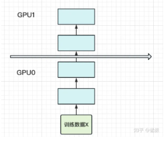

此时，模型做一轮forward和backward的过程如下：

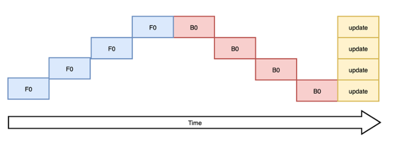

其中下标表示batch编号，这里只有一个batch，因此下标都是0。每一行表示一个GPU。每一列表示timestep。

这张图的含义是：**我在GPU0上做完一次forward，然后将GPU0上最后一层的输入传给GPU1，继续做forward，直到四块GPU都做完forward后，我再依次做backward。等把四块GPU上的backward全部做完后，最后一个时刻我统一更新每一层的梯度**。

这样做确实能训更大的模型了，但也带来了两个问题：

1. **GPU利用度不够**

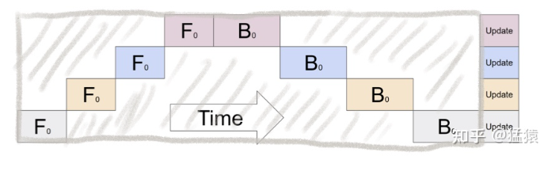

如图，阴影部分所表示的时间段里，总有GPU在空转。在Gpipe中，将阴影部分定义为bubble。我们来计算一下bubble。假设有 K  块GPU，而单块GPU上做一次forward和backward的时间为：

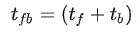

那么：

- 图中灰色长方形的整体面积为：

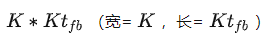

- 图中实际在做forward和backward的面积为：

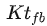

- 图中阴影部分的面积为：

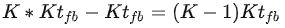

- 图像阴影部分的占比为： 

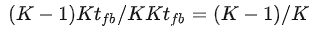

则我们定义出bubble部分的时间复杂度为：

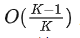

**当K越大，即GPU的数量越多时，空置的比例接近1，即GPU的资源都被浪费掉了**。因此这个问题肯定需要解决。

2. 中间结果占据大量内存

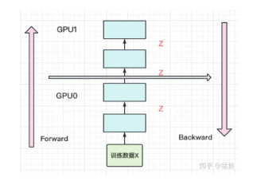

在做backward计算梯度的过程中，我们需要用到每一层的中间结果z。假设我们的模型有L层，每一层的宽度为d，则对于每块GPU，不考虑其参数本身的存储，额外的空间复杂度为

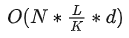

从这个复杂度可以看出，随着模型的增大，N，L，d三者的增加可能会平滑掉K增加带来的GPU内存收益。因此，这也是需要优化的地方。

## 三、流水线并行（Pipeline Parallelism） 图解？

朴素的模型并行存在GPU利用度不足，中间结果消耗内存大的问题。

而Gpipe提出的流水线并行，就是用来解决这两个主要问题的。

### 3.1 切分micro-batch

- 核心思想：**在模型并行的基础上，进一步引入数据并行的办法，即把原先的数据再划分成若干个batch，送入GPU进行训练**。未划分前的数据，叫mini-batch。在mini-batch上再划分的数据，叫micro-batch。

图例如下：

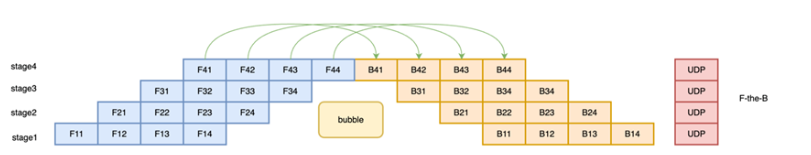

其中，第一个下标表示GPU编号，第二个下标表示micro-batch编号。假设我们将mini-batch划分为M个，则流水线并行下，bubble的时间复杂度为：

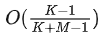

> 注： (推导过程略，可参照第二部分的bubble推导流程)

Gpipe通过实验证明，当 M>=4K 时，bubble产生的空转时间占比对最终训练时长影响是微小的，可以忽略不计。

将batch切好，并逐一送入GPU的过程，就像一个流水生产线一样（类似于CPU里的流水线），因此也被称为Pipeline Parallelism。

### 3.2 re-materialization（active checkpoint）

- 动机：虽然 切分micro-batch方法 能够 解决了GPU的空置问题，提升了GPU计算的整体效率。但是 如何解决 GPU的内存问题 呢？前文说过，随着模型的增加，每块GPU中存储的中间结果也会越大。
- 核心方法：Gpipe采用了一种非常简单粗暴但有效的办法：**用时间换空间，在论文里，这种方法被命名为re-materalization，后人也称其为active checkpoint**。

具体来说，就是**几乎不存中间结果，等到backward的时候，再重新算一遍forward**，图例如下：

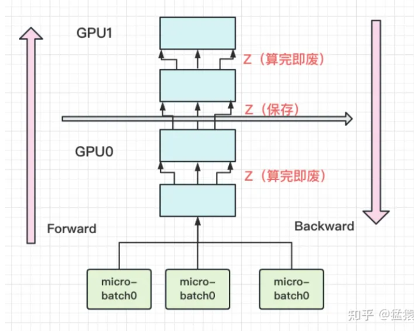

每块GPU上，我们只保存来自上一块的最后一层输入z，其余的中间结果我们算完就废。等到backward的时候再由保存下来的z重新进行forward来算出。

现在我们来计算每块GPU峰值时刻的内存：

**每块GPU峰值时刻存储大小 = 每块GPU上的输入数据大小 + 每块GPU在forward过程中的中间结果大小**

每块GPU上固定需要保存它的起始输入，我们记起始输入为 N （即mini-batch的大小）。

每个micro-batch是流水线形式进来的，算完一个micro-batch才算下一个。在计算一个micro-batch的过程中，我们会产生中间变量，它的大小为 

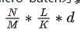

> 注：（其中M为micro-batch个数）

因此，每块GPU峰值时刻的空间复杂度为

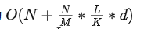

与朴素模型并行中的GPU空间复杂度 

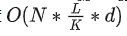

相比，可以发现，由于采用了micro-batch的方法，当L变大时，流水线并行相比于朴素模型并行，对GPU内存的压力显著减小。

如果你使用Pytorch提供的pipeline接口，其中有一个参数叫checkpoint，就是用来做这一项的。

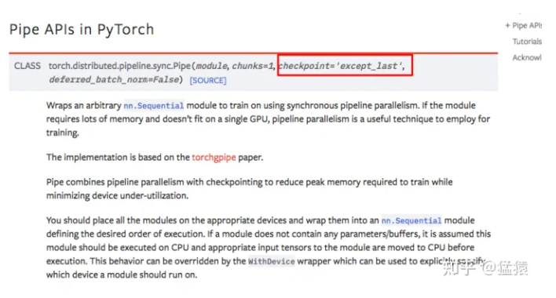

最后，再提一点，在micro-batch的划分下，我们在计算**Batch Normalization**时会有影响。Gpipe的方法是，在训练时计算和运用的是micro-batch里的均值和方差，但同时持续追踪全部mini-batch的移动平均和方差，以便在测试阶段进行使用。Layer Normalization则不受影响。

## 四、流水线并行（Pipeline Parallelism）优缺点？

回顾第二部分的两个目标，Gpipe真的实现了吗？如果实现不了，又是因为什么原因呢？我们来看下实验效果。

### 4.1 GPU数量 VS 模型大小

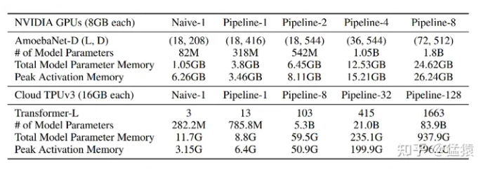

Gpipe分别在AmoebaNet（图像）和Transformer（自然语言）两个大模型上做了实验。

- Naive表示单卡
- Pipeline-N表示re-materalization + N卡。
- AmeobaNet-D和Trasformer-L一行表示超参数的量
- # of Model Parameter表示模型的参数量
- Total Model Parameter Memory表示模型参数所占内存大小
- Peak Activation Memory表示峰值时中间结果大小。可以发现，中间结果占据的内存大小是相当可观的。

从实验结果里，我们可以发现：

- 在Transformer上，Gpipe基本实现了模型大小（参数量）和GPU个数之间的线性关系。例如从32卡增到128卡时，模型的大小也从21.08B增加到82.9B，约扩4倍
- 对AmoebaNet而言，却没有完全实现线性增长。例如从4卡到8卡，模型大小从1.05B到1.8B，不满足2倍的关系。本质原因是AmoebaNet模型在切割时，没有办法像Transformer一样切得匀称，保证每一块GPU上的内存使用率是差不多的。因此对于AmoebaNet，当GPU个数上升时，某一块GPU可能成为木桶的短板。-

### 4.2 GPU数量 VS 训练速度

#### 4.2.1 关掉NVlinks

为了验证Gpipe框架带来的收益，实验中关掉了NVlinks（GPU间快速通信的桥梁。估计是通过强迫GPU先连CPU然后再连别的GPU做到的）。关掉的意义在于说明，不靠硬件本身的高效通讯带来的收益，Gpipe一样能做的很好。实验效果如下：

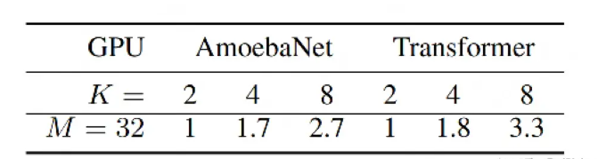

M=32表示micro-batch的数量为32，K表示GPU数量。从实验结果可知，在关掉NVlinks的情况下，Gpipe一样也能实现随着GPU数量的增加，训练速度也增加的效果。虽然这两者间不是线性的。同样，因为模型切割不均的原因，AmoebaNet的表现不如Transformer。

#### 4.2.2 开启NVlinks，并寻找最佳M

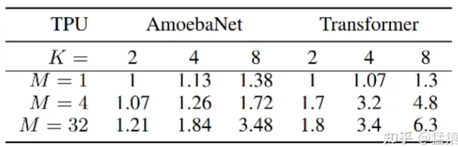

当重新开启NVlinks后，我们来看M的大小（即流水线的核心）对训练速度的影响。

- 当M=1的时候，如前文所说，GPU的空置率太高，因此两个模型都没有实现训练速度和GPU个数间的线性关系
- 当M=4时，表现明显好转。
- 当M=32时，表现最佳，且Transformer基本实现了训练速度和GPU个数的线性关系。

#### 4.2.3 Gpipe下时间消耗分布

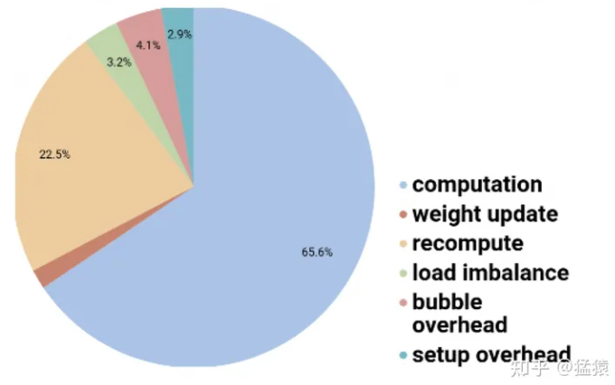

- 对每块GPU来说，约2/3的时间，是真正花在计算上的。
- 其余1/3的时间，大部分花在re-materalization策略下的重计算上。因为采用流水线的方法，bubble的时间也被压缩到很短，可以忽略不计。

## 致谢

1. https://arxiv.org/abs/1811.06965
2. https://www.zhihu.com/question/508671222/answer/2290801813
3. 流水线并行技术与飞桨优化实现详解：https://cloud.tencent.com/developer/article/2089268