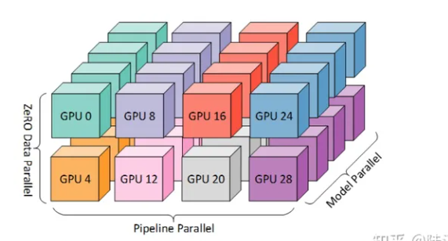
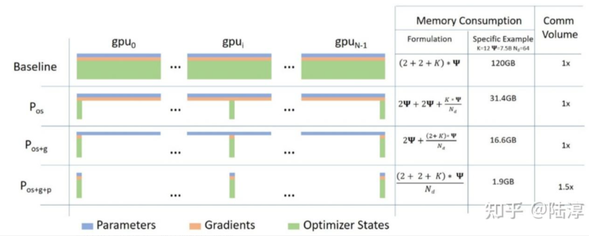
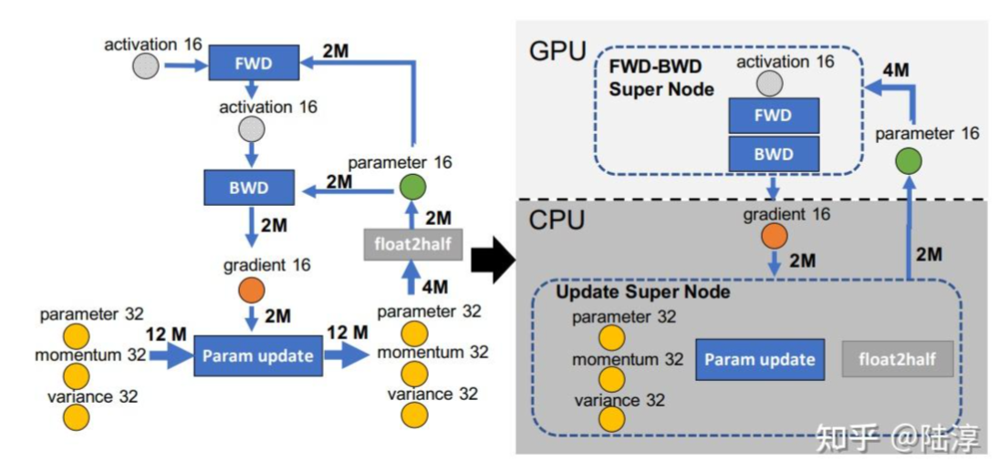
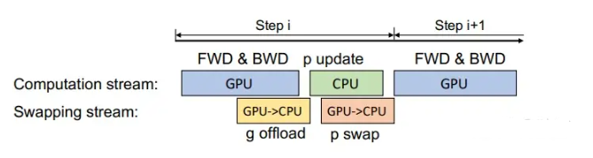
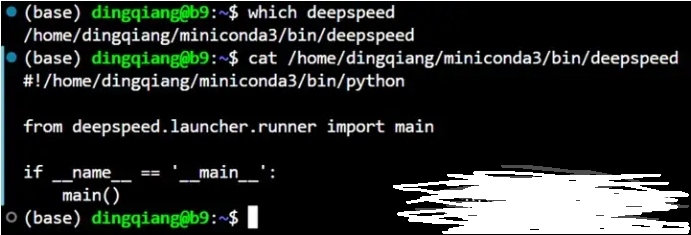
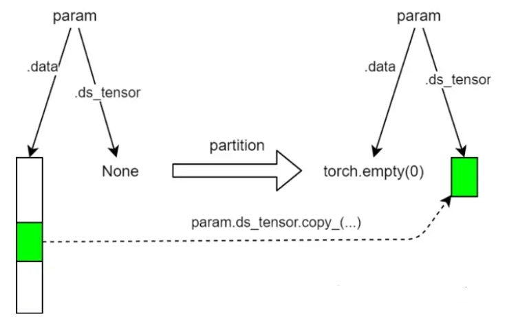
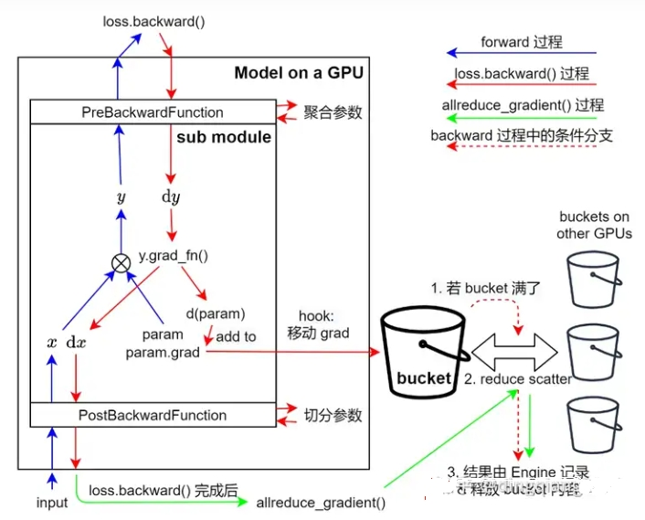
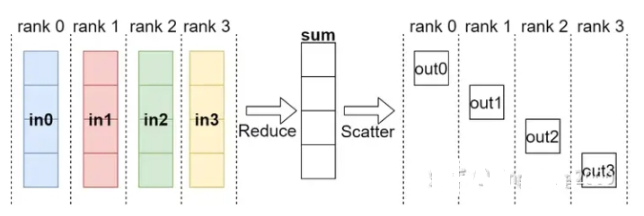

# 图解分布式训练（八）—— ZeRO 学习

- [图解分布式训练（八）—— ZeRO 学习](#图解分布式训练八-zero-学习)
  - [一、什么是 3D 并行？](#一什么是-3d-并行)
  - [二、3D 并行 策略有哪些？](#二3d-并行-策略有哪些)
    - [2.1 DataParallel (DP)](#21-dataparallel-dp)
    - [2.2 TensorParallel (TP)](#22-tensorparallel-tp)
    - [2.3 PipelineParallel (PP)](#23-pipelineparallel-pp)
  - [三、为什么需要 ZeRO？](#三为什么需要-zero)
  - [四、ZeRO 的 核心思想是什么？](#四zero-的-核心思想是什么)
  - [五、ZeRO 显存如何分配？](#五zero-显存如何分配)
  - [六、ZeRO 优化策略是怎么样？](#六zero-优化策略是怎么样)
    - [6.1 介绍一下 ZeRO 优化策略有哪几种？](#61-介绍一下-zero-优化策略有哪几种)
    - [6.2 介绍一下 ZeRO-Offload 优化策略？](#62-介绍一下-zero-offload-优化策略)
    - [6.3 介绍一下 ZeRO-1 原理？](#63-介绍一下-zero-1-原理)
    - [6.4 介绍一下 ZeRO-2 原理？](#64-介绍一下-zero-2-原理)
    - [6.5 介绍一下 ZeRO-3 原理？](#65-介绍一下-zero-3-原理)
  - [七、ZeRO Offload后的计算流程是怎么样？](#七zero-offload后的计算流程是怎么样)
  - [八、DeepSped ZeRO3内部实现初探篇](#八deepsped-zero3内部实现初探篇)
    - [8.1 deepspeed程序内部到底做了什么？](#81-deepspeed程序内部到底做了什么)
    - [8.2 介绍一下 deepspeed 命令的本质？](#82-介绍一下-deepspeed-命令的本质)
    - [8.3 trainer.train(...) 里面发生了什么？](#83-trainertrain-里面发生了什么)
    - [8.4 from\_pretrained() \& 参数切分与聚合？](#84-from_pretrained--参数切分与聚合)
  - [九、DeepSpeed ZeRO3的 backward \& step 的实现](#九deepspeed-zero3的-backward--step-的实现)
    - [9.1 介绍一下 backward 实现机制？](#91-介绍一下-backward-实现机制)
    - [9.2 介绍一下 bstep 实现机制？](#92-介绍一下-bstep-实现机制)
  - [参考](#参考)

## 一、什么是 3D 并行？

3D 并行可以让大型模型以非常有效的方式进行训练

## 二、3D 并行 策略有哪些？

- DataParallel (DP)
- TensorParallel (TP) 
- PipelineParallel (PP)

### 2.1 DataParallel (DP)

- 介绍：假设有N张卡，**每张卡都保存一个模型，每一次迭代（iteration/step）都将batch数据分割成N个等大小的micro-batch，每张卡根据拿到的micro-batch数据独立计算梯度，然后调用AllReduce计算梯度均值，每张卡再独立进行参数更新**。
- 举例说明：

```s
    # 假设模型有三层：L0, L1, L2   
    # 每层有两个神经元   # 两张卡
    GPU0:    L0 | L1 | L2   ---|----|---   a0 | b0 | c0   a1 | b1 | c1
    GPU1:   L0 | L1 | L2   ---|----|---   a0 | b0 | c0   a1 | b1 | c1  
```

### 2.2 TensorParallel (TP)

- 介绍：**每个张量都被分成多个块，因此不是让整个张量驻留在单个 GPU 上，而是张量的每个分片都驻留在其指定的 GPU 上。在处理过程中，每个分片在不同的 GPU 上分别并行处理，最终结果在步骤结束时同步**。这也被称作横向并行。
- 举例说明：

```s
    # 假设模型有三层：L0, L1, L2   
    # 每层有两个神经元   # 两张卡
    GPU0:    L0 | L1 | L2   ---|----|---   a0 | b0 | c0   a1 | b1 | c1
    GPU1:   L0 | L1 | L2   ---|----|---   a0 | b0 | c0   a1 | b1 | c1  
```

### 2.3 PipelineParallel (PP) 

- 介绍：模型在多个 GPU 上垂直（层级）拆分，因此只有模型的一个或多个层放置在单个 GPU 上。每个 GPU 并行处理管道的不同阶段，并处理一小部分批处理。
- 举例说明：

```s
    # 假设模型有8层  
    # 两张卡
    |  L0 | L1 | L2 | L3 |  | L4 | L5 | L6 | L7 |  
    ======================  =====================          
            GPU0                 GPU1   
```

## 三、为什么需要 ZeRO？

虽然 DataParallel (DP) 因为简单易实现，所以目前应用相比于其他两种 广泛，但是 由于 DataParallel (DP) 需要 每张卡都存储一个模型，导致 显存大小 成为 制约模型规模 的 主要因素。

既然 每张卡都存储一个模型 会 增加 模型训练过程中的显存占用，那么 是否可以 让 每行卡训练 1/N 的模型参数，然后 合并起来就是一个完整模型呢？ 这样，随着卡数的增加，每张卡 用于 模型训练的显存占用将减低，能够训练的模型也就越大。

如今训练大模型离不开各种分布式并行策略，ZeRO系列技术就是一种显存优化的数据并行方案，旨在训练超大规模的语言模型。



## 四、ZeRO 的 核心思想是什么？

去除数据并行中的冗余参数，使每张卡只存储一部分模型状态，从而减少显存占用。

## 五、ZeRO 显存如何分配？

ZeRO将模型训练阶段中每张卡的显存内容分为两类：

- 模型状态：包括参数、梯度和优化器状态，其中优化器状态占比 75% 。
- 剩余状态：除了模型状态之外的显存占用，包括激活值、各种临时缓冲区以及无法使用的显存碎片。

> 来看一个例子，GPT-2含有1.5B个参数，如果用fp16格式（混合精度），只需要3GB显存，但是模型状态实际上需要耗费24GB！所以模型状态就成了头号显存杀手，它也是ZeRO的重点优化对象。而其中优化器状态又是第一个要被优化的。

## 六、ZeRO 优化策略是怎么样？

针对模型状态的存储优化（去除冗余），ZeRO使用的优化策略是分片，即每张卡只存 1/N的模型状态量，这样系统内只维护一份模型状态。

### 6.1 介绍一下 ZeRO 优化策略有哪几种？

ZeRO 具有三个主要的优化阶段（ZeRO-1，ZeRO-2，ZeRO-3），它们对应于优化器状态（optimizer states）、梯度（gradients）和参数（parameters）的分片，分别对应对 Model States 不同程度的分割 (Paritition)：

- ZeRO-1：分割Optimizer States； 
- ZeRO-2：分割Optimizer States与Gradients； 
- ZeRO-3：分割Optimizer States、Gradients与Parameters；

累积启用时：

- 优化器状态分区 ($P_{os}$) – 内存减少 4 倍，通信量与数据并行性相同
- 添加梯度分区 ($P_{os+g}$) – 内存减少 8 倍，通信量与数据并行性相同
- 添加参数分区 ($P_{os+g+p}$) – 内存减少与数据并行度 Nd 成线性关系。例如，拆分为 64 个 GPU ( Nd =64) 内存将减少到 1/64 。GPU 通信量略有增加 50%。


> 注：图中Memory Consumption 第二列给出了一个示例： k=12,Φ=7.5B,$N_d$=64 ，可以看到随着ZeRO 阶段深入，显存优化相当明显。

### 6.2 介绍一下 ZeRO-Offload 优化策略？

**一张卡训不了大模型，根因是显存不足，ZeRO-Offload则将训练阶段的某些模型状态下放（offload）到内存以及CPU计算，即显存不足，内存来补。相比于昂贵的显存，内存廉价多了。**

下图是某一层的一次迭代过程，使用了混合精度训练，前向计算（FWD）需要用到上一次的激活值（activation）和本层的参数（parameter），反向传播（BWD）也需要用到激活值和参数计算梯度，当我们用Adam优化器进行参数更新时，假设模型参数量是 M ，在混合精度训练的前提下，边的权重要么是2M（fp16），要么是4M（fp32）。为了不降低计算效率，将前两个节点放在GPU，后两个节点不但计算量小还需要和Adam状态打交道，所以放在CPU上，Adam状态自然也放在内存中，为了简化数据图，将前两个节点融合成一个节点FWD-BWD Super Node，将后两个节点融合成一个节点Update Super Node，**沿着gradient 16和parameter 16把数据流图切分为两部分，分布对应GPU和CPU**



### 6.3 介绍一下 ZeRO-1 原理？

> Optimizer States Partitioning (Pos): 4x memory reduction, same communication volume as DP

Optimizer 在进行梯度更新时，会使用参数与Optimizer States计算新的参数。而在正向或反向传播中，Optimizer States并不会参与其中的计算。 因此，我们完全可以让每个进程只持有一小段Optimizer States，利用这一小段Optimizer States更新完与之对应的一小段参数后，再把各个小段拼起来合为完整的模型参数。

<video width="320" height="240" controls>
    <source src="img/bd03b0bc-ef95-11eb-8ee1-ce96bf022449.mp4" type="video/mp4">
    <source src="img/bd03b0bc-ef95-11eb-8ee1-ce96bf022449.mp4" type="video/ogg">
    您的浏览器不支持 video 标签。
</video>

假设我们有 Nd 个并行的进程，ZeRO-1 会将完整优化器的状态等分成 Nd 份并储存在各个进程中。当Backward完成之后，每个进程的Optimizer: - 对自己储存的Optimizer States（包括Momentum、Variance 与 FP32 Master Parameters）进行计算与更新。 - 更新过后的Partitioned FP32 Master Parameters会通过All-gather传回到各个进程中。 - 完成一次完整的参数更新。

通过 ZeRO-1 对Optimizer States的分段化储存，7.5B 参数量的模型内存占用将由原始数据并行下的 120GB 缩减到 31.4GB。

### 6.4 介绍一下 ZeRO-2 原理？

> Optimizer States and Gradient Partitioning ($P_{os+g}$): 8x memory reduction, same communication volume as DP

ZeRO-1将Optimizer States分小段储存在了多个进程中，所以在计算时，这一小段的Optimizer States也只需要得到进程所需的对应一小段Gradient就可以。遵循这种原理，和Optimizer States一样，ZeRO-2也将Gradient进行了切片：

在一个Layer的Gradient都被计算出来后： - Gradient通过AllReduce进行聚合。 （类似于DDP） - 聚合后的梯度只会被某一个进程用来更新参数，因此其它进程上的这段Gradient不再被需要，可以立马释放掉。（按需保留）

这样就在ZeRO-1的基础上实现了对Gradient的切分。

通过 ZeRO-2 对Gradient和Optimizer States的分段化储存，7.5B 参数量的模型内存占用将由 ZeRO-1 中 31.4GB 进一步下降到 16.6GB。

### 6.5 介绍一下 ZeRO-3 原理？

> Optimizer States, Gradient and Parameter Partitioning ($P_{os+g+p}$): Memory reduction is linear with DP degree

当Optimizer States，Gradient都被分布式切割分段储存和更新之后，剩下的就是Model Parameter了。 ZeRO-3 通过对Optimizer States，Gradient和Model Parameter三方面的分割，从而使所有进程共同协作，只储存一份完整 Model States。其核心思路就是精细化通讯，按照计算需求做到参数的收集和释放。

## 七、ZeRO Offload后的计算流程是怎么样？

- 在GPU上面进行前向和后向计算，将梯度传给CPU。同时为了提高效率，可以将计算和通信并行起来，GPU在反向传播阶段，可以待梯度值填满bucket后，一边计算新的梯度一边将bucket传输给CPU，当反向传播结束，CPU基本上已经有最新的梯度值了；
- cpu进行参数更新，再将更新后的参数传给GPU。



## 八、DeepSped ZeRO3内部实现初探篇

### 8.1 deepspeed程序内部到底做了什么？

这个问题可以总结为两个方面：

1. deepspeed ... <user_script>.py ... 命令的本质是什么？
2. trainer.train(...) 里面发生了什么？

### 8.2 介绍一下 deepspeed 命令的本质？

deepspeed命令的本质是一个 Python脚本。

如图下所示，使用which deepspeed 命令找到该命令的路径，然后打印该路径下的文件，我们发现deepspeed 命令实际是一个Python脚本，它调用了deepspeed顶层目录下的launcher/runner.py（下面的路径都只写出相对deepspeed顶层目录的路径）。runner.py 会启动一个子进程执行 launcher/launch.py。然后 launch.py会启动多个子进程执行用户脚本 <user_script>.py，这里的子进程数量等于GPU数目。每个子进程都会被提供相应的RANK和LOCAL_RANK环境变量，用来指定子进程用哪个GPU。


> deepspeed命令源码

### 8.3 trainer.train(...) 里面发生了什么？

Trainer.train(...) 主要干了三件事（如果用户提供了resume_from_checkpoint 参数的话，还要从deepspeed 专用格式的checkpoint中加载模型参数和优化器状态，这里暂不考虑）：

1. 初始化 deepspeed 的分布式环境（由 torch.distributed.init_process_group() 实现，熟悉torch分布式训练的同学都知道这是分布式训练开头的必要操作，下面不讨论）；
2. 用DeepSpeedEngine（以下简称Engine）封装模型；
3. 实现训练 loop的代码（与普通的Pytorch 代码一样）。

上面操作能实现 ZeRO3 的核心在于用Engine封装了torch的模型。下面我们就要探索它是如何实现这一点的。Engine 的初始化代码表面上没做什么工作，但它初始化了 ZeRO3 优化器，这里面大有文章。优化器在初始化时做了：

1. 递归地给模型的每个子模块注册4 个钩子函数 (pre/post x forward/backward)；
2. 减少内存碎片：把切分好的参数塞进一个扁平的 buffer（奇怪，参数啥时候切分了？这个问题后面回答）；
3. 注册反向传播的额外钩子函数

这里的前4个钩子函数中的两个函数已经直观地显示在图2.3中了。它们分别负责在每个子模块forward前后聚合和重新切分参数（这里的参数只包括子模块本身的参数，不递归地包括子模块的子模块的参数）。关于参数聚合与切分的实现请看下一小节。另外两个和 backward相关的函数也是类似的，也是做参数的聚合和划分。还有一个反向传播的额外钩子函数用于归约和切分梯度（详见第5节）。有了这些钩子函数，直接调用torch模型的forward/backward就能表现出 ZeRO3 的行为了。

### 8.4 from_pretrained() & 参数切分与聚合？

from_pretrained() 是完成预训练权重加载的函数。在单进程的Python程序中，它可以由 torch.load() 以及 load_state_dict() 替代。但是在deepspeed环境下，它有一些新的行为：

1. 给模型参数添加新属性和方法，使它们成为“zero参数”，例如：ds_tensor（用于存放被切分的参数）、ds_status（用于表示参数是否被切分）、partition()（用于切分参数）、all_gather()（用于聚合参数）；
2. “分布式地”加载模型权重：
   1. 由主进程递归地加载子模块；
   2. 每加载完一个子模块就广播 & 所有进程都做切分。

下面介绍最底层的参数切分和聚合。它们的实现都非常简单直接。参数切分的实现梗概如下：

1. 将参数展平到一维；
2. 每个进程根据自己的 rank 找到自己存的参数片段；
3. 参数 param切完的值保存在param.ds_tensor，释放 param.data。

参数聚合的实现也相当简单，只需要调用 torch.distributed.all_gather_into_tensor()。不过deepseed加入了一些技巧，它把一个模块的参数都装进一个连续的buffer来做聚合，这样可以提高GPU之间通信的吞吐量。


> 参数切分示意图

## 九、DeepSpeed ZeRO3的 backward & step 的实现

### 9.1 介绍一下 backward 实现机制？


> DeepSpeed ZeRO3 实现反向传播的示意图

DeepSpeed ZeRO3 实现的反向传播包括两个部分：loss.backward() 和 allreduce_gradient()。它们的过程在图5.1中分别用红色箭头和绿色箭头表示。其中，loss.backward() 就是我们常用的 PyTorch进行反向传播的操作。类似前面的 forwrad()，这里的 loss.backward() 与普通PyTorch实现的不同之处在于其中注册了多个钩子函数（钩子函数由图5.1中若干水平红色箭头表示）。在反向传播进入每个子模块前后，都有钩子函数负责参数的聚合和切分。这里聚合参数的意义在于有的反向传播计算需要完整参数的参与（比如线性层）。另外，反向传播还有额外的钩子函数，它完成运行时的梯度的归约和切分，即Reduce Scatter（更具体的操作在下一段说明）。这里Reduce Scatter（如图5.2所示）指的是所有GPU上的同一参数的梯度求和（这是数据并行要求的），然后划分到各个GPU（需要划分是因为torch自动求导得到的梯度形状都是完整参数的形状，但DeepSpeed ZeRO3要求梯度划分到所有GPU）。由于GPU间通信效率的原因，钩子函数没有在每个梯度算出后立即归约，因此这一操作在反向传播完成可能会留下残留的未归约的梯度，这些未归约的梯度由allreduce_gradient() 完成归约和切分。


> Reduce Scatter操作示意图

与常见的注册在模块上的钩子函数不同，反向传播的额外钩子函数注册在每个参数的grad属性（图5.1中的param.grad）写入发生后。每当这个钩子函数被调用，它会首先把参数的梯度移动到一段连续显存（称为bucket）。然后，钩子函数会检查bucket内元素的个数，如果超过一定阈值（这个阈值是reduce_bucket_size，可以在deepspeed config中配置），则将bucket中所有梯度做归约并切分，切分好的梯度将由Engine记录，如图5.1红色虚线箭头所示。在loss.backward() 结束后，bucket中可能由剩余的梯度，这些梯度将由前面提到的allreduce_gradient() 处理。

### 9.2 介绍一下 bstep 实现机制？

step即权重更新操作。类似PyTorch的训练，DeepSpeed在反向传播完成后也会调用Engine的step方法。step方法的过程比较简单：

1. 将所有参数切分，确保参数处于切分状态；
2. 然后对参数分组执行下面步骤（可以看出来这是混合精度训练的一部分）：
   1. 把backward的结果扩展到32位，然后移动到对应32位参数的grad属性；
   2. 对32位参数执行torch的优化器（比如 torch.optim.AdamW）的step和zero_grad方法；
   3. 更新后的32位参数写入到16位参数；
   4. 释放32位参数的grad属性。

不熟悉混合精度训练的读者可能不理解为什么梯度要扩展到32位相加，结果再倒回16位。这是因为16位累加的时候可能因为指数对齐会扔掉一部分尾数，但是32位在一定程度上可以保存这些尾数，从而结果的精度更高。下面是一个16位浮点数和32位浮点数相加的例子：

```s
>>> a = torch.Tensor([2+2**(-9)]).half()
>>> b = torch.Tensor([4+2**(-9)])
>>> a
tensor([2.0020], dtype=torch.float16)
>>> b
tensor([4.0020])
>>> a+b.half()  # b转成16位相加；末尾的1都丢失了
tensor([6.], dtype=torch.float16)
>>> (a.float()+b).half()  # a转成32位相加，然后倒回16位；末尾的1进位了，没有丢失
tensor([6.0039], dtype=torch.float16)
```

## 参考

1. DeepSpeed-chat：民主化LLM全攻略：https://zhuanlan.zhihu.com/p/634692854
2. Optimizer state sharding (ZeRO) https://zhuanlan.zhihu.com/p/394064174