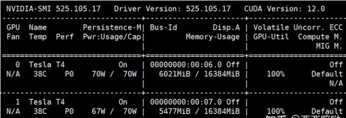

# 图解分布式训练（七）—— accelerate 分布式训练 详细解析

- [图解分布式训练（七）—— accelerate 分布式训练 详细解析](#图解分布式训练七-accelerate-分布式训练-详细解析)
  - [一、为什么需要 accelerate 分布式训练？](#一为什么需要-accelerate-分布式训练)
  - [二、什么是 accelerate 分布式训练?](#二什么是-accelerate-分布式训练)
    - [2.1 accelerate 分布式训练 介绍](#21-accelerate-分布式训练-介绍)
    - [2.2 accelerate 分布式训练 主要优势](#22-accelerate-分布式训练-主要优势)
  - [三、accelerate 分布式训练 原理讲解？](#三accelerate-分布式训练-原理讲解)
    - [3.1 分布式训练](#31-分布式训练)
    - [3.2 加速策略](#32-加速策略)
      - [3.2.1 Pipeline并行](#321-pipeline并行)
      - [3.2.2 数据并行](#322-数据并行)
      - [3.2.3 加速器](#323-加速器)
  - [四、accelerate 分布式训练 如何实践？](#四accelerate-分布式训练-如何实践)
    - [4.1 accelerate 分布式训练 依赖安装](#41-accelerate-分布式训练-依赖安装)
    - [4.2 accelerate 分布式训练 代码实现逻辑](#42-accelerate-分布式训练-代码实现逻辑)
    - [4.3 accelerate 分布式训练 示例代码](#43-accelerate-分布式训练-示例代码)
    - [4.3 accelerate 分布式训练 运行](#43-accelerate-分布式训练-运行)
  - [参考](#参考)

## 一、为什么需要 accelerate 分布式训练？

PyTorch Accelerate 是一个 PyTorch 的加速工具包，旨在简化 PyTorch 训练和推断的开发过程，并提高性能。它是由 Hugging Face、NVIDIA、AWS 和 Microsoft 等公司联合开发的，是一个开源项目。

## 二、什么是 accelerate 分布式训练?

### 2.1 accelerate 分布式训练 介绍

PyTorch Accelerate 提供了一组简单易用的 API，帮助开发者实现模型的分布式训练、混合精度训练、自动调参、数据加载优化和模型优化等功能。它还集成了 PyTorch Lightning 和 TorchElastic，使用户能够轻松地实现高性能和高可扩展性的模型训练和推断。

### 2.2 accelerate 分布式训练 主要优势

PyTorch Accelerate 的主要优势包括：

- 分布式训练：可以在多个 GPU 或多台机器上并行训练模型，从而缩短训练时间和提高模型性能；
- 混合精度训练：可以使用半精度浮点数加速模型训练，从而减少 GPU 内存使用和提高训练速度；
- 自动调参：可以使用 PyTorch Lightning Trainer 来自动调整超参数，从而提高模型性能；
- 数据加载优化：可以使用 DataLoader 和 DataLoaderTransforms 来优化数据加载速度，从而减少训练时间；
- 模型优化：可以使用 Apex 或 TorchScript 等工具来优化模型性能。

## 三、accelerate 分布式训练 原理讲解？

### 3.1 分布式训练

分布式训练是指将一个大型深度学习模型拆分成多个小模型，在不同的计算机上并行训练，最后将结果合并，得到最终的模型。分布式训练可以显著减少模型训练的时间，因为它充分利用了多个计算机的计算资源。同时，由于每个小模型只需要处理部分数据，因此可以使用更大的批次大小，进一步提高训练速度。

### 3.2 加速策略

Accelerate提供了多种加速策略，如pipeline并行、数据并行等。

#### 3.2.1 Pipeline并行

Pipeline并行是指将模型拆分成多个部分，在不同的计算机上并行训练。在每个计算机上，只需要处理模型的一部分，然后将结果传递给下一个计算机。这样可以充分利用多个计算机的计算资源，并且可以使用更大的批次大小，提高训练速度。Pipeline并行的缺点是，由于每个计算机只处理部分数据，因此每个计算机的结果都会有一些误差，最终的结果可能会有一些偏差。

#### 3.2.2 数据并行

数据并行是指将数据拆分成多个部分，在不同的计算机上并行训练。在每个计算机上，都会处理全部的模型，但是每个计算机只处理部分数据。这样可以充分利用多个计算机的计算资源，并且可以使用更大的批次大小，提高训练速度。数据并行的优点是，每个计算机都会处理全部的模型，因此结果更加准确。缺点是，由于每个计算机都需要完整的模型，因此需要更多的计算资源。

#### 3.2.3 加速器

加速器是指用于加速深度学习模型训练的硬件设备，如GPU、TPU等。加速器可以大幅提高模型的训练速度，因为它们可以在更短的时间内完成更多的计算。Accelerate可以自动检测并利用可用的加速器，以进一步提高训练速度。

## 四、accelerate 分布式训练 如何实践？

### 4.1 accelerate 分布式训练 依赖安装

```s
    $ pip install accelerate==0.17.1
```

### 4.2 accelerate 分布式训练 代码实现逻辑

1. 导包

```s
    ...
    from accelerate import Accelerator
    ...
```

2. Trainer 训练类 编写

```s
class Trainer:
    def __init__(self,
                 args,
                 config,
                 model_engine,
                 criterion,
                 optimizer,
                 accelerator):
        ...
        self.accelerator = accelerator
        ...

    def train(self, train_loader, dev_loader=None):
        ...
        for epoch in range(1, self.args.epochs + 1):
            for step, batch_data in enumerate(train_loader):
                self.model_engine.train()
                logits, label = self.on_step(batch_data)
                loss = self.criterion(logits, label)
                self.accelerator.backward(loss)
                self.optimizer.step()
                self.optimizer.zero_grad()
        ...
```

3. main() 函数 编写

```s
def main():
    ...
    # =======================================
    # 定义模型、优化器、损失函数
    ...
    accelerator = Accelerator()
    args.local_rank = int(dist.get_rank())
    print(args.local_rank)
    model_engine, optimizer_engine, train_loader_engine, dev_loader_engine = accelerator.prepare(
        model, optimizer, train_loader, dev_loader
    )

    # =======================================
    # 定义训练器
    trainer = Trainer(args,
                      config,
                      model_engine,
                      criterion,
                      optimizer_engine,
                      accelerator)

    # 训练和验证
    trainer.train(train_loader_engine, dev_loader_engine)

    # 测试
    ...

    # 需要重新初始化引擎
    model_engine, optimizer_engine, train_loader_engine, dev_loader_engine = accelerator.prepare(
        model, optimizer, train_loader, dev_loader
    )
    model_engine.load_state_dict(torch.load(args.ckpt_path))
    report = trainer.test(model_engine, test_loader, labels)
    if args.local_rank == 0:
        print(report)
    # =======================================
```

### 4.3 accelerate 分布式训练 示例代码

```s
import json
import time
import random
import torch
import deepspeed
import torch.nn as nn
import numpy as np
import torch.distributed as dist
from sklearn.metrics import classification_report
from accelerate import Accelerator
from torch.utils.data import DataLoader
from collections import Counter
from transformers import BertForMaskedLM, BertTokenizer, BertForSequenceClassification, BertConfig, AdamW

def set_seed(seed=123):
    """
    设置随机数种子，保证实验可重现
    :param seed:
    :return:
    """
    random.seed(seed)
    torch.manual_seed(seed)
    np.random.seed(seed)
    torch.cuda.manual_seed_all(seed)

def get_data():
    with open("data/train.json", "r", encoding="utf-8") as fp:
        data = fp.read()
    data = json.loads(data)
    return data

def load_data():
    data = get_data()
    return_data = []
    # [(文本， 标签id)]
    for d in data:
        text = d[0]
        label = d[1]
        return_data.append(("".join(text.split(" ")).strip(), label))
    return return_data

class Collate:
    def __init__(self,
                 tokenizer,
                 max_seq_len,
                 ):
        self.tokenizer = tokenizer
        self.max_seq_len = max_seq_len

    def collate_fn(self, batch):
        input_ids_all = []
        token_type_ids_all = []
        attention_mask_all = []
        label_all = []
        for data in batch:
            text = data[0]
            label = data[1]
            inputs = self.tokenizer.encode_plus(text=text,
                                                max_length=self.max_seq_len,
                                                padding="max_length",
                                                truncation="longest_first",
                                                return_attention_mask=True,
                                                return_token_type_ids=True)
            input_ids = inputs["input_ids"]
            token_type_ids = inputs["token_type_ids"]
            attention_mask = inputs["attention_mask"]
            input_ids_all.append(input_ids)
            token_type_ids_all.append(token_type_ids)
            attention_mask_all.append(attention_mask)
            label_all.append(label)

        input_ids_all = torch.tensor(input_ids_all, dtype=torch.long)
        token_type_ids_all = torch.tensor(token_type_ids_all, dtype=torch.long)
        attention_mask_all = torch.tensor(attention_mask_all, dtype=torch.long)
        label_all = torch.tensor(label_all, dtype=torch.long)
        return_data = {
            "input_ids": input_ids_all,
            "attention_mask": attention_mask_all,
            "token_type_ids": token_type_ids_all,
            "label": label_all
        }
        return return_data

class Trainer:
    def __init__(self,
                 args,
                 config,
                 model_engine,
                 criterion,
                 optimizer,
                 accelerator):
        self.args = args
        self.config = config
        self.model_engine = model_engine
        self.criterion = criterion
        self.optimizer = optimizer
        self.accelerator = accelerator

    def on_step(self, batch_data):
        label = batch_data["label"].cuda()
        input_ids = batch_data["input_ids"].cuda()
        token_type_ids = batch_data["token_type_ids"].cuda()
        attention_mask = batch_data["attention_mask"].cuda()
        output = self.model_engine.forward(input_ids=input_ids,
                                           token_type_ids=token_type_ids,
                                           attention_mask=attention_mask,
                                           labels=label)
        logits = output[1]
        return logits, label

    def loss_reduce(self, loss):
        rt = loss.clone()
        dist.all_reduce(rt, op=dist.ReduceOp.SUM)
        rt /= torch.cuda.device_count()
        return rt

    def output_reduce(self, outputs, targets):
        output_gather_list = [torch.zeros_like(outputs) for _ in range(torch.cuda.device_count())]
        # 把每一个GPU的输出聚合起来
        dist.all_gather(output_gather_list, outputs)

        outputs = torch.cat(output_gather_list, dim=0)
        target_gather_list = [torch.zeros_like(targets) for _ in range(torch.cuda.device_count())]
        # 把每一个GPU的输出聚合起来
        dist.all_gather(target_gather_list, targets)
        targets = torch.cat(target_gather_list, dim=0)
        return outputs, targets

    def train(self, train_loader, dev_loader=None):
        gloabl_step = 1
        best_acc = 0.
        if self.args.local_rank == 0:
            start = time.time()
        for epoch in range(1, self.args.epochs + 1):
            for step, batch_data in enumerate(train_loader):
                self.model_engine.train()
                logits, label = self.on_step(batch_data)
                loss = self.criterion(logits, label)
                self.accelerator.backward(loss)
                self.optimizer.step()
                self.optimizer.zero_grad()
                loss = self.loss_reduce(loss)
                if self.args.local_rank == 0:
                    print("【train】 epoch：{}/{} step：{}/{} loss：{:.6f}".format(
                        epoch, self.args.epochs, gloabl_step, self.args.total_step, loss
                    ))
                gloabl_step += 1
                if self.args.dev:
                    if gloabl_step % self.args.eval_step == 0:
                        loss, accuracy = self.dev(dev_loader)
                        if self.args.local_rank == 0:
                            print("【dev】 loss：{:.6f} accuracy：{:.4f}".format(loss, accuracy))
                            if accuracy > best_acc:
                                best_acc = accuracy
                                print("【best accuracy】 {:.4f}".format(best_acc))
                                torch.save(self.model_engine.state_dict(), self.args.ckpt_path)

        if self.args.local_rank == 0:
            end = time.time()
            print("耗时：{}分钟".format((end - start) / 60))
        if not self.args.dev and self.args.local_rank == 0:
            torch.save(self.model_engine.state_dict(), self.args.ckpt_path)

    def dev(self, dev_loader):
        self.model_engine.eval()
        correct_total = 0
        num_total = 0
        loss_total = 0.
        with torch.no_grad():
            for step, batch_data in enumerate(dev_loader):
                logits, label = self.on_step(batch_data)
                loss = self.criterion(logits, label)
                loss = self.loss_reduce(loss)
                logits, label = self.output_reduce(logits, label)
                loss_total += loss
                logits = logits.detach().cpu().numpy()
                label = label.view(-1).detach().cpu().numpy()
                num_total += len(label)
                preds = np.argmax(logits, axis=1).flatten()
                correct_num = (preds == label).sum()
                correct_total += correct_num

        return loss_total, correct_total / num_total

    def test(self, model_engine, test_loader, labels):
        self.model_engine = model_engine
        self.model_engine.eval()
        preds = []
        trues = []
        with torch.no_grad():
            for step, batch_data in enumerate(test_loader):
                logits, label = self.on_step(batch_data)
                logits, label = self.output_reduce(logits, label)
                label = label.view(-1).detach().cpu().numpy().tolist()
                logits = logits.detach().cpu().numpy()
                pred = np.argmax(logits, axis=1).flatten().tolist()
                trues.extend(label)
                preds.extend(pred)
        # print(trues, preds, labels)
        print(np.array(trues).shape, np.array(preds).shape)
        report = classification_report(trues, preds, target_names=labels)
        return report

def build_optimizer(model, args):
    no_decay = ['bias', 'LayerNorm.weight']
    optimizer_grouped_parameters = [
        {'params': [p for n, p in model.named_parameters() if not any(nd in n for nd in no_decay)],
         'weight_decay': args.weight_decay},
        {'params': [p for n, p in model.named_parameters() if any(nd in n for nd in no_decay)],
         'weight_decay': 0.0}
    ]

    # optimizer = AdamW(model.parameters(), lr=learning_rate)
    optimizer = AdamW(optimizer_grouped_parameters, lr=args.learning_rate)
    return optimizer

class Args:
    model_path = "model_hub/chinese-bert-wwm-ext"
    ckpt_path = "output/accelerate/multi-gpu-accelerate-cls.pt"
    max_seq_len = 128
    ratio = 0.92
    epochs = 1
    eval_step = 50
    dev = False
    local_rank = None
    train_batch_size = 32
    dev_batch_size = 32
    weight_decay = 0.01
    learning_rate=3e-5

def main():
    # =======================================
    # 定义相关参数
    set_seed()
    label2id = {
        "其他": 0,
        "喜好": 1,
        "悲伤": 2,
        "厌恶": 3,
        "愤怒": 4,
        "高兴": 5,
    }
    args = Args()
    tokenizer = BertTokenizer.from_pretrained(args.model_path)
    # =======================================

    # =======================================
    # 加载数据集
    data = load_data()
    # 取1万条数据出来
    data = data[:10000]
    random.shuffle(data)
    train_num = int(len(data) * args.ratio)
    train_data = data[:train_num]
    dev_data = data[train_num:]

    collate = Collate(tokenizer, args.max_seq_len)
    train_loader = DataLoader(train_data,
                              batch_size=args.train_batch_size,
                              shuffle=True,
                              num_workers=2,
                              collate_fn=collate.collate_fn)
    total_step = len(train_loader) * args.epochs //  torch.cuda.device_count()
    args.total_step = total_step
    dev_loader = DataLoader(dev_data,
                            batch_size=args.dev_batch_size,
                            shuffle=False,
                            num_workers=2,
                            collate_fn=collate.collate_fn)
    test_loader = dev_loader
    # =======================================

    # =======================================
    # 定义模型、优化器、损失函数
    config = BertConfig.from_pretrained(args.model_path, num_labels=6)
    model = BertForSequenceClassification.from_pretrained(args.model_path, config=config)
    model.cuda()
    criterion = torch.nn.CrossEntropyLoss()
    optimizer = build_optimizer(model, args)

    accelerator = Accelerator()
    args.local_rank = int(dist.get_rank())
    print(args.local_rank)
    model_engine, optimizer_engine, train_loader_engine, dev_loader_engine = accelerator.prepare(
        model, optimizer, train_loader, dev_loader
    )

    # =======================================
    # 定义训练器
    trainer = Trainer(args,
                      config,
                      model_engine,
                      criterion,
                      optimizer_engine,
                      accelerator)

    # 训练和验证
    trainer.train(train_loader_engine, dev_loader_engine)

    # 测试
    labels = list(label2id.keys())
    config = BertConfig.from_pretrained(args.model_path, num_labels=6)
    model = BertForSequenceClassification.from_pretrained(args.model_path, config=config)
    model.cuda()

    # 需要重新初始化引擎
    model_engine, optimizer_engine, train_loader_engine, dev_loader_engine = accelerator.prepare(
        model, optimizer, train_loader, dev_loader
    )
    model_engine.load_state_dict(torch.load(args.ckpt_path))
    report = trainer.test(model_engine, test_loader, labels)
    if args.local_rank == 0:
        print(report)
    # =======================================

if __name__ == '__main__':
    main()
```

### 4.3 accelerate 分布式训练 运行

- 方式一：

```s
    $ accelerate launch multi-gpu-accelerate-cls.py
```

- 方式二：

```s
    $ python -m torch.distributed.launch --nproc_per_node 2 --use_env multi-gpu-accelerate-cls.py
```

> 运行效果
```s
【train】 epoch：1/1 step：1/144 loss：1.795169
【train】 epoch：1/1 step：2/144 loss：1.744665
【train】 epoch：1/1 step：3/144 loss：1.631625
【train】 epoch：1/1 step：4/144 loss：1.543691
【train】 epoch：1/1 step：5/144 loss：1.788955
```

> GPU 使用情况


## 参考

1. 一文搞定分布式训练：dataparallel、distirbuted、deepspeed、accelerate、transformers、horovod： https://zhuanlan.zhihu.com/p/628022953
2. GitHub - huggingface/accelerate: A simple way to train and use PyTorch models with multi-GPU, TPU, mixed-precision：https://github.com/huggingface/accelerate


