# 大模型（LLMs）分布式训练面

- [大模型（LLMs）分布式训练面](#大模型llms分布式训练面)
  - [1. 理论篇](#1-理论篇)
    - [1.1 训练 大语言模型 存在问题？](#11-训练-大语言模型-存在问题)
    - [1.2 什么是 点对点通信？](#12-什么是-点对点通信)
    - [1.3 什么是 集体通信？](#13-什么是-集体通信)
    - [1.4 什么是 数据并行？](#14-什么是-数据并行)
    - [1.5 数据并行 如何 提升效率？](#15-数据并行-如何-提升效率)
    - [1.6 什么是 流水线并行？](#16-什么是-流水线并行)
    - [1.7 什么是 张量并行 (intra-layer)？](#17-什么是-张量并行-intra-layer)
    - [1.8 数据并行 vs 张量并行 vs 流水线并行?](#18-数据并行-vs-张量并行-vs-流水线并行)
    - [1.9 什么是 3D并行？](#19-什么是-3d并行)
    - [1.10 想要训练1个LLM，如果只想用1张显卡，那么对显卡的要求是什么？](#110-想要训练1个llm如果只想用1张显卡那么对显卡的要求是什么)
    - [1.11 如果有N张显存足够大的显卡，怎么加速训练？](#111-如果有n张显存足够大的显卡怎么加速训练)
    - [1.12 如果显卡的显存不够装下一个完整的模型呢？](#112-如果显卡的显存不够装下一个完整的模型呢)
    - [1.13 PP推理时，是一个串行的过程，1个GPU计算，其他空闲，有没有其他方式？](#113-pp推理时是一个串行的过程1个gpu计算其他空闲有没有其他方式)
    - [1.14 3种并行方式可以叠加吗？](#114-3种并行方式可以叠加吗)
    - [1.15 Colossal-AI 有1D/2D/2.5D/3D，是什么情况？](#115-colossal-ai-有1d2d25d3d是什么情况)
    - [1.16 除了3D并行有没有其他方式大规模训练？](#116-除了3d并行有没有其他方式大规模训练)
    - [1.17 有了ZeRO系列，为什么还需要3D并行？](#117-有了zero系列为什么还需要3d并行)
    - [1.18 平民适不适合玩3D并行？](#118-平民适不适合玩3d并行)
    - [1.19 平民适不适合直接上多机多卡的ZeRO3（万兆网）？](#119-平民适不适合直接上多机多卡的zero3万兆网)
    - [1.20 分布式并行及显存优化技术并行技术有哪一些，都有什么特点？](#120-分布式并行及显存优化技术并行技术有哪一些都有什么特点)
    - [1.21 显存优化技术有哪一些，都有什么特点？](#121-显存优化技术有哪一些都有什么特点)
    - [1.22 常见的分布式训练框架哪一些，都有什么特点？](#122-常见的分布式训练框架哪一些都有什么特点)
  - [2. 实践篇](#2-实践篇)
    - [2.1 假如有超多的8卡A100节点（DGX A100），如何应用3D并行策略？](#21-假如有超多的8卡a100节点dgx-a100如何应用3d并行策略)
    - [2.2 如果想构这样一个大规模并行训练系统，训练框架如何选？](#22-如果想构这样一个大规模并行训练系统训练框架如何选)
    - [2.3 训练框架如何选？](#23-训练框架如何选)
  - [3. 并行化策略选择篇](#3-并行化策略选择篇)
    - [3.1 如何选择一款分布式训练框架？](#31-如何选择一款分布式训练框架)
    - [3.2 如何选择一款分布式训练框架？](#32-如何选择一款分布式训练框架)
    - [3.3 单GPU](#33-单gpu)
    - [3.4 单节点多卡](#34-单节点多卡)
    - [3.5 多节点多卡](#35-多节点多卡)
  - [4. 问题篇](#4-问题篇)
    - [4.1 推理速度验证](#41-推理速度验证)
    - [4.2 并行化训练加速](#42-并行化训练加速)
    - [4.3 deepspeed 训练过程，报找不主机](#43-deepspeed-训练过程报找不主机)
    - [4.4 为什么 多机训练效率不如单机？](#44-为什么-多机训练效率不如单机)
    - [4.5 多机训练不通，DeepSPeed配置问题](#45-多机训练不通deepspeed配置问题)
  - [总结](#总结)

## 1. 理论篇

### 1.1 训练 大语言模型 存在问题？

- **显存效率:模型参数量太大，显存不够用**

> 即使目前显存最大的GPU也放不下这些大模型的模型参数。例如:175B参数量的GPT3模型参数需要占用700GB (175B*4bytes) 的显存。参数梯度是700GB,Adam优化器状态需要1400GB，共计需要2.8TB的显存。

- **计算效率:训练数据量多，模型参数量大，计算量大，单机训练时间久**

> 即使我们能将大模型放在一张GPU上，训练大模型需要的海量计算操作需要耗费很长时间。例如:用英伟达A100显卡训练175B参数量的GPT3模型大约需要288年。

### 1.2 什么是 点对点通信？

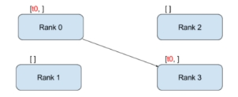

- 点对点通信 思路:一个进程发送数据，一个进程接收数据
- 优点：速度快，成本低

### 1.3 什么是 集体通信？

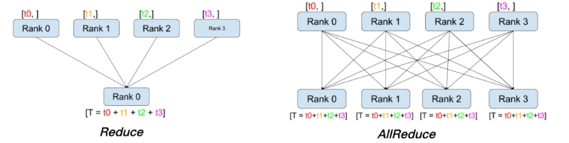

- 集体通信思路:多个进程发送数据，多个进程接收数据。
- 缺点：速度慢，成本高

### 1.4 什么是 数据并行？

- 介绍：将整个数据集切分为多份，每张GPU分配到不同的数据进行训练，每个进程都有一个完整的模型副本。

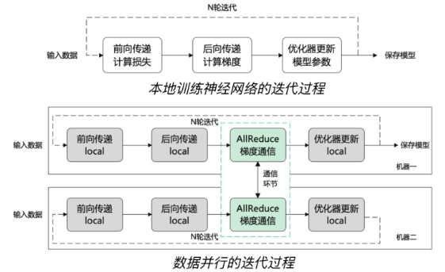

- 关键：保证多个GPU上的模型副本是相同的

1. 确保所有worker都从相同的初始化模型参数开始训练。在训练开始前，通常会将0号卡的1模型参数通信同步到其他卡。
2. 每次训练选代中，在后向传递之后，优化器更新参数之前，插入reduce通信操作来规约梯度，确保所有worker上的梯度都是相同的。

通过以上两点，在优化器更新后，也可以保证所有worker上的模型参数是相同的。

**相同的初始化模型参数 + 相同的梯度 --> 相同的模型参数。**

### 1.5 数据并行 如何 提升效率？

1. 梯度分桶:动机是集体通信在大张量上比在小张量上效率更高。
2. 2.计算与通信重叠:有了梯度分桶之后，在等待同一个桶内的梯度计算完后，就可以进行通信操作
3. 3.跳过梯度同步: 梯度累加，减少梯度通信的频次。

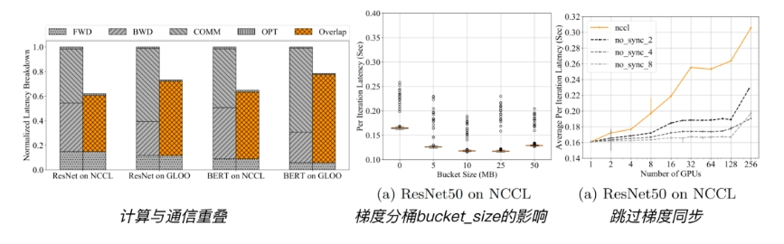

### 1.6 什么是 流水线并行？

1. 层间划分，将不同的层划分到不同的GPU上
2. 前3层在0号卡上，后3层在1号卡上

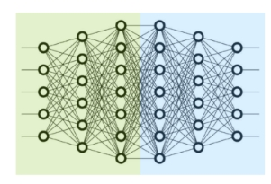

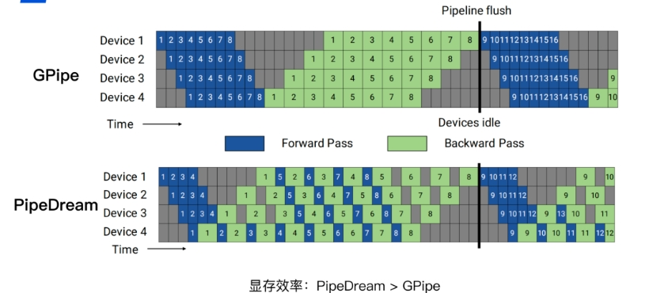

### 1.7 什么是 张量并行 (intra-layer)？

- 层内划分，切分一个独立的层划分到不同的GPU上
- 0号卡和1号卡分别计算某个层的不同部分

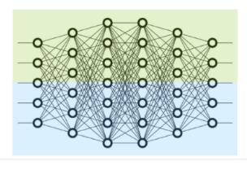

对于一个简单的矩阵乘法GEMMs Y =XA

按照对权重矩阵A的分块方式，张量并行分为行并行和列并行.

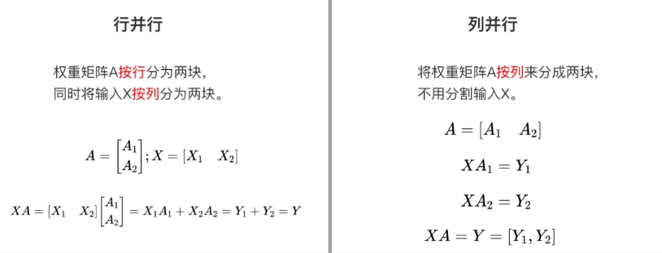

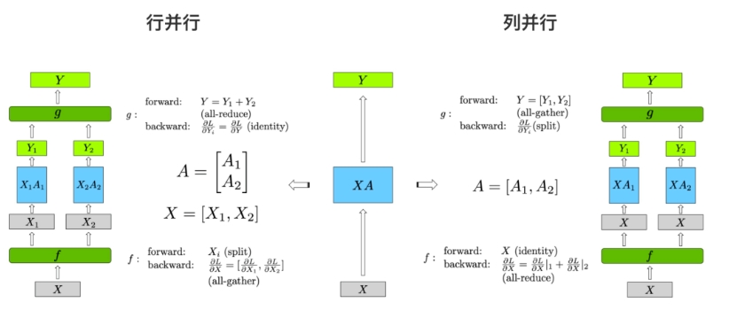

### 1.8 数据并行 vs 张量并行 vs 流水线并行?

- 数据并行:计算效率高、实现简单。
  - 显存效率:每张卡上都保存了完整的模型、梯度、优化器状态，因此显存效率不高
  - 计算效率:当增加并行度时，单卡的计算量是保持恒定的，可以实现近乎完美的线性扩展。但规约梯度的通信开销，与模型大小成正相关。
- 张量并行:因模型结构而异，实现难度大。
  - 显存效率:随着并行度增加，成比例地减少显存占用。是减少单层神经网络中间激活的唯一方法
  - 计算效率:频繁的通信，限制了两个通信阶段之间的计算量，影响了计算效率，计算效率很低。
- 流水线并行:通信成本最低
  - 显存效率:减少的显存与流水线并行度成正比。但流水线并行不会减少每层中间激活的显存占用
  - 计算效率:成本更低的点对点(P2P)通信。通信量与流水线各个阶段边界的激活值大小成正比。

> 显存效率:模型并行>流水线并行>数据并行
> 通信效率:流水线并行>数据并行>模型并行

### 1.9 什么是 3D并行？

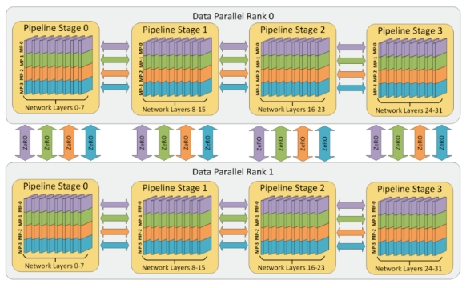

3D并行。4路张量并行，4路流水线并行，2路数据并行。共32个workers。

### 1.10 想要训练1个LLM，如果只想用1张显卡，那么对显卡的要求是什么？

显卡显存足够大，nB模型微调一般最好准备**20nGB以上的显存**。

### 1.11 如果有N张显存足够大的显卡，怎么加速训练？

**数据并行（DP）**，充分利用多张显卡的算力。

### 1.12 如果显卡的显存不够装下一个完整的模型呢？

最直观想法，需要**分层加载，把不同的层加载到不同的GPU上**（accelerate的device_map）

也就是常见的PP，流水线并行。

### 1.13 PP推理时，是一个串行的过程，1个GPU计算，其他空闲，有没有其他方式？

- **横向切分：流水线并行（PP）**，也就是分层加载到不同的显卡上。
- **纵向切分：张量并行（TP）**，在 [DeepSpeed](https://www.deepspeed.ai) 世界里叫模型并行（MP）

### 1.14 3种并行方式可以叠加吗？

是可以的，**DP+TP+PP**，这就是3D并行。**如果真有1个超大模型需要预训练，3D并行那是必不可少的**。毕竟显卡进化的比较慢，最大显存的也就是A100 80g。

单卡80g，可以完整加载小于40B的模型，但是训练时+梯度+优化器状态，5B模型就是上限了，更别说activation的参数也要占显存，batch size还得大。而现在100亿以下（10B以下）的LLM只能叫small LLM。

### 1.15 Colossal-AI 有1D/2D/2.5D/3D，是什么情况？

[Colossal-AI](https://github.com/hpcaitech/ColossalAI) 的nD是针对张量并行，指的是TP的切分，对于矩阵各种切，和3D并行不是一回事。

### 1.16 除了3D并行有没有其他方式大规模训练？

可以使用更优化的数据并行算法FSDP（类似ZeRO3）或者直接使用 [DeepSpeed ZeRO](https://arxiv.org/pdf/1910.02054.pdf) 。

### 1.17 有了ZeRO系列，为什么还需要3D并行？

根据ZeRO论文，尽管张量并行的显存更省一点，张量并行的通信量实在太高，只能限于节点内（有NVLINK）。如果节点间张量并行，显卡的利用率会低到5%

但是，根据Megatron-LM2的论文，当显卡数量增加到千量级，ZeRO3是明显不如3D并行的。

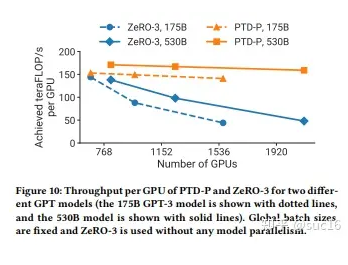

### 1.18 平民适不适合玩3D并行？

不适合。

**3D并行的基础是，节点内显卡间NVLINK超高速连接才能上TP。有没有NVLINK都是个问题**。

而且，节点间特殊的网络通常有400Gb/s？远超普通IDC内的万兆网络10Gb/s。

### 1.19 平民适不适合直接上多机多卡的ZeRO3（万兆网）？

不适合。

想象一下，当65B模型用Zero3，每一个step的每一张卡上需要的通信量是195GB（3倍参数量），也就是1560Gb。万兆网下每步也要156s的通信时间，这画面太美。

### 1.20 分布式并行及显存优化技术并行技术有哪一些，都有什么特点？

分布式并行及显存优化技术并行技术：

- 数据并行（如：PyTorch DDP）
- 模型/张量并行（如：Megatron-LM（1D）、Colossal-AI（2D、2.5D、3D））
- 流水线并行（如：GPipe、PipeDream、PipeDream-2BW、PipeDream Flush（1F1B））
- 多维混合并行（如：3D并行（数据并行、模型并行、流水线并行））
- 自动并行（如：Alpa（自动算子内/算子间并行））
- 优化器相关的并行（如：ZeRO（零冗余优化器，在执行的逻辑上是数据并行，但可以达到模型并行的显存优化效果）、PyTorch FSDP）

### 1.21 显存优化技术有哪一些，都有什么特点？

显存优化技术：

- 重计算(Recomputation)：Activation checkpointing(Gradient checkpointing)，本质上是一种用时间换空间的策略。
- 卸载（Offload）技术：一种用通信换显存的方法，简单来说就是让模型参数、激活值等在CPU内存和GPU显存之间左右横跳。如：ZeRO-Offload、ZeRO-Infinity等。
- 混合精度（BF16/FP16）：降低训练显存的消耗，还能将训练速度提升2-4倍。 
  - BF16 计算时可避免计算溢出，出现Inf case。
  - FP16 在输入数据超过65506 时，计算结果溢出，出现Inf case。

### 1.22 常见的分布式训练框架哪一些，都有什么特点？

- 第一类：深度学习框架自带的分布式训练功能。如：TensorFlow、PyTorch、MindSpore、Oneflow、PaddlePaddle等。
- 第二类：基于现有的深度学习框架（如：PyTorch、Flax）进行扩展和优化，从而进行分布式训练。如：Megatron-LM（张量并行）、DeepSpeed（Zero-DP）、Colossal-AI（高维模型并行，如2D、2.5D、3D）、Alpa（自动并行）等

## 2. 实践篇

### 2.1 假如有超多的8卡A100节点（DGX A100），如何应用3D并行策略？

- 首先，**张量并行**。3种并行方式里，张量并行（TP）对于GPU之间的通信要求最高，而节点内有NVLINK通信速度可以达到600GB/s。
- 其次，**流水线并行**，每个节点负责一部分层，每35个节点组成一路完整的流水线，也就是一个完整的模型副本，这里一个模型副本需280卡。
- 最后，**数据并行**，官方也做了8路，10路，12路的并行实验，分别使用280个节点，350个节点和420个节点。

> 参考 [Megatron-Turing NLG 530B](https://www.microsoft.com/en-us/research/blog/using-deepspeed-and-megatron-to-train-megatron-turing-nlg-530b-the-worlds-largest-and-most-powerful-generative-language-model/)

集群规模越大，单个GPU利用率越低。

### 2.2 如果想构这样一个大规模并行训练系统，训练框架如何选？

可以参考Megatron-Turing NLG 530B，NVIDIA Megatron-LM + Microsoft DeepSpeed

[BLOOM](https://arxiv.org/pdf/2211.05100.pdf) **则是PP+DP用DeepSpeed，TP用Megatron-LM**

当然还有一些其他的训练框架，在超大规模下或许也能work。

### 2.3 训练框架如何选？

下面这个图是bloom的一个实验，DP/TP/PP都能降显存，核心是要降到单卡峰值80g以下。

真大模型就是要TP=8，充分利用NVLINK，然后优先PP，最后DP。

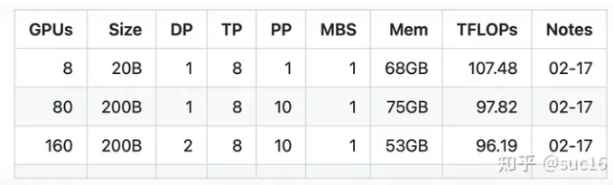

然而假大模型（7B）比如LLaMA-7B，可以不用3D并行，直接用DeepSpeed ZeRO更方便，参考open-llama项目。

## 3. 并行化策略选择篇

### 3.1 如何选择一款分布式训练框架？

- 训练成本：不同的训练工具，训练同样的大模型，成本是不一样的。对于大模型，训练一次动辄上百万/千万美元的费用。合适的成本始终是正确的选择。
- 训练类型：是否支持数据并行、张量并行、流水线并行、多维混合并行、自动并行等
- 效率：将普通模型训练代码变为分布式训练所需编写代码的行数，我们希望越少越好。
- 灵活性：你选择的框架是否可以跨不同平台使用？

### 3.2 如何选择一款分布式训练框架？

- TPU + XLA + TensorFlow/JAX ：由Google主导，由于TPU和自家云平台GCP深度绑定。
- GPU + PyTorch + Megatron-LM + DeepSpeed ：由NVIDIA、Meta、MicroSoft大厂加持，社区氛围活跃，也更受到大家欢迎。

### 3.3 单GPU

- 显存够用： 直接用
- 显存不够：上offload，用cpu

### 3.4 单节点多卡

- 显存够用（模型能装进单卡）：DDP或ZeRO
- 显存不够：TP或者ZeRO或者PP

> 重点：没有NVLINK或者NVSwitch，也就是穷人模式，要用PP

### 3.5 多节点多卡

如果节点间通信速度快（穷人的万兆网肯定不算）

**ZeRO或者3D并行，其中3D并行通信量少但是对模型改动大**。

如果节点间通信慢，但显存又少。

DP+PP+TP+ZeRO-1

## 4. 问题篇

### 4.1 推理速度验证

ChatGML在V100单卡的推理耗时大约高出A800单卡推理的40%。

ChatGML推理耗时和问题输出答案的字数关系比较大，答案字数500字以内，A800上大概是每100字，耗时1秒，V100上大概是每100字，耗时1.4秒。

1. ChatGML在A800单卡推理耗时统计

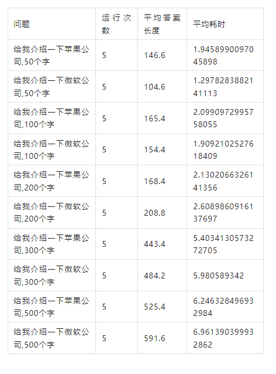

2. ChatGML在V100单卡推理耗时统计

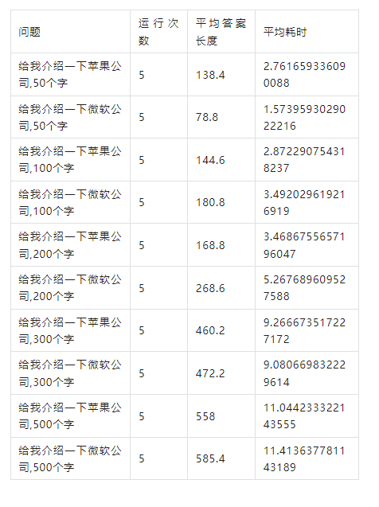

- 结论：
  - 训练效率方面: 多机多卡训练，增加训练机器可以线性缩短训练时间。
  - 推理性能方面:
    - ChatGML在V100单卡的推理耗时大约高出A800单卡推理的40%。
    - ChatGML推理耗时和问题输出答案的字数关系比较大，答案字数500字以内，A800上大概是每100字，耗时1秒，V100上大概是每100字，耗时1.4秒。

### 4.2 并行化训练加速

可采用deepspeed进行训练加速，目前行业开源的大模型很多都是采用的基于deepspeed框架加速来进行模型训练的。如何进行deepspeed训练，可以参考基于[deepspeed构建大模型分布式训练平台](http://mp.weixin.qq.com/s?__biz=MzkzNTEzNzA3NA==&mid=2247484328&idx=1&sn=97d4729a832c0a11b36ccfa0b89c4162&chksm=c2b3d9f5f5c450e313ccd690a569637f1a8b674b3cb77c0c4c36f6cf16b9f68afbcc58f56b61&scene=21#wechat_redirect)。

deepspeed在深度学习模型软件体系架构中所处的位置：‍

DL model—>train opitimization(deepspeed)—>train framework —> train instruction (cloud)—>GPU device

当然需要对比验证deepspeed 的不同参数，选择合适的参数。分别对比stage 2,3进行验证，在GPU显存够的情况下，最终使用stage 2。

### 4.3 deepspeed 训练过程，报找不主机

解决方法：deepspeed的关联的多机的配置文件，Hostfile 配置中使用ip，不使用hostname

### 4.4 为什么 多机训练效率不如单机？

多机训练可以跑起来，但是在多机上模型训练的速度比单机上还慢。

通过查看服务器相关监控，发现是网络带宽打满，上不去了，其他系统监控基本正常。原理初始的多机之间的网络带宽是64Gps，后面把多机之间的网络带宽调整为800Gps，问题解决。

实验验证，多机训练的效率，和使用的机器数成线性关系，每台机器的配置一样，如一台GPU机器跑一个epoch需要2小时，4台GPU机器跑一个epoch需要半小时。除了训练速度符合需求，多机训练模型的loss下降趋势和单机模型训练的趋势基本一致，也符合预期。

### 4.5 多机训练不通，DeepSPeed配置问题

多机间NCCL 不能打通

- 解决方法：

新建 .deepspeed_env 文件，写入如下内容

```s
NCCL_IB_DISABLE=1
NCCL_DEBUG=INFO
NCCL_SOCKET_IFNAME=eth0
NCCL_P2P_DISABLE=1
```

## 总结

如果没有NVLINK和节点间还是万兆网的穷人，TP别想了，DP也勉强（显存不够），主要靠PP，再试试ZeRO1

> 参考链接：Model Parallelism: https://huggingface.co/docs/transformers/v4.17.0/en/parallelism
