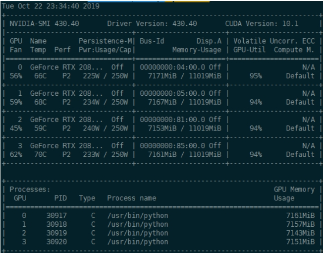
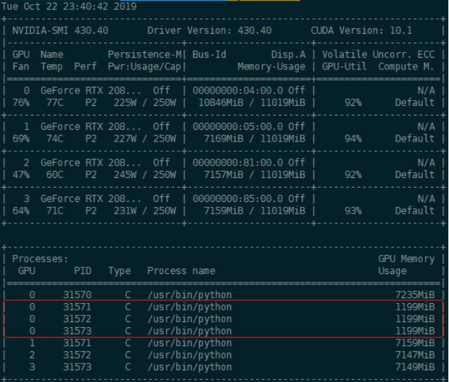

# pytorch 分布式计算 坑/bug 梳理篇

- [pytorch 分布式计算 坑/bug 梳理篇](#pytorch-分布式计算-坑bug-梳理篇)
  - [动机](#动机)
  - [一、使用 DistributedDataParallel（分布式并行）时，显存分布不均衡问题](#一使用-distributeddataparallel分布式并行时显存分布不均衡问题)
  - [二、如果是用pytorch实现同步梯度更新，自研 数据接口，出现 第一个epoch结尾处程序卡死问题](#二如果是用pytorch实现同步梯度更新自研-数据接口出现-第一个epoch结尾处程序卡死问题)
  - [三、在微调大模型的时候，单机2卡的时候正常训练，但是采用4卡及其以上，就会卡住，卡在读完数据和开始训练之间？](#三在微调大模型的时候单机2卡的时候正常训练但是采用4卡及其以上就会卡住卡在读完数据和开始训练之间)

## 动机

pytorch用的人越来越多，大的模型都需要用gpu或者多张gpu甚至多节点多卡进行分布式计算，但是坑也很多，本文主要 介绍 读者 在 进行 pytorch 分布式计算 所遇到的 坑/bug 的 梳理 及 填坑记录。

## 一、使用 DistributedDataParallel（分布式并行）时，显存分布不均衡问题

- 问题描述：

如果用 DistributedDataParallel （分布式并行）的时候，每个进程单独跑在一个 GPU 上，多个卡的显存占用用该是均匀的，比如像这样的：



> 注：在 Distributed 模式下，相当于你的代码分别在多个 GPU 上独立的运行，代码都是设备无关的。比如你写 t = torch.zeros(100, 100).cuda()，在4个进程上运行的程序会分别在4个 GPUs 上初始化 t。所以显存的占用会是均匀的。

然而，有时会发现另外几个进程会在0卡上占一部分显存，导致0卡显存出现瓶颈，可能会导致cuda-out-of-memory 错误。比如这样的：



- 问题定位：

该问题主要由 以下代码导致：

```s
    checkpoint = torch.load("checkpoint.pth")
    model.load_state_dict(checkpoint["state_dict"])
```

> 注：上述代码运行后，程序 load 一个 pretrained model 的时候，torch.load() 会默认**把load进来的数据放到0卡上，这样4个进程全部会在0卡占用一部分显存**。

- 解决方法：

把load进来的数据map到cpu上：

```s
    checkpoint = torch.load("checkpoint.pth", map_location=torch.device('cpu'))
    model.load_state_dict(checkpoint["state_dict"])
```

## 二、如果是用pytorch实现同步梯度更新，自研 数据接口，出现 第一个epoch结尾处程序卡死问题

如果是用pytorch实现同步梯度更新，然后数据接口是自己写的话一定要注意保证每张卡分配的batch数是一样的。因为如果某张卡少了一个batch的话，其他卡就会等待，从而程序卡在torch.all_reduce()上。最后的情况就会出现在第一个epoch结尾处程序卡住，而且没有报错信息。

## 三、在微调大模型的时候，单机2卡的时候正常训练，但是采用4卡及其以上，就会卡住，卡在读完数据和开始训练之间？

先确认几张卡都能正常使用和通信，然后看看是不是batchsize分配之类的问题导致无限等待某一张卡了。再就是只留4条数据，每张卡只跑一条数据试试看。

