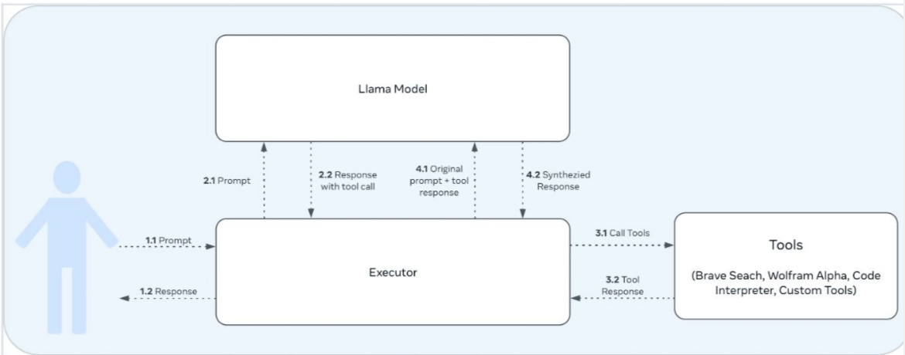
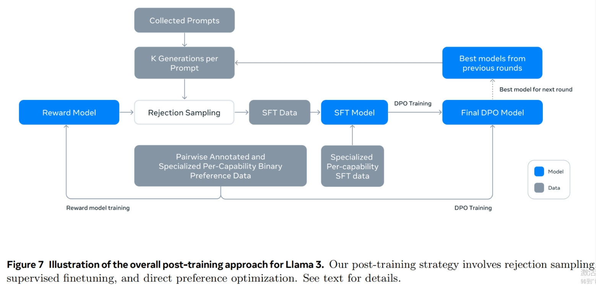
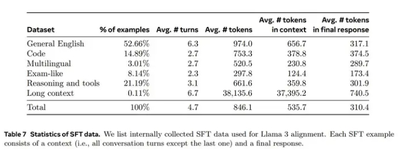
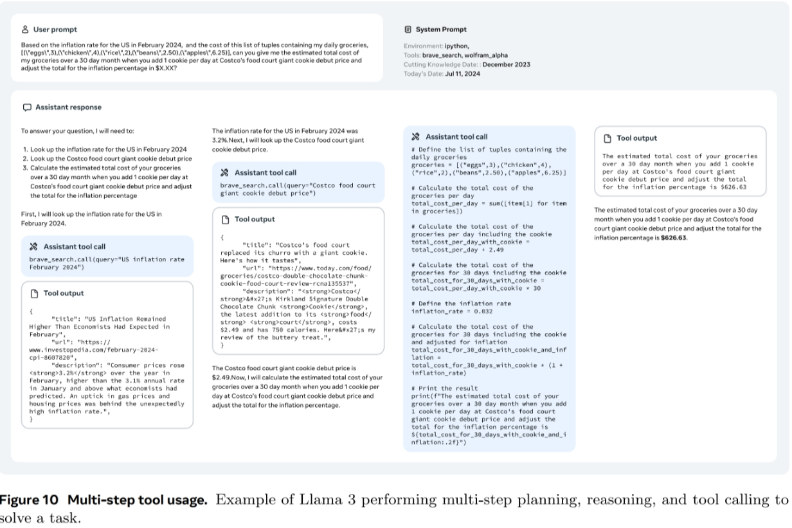
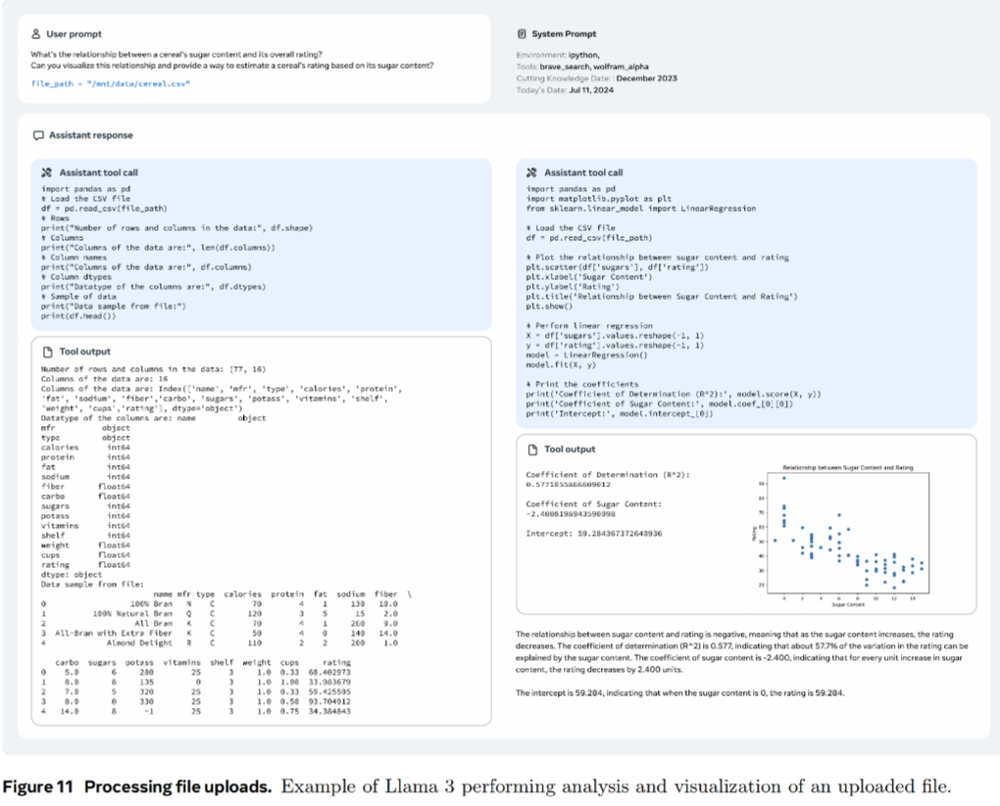
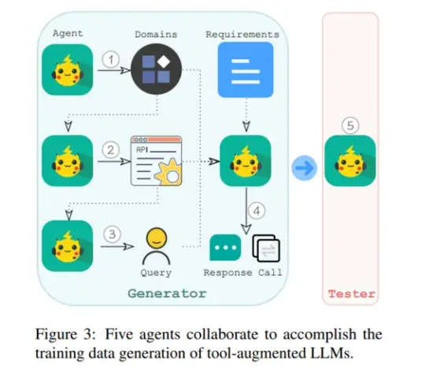
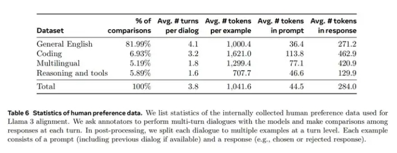
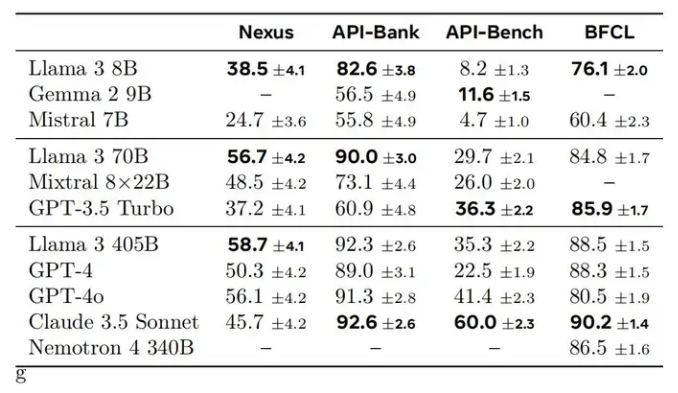
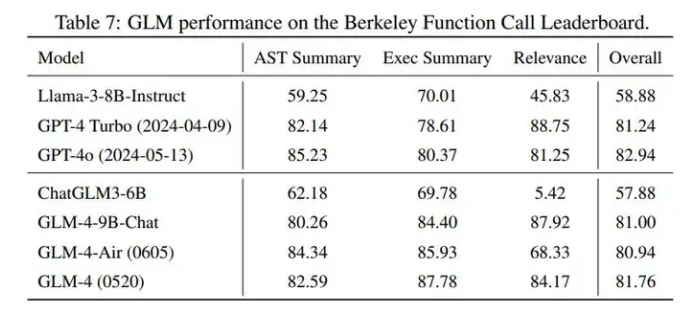

# 开源模型 Function Call 篇

- [开源模型 Function Call 篇](#开源模型-function-call-篇)
  - [开源模型 Function Call 方案有哪些？](#开源模型-function-call-方案有哪些)
    - [Llama 3.1](#llama-31)
      - [对话协议（Chat Protocal）](#对话协议chat-protocal)
      - [Tool Call Template 样式](#tool-call-template-样式)
      - [样式1：Json based tool calling](#样式1json-based-tool-calling)
      - [样式2：Built in Python based tool calling](#样式2built-in-python-based-tool-calling)
      - [工具调用相关的训练](#工具调用相关的训练)
        - [SFT 相关训练](#sft-相关训练)
        - [数据](#数据)
          - [single-step tool use 数据](#single-step-tool-use-数据)
          - [Multi-step tool use 数据](#multi-step-tool-use-数据)
          - [File uploads 数据](#file-uploads-数据)
        - [DPO 相关训练](#dpo-相关训练)
      - [其他](#其他)
    - [Mistral Large 2](#mistral-large-2)
      - [关注点：](#关注点)
    - [glm-4-9b-chat](#glm-4-9b-chat)
      - [效果如下](#效果如下)
      - [其他](#其他-1)
    - [Qwen 2](#qwen-2)
  - [致谢](#致谢)

## 开源模型 Function Call 方案有哪些？

开源模型 Function Calling 包括采用的 chat template，function call 训练方案等。涉及模型 LlaMa 3.1， Mistral Large 2，glm-4-9b-chat，Qwen 2。

### Llama 3.1

> 推荐官方指南：https://llama.meta.com/docs/model-cards-and-prompt-formats/llama3_1/

#### 对话协议（Chat Protocal）

Llama 3.1 中采用了以下 special tokens 来辅助多轮对话和工具的调用。

- <|begin_of_text|>: 指定 prompt 的开始
- <|end_of_text|>: 模型将停止生成更多的tokens。此token仅由基础模型生成。
- <|start_header_id|> 和 <|end_header_id|>: 这些tokens封闭特定消息的角色。可能的角色包括: [system, user, assistant, and ipython]
- <|eom_id|>: end of message。表示消息结束，提示模型接下来可能需要调用工具。这用于模型与任何可用工具之间的多步骤交互。当在系统提示中使用Environment: ipython指令时，或者如果模型调用内置工具时，会发出此token。
- <|eot_id|>: End of turn。表示模型已经确定它已完成与用户消息的互动，有两种情况会使用：
  - 在模型与用户之间的直接互动结束时
  - 在模型与任何可用工具之间的多次互动结束时
- <|python_tag|>: 是模型响应中用来表示工具调用的特殊标签。

在对话过程中，llama 3.1 支持了 4 中角色：

[system, assistant, user, ipython] 其中 ipython 的角色与 gpt 中的 tool 类似，用来标记调用 tool 后生成的结果。

#### Tool Call Template 样式

根据 [Llama 的这个技术报告](https://arxiv.org/pdf/2407.21783) 来看，llama 3 工具调用能力，是在 post training 的时候加上去的。大致的使用 tool 流程和 GPT 的 tool call 差不多，如下：



#### 样式1：Json based tool calling

以下用一个例子展示 llama 3.1 tool call 时候的格式，假设用户与agent有了以下对话：

```s
tool_call = {"name": "get_current_temperature", "arguments": {"location": "Paris, France"}}
​
messages = [
  {"role": "system", "content": "You are a bot that responds to weather queries."},
  {"role": "user", "content": "Hey, what's the temperature in Paris right now?"},
  {"role": "assistant", "tool_calls": [{"type": "function", "function": tool_call}]},
  {"role": "tool", "name": "get_current_temperature", "content": "22.0"}
]
```

那么使用 huggingface 提供的 function call 示例进行计算：

```s
model_path = "/models/Meta-Llama-3.1-70B-Instruct"
tokenizer = AutoTokenizer.from_pretrained(model_path, trust_remote_code=True)
inputs = tokenizer.apply_chat_template(messages, 
                                       tools=[get_current_temperature],
                                       add_generation_prompt=True, 
                                       tokenize=False,
                                       tools_in_user_message=False)
```

可以得到 inputs 为：

```s
<|begin_of_text|><|start_header_id|>system<|end_header_id|>
​
Environment: ipython
Cutting Knowledge Date: December 2023
Today Date: 26 Jul 2024
​
You have access to the following functions. To call a function, please respond with JSON for a function call.Respond in the format {"name": function name, "parameters": dictionary of argument name and its value}.Do not use variables.
​
{
    "type": "function",
    "function": {
        "name": "get_current_temperature",
        "description": "Get the current temperature at a location.",
        "parameters": {
            "type": "object",
            "properties": {
                "location": {
                    "type": "string",
                    "description": "The location to get the temperature for, in the format \"City, Country\""
                }
            },
            "required": [
                "location"
            ]
        },
        "return": {
            "type": "number",
            "description": "The current temperature at the specified location in the specified units, as a float."
        }
    }
}
​
You are a bot that responds to weather queries.<|eot_id|>
<|start_header_id|>user<|end_header_id|>
​
Hey, what's the temperature in Paris right now?<|eot_id|>
<|start_header_id|>assistant<|end_header_id|>
​
{"name": "get_current_temperature", "parameters": {"location": "Paris, France"}}<|eot_id|>
<|start_header_id|>ipython<|end_header_id|>
​
"22.0"<|eot_id|>
<|start_header_id|>assistant<|end_header_id|>
```

- 关注点：
  - 为了方便阅读，以上 prompt 中添加了一些换行符。
  - llama 3.1 70B instruct 提供的模板中，可以选择将 function 信息放在用户的输入中，或者放在 system prompt 中。
  - 工具调用结果通过 <|start_header_id|>ipython<|end_header_id|> 标记。
  - 在 llama 3.1 的官方文档中还记录了一种 User-defined Custom tool calling 的方法，但是没有在 llama3.1 70B instruct 的 jinja chat template 中找到对应的功能，可能官方还没更新 jinja template？

> 更具体的多轮对话 prompt 可以参考 llama 3.1-70b-instruct 的 jinja chat template。

#### 样式2：Built in Python based tool calling

官方自带支持 brave_search, wolfram_alpha, 和 code interpreter 三种工具，使用这三种工具时，tokenizer 的处理方式与 json based tool calling 不太一样。具体是要在 system prompt 中加上

```s
Environment: ipython
Tools: brave_search, wolfram_alpha
```

同时模型要调用工具时，会生成 <|python_tag|>wolfram_alpha.call(query="solve x^3 - 4x^2 + 6x - 24 = 0")<|eom_id|> 类似的样式，而非原先的 json 格式：

```s
<|begin_of_text|><|start_header_id|>system<|end_header_id|>
​
Environment: ipython
Tools: brave_search, wolfram_alpha
​
Cutting Knowledge Date: December 2023
Today Date: 23 Jul 2024
​
You are a helpful assistant.<|eot_id|><|start_header_id|>user<|end_header_id|>
​
​
Can you help me solve this equation: x^3 - 4x^2 + 6x - 24 = 0<|eot_id|>
<|start_header_id|>assistant<|end_header_id|>
​
<|python_tag|>wolfram_alpha.call(query="solve x^3 - 4x^2 + 6x - 24 = 0")<|eom_id|>
<|start_header_id|>ipython<|end_header_id|>
​
{"queryresult": {"success": true, "inputstring": "solve x^3 - 4x^2 + 6x - 24 = 0", "pods": [{"title": "Input interpretation", "subpods": [{"title": "", "plaintext": "solve x^3 - 4 x^2 + 6 x - 24 = 0"}]}, {"title": "Results", "primary": true, "subpods": [{"title": "", "plaintext": "x = 4"}, {"title": "", "plaintext": "x = \u00b1 (i sqrt(6))"}]}, ... ]}}<|eot_id|>
<|start_header_id|>assistant<|end_header_id|>         
          
```

#### 工具调用相关的训练

The Llama 3 Herd of Models 中提到工具调用是在 post training 部分加上去的，包括了多组的 SFT + DPO 训练。



##### SFT 相关训练

Learning rate 1e-5，训练 9K steps。SFT 的训练集中，有 21.9% 的数据是用于推理和工具使用的:



##### 数据

参考 llama 3 herd of model 中对 SFT Tool 数据集的描述：

- 标注员只对 assistant 信息进行排名打分（通常模型对当前问题的推理能力越强，打分越高），不对tool message 进行排名打分。
- 不采用 rejection sampling，因为 llama 团队没有在后期的 tool 测评中观察到它带来的收益。

为了加快标注过程，llama 团队首先通过在之前的Llama 3 checkpoint 生成的合成数据上进行微调来引导基本的工具使用能力。因此，标注员需要进行的编辑较少。同样地，随着Llama 3 在训练过程中逐渐改进，llama 逐步复杂化人类标注协议：从标注单轮 tool use 的对话数据开始，逐步过渡到标注对话中包含了 tool use 的数据，最后到标注对话中包含了多步 tool use 以及数据分析的训练数据。

llama 团队采用了以下方法来构造 Synthetic Tool datasets

###### single-step tool use 数据

参考上文中提到的标注方案，llama 团队先构造了该数据集，并对模型进行单论 tool use 训练。构造步骤：

1. 通过 few-shot，用模型生成用户 prompt。该 prompt 必须涉及到调用 1 个 llama 的核心工具（core tools）。
2. 通过 few-shot，和 step 1 中的 prompt，生成对应的 tool call 回答（包括调用工具名称，对应参数）。
3. 执行 step 2 中的工具和参数，得到对应的 tool output。
4. 让模型基于 用户prompt，tool call，tool output，生成最终回复。

因此整个数据集包括了：system prompt， user prompt, tool call, tool output 和 final answer。在获得数据集后，llama 还过滤了约 30% 的数据集，以去除无法执行工具或有其他格式问题的数据。

根据 llama 报告中介绍 core tools 包括 brave_search, wolfram_alpha, and code interpreter 等 python 对象。

###### Multi-step tool use 数据

Multi-step 与 single step 的 tool use 数据生成方式相似：

1. 通过 few-shot，用模型生成用户 prompt。该 prompt 必须是一个需要使用多个 tool 来获得答案的任务（这些 tool 不一定得从 core tool 中选）。
2. 基于 step 1 的 prompt，让 llama 3 生成包含了推理步骤和对应 tool call 信息的数据，具体可以看下图：



###### File uploads 数据

File Uploads 数据参考下图训练数据示例。prompt 都是基于某个文件进行提问，问题包括总结，查找 bug，优化某个部分，数据分析等操作。



除此外，llama 在 system prompt 中进行了调试，让模型能够只在激活了 tool call 的情况下去调用共外部工具。

llama 团队采用了以下方法来构造 Zero-shot tool use data （与 function calling 类似）

- Single, nested, and parallel function calling: 个人理解是 llama 基于 the Stack 的开源数据进行筛选/修改，构造了 function call 信息，而后用 llama 3 基于 function call 信息，生成对应的用户 query。
- Multi-turn function calling: 采用了 API-Bank: A Comprehensive Benchmark for Tool-Augmented LLMs 中的方法生成数据。Llama 采用了 5 个 agent 如下图：
  - 第一个 agent 用于生成不同的领域，如医疗保险，健身等。
  - 第二个 agent，根据领域数据，生成潜在的 API。值得注意的是，在这一阶段，为了确保模拟 API 的真实性，我们在代理输入中加入了来自公共 API 的示例。
  - 第三个 agent 从模拟 API 中随机选择一个或多个 API。此外，它还选择了我们设计原则中概述的一种能力。然后使用这些信息创建一个匹配所选能力的 query 问题，这个 query 问题可以通过调用所选 API 来完成回答。
  - 第四个 agent 将领域、API、能力和 query 作为输入。这个agent 需要通过模拟的方式调用选择的 API，然后根据API 结果生成 response。
  - 最后，我们引入了第五个 agent，作为测试者。该agent自动验证生成的数据是否符合我们的设计原则（实际上它丢弃了 35% 的实例）

所有的 agent 都是通过简单的 prompt + llama 3 实现。



##### DPO 相关训练

Llama 发现 PPO 没有 DPO 好，于是只用了 DPO，preference data 中，有 5.89% 是和 reasoning 还有 tool 相关的。



> 效果

Llama 的工具调用能力还是不错的：



#### 其他

更多关于 llama 3.1 tool 和 reasoning 的细节，推荐查看 The Llama 3 Herd of Models。

### Mistral Large 2
Mistral Large 也是采用了额外的 special token 来辅助 function call 的处理。

比如对于以下对话内容：

```s
messages = [ 
    {"role": "user", "content": "What's the weather like in Paris?"},
    {"role": "assistant", "content": "","tool_calls": [
        {"type": "function","id":'D681PevKs',"function": 
            {"name": "get_current_weather", "arguments": {"location": "Paris, France", "format": "celsius"}}
            }]},
    {"role":"tool", "name":"get_current_weather", "content":"20", "tool_call_id":'D681PevKs'}
    ]
```

经过 mistral large 2 的 tokenizer 处理：

```s
def get_current_weather(location: str, format: str):
    """
    Get the current weather
​
    Args:
        location: The city and state, e.g. San Francisco, CA
        format: The temperature unit to use. Infer this from the users location. (choices: ["celsius", "fahrenheit"])
    """
    pass
model_path = "/home/kevin/models/Mistral-Large-Instruct-2407"
​
tokenizer = AutoTokenizer.from_pretrained(model_path, 
                                          
                                          trust_remote_code=True,
                                          )
​
inputs = tokenizer.apply_chat_template(messages, 
                                       tokenize=False,
                                       tools = [get_current_weather],
                                       add_generation_prompt=True)
```

输入 input 如下：

```s
<s>[AVAILABLE_TOOLS] [
{
    "type": "function",
    "function": {
        "name": "get_current_weather",
        "description": "Get the current weather",
        "parameters": {
            "type": "object",
            "properties": {
                "location": {
                    "type": "string",
                    "description": "The city and state, e.g. San Francisco, CA"
                },
                "format": {
                    "type": "string",
                    "enum": [
                        "celsius",
                        "fahrenheit"
                    ],
                    "description": "The temperature unit to use. Infer this from the users location."
                }
            },
            "required": [
                "location",
                "format"
            ]
        }
    }
}
]
[/AVAILABLE_TOOLS]
[INST] What's the weather like in Paris?[/INST]
[TOOL_CALLS] 
[
    {
        "name": "get_current_weather",
        "arguments": {
            "location": "Paris, France",
            "format": "celsius"
        },
        "id": "D681PevKs"
    }
]
</s>
[TOOL_RESULTS] {"content": 20, "call_id": "D681PevKs"}[/TOOL_RESULTS]
```

#### 关注点：

- 为了方便展示观看，以上 inputs 进行了必要的格式化。
- function 的信息是统一放在了system prompt 的地方。
- 用了 [TOOL_CALLS], [TOOL_RESULTS] 等额外 token 来辅助 function calling。

具体的 mistral large 2 Chat Template 如下：

```s

    
    

    


    


​

    {%- if (message["role"] == "user") != (loop.index0 % 2 == 0) %}
        {{- raise_exception("After the optional system message, conversation roles must alternate user/assistant/user/assistant/...") }}
    

​
{{- bos_token }}

    
        
            {{- "[AVAILABLE_TOOLS] [" }}
            
        
        {{- '{"type": "function", "function": {' }}
        
            
            {{- '"' + key + '": "' + val + '"' }}
            
            {{- '"' + key + '": ' + val|tojson }}
            
            
            {{- ", " }}
            
        
        {{- "}}" }}
                
                    {{- ", " }}
                
                    {{- "]" }}
                
            
            {{- "[/AVAILABLE_TOOLS]" }}
            
        
            {{- "[INST] " + system_message + "\n\n" + message["content"] + "[/INST]" }}
        
            {{- "[INST] " + message["content"] + "[/INST]" }}
        
    
        
            
        
            
        
        {{- "[TOOL_CALLS] [" }}
        
            
            {{- out[:-1] }}
            
                {{- raise_exception("Tool call IDs should be alphanumeric strings with length 9!") }}
            
            {{- ', "id": "' + tool_call.id + '"}' }}
            
                {{- ", " }}
            
                {{- "]" + eos_token }}
            
        
    
        {{- " " + message["content"] + eos_token}}
    
        
            
        
            
        
        {{- '[TOOL_RESULTS] {"content": ' + content|string + ", " }}
        
            {{- raise_exception("Tool call IDs should be alphanumeric strings with length 9!") }}
        
        {{- '"call_id": "' + message.tool_call_id + '"}[/TOOL_RESULTS]' }}
    
        {{- raise_exception("Only user and assistant roles are supported, with the exception of an initial optional system message!") }}
    

```

### glm-4-9b-chat

参考以下内容整理

> Github： https://github.com/THUDM/GLM-4/tree/main
> 
> 技术报告：https://arxiv.org/pdf/2406.12793

GLM 中的特殊 token 有:

```s
["<|endoftext|>", "[MASK]", "[gMASK]", "[sMASK]", "<sop>", "<eop>", "<|system|>",
                               "<|user|>", "<|assistant|>", "<|observation|>", "<|begin_of_image|>", "<|end_of_image|>",
                               "<|begin_of_video|>", "<|end_of_video|>"]
```

其中 <|observation|> 用来标记工具的执行结果。

GLM 使用的 chat template 如下：

```s
[gMASK]<sop><|system|>
你是一个名为 GLM-4 的人工智能助手。你是基于智谱AI训练的语言模型 GLM-4 模型开发的，你的任务是针对用户的问题和要求提供适当的答复和支持。
​
# 可用工具
​
## {{ tool['function']['name'] }}
​
{{ tool['function'] | tojson(indent=4) }}
在调用上述函数时，请使用 Json 格式表示调用的参数。
​
## python
​
当你向 `python` 发送包含 Python 代码的消息时，该代码将会在一个有状态的 Jupyter notebook 环境中执行。
`python` 返回代码执行的输出，或在执行 60 秒后返回超时。
`/mnt/data` 将会持久化存储你的文件。在此会话中，`python` 无法访问互联网。不要使用 `python` 进行任何网络请求或者在线 API 调用，这些在线内容的访问将不会成功。
​
## simple_browser
​
你可以使用 `simple_browser` 工具。该工具支持以下函数：
`search(query: str, recency_days: int)`：使用搜索引擎进行查询并显示结果，可以使用 `recency_days` 参数控制搜索内容的时效性。
`mclick(ids: list[int])`：获取一系列指定 id 的页面内容。每次调用时，须选择3-10个页面。选择多个角度的页面，同时尽可能选择可信任的信息来源。考虑到部分页面是无法加载的，你也可以多打开一些可能有用的页面而不用担心内容过多。
`open_url(url: str)`：打开指定的 URL。
​
使用 `【{引用 id}†{引用文本}】` 来引用内容。
​
操作步骤：1. 使用 `search` 来获得信息列表; 2. 使用 `mclick` 来获取指定 ID 页面的内容; 3. 根据获得的内容进行回复。在回复中应当引用信息来源。
 如果用户提供了 URL，也可以用 `open_url` 直接打开页面。
如果初次搜索结果没有找到合适的信息，也可以再次使用 `search` 进行搜索。
​
## cogview
​
如果用户的请求中包含了对图像的描述，你可以使用 `cogview` 来生成图像并展示给用户。你需要向 `cogview` 发送图像描述，规则：
- 发送给 `cogview` 的消息必须使用英语。用户的中文描述必须完全翻译为英语。
- 应当尽可能详细地描述图像生成的需求，需求描述约 100 英文单词。
- 保持用户原始描述的意图。不要虚构内容或者没见过的人物。
- 如无特殊说明，所在地为中国，持有中国立场并遵循中国社会主义价值观。<|{{ item['role'] }}|>{{ item['metadata'] }}
{{ item['content'] }}<|assistant|>
```

通过以下对话内容进行示例：

```s
messages = [
    {
      "role": "system",
      "content": "",
      "tools": [
        {
          "type": "function",
          "function": {
            "name": "get_recommended_books",
            "description": "Get recommended books based on user's interests",
            "parameters": {
              "type": "object",
              "properties": {
                "interests": {
                  "type": "array",
                  "items": {
                    "type": "string"
                  },
                  "description": "The interests to recommend books for"
                }
              },
              "required": [
                "interests"
              ]
            }
          }
        }
      ]
    },
    {
      "role": "user",
      "content": "Hi, I am looking for some book recommendations. I am interested in history and science fiction."
    },
    {
      "role": "assistant",
      "content": "{\"name\": \"get_recommended_books\", \"arguments\": {\"interests\": [\"history\", \"science fiction\"]}}"
    },
    {
      "role": "observation",
      "content": "{\"books\": [\"Sapiens: A Brief History of Humankind by Yuval Noah Harari\", \"A Brief History of Time by Stephen Hawking\", \"Dune by Frank Herbert\", \"The Martian by Andy Weir\"]}"
    },
    {
      "role": "assistant",
      "content": "Based on your interests in history and science fiction, I would recommend the following books: \"Sapiens: A Brief History of Humankind\" by Yuval Noah Harari, \"A Brief History of Time\" by Stephen Hawking, \"Dune\" by Frank Herbert, and \"The Martian\" by Andy Weir."
    }
  ]
```

那么，对应的 input 就会是：

```s
tokenizer = AutoTokenizer.from_pretrained("/home/kevin/models/glm-4-9b-chat", trust_remote_code=True)
​
inputs = tokenizer.apply_chat_template(messages, 
                                       tokenize=False)
​
# inputs =
"""
[gMASK]<sop><|system|>
你是一个名为 GLM-4 的人工智能助手。你是基于智谱AI训练的语言模型 GLM-4 模型开发的，你的任务是针对用户的问题和要求提供适当的答复和支持。
​
# 可用工具
## get_recommended_books
​
{
    "name": "get_recommended_books",
    "description": "Get recommended books based on user's interests",
    "parameters": {
        "type": "object",
        "properties": {
            "interests": {
                "type": "array",
                "items": {
                    "type": "string"
                },
                "description": "The interests to recommend books for"
            }
        },
        "required": [
            "interests"
        ]
    }
}
在调用上述函数时，请使用 Json 格式表示调用的参数。<|user|>
Hi, I am looking for some book recommendations. I am interested in history and science fiction.<|assistant|>
{"name": "get_recommended_books", "arguments": {"interests": ["history", "science fiction"]}}<|observation|>
{"books": ["Sapiens: A Brief History of Humankind by Yuval Noah Harari", "A Brief History of Time by Stephen Hawking", "Dune by Frank Herbert", "The Martian by Andy Weir"]}<|assistant|>
Based on your interests in history and science fiction, I would recommend the following books: "Sapiens: A Brief History of Humankind" by Yuval Noah Harari, "A Brief History of Time" by Stephen Hawking, "Dune" by Frank Herbert, and "The Martian" by Andy Weir.
"""
​
```

#### 效果如下

GLM function call 能力（[Berkeley function-calling leaderboard](https://gorilla.cs.berkeley.edu/leaderboard.html)）：



#### 其他

GLM 公开的信息还是挺少的，官方 github 及 官方技术报告 都没有找到一些 function call 训练细节。

### Qwen 2

参考 Qwen2 的这个文档：

> https://qwen.readthedocs.io/zh-cn/latest/framework/function_call.html

Qwen2 instruct 的 chat template 如下：

```s
{{ '<|im_start|>system
You are a helpful assistant.<|im_end|>
' }}{{'<|im_start|>' + message['role'] + '
' + message['content'] + '<|im_end|>' + '
'}}{{ '<|im_start|>assistant
' }}
```

可以看到，chat template 中是没有 tool 相关的 special token 的。因此 Qwen 2 的 function calling 功能需要依靠 Qwen-Agent 来实现。参考 Qwen-Agent 的 BaseFnCallModel 实现（github link），当用 Qwen2 官方示例的 function call 方式时，function 的信息会被添加到 system prompt 中：

```s
def _prepend_fncall_system(
        self,
        messages: List[Message],
        functions: List[Dict],
        lang: Literal['en', 'zh'],
        parallel_function_calls: bool = False,
    ) -> List[Message]:
        tool_desc_template = FN_CALL_TEMPLATE[lang + ('_parallel' if parallel_function_calls else '')]
        tool_descs = '\n\n'.join(get_function_description(function, lang=lang) for function in functions)
        tool_names = ','.join(function.get('name', function.get('name_for_model', '')) for function in functions)
        tool_system = tool_desc_template.format(tool_descs=tool_descs, tool_names=tool_names)
​
        assert messages[0].role == SYSTEM
        messages = copy.deepcopy(messages[:1]) + messages[1:]
        if isinstance(messages[0].content, str):
            messages[0].content += '\n\n' + tool_system
        else:
            messages[0].content.append(ContentItem(text='\n\n' + tool_system))
​
        return messages
```

添加 function call 的模板有中文和英文模板，也有并行调用和非并行调用模板，具体可以在 [Qwen-Agent 代码](https://github.com/QwenLM/Qwen-Agent/blob/main/qwen_agent/llm/function_calling.py#L33)中查看，以下是一个中文模板示例：

```s
"""# 工具
​
## 你拥有如下工具：
​
{tool_descs}
​
## 你可以在回复中插入零次、一次或多次以下命令以调用工具：
​
✿FUNCTION✿: 工具名称，必须是[{tool_names}]之一。
✿ARGS✿: 工具输入
✿RESULT✿: 工具结果
✿RETURN✿: 根据工具结果进行回复，需将图片用渲染出来"""
```

在得到模型输出之后，通过 Qwen-Agent 中的 [_postprocess_fncall_message](https://github.com/QwenLM/Qwen-Agent/blob/main/qwen_agent/llm/function_calling.py#L252) 来抽取对应的结构化数据。


Qwen 初代的 function call 采用的 react 的思路，当时模型有在额外的工具调用数据集上专门对 function call 进行训练。Qwen 2 Qwen2 Technical Report， blog 中虽然没有提到 function call 实现细节，但个人猜测也是经过了额外的 function call 能力训练。

## 致谢

- 开源模型 Function Call 方案梳理 https://zhuanlan.zhihu.com/p/713937194