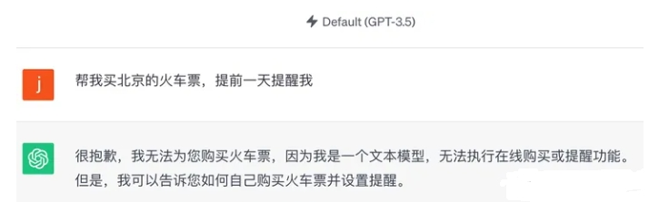
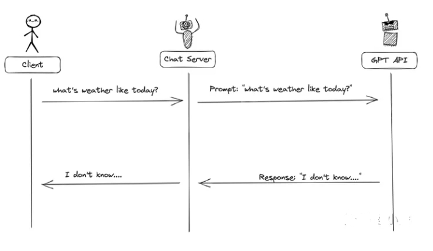
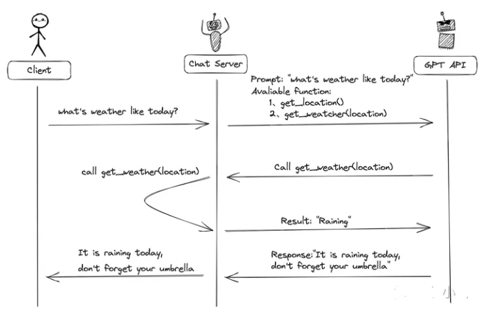
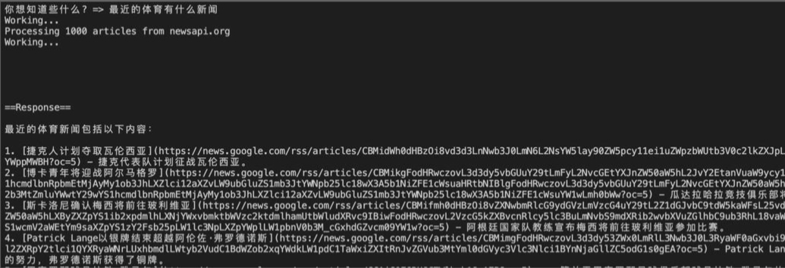

# 函数调用 Function Call 篇

- [函数调用 Function Call 篇](#函数调用-function-call-篇)
  - [一、为什么需要 函数调用(function call)？](#一为什么需要-函数调用function-call)
  - [二、什么是 函数调用(function call)？](#二什么是-函数调用function-call)
  - [三、函数调用(function-call)目的是什么？](#三函数调用function-call目的是什么)
  - [四、怎么样使用函数调用？](#四怎么样使用函数调用)
  - [五、如何使用API完成函数调用？](#五如何使用api完成函数调用)
    - [5.1 如何使用 函数调用(function-call) 构建 新闻机器人？](#51-如何使用-函数调用function-call-构建-新闻机器人)
  - [致谢](#致谢)

## 一、为什么需要 函数调用(function call)？

> 模拟一个场景：你创建一个人工智能助手，你可以这样对他说：“帮我买北京的火车票，提前一天提醒我”！如果是ChatGPT的话，它必然会无情地拒绝你。



ChatGPT是世界上最强大的模型，不过，它虽然知道你想让它帮你买票，但它却不懂如何买票，它能力的上限就摆在那儿了。好在OpenAI在GPT模型引入了一个强大的功能--函数调用(function call)。

相信有些小伙伴应该已经用过ChatGPT的plugins功能，Plugins的功能有不少是基于function call进行的

今天，我们一起来创建一个获取最新新闻的GPT，给大家展示如何使用function call，用于深入理解函数调用的概念以及它给我们带来的可能性。

## 二、什么是 函数调用(function call)？

**函数调用(function call)**是OpenAIGPT-4-0613和GPT-3.5 Turbo-0613模型支持的功能，这两个模型经过训练，**可以根据用户的提示检测需不需要调用用户提供的函数，并且用一个很规范的结构返回，而不是直接返回常规的文本**。

函数调用(function)允许ChatGPT和其他的系统进行信息的交互，让ChatGPT回答他们原本无法回答的问题。例如，我们需要查询实时的天气，这些数据是ChatGPT没有的，所以ChatGPT需要从别的平台获取最新的天气情况。换句话就是说，**函数调用，就是提供了一种方式，教AI模型怎么样和外面的系统进行交互**。

## 三、函数调用(function-call)目的是什么？

函数调用，可以用来增强GPT模型的功能，让GPT能做到更多事情。其实还有两种方式可以增强GPT模型的能力。

- **微调**: 提供标注数据进一步训练模型，不过微调需要很多时间和精力准备训练数据。
- **嵌入**：构建机器人知识库，通过构建上下文和知识库的内容进行关联，从而让GPT获得更丰富的回答。

函数调用是第三种扩展GPT功能的方式，这种方式和其他两种不一样，它可以让我们和外部的系统进行交互！

## 四、怎么样使用函数调用？

在没有函数调用(funciton-call)时候，我们调用GPT构建AI应用的模式非常简单。主要有几个步骤：

1. 用户(client)发请求给我们的服务(chat server)；
2. 我们的服务(chat server)给GPT提示词；
3. 重复执行；



有了函数调用(function-call)，调用的方式就比之前的复杂一些了，具体的步骤：

1. 发送用户的提示词以及可以调用的函数；
2. GPT模型根据用户的提示词，判断是用普通文本还是函数调用的格式响应；
3. 如果是函数调用格式，那么Chat Server就会执行这个函数，并且将结果返回给GPT；
4. 然后模型使用提供的数据，用连贯的文本响应。



## 五、如何使用API完成函数调用？

在调用GPT接口时，我们一般使用的是Completions接口，这个接口发送的是POST请求，发送的数据格式如下图所示：

```s
{
  "model": "gpt-3.5-turbo",
  "messages": [
    {
      "role": "user",
      "content": "What's weather like today?"
    }
  ]
}
```

GPT返回的可能是下面这些内容:

```s
{
  "id": "chatcmpl-FWVo3hYwjrpAptzepU46JamvvgBzb",
  "object": "chat.completion",
  "created": 1687983115,
  "model": "gpt-3.5-turbo-0613",
  "choices": [
    {
      "index": 0,
      "message": {
        "role": "assistant",
        "content": "I'm sorry, but I don't have access to real-time information, including current weather conditions or forecasts. To find out the weather for your location today, I recommend using a weather website, app, or a voice-activated assistant like Siri, Google Assistant, or Alexa. Simply ask one of these services for the weather in your area, and they should be able to provide you with up-to-date information."
      },
      "finish_reason": "stop"
    }
  ],
  "usage": {
    "prompt_tokens": 15,
    "completion_tokens": 44,
    "total_tokens": 59
  }
}
```

在这里，为了记录上下文，我们需要在每个请求上，将整个消息历史记录返回给 API。例如，如果我们想继续讨论之前的问题，那么相应的 JSON 应该将是：

```s
{
  "model": "gpt-3.5-turbo",
  "messages": [
    {
      "role": "user",
      "content": "How many planets does the solar system have?"
    },
    {
      "role": "assistant",
      "content": "I'm sorry, but I don't have access to real-time information, including current weather conditions or forecasts. To find out the weather for your location today, I recommend using a weather website, app, or a voice-activated assistant like Siri, Google Assistant, or Alexa. Simply ask one of these services for the weather in your area, and they should be able to provide you with up-to-date information."
    {
      "role": "user",
      "content": "how do I access these apps?"
    }
  ]
}
```

在上面的例子中，我们明确知道了，ChatGPT查不了实时信息，接下来，我们会加上function call，让ChatGPT可以查询实时信息。

```s
{
  "model": "gpt-3.5-turbo-0613",
  "messages": [
    {
      "role": "user",
      "content": "How is the weather in NYC?"
    }
  ],
  "functions": [
    {
      "name": "get_current_weather",
      "description": "Get the current weather in a given location",
      "parameters": {
        "type": "object",
        "properties": {
          "location": {
            "type": "string",
            "description": "The city and state, e.g. San Francisco, CA"
          },
          "unit": {
            "type": "string",
            "enum": [
              "celsius",
              "fahrenheit"
            ]
          }
        },
        "required": [
          "location"
        ]
      }
    }
  ]
}
```

当GPT模型决定调用我们提供的函数，那么我们就会收到下面类似的返回

```s
{
  "id": "chatcmpl-7WWG94C1DCFlAk5xmUwrZ9OOhFnOq",
  "object": "chat.completion",
  "created": 1687984857,
  "model": "gpt-3.5-turbo-0613",
  "choices": [
    {
      "index": 0,
      "message": {
        "role": "assistant",
        "content": null,
        "function_call": {
          "name": "get_current_weather",
          "arguments": "{\n  \"location\": \"New York, NY\"\n}"
        }
      },
      "finish_reason": "function_call"
    }
  ],
  "usage": {
    "prompt_tokens": 81,
    "completion_tokens": 19,
    "total_tokens": 100
  }
}
```

get_current_weather将会使用返回的参数调用。OpenAI不执行该函数，我们的服务会执行这个函数，并且获取结果后解析返回给OpenAI。

一旦我们检索到天气数据，我们就会使用一种名为 的新的角色将其发送回模型function。例如：

```s
{
    "model":"gpt-3.5-turbo-0613",
    "messages":[
        {
            "role":"user",
            "content":"How is the weather in NYC?"
        },
        {
            "role":"assistant",
            "content":null,
            "function_call":{
                "name":"get_current_weather",
                "arguments":"{\n  \"location\": \"New York, NY\"\n}"
            }
        },
        {
            "role":"function",
            "name":"get_current_weather",
            "content":"Temperature: 57F, Condition: Raining"
        }
    ],
    "functions":[
        {
            "name":"get_current_weather",
            "description":"Get the current weather in a given location",
            "parameters":{
                "type":"object",
                "properties":{
                    "location":{
                        "type":"string",
                        "description":"The city and state, e.g. San Francisco, CA"
                    },
                    "unit":{
                        "type":"string",
                        "enum":[
                            "celsius",
                            "fahrenheit"
                        ]
                    }
                },
                "required":[
                    "location"
                ]
            }
        }
    ]
}
```

这里注意下，我们将整个消息历史记录传递给了 API，包括原始提示词、模型的函数调用以及代码中执行天气函数的结果，这种方式可以让模型能够理解调用函数的上下文。

最后，模型可能会回复一个格式正确的答案，回答我们最初的问题：

```s
{
  "id": "chatcmpl-7WWQUccvLUfjhbIcuvFrj2MDJVEiN",
  "object": "chat.completion",
  "created": 1687985498,
  "model": "gpt-3.5-turbo-0613",
  "choices": [
    {
      "index": 0,
      "message": {
        "role": "assistant",
        "content": "The weather in New York City is currently raining with a temperature of 57 degrees Fahrenheit."
      },
      "finish_reason": "stop"
    }
  ],
  "usage": {
    "prompt_tokens": 119,
    "completion_tokens": 19,
    "total_tokens": 138
  }
}
```

以上，就是Function Call在调用过程中交互数据的格式，接下来，我们使用实际的例子，使用python开发function call的简单应用。

### 5.1 如何使用 函数调用(function-call) 构建 新闻机器人？

为了实现这个功能，我们需要OpenAI 的key，key的获取可以在https://platform.openai.com/account/api-keys， 获取key之后，我们需要安装一些python依赖包

```s
    $ pip install openai tiktoken
```

我们需要导入一些依赖库

```s
import openai
import tiktoken
import json
import os
import requests
```

接下来，将定义几个常量：

- 指定 GPT 模型。我们将使用gpt-3.5-turbo-16k
- 我们预设的提示词。
- 用于对字符串和消息中的标记进行计数的编码；需要确保我们不超过语言模型的限制。
- 调用的函数的最大数量
- openai.api_key 从openai平台获取的key
- zsxq_cookie 知识星球的cookie

```s
llm_model = "gpt-3.5-turbo-16k"
llm_max_tokens = 15500
llm_system_prompt = "You are an assistant that provides news and headlines to user requests. Always try to get the lastest breaking stories using the available function calls."
encoding_model_messages = "gpt-3.5-turbo-0613"
encoding_model_strings = "cl100k_base"
function_call_limit = 3
openai.api_key = "sk-xxx" # 需要设置
zsxq_cookie="zsxq_access_token=xxx" # 需要设置
news_key = "" # 新闻key
```

所有 GPT模型都有token限制。如果超过此限制，API 将抛出错误而不是响应我们的请求。因此，我们需要一个函数来计算token的数量。

```s
def num_tokens_from_messages(messages):
    """Returns the number of tokens used by a list of messages."""
    try:
        encoding = tiktoken.encoding_for_model(encoding_model_messages)
    except KeyError:
        encoding = tiktoken.get_encoding(encoding_model_strings)

    num_tokens = 0
    for message in messages:
        num_tokens += 4
        for key, value in message.items():
            num_tokens += len(encoding.encode(str(value)))
            if key == "name":
                num_tokens += -1
    num_tokens += 2
    return num_tokens
```

现在我们需要有一个函数来获取新闻，我们可以在https://newsapi.org/获取查询新闻的KEY

```s
def get_top_headlines(query: str = None, country: str = None, category: str = None):
    """Retrieve top headlines from newsapi.org (API key required)"""

    base_url = "https://newsapi.org/v2/top-headlines"
    headers = {
        "x-api-key": news_key
    }
    params = { "category": "general" }
    if query is not None:
        params['q'] = query
    if country is not None:
        params['country'] = country
    if category is not None:
        params['category'] = category

    # Fetch from newsapi.org - reference: https://newsapi.org/docs/endpoints/top-headlines
    response = requests.get(base_url, params=params, headers=headers)
    data = response.json()

    if data['status'] == 'ok':
        print(f"Processing {data['totalResults']} articles from newsapi.org")
        return json.dumps(data['articles'])
    else:
        print("Request failed with message:", data['message'])
        return 'No articles found'
```

为了让GPT模型知道我们存在get_top_headlines函数可以调用，我们需要用JSON结构描述我们的函数

```s
signature_get_top_headlines = {
    "name": "get_top_headlines",
    "description": "获取按国家和/或类别分类的头条新闻。",
    "parameters": {
        "type": "object",
        "properties": {
            "query": {
                "type": "string",
                "description": "自由输入关键词或短语进行搜索。",
            },
            "country": {
                "type": "string",
                "description": "要获取头条新闻的国家的2位ISO 3166-1代码。",
            },
            "category": {
                "type": "string",
                "description": "要获取头条新闻的类别",
                "enum": ["business","entertainment","general","health","science","sports","technology"]
            }
        },
        "required": [],
    }
}
```

接下来，我们将定义complete函数，执行和GPT大模型交互的任务，主要步骤为：

1. 在消息末尾添加系统提示。这个用于添加消息的上下文
2. 如果token总数超过模型的限制，则删除旧消息。
3. 将请求发送到 GPT API。
4. 从列表末尾删除系统消息

```s
def complete(messages, function_call: str = "auto"):
    """Fetch completion from OpenAI's GPT"""

    messages.append({"role": "system", "content": llm_system_prompt})

    # delete older completions to keep conversation under token limit
    while num_tokens_from_messages(messages) >= llm_max_tokens:
        messages.pop(0)

    print('Working...')
    res = openai.ChatCompletion.create(
        model=llm_model,
        messages=messages,
        functions=[signature_get_top_headlines, signature_get_zsxq_article],
        function_call=function_call
    )
    
    # remove system message and append response from the LLM
    messages.pop(-1)
    response = res["choices"][0]["message"]
    messages.append(response)

    # call functions requested by the model
    if response.get("function_call"):
        function_name = response["function_call"]["name"]
        if function_name == "get_top_headlines":
            args = json.loads(response["function_call"]["arguments"])
            headlines = get_top_headlines(
                query=args.get("query"),
                country=args.get("country"),
                category=args.get("category")        
            )
            messages.append({ "role": "function", "name": "get_top_headline", "content": headlines})
        elif function_name == "get_zsxq_article":
            args = json.loads(response["function_call"]["arguments"])
            headlines = get_zsxq_article(query=args.get("query"))
            messages.append({ "role": "function", "name": "get_top_headline", "content": headlines})
```

最后，我们添加一个Run函数，循环接受我们的请求发送给GPT API

```s
def run():
    print("\n你好，我是你的小助手，你有什么问题都可以问我噢～")
    print("你可以这样问我:\n - 告诉我最近有什么技术发现？\n - 最近的体育有什么新闻\n - 知识星球最近有什么精彩内容\n")

    messages = []
    while True:
        prompt = input("\n你想知道些什么? => ")
        messages.append({"role": "user", "content": prompt})
        complete(messages)

        # the LLM can chain function calls, this implements a limit
        call_count = 0
        while messages[-1]['role'] == "function":
            call_count = call_count + 1
            if call_count < function_call_limit:
                complete(messages)
            else:
                complete(messages, function_call="none")

            # print last message
            print("\n\n==Response==\n")
            print(messages[-1]["content"].strip())
            print("\n==End of response==")
```

最后，我们可以运行我们的程序进行测试了，要注意，运行这个python程序的电脑一定要在国外，另外一定要设置相应的key。国内的电脑无法调用GPT模型的API

```s
    $ python client.py
```



## 致谢

- 耗时3天整理，一篇文章学会OpenAI大杀器-Function call https://zhuanlan.zhihu.com/p/656031413
