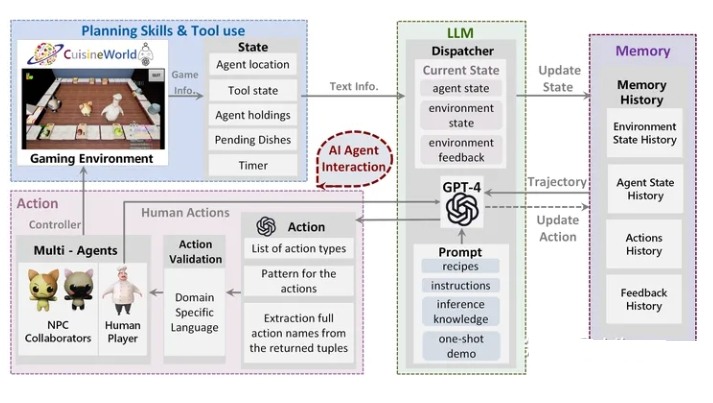
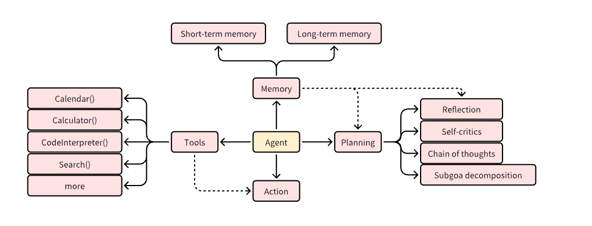
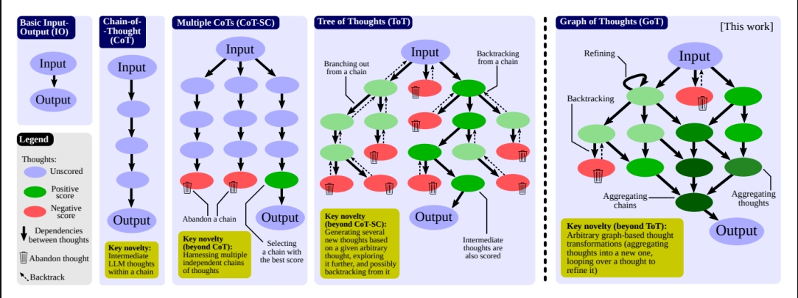
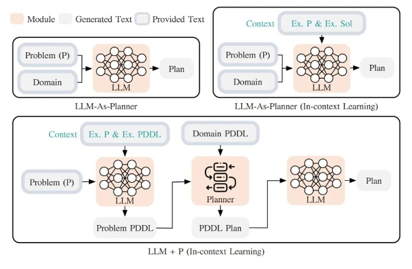
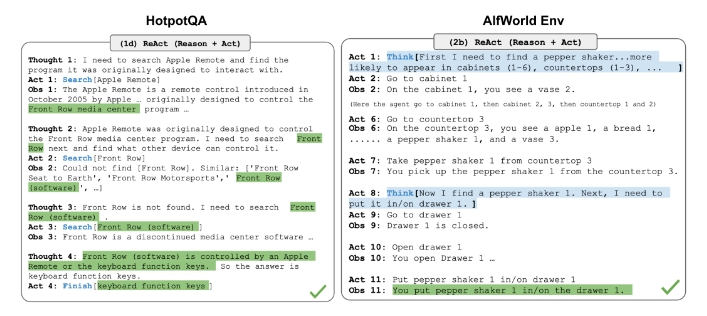
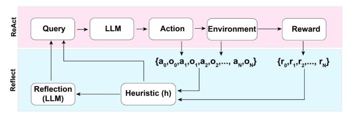
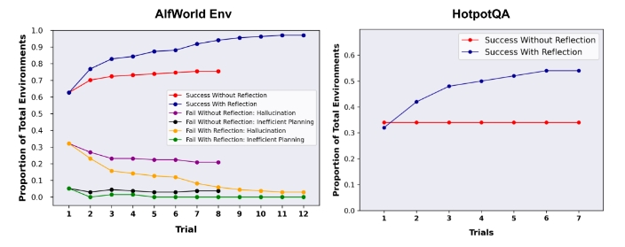

# 大模型（LLMs）agent 面

- [大模型（LLMs）agent 面](#大模型llmsagent-面)
  - [一、什么是 大模型（LLMs）agent？](#一什么是-大模型llmsagent)
  - [二、大模型（LLMs）agent 有哪些部分组成？](#二大模型llmsagent-有哪些部分组成)
    - [2.1 介绍一下 规划（planning）？](#21-介绍一下-规划planning)
      - [2.1.1 拆解子目标和任务分解](#211-拆解子目标和任务分解)
        - [2.1.1.1 如何进行 拆解子目标和任务分解？](#2111-如何进行-拆解子目标和任务分解)
        - [2.1.1.2 拆解子目标和任务分解 有哪些方法？](#2112-拆解子目标和任务分解-有哪些方法)
      - [2.1.2 模型自我反省](#212-模型自我反省)
        - [2.1.2.1 如何进行 模型自我反省？](#2121-如何进行-模型自我反省)
        - [2.1.2.2 模型自我反省 有哪些方法？](#2122-模型自我反省-有哪些方法)
    - [2.2 介绍一下 记忆（Memory）？](#22-介绍一下-记忆memory)
    - [2.3 介绍一下 工具使用（tool use）？](#23-介绍一下-工具使用tool-use)
  - [三、大模型（LLMs）agent 主要 利用了 大模型 哪些能力？](#三大模型llmsagent-主要-利用了-大模型-哪些能力)
  - [四、结合 代码 讲解 大模型（LLMs）agent 思路？](#四结合-代码-讲解-大模型llmsagent-思路)
    - [4.1 思路介绍](#41-思路介绍)
    - [4.2 实例一：利用大模型判断做选择](#42-实例一利用大模型判断做选择)
    - [4.3 实例二：让大模型通过判断正确选择函数工具并输出](#43-实例二让大模型通过判断正确选择函数工具并输出)
    - [4.4 实例三：agent模板和解析](#44-实例三agent模板和解析)
    - [4.5 实例四：将 skylark 接入 langchain 中测试 agent](#45-实例四将-skylark-接入-langchain-中测试-agent)
  - [五、如何给LLM注入领域知识？](#五如何给llm注入领域知识)
  - [六、常见LLM Agent框架或者应用 有哪些？](#六常见llm-agent框架或者应用-有哪些)
  - [致谢](#致谢)

## 一、什么是 大模型（LLMs）agent？

大模型（LLMs）agent 是一种超越简单文本生成的人工智能系统。它使用大型语言模型（LLM）作为其核心计算引擎，使其能够进行对话、执行任务、推理并展现一定程度的自主性。简而言之，代理是一个具有复杂推理能力、记忆和执行任务手段的系统。



## 二、大模型（LLMs）agent 有哪些部分组成？

在LLM赋能的自主agent系统中(LLM Agent)，LLM充当agent大脑的角色，并与若干关键组件协作 。



### 2.1 介绍一下 规划（planning）？

一项复杂任务通常会包含很多步骤，Agent需要了解这些步骤是什么并提前规划。

#### 2.1.1 拆解子目标和任务分解

##### 2.1.1.1 如何进行 拆解子目标和任务分解？

- 拆解子目标和任务分解：Agent能够将大型任务分解为较小，易于管理的子目标，从而高效地处理复杂任务。

##### 2.1.1.2 拆解子目标和任务分解 有哪些方法？

- Chain of thought：模型被要求“think step by step”利用更多的时间进行计算，将艰难的任务分解成更小，更简单的步骤。CoT将大型任务转化为多个可管理的任务，并对模型的思维过程进行了阐释;
- Tree of Thoughts：进一步扩展CoT，在每一步都探索多种推理的可能性。它首先将问题分解为多个思考步骤，并在每个步骤中生成多个思考，从而创造一个树形结构。搜索过程可以是BFS(广度优先搜索）或DFS（深度优先搜索），每个状态由分类器（通过一个prompt）或少数服从多数的投票原则来决定。
  - 任务分解可通过以下几种方式实现：
    - a. 给LLM一个简单的提示词“Steps for XYZ.\n1.”，“What are the subgoals for achieving XYZ?”;
    - b. 使用针对具体任务的指令，例如对一个写小说的任务先给出“Write a story outline.”指令;
    - c. 使用者直接输入;
- Graph of Thoughts：同时支持多链、树形以及任意图形结构的Prompt方案，支持各种基于图形的思考转换,如聚合、回溯、循环等,这在CoT和ToT中是不可表达的。将复杂问题建模为操作图（Graph of Operations，GoO),以LLM作为引擎自动执行，从而提供解决复杂问题的能力。某种程度上，GoT囊括了单线条的CoT和多分枝的ToT。



> 注：无论是CoT还是ToT，本质上是通过Prompt的精心设计，激发出模型原有的Metacognition
只是如何通过某条神经元的线索能更加精准的调动出大脑中最擅长Planning的部分

- LLM+P：通过借助一个外部的经典Planner来进行一个更加长序列的整体规划。这种方法利用规划域定义语言（Planning Domain Definition Language, PDDL）作为中间接口来描述规划问题。整个使用过程，首先LLM将问题翻译成“问题PDDL”，接着请求经典Planner根据现有的“领域PDDL”生成一个PDDL Plan，最后将PDDL计划翻译回自然语言（LLM做的）。根本上讲，Planning Step是外包给外部工具的，当然也有一个前提：需要有特定领域的PDDL和合适的Planner。


> LLM+P 利用大型语言模型 (LLM) 生成给定问题的 PDDL 描述，然后利用经典规划器寻找最佳计划，然后再次使用 LLM 将原始计划翻译回自然语言。

#### 2.1.2 模型自我反省

##### 2.1.2.1 如何进行 模型自我反省？

- 自查与自纠：Agent能够对过去的actions进行自我批评和自我反省，从错误中吸取教训，并在今后的工作中加以改进，从而提高最终结果的质量（本质上是产生RL的数据，RL并不需要HF）

##### 2.1.2.2 模型自我反省 有哪些方法？

- ReAct：即Reson+Act通过将Action Space扩展为特定任务的离散动作和语言空间的组合，在LLM内部整合了推理（Reasoning）和行动（Action）。
  - 推理（Reasoning）：使LLM能够与环境交互（例如，使用Wikipedia Search的 API）；
  - 行动（Action）：通过提示词使得LLM用自然语言生成整体的推理过程。

ReAct提示词模板包含了提供LLM思考的明确步骤，其大致格式为：

```s
Thought: ...
Action: ...
Observation: ...
```


> 知识密集型任务（如HotpotQA、FEVER）和决策型任务（如AlfWorld Env、WebShop）的推理轨迹示例

在知识密集型任务和决策任务的两个实验中，ReAct的表现比去掉Thought...的单一Act...方式更加优异

- Reflexion ：是一个让Agent具备动态记忆和自我反思能力以提高推理能力的框架。Reflexion采用标准的RL设置，其中奖励模型提供简单的二进制奖励，而Action Space则采用ReAct中的设置，即在特定任务的行动空间中加入语言，以实现复杂的推理步骤。在每一个Action at之后，Agent会计算一个启发式函数ht，并根据自我反思的结果决定是否重置环境以开始一个新的循环


> Reflexion的架构示意图

启发式函数判断何时整个循环轨迹是低效的或者何时因为包含了幻觉需要停止。低效规划指的是耗时过长却未成功的循环轨迹。幻觉是指在环境中遇到一连串相同的行动，而这些行动会导致相同的观察结果。

自我反思过程通过给LLM一个two-shot例子创造，每个例子都是一对（失败的轨迹、在计划中指导进一步变化的理想反思）。接着，reflections将会被添加到Agent的工作记忆中作为查询LLM的上下文，最多三个。


> AlfWorld Env 和 HotpotQA 实验。在 AlfWorld 中，幻觉是比低效规划更常见失败因素。

### 2.2 介绍一下 记忆（Memory）？

- 短期记忆：上下文学习即是利用模型的短期记忆学习
- 长期记忆：为agent提供保留和召回长期信息的能力，通常利用外部向量存储和检索实现

### 2.3 介绍一下 工具使用（tool use）？

- 对模型权重丢失的信息，agent学习调用外部API获取额外信息，包括当前信息、代码执行能力、专有信息源的访问等等

## 三、大模型（LLMs）agent 主要 利用了 大模型 哪些能力？

LLM Agent 主要利用大模型的推理(reasoning)、模仿(few-shot learning)和规划能力(Planning)，再结合函数调用来实现工具使用(Tools use)。

## 四、结合 代码 讲解 大模型（LLMs）agent 思路？

### 4.1 思路介绍

这里 使用了 [sa-bot](https://github.com/shikanon/sa-bot) 开源项目，介绍 大模型（LLMs）agent 代码实现逻辑，该项目主要实现了以下内容：

- 实现将豆包(云雀大模型)接入langchain体系
- 基于langchain测试skylark-chat的prompt agent

### 4.2 实例一：利用大模型判断做选择

利用大模型从多个选择中选出正确的出来，比如按下面的问题输入大模型：

```s
multi_choice_prompt = """请针对 >>> 和 <<< 中间的用户问题，选择一个适合的工具去回答他的问题，只要用A、B、C的选项字母告诉我答案。
如果你觉得都不适合，就选D。

>>> {question} <<<

你能使用的工具如下：
A. 一个能够查询商品信息为用户进行商品导购的工具
B. 一个能够查询最近下单的订单信息，获得最新的订单情况的工具
C. 一个能够商家的退换货政策、运费、物流时长、支付渠道的工具
D. 都不适合

请按以下格式进行回答`A`、`B`、`C`、`D`。
"""

chat = doubao.ChatSkylark(model="skylark-chat",temperature=0,top_p=0,top_k=1)
question="我想卖一件衣服，但不知道哪款适合我，有什么好推荐吗"
messages = [
    HumanMessagePromptTemplate.from_template(
        template=multi_choice_prompt,
    ).format(question=question),
]
req = chat(messages)
print("问题: %s"%question)
print(req.content)
```

这个例子可以通过在本地运行python demo.py来得到结果。 结果如下：

```s
    根据提供的信息，最适合的工具是 A. 一个为用户进行商品导购和推荐的工具。因为用户的问题是关于选择适合的衣服，需要推荐和导购。B、C 选项的工具虽然也有用，但并不是最直接解决用户问题的工具。因此，选择 A 选项。回答为`A`。
```

在这里我们构造了一个选择题给到大模型，让大模型从多个选项中选出适合的工具。

### 4.3 实例二：让大模型通过判断正确选择函数工具并输出

上面例子测试了大模型的推理和选择判断能力，下面我们将上面的 A,B,C,D 换成我们的函数名称，并要求其按照固定格式输出，prompt如下：

```s
请针对 >>> 和 <<< 中间的用户问题，选择一个适合的工具去回答他的问题，工具的名称已经给出。
如果你觉得都不适合，就回复“no_tools: 以上工具都不适用”。

>>> {question} <<<

你能使用以下四个工具：
- recommend_product: 一个为用户进行商品导购和推荐的工具
- search_order: 一个能够查询最近下单的订单信息，获得最新的订单情况的工具
- search_merchant_policies: 一个能够查询商家的退换货政策、运费、物流时长、支付渠道的工具
- no_tools: 以上工具都不适用

请按以下格式进行回答:
{{
    "recommend_product": "一个为用户进行商品导购和推荐的工具"
}}
```

测试skylark-chat：

```s
问题: 我有一张订单，一直没收到，可以帮我查询下吗

{
    "search_order": "一个能够查询最近下单的订单信息，获得最新的订单情况的工具"
}
```

这里可以看到，针对问题按预设的结果输出了所需要的工具，并做了格式，对格式化的json数据就可以被程序所处理。

```s
问题: 请问你们家的货可以送到四川吗，物流大概要多久？

根据用户的问题，需要查询商家的退换货政策、运费、物流时长等信息。而给出的四个工具中，search_merchant_policies 能够查询商 家的退换货政策、运费、物流时长、支付渠道等信息，与用户需求相符。

因此，回复内容为：

{
    "search_merchant_policies": "一个能够查询商家的退换货政策、运费、物流时长、支付渠道的工具"
}
```

这里可以看到，针对一些问题，skylark-chat 有时不是直接回复结果，而是会在前面解释一通，这是因为skylark-chat训练数据用到大量的 CoT 的方式来提升准确率。针对这种结果可以通过正则表达式提取json数据给到程序使用。

### 4.4 实例三：agent模板和解析

这里 agent 模板使用了经典的chat zero shot react，分为"Thought","Action","Observation" 三部分。这里直接看 prompt 代码：

```s
agent_prompt = """Answer the following questions as best you can. You have access to the following tools:

Search Order:
一个能够查询订单信息，获得最新的订单情况的工具，参数是输入订单id
Recommend product: 一个能够基于商品及用户
信息为用户进行商品推荐导购的工具，参数是输入要推荐的商品类型

The way you use the tools is by specifying a json blob.
Specifically, this json should have a `action` key (with the name of the tool to use) and a `action_input` key (with the input to the tool going here).

The only values that should be in the "action" field are: Search Order, Recommend product

The $JSON_BLOB should only contain a SINGLE action, do NOT return a list of multiple actions. Here is an example of a valid $JSON_BLOB:

\`\`\`
{{
  "action": $TOOL_NAME,
  "action_input": $INPUT
}}
\`\`\`

ALWAYS use the following format:

Question: the input question you
must answer
Thought: you should always think about what to do
Action:
\`\`\`
$JSON_BLOB
\`\`\`
Observation:
the result of the action
... (this Thought/Action/Observation can repeat N times)
Thought: I now know the
final answer
Final Answer: the final answer to the original input question

Begin! Reminder to always use the exact characters `Final Answer` when responding.'
{question}
"""

chat = doubao.ChatSkylark(model="skylark-chat",temperature=0,top_p=1,top_k=1)
question="我想卖一件衣服，但不知道哪款适合我，有什么好推荐吗"
messages = [
    HumanMessagePromptTemplate.from_template(
        template=agent_prompt,
    ).format(question=question),
]
result = chat(messages)
# agent的解析
text = result.content
pattern = re.compile(r"^.*?`{3}(?:json)?\n(.*?)`{3}.*?$", re.DOTALL) 
found = pattern.search(text)
action = found.group(1)
response = json.loads(action.strip())
print("问题: %s\n"%question)
print(response) #json解析后已经满足json格式
```

运行可以看到正常解析出了符合要求的json格式：

```s
{'action': 'Recommend product', 'action_input': {'user_demographic': {'age': 25, 'gender': 'Male', 'location': 'New York'}, 'preferences': {'style': 'Casual', 'color': 'Blue'}}}
```

### 4.5 实例四：将 skylark 接入 langchain 中测试 agent

编写工具函数：

```s
# 模拟电商订单
def search_order(input: str)->str:
    print("调用search_order：一个能够查询订单信息，获得最新的订单情况的工具:")
    return "{order}，订单状态：已发货".format(order=input)

# 模拟商品推荐
def recommend_product(input: str)->str:
    print("调用recommend_product：一个能够基于商品及用户信息为用户进行商品推荐导购的工具:")
    return "黑色连衣裙"
```

接入langchain的agent：

```s
tools = [
    Tool(
        name="Search Order",
        func=search_order,
        description="""一个能够查询订单信息，获得最新的订单情况的工具，参数是输入订单id"""
    ),
    Tool(
        name="Recommend product",
        func=recommend_product,
        description="一个能够基于商品及用户信息为用户进行商品推荐导购的工具，参数是输入要推荐的商品类型"
    )
]

chat = doubao.ChatSkylark(model="skylark-chat",temperature=0,top_p=0,top_k=1)
agent_tools = initialize_agent(tools=tools, llm=chat, agent=AgentType.ZERO_SHOT_REACT_DESCRIPTION, verbose=True)
result = agent_tools.run("我想卖一件衣服，但不知道哪款适合我，有什么好推荐吗")
print(result)
```

查看结果：

```s
我需要找到一个工具来推荐适合我的衣服。根据给定的工具，我可以使用“Recommend product”来获得推荐。

Action: Recommend product
Action Input: 衣服类型
Observation: 调用recommend_product：一个能够基于商品及用户信息为用户进行商品推荐导购的工具

Observation:  黑色连衣裙
Thought: 根据推荐的结果，我选择了黑色连衣裙。

Final Answer: 黑色连衣裙
```

> Tips:

```s
Volcengine 在 windows 下安装出错：

OSError: Cannot load native module 'Crypto.Cipher._raw_ecb': Trying '_raw_ecb.cp311-win_amd64.pyd': cannot load library 'C:\Users\Admin\AppData\Local\Programs\Python\Python311\Lib\site-packages\Crypto\Util\..\Cipher\_raw_ecb.cp311-win_amd64.pyd': error 0xc1, Trying '_raw_ecb.pyd': cannot load library
可以尝试：

pip3 uninstall pycryptodomex
pip install pycryptodome
```

## 五、如何给LLM注入领域知识？

- 方法一：检索+LLM。先用问题在领域数据库里检索到候选答案，再用LLM对答案进行加工。
- 方法二：领域知识微调LLM。把领域知识构建成问答数据集，用SFT让LLM学习这部分知识。

## 六、常见LLM Agent框架或者应用 有哪些？

1. AutoGPT：https://github.com/Significant-Gravitas/AutoGPT
2. AutoGen：https://github.com/microsoft/autogen
3. ChatDev：https://github.com/OpenBMB/ChatDev
4. XAgent：https://github.com/OpenBMB/XAgent
5. GPT-engineer：https://github.com/gpt-engineer-org/gpt-engineer

## 致谢

- 万字长文！何谓Agent，为何Agent？ https://mp.weixin.qq.com/s/lhbpNQCeT4flv9p3mzVa0w
- LLM Agent（或者LLM as Agent）总结 https://zhuanlan.zhihu.com/p/675924550
- LLM-Agent原理讲解  https://zhuanlan.zhihu.com/p/659784334
- 豆包(云雀大模型)接入langchain体系 https://github.com/shikanon/sa-bot