# LLMs 位置编码篇

- [LLMs 位置编码篇](#llms-位置编码篇)
  - [动机](#动机)
  - [一、什么是位置编码？](#一什么是位置编码)
  - [二、为什么需要位置编码？](#二为什么需要位置编码)
  - [三、什么是绝对位置编码？](#三什么是绝对位置编码)
    - [3.1 训练式位置编码篇](#31-训练式位置编码篇)
      - [3.1.1 什么是 训练式位置编码？](#311-什么是-训练式位置编码)
      - [3.1.2 如何为每个位置的词向量注入位置信息呢？](#312-如何为每个位置的词向量注入位置信息呢)
      - [3.1.3 训练式位置编码篇 应用场景？](#313-训练式位置编码篇-应用场景)
      - [3.1.4 训练式位置编码篇 存在哪些问题？](#314-训练式位置编码篇-存在哪些问题)
    - [3.2 Sinusoidal位置编码篇](#32-sinusoidal位置编码篇)
      - [3.2.1 什么是 Sinusoidal位置编码？](#321-什么是-sinusoidal位置编码)
      - [3.2.2 Sinusoidal位置编码 有哪些优点？](#322-sinusoidal位置编码-有哪些优点)
  - [四、什么是相对位置编码？](#四什么是相对位置编码)
  - [五、旋转位置编码 RoPE篇](#五旋转位置编码-rope篇)
    - [5.1 旋转位置编码 RoPE 思路是什么？](#51-旋转位置编码-rope-思路是什么)
    - [5.2 推导一下 旋转位置编码 RoPE ？](#52-推导一下-旋转位置编码-rope-)
    - [5.3 旋转位置编码 RoPE 有什么优点？](#53-旋转位置编码-rope-有什么优点)
    - [5.4 旋转位置编码 RoPE 被哪些 LLMs 应用？](#54-旋转位置编码-rope-被哪些-llms-应用)
  - [六、长度外推问题篇](#六长度外推问题篇)
    - [6.1 什么是 长度外推问题？](#61-什么是-长度外推问题)
    - [6.2 长度外推问题 的 解决方法 有哪些？](#62-长度外推问题-的-解决方法-有哪些)
  - [七、 ALiBi (Attention with Linear Biases)篇](#七-alibi-attention-with-linear-biases篇)
    - [7.1 ALiBi (Attention with Linear Biases) 思路是什么？](#71-alibi-attention-with-linear-biases-思路是什么)
    - [7.2 ALiBi (Attention with Linear Biases) 的偏置矩阵是什么？有什么作用？](#72-alibi-attention-with-linear-biases-的偏置矩阵是什么有什么作用)
    - [7.3 ALiBi (Attention with Linear Biases) 有什么优点？](#73-alibi-attention-with-linear-biases-有什么优点)
    - [7.4 ALiBi (Attention with Linear Biases)  被哪些 LLMs 应用？](#74-alibi-attention-with-linear-biases--被哪些-llms-应用)
  - [致谢](#致谢)

## 动机

由于计算资源限制，目前的大模型大多**在较小的上下文长度中进行训练**，**在推理中，若超出预训练的长度，模型的性能将会显著降低**。于是涌现出了许多基于RoPE的长度外推的工作，旨在让大模型能够在预训练长度之外，取得更好的效果。

## 一、什么是位置编码？

句子中不同词语之前的位置信息十分重要，但是self-attention框架无法直接利用位置信息，因此研究者提出了许多方法将位置信息编码到学习过程中。

1. **绝对位置编码方法**：将位置信息直接加入到输入中；
2. **相对位置编码方法**：研究者通过微调attention的结构，使它具有识别token位置信息的能力。

## 二、为什么需要位置编码？

众所周知，transformer模型之所以能够取得如此卓越的效果，其中的Attention机制功不可没，它的本质是计算输入序列中的每个token与整个序列的注意力权重。假设 qm 和 kn 分别表示词向量 q 位于位置 m 和词向量 k 位于位置 n ，在未添加位置信息的时候，

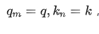

则两者的注意力权重计算如下:

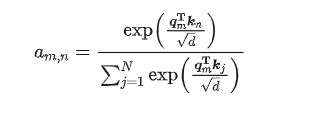

我们会发现，在未加入位置信息的情况下，无论 q 和 k 所处的位置如何变化，它们之间的注意力权重 a(m,n) 均不会发生变化，也就是位置无关，这显然与我们的直觉不符。**对于两个词向量，如果它们之间的距离较近，我们希望它们之间的的注意力权重更大，当距离较远时，注意力权重更小**。

为了解决这个问题，我们需要为**模型引入位置编码，让每个词向量都能够感知到它在输入序列中所处的位置信息**。我们定义如下函数，该函数表示对词向量 q 注入位置信息 m ，得到 qm ：

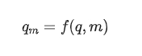

则 qm 与 kn 之间的注意力权重可表示为：

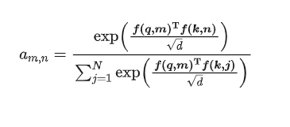

## 三、什么是绝对位置编码？

绝对位置编码比较简单，研究者一般会将绝对位置信息加到输入中：在输入的第 k 个向量 $x_k$ 中加入位置向量 $p_k$ 得到 $p_k + x_k$  ，其中 $p_k$ 仅与 k 相关。计算 $p_k$ 的方法一般有两种：训练式位置编码与Sinusoidal位置编码。

### 3.1 训练式位置编码篇

#### 3.1.1 什么是 训练式位置编码？

训练式位置编码，顾名思义就是每个位置的位置向量会随着模型一起训练。假设模型最大输入长度为512，向量维度为768，我们可初始化一个512*768的位置编码矩阵，该矩阵将参与模型的训练，从而学习得到每个位置所对应的向量表示。

#### 3.1.2 如何为每个位置的词向量注入位置信息呢？

答案是相加，如以下公式所示，其中 pm 表示第 m 个位置的位置向量：

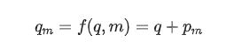

#### 3.1.3 训练式位置编码篇 应用场景？

训练式位置编码广泛应用于早期的transformer类型的模型，如BERT、GPT、ALBERT等。

#### 3.1.4 训练式位置编码篇 存在哪些问题？

模型不具有长度外推性，因为位置编码矩阵的大小是预设的，若对其进行扩展，将会破坏模型在预训练阶段学习到的位置信息。例如将512*768扩展为1024*768，新拓展的512个位置向量缺乏训练，无法正确表示512~1023的位置信息。但早期大家对长文本输入的需求并不如现在迫切。

### 3.2 Sinusoidal位置编码篇

#### 3.2.1 什么是 Sinusoidal位置编码？

Sinusoidal位置编码是谷歌在Transformer模型中提出的一种绝对位置编码，它的形式如下，其中 d 表示词向量的维度，k  表示位置索引， 2i 和 2i+1 表示位置向量的分量索引，例如 $p_{k,2i}$ 和 $p_{k,2i+1}$ 分别表示位置 k 的位置向量的第 2i 和第 2i+1 个分量： 

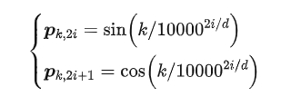

#### 3.2.2 Sinusoidal位置编码 有哪些优点？

1. 周期性

Sinusoidal位置编码的每个分量都是正弦或余弦函数，所有每个分量的数值都具有周期性。如下图所示，**每个分量都具有周期性，并且越靠后的分量，波长越长，频率越低**。

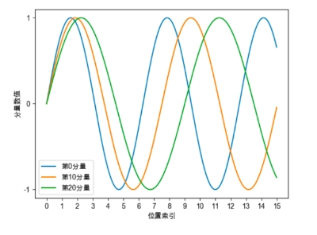

2. 远程衰减性

Sinusoidal位置编码还具有远程衰减的性质，具体表现为：**对于两个相同的词向量，如果它们之间的距离越近，则他们的内积分数越高，反之则越低**。如下图所示，我们随机初始化两个向量 q 和 k，将 q 固定在位置0上，k 的位置从 0 开始逐步变大，依次计算 q 和 k 之间的内积。我们发现随着 q 和 k 的相对距离的增加，它们之间的内积分数震荡衰减。

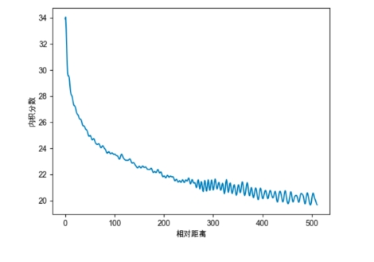

## 四、什么是相对位置编码？

前面讲到相对位置编码是微调Attention矩阵的计算方式，先看看绝对位置编码怎样计算Attention矩阵：

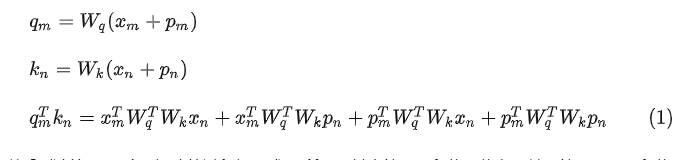

可以看到计算attention矩阵的过程如公式(1)所示，其中第一项和位置信息无关，第二至四项和位置信息相关。因此研究者通常是直接修改第二至四项的内容，直接在attention矩阵中添加相对位置信息。常见的有以下几种方法：

> XLNET式：如(2)所示，xlnet将(1)中的二至四项都做了改变，具体的将 $p_n$ 替换为了Sinusoidal生成式编码 $R_{n-m}$，将 $p_m$ 换成了两个可以训练的向量 $u,v$ 。

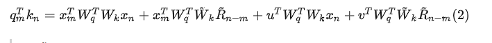

> T5式：如(3)所示，它的作者认为输入和位置间不应过多的交互，因此将第二、三项删除，将第四项都替换为一个可学习的偏执 $b_{m,n}$，这仅仅是在Attention矩阵的基础上加一个可训练的偏置项而已，十分简单。

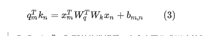

> DeBerta式：和T5的构造相反，它舍弃了公式(1)中第四项，保留了第二、三项并将位置信息替换为了相对位置向量 $R_{n-m}$。

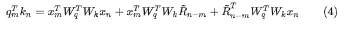

## 五、旋转位置编码 RoPE篇

### 5.1 旋转位置编码 RoPE 思路是什么？

作用在每个 transformer 层的 self-attention 块，在计算完 Q/K 之后，**旋转位置编码作用在 Q/K 上**，再计算attention score。

### 5.2 推导一下 旋转位置编码 RoPE ？

Attention的核心运算是内积，所以我们希望经过内积的结果能够带有相对信息。那么我们希望 $q_m$ 和 $k_n$ 的内积仅与输入 $x_m$, $x_n$ 和他们的相对位置 m-n 有关，那么我们可以假设存在函数 g ,使得：

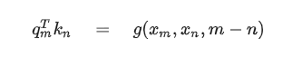

为了方便理解我们可以先考虑二维形式，然后借助复数的运算法则来理解。首先分别用复数的指数形式表示各个向量变化,即有：

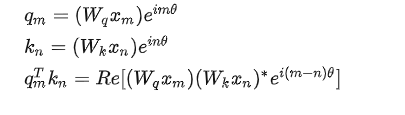

> PS1. 向量内积与复数乘积的关系为内积 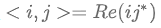 ，其中 Re 表示复数的实部。
>
> PS2. 这个形式证明过程可以参考论文的3.4.1节。但是要注意的是向量内积是标量，而 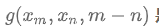 是向量，所以其公式(21) 应改为 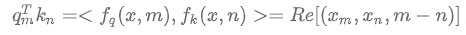  ,这样公式(24)才好理解。

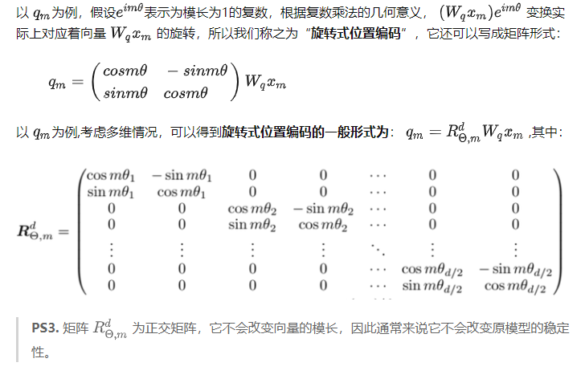

### 5.3 旋转位置编码 RoPE 有什么优点？

**旋转位置编码通过绝对位置编码的方式实现了相对位置编码，有良好的外推性**。

### 5.4 旋转位置编码 RoPE 被哪些 LLMs 应用？

LLaMA、GLM-130B、PaLM等大语言模型就采用了旋转位置编码ROPE。

## 六、长度外推问题篇

### 6.1 什么是 长度外推问题？

- 长度外推问题：训练、推理的长度不一致问题，主要体现在以下两方面：
  - 问题一：**位置编码不一致（推理的时候有训练没见过的位置编码）**；
  - 问题二：**attention span大小不一致（推理的时候attention span更大，导致墒增）**；

### 6.2 长度外推问题 的 解决方法 有哪些？

- 问题一解决方法：ALIBI、KERPLE、Sandwich、XPOS、PI、NTK-RoPE(目前看起来这个最强，不用finetune)；
- 问题二解决方法：softmax的时候加一个 $log_{512}n$ 系数；

## 七、 ALiBi (Attention with Linear Biases)篇

### 7.1 ALiBi (Attention with Linear Biases) 思路是什么？

在计算完attention score后，直接为attention score矩阵加上一个预设好的偏置矩阵

### 7.2 ALiBi (Attention with Linear Biases) 的偏置矩阵是什么？有什么作用？

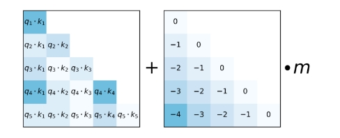

- ALiBi的偏置矩阵：根据q和k的相对距离来惩罚attention score
- 作用：相对距离越大，惩罚项越大相当于两个token的距离越远，相互贡献就越小。

### 7.3 ALiBi (Attention with Linear Biases) 有什么优点？

ALiBi位置编码有良好的外推性

### 7.4 ALiBi (Attention with Linear Biases)  被哪些 LLMs 应用？

BLOOM就采用了这种位置编码

## 致谢

- 社区供稿 | 图解 RoPE 旋转位置编码及其特性 https://mp.weixin.qq.com/s/iV_RJqPV2YiLxSBCQXjRtg
