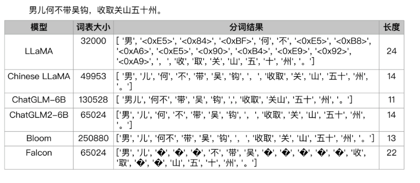
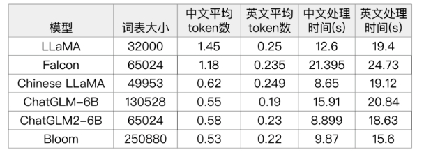

# LLMs Tokenizer 常见面试篇

- [LLMs Tokenizer 常见面试篇](#llms-tokenizer-常见面试篇)
  - [Byte-Pair Encoding(BPE)篇](#byte-pair-encodingbpe篇)
    - [1 介绍一下 Byte-Pair Encoding(BPE) ？](#1-介绍一下-byte-pair-encodingbpe-)
    - [2 Byte-Pair Encoding(BPE) 如何构建词典？](#2-byte-pair-encodingbpe-如何构建词典)
    - [3 Byte-Pair Encoding(BPE) 具有什么优点？](#3-byte-pair-encodingbpe-具有什么优点)
    - [4 Byte-Pair Encoding(BPE) 具有什么缺点？](#4-byte-pair-encodingbpe-具有什么缺点)
    - [5 手撕 Byte-Pair Encoding(BPE) ？](#5-手撕-byte-pair-encodingbpe-)
  - [Byte-level BPE 篇](#byte-level-bpe-篇)
    - [1 介绍一下 Byte-level BPE ？](#1-介绍一下-byte-level-bpe-)
    - [2 Byte-level BPE 如何构建词典？](#2-byte-level-bpe-如何构建词典)
    - [3 Byte-level BPE 具有什么优点？](#3-byte-level-bpe-具有什么优点)
    - [4 Byte-level BPE 具有什么缺点？](#4-byte-level-bpe-具有什么缺点)
  - [WordPiece 篇](#wordpiece-篇)
    - [1 介绍一下 WordPiece ？](#1-介绍一下-wordpiece-)
    - [2 WordPiece 如何构建词典？](#2-wordpiece-如何构建词典)
    - [3 WordPiece 具有什么优点？](#3-wordpiece-具有什么优点)
    - [4 WordPiece 具有什么缺点？](#4-wordpiece-具有什么缺点)
    - [5 手撕 WordPiece ？](#5-手撕-wordpiece-)
    - [6 WordPiece 与 BPE 异同点是什么？](#6-wordpiece-与-bpe-异同点是什么)
  - [SentencePiece 篇](#sentencepiece-篇)
    - [1 介绍一下 SentencePiece ？](#1-介绍一下-sentencepiece-)
    - [2 SentencePiece 如何构建词典？](#2-sentencepiece-如何构建词典)
    - [3 SentencePiece 具有什么优点？](#3-sentencepiece-具有什么优点)
    - [4 SentencePiece 具有什么缺点？](#4-sentencepiece-具有什么缺点)
    - [5 手撕 SentencePiece ？](#5-手撕-sentencepiece-)
  - [Transformer Tokenizer 篇](#transformer-tokenizer-篇)
    - [1 介绍一下 Transformer Tokenizer ？](#1-介绍一下-transformer-tokenizer-)
    - [2 Transformer Tokenizer 如何构建词典？](#2-transformer-tokenizer-如何构建词典)
    - [3 Transformer Tokenizer 具有什么优点？](#3-transformer-tokenizer-具有什么优点)
    - [4 Transformer Tokenizer 具有什么缺点？](#4-transformer-tokenizer-具有什么缺点)
    - [5 手撕 Transformer Tokenizer ？](#5-手撕-transformer-tokenizer-)
  - [Unigram LM 篇](#unigram-lm-篇)
    - [1 介绍一下 Unigram LM ？](#1-介绍一下-unigram-lm-)
    - [2 Unigram LM 如何构建词典？](#2-unigram-lm-如何构建词典)
    - [3 Unigram LM 具有什么优点？](#3-unigram-lm-具有什么优点)
    - [4 Unigram LM 具有什么缺点？](#4-unigram-lm-具有什么缺点)
    - [5 手撕 Unigram LM ？](#5-手撕-unigram-lm-)
  - [对比篇](#对比篇)
    - [1 对比一下 不同 分词器 优缺点？](#1-对比一下-不同-分词器-优缺点)
    - [2 举例 介绍一下 不同 大模型LLMs 的分词效果？](#2-举例-介绍一下-不同-大模型llms-的分词效果)
    - [3 介绍一下 不同 大模型LLMs 的分词方式 的区别？](#3-介绍一下-不同-大模型llms-的分词方式-的区别)
  - [致谢](#致谢)

## Byte-Pair Encoding(BPE)篇

### 1 介绍一下 Byte-Pair Encoding(BPE) ？

Byte Pair Encoding (BPE)：BPE是一种基于字符级别的分词算法，常用于处理未分词的文本。它从字符级别开始，逐步合并出现频率最高的字符或字符组合，形成更长的词汇。

### 2 Byte-Pair Encoding(BPE) 如何构建词典？

1. 准备足够的训练语料;以及期望的词表大小；
2. 将单词拆分为字符粒度(字粒度)，并在末尾添加后缀“</w>”，统计单词频率
3. 合并方式:统计每一个连续/相邻字节对的出现频率，将最高频的连续字节对合并为新的子词；
4. 重复第3步，直到词表达到设定的词表大小;或下一个最高频字节对出现频率为1。

> 注：GPT2、BART和LLaMA就采用了BPE。

### 3 Byte-Pair Encoding(BPE) 具有什么优点？

- 无监督学习：BPE是一种无监督学习算法，不需要人工标注的分词数据即可进行词汇划分。
- 适应性强：BPE可以根据语料库进行自适应，能够学习到不同语种、领域的词汇特点，适用范围广。
- 有效处理未登录词：BPE可以将未登录词（Out-of-Vocabulary）分割成较小的子词，从而提高模型对未登录词的处理能力。

### 4 Byte-Pair Encoding(BPE) 具有什么缺点？

- Out-of-Vocabulary问题：由于BPE算法基于统计，其词汇表是固定大小的，如果遇到未在词汇表中出现的单元，将其分割为子词可能会增加语义上的困惑。
- 等分割问题：由于BPE算法在合并时选择频次最高的字符或字符组合，可能会导致某些词被过于粗糙地分割，产生一些半词或半短语。
- 分词效率较低：BPE算法是一个迭代的过程，可能需要大量的计算资源和时间来处理大规模的文本数据。

### 5 手撕 Byte-Pair Encoding(BPE) ？

> 代码
```s
from collections import defaultdict
 
def get_stats(vocab):
    pairs = defaultdict(int)
    for word, freq in vocab.items():
        symbols = word.split()
        for i in range(len(symbols)-1):
            pairs[symbols[i], symbols[i+1]] += freq
    return pairs
 
def merge_vocab(pair, v_in):
    v_out = {}
    bigram = ' '.join(pair)
    for word in v_in:
        v_out[word] = v_in[word]
        new_word = word.replace(' '.join(pair), bigram)
        if new_word != word:
            v_out[new_word] = v_in[word]
    return v_out
 
def bpe(text, num_iters):
    vocab = defaultdict(int)
    for word in text:
        vocab[' '.join(word)] += 1
    
    for i in range(num_iters):
        pairs = get_stats(vocab)
        if not pairs:
            break
        best_pair = max(pairs, key=pairs.get)
        vocab = merge_vocab(best_pair, vocab)
        
    return vocab
 
# 示例用法
text = ['low', 'lower', 'newest', 'widest', 'room', 'rooms']
num_iters = 10
 
vocab = bpe(text, num_iters)
print(vocab)
```

> 输出
```s
{'l o w': 1, 'l o w e r': 1, 'n e w e s t': 1, 'w i d e s t': 1, 'r o o m': 1, 'r o o m s': 1}
```

## Byte-level BPE 篇

### 1 介绍一下 Byte-level BPE ？

将BPE的思想从字符级别扩展到子节级别。

### 2 Byte-level BPE 如何构建词典？

考虑文本的UTF8编码，它将每个Unicode字符编码成1到4个字节。这允许我们将句子建模为字节序列，而不是字符序列。虽然有覆盖150多种语言的138K Unicode字符，但我们可以将任何语言的句子表示为UTF-8字节序列(只需要256个可能的字节中的248个)。

文本的字节序列表示通常比字符序列表示长得多(高达4倍)，这使得按原样使用字节（只使用256的子节集）在计算上要求很高。作为另一种选择，我们考虑将字节序列分割成可变长度的n-gram(字节级“subwords”)。具体地说，我们学习关于字节级表示的BPE词汇，该表示用字节n-gram扩展了UTF-8字节集，称之为BBPE。

### 3 Byte-level BPE 具有什么优点？

1. 效果与BPE相当，但词表大为减小；
2. 可以在多语言之间通过字节级别的子词实现更好的共享；
3. 即使字符集不重叠，也可以通过子节层面的共享来实现良好的迁移。

### 4 Byte-level BPE 具有什么缺点？

1. 编码序列时，长度可能会略长于BPE，计算成本更高；
2. 由byte解码时可能会遇到歧义，需要通过上下文信息和动态规划来进行解码。

## WordPiece 篇

### 1 介绍一下 WordPiece ？

WordPiece是一种基于子词级别的分词算法，常用于将文本划分为更小的单元。它通过合并出现频率最高的子词或子词组合，构建词汇表，并将文本划分为这些子词。

### 2 WordPiece 如何构建词典？

1. 初始化：将每个字符作为初始词汇表中的单元。
2. 统计频次：对语料进行统计，记录每个单词及子词的频次。
3. 合并：在每次迭代中，选择频次最高的相邻两个单元（字符或子词），将其合并为一个新的单元，并将其作为新的词汇表中的单元。
4. 更新词汇表：更新词汇表，将新合并的单元添加到词汇表中。
5. 重复步骤2和3，直到达到预设的词汇表大小或满足停止条件。

### 3 WordPiece 具有什么优点？

- 语言无关性：WordPiece算法是一种通用的分词算法，不依赖于特定的语言或语料库，能够适应不同的语种和领域。
- 词汇控制：通过合并相邻的单元，WordPiece算法可以根据词汇表的需求，动态控制词汇大小，使得词汇表能够适应不同的任务和数据规模。
- 有效处理未登录词：WordPiece算法将文本划分为子词，可以有效处理未登录词，并提供更好的语义表示能力。

### 4 WordPiece 具有什么缺点？

- Out-of-Vocabulary问题：由于词汇表是固定大小的，WordPiece算法在遇到未在词汇表中出现的单元时，将其分割为子词可能会导致一些语义上的困惑。
- 词的不连续性：WordPiece算法将单词分割为子词，可能导致词的不连续性，使得模型需要更长的上下文来理解词的语义。
- 分割歧义：由于WordPiece算法仅根据频次合并单元，并不能解决所有的分割歧义问题，可能产生一些歧义的分词结果。

### 5 手撕 WordPiece ？

> 代码
```s
from collections import defaultdict
 
def get_stats(vocab):
    pairs = defaultdict(int)
    for word, freq in vocab.items():
        symbols = word.split()
        for i in range(len(symbols)-1):
            pairs[symbols[i], symbols[i+1]] += freq
    return pairs
 
def merge_vocab(pair, v_in):
    v_out = {}
    bigram = ''.join(pair)
    for word in v_in:
        v_out[word] = v_in[word]
        new_word = word.replace(' '.join(pair), bigram)
        if new_word != word:
            v_out[new_word] = v_in[word]
    return v_out
 
def wordpiece(text, num_iters):
    vocab = defaultdict(int)
    for word in text:
        vocab[' '.join(list(word))+' </w>'] += 1
    
    for i in range(num_iters):
        pairs = get_stats(vocab)
        if not pairs:
            break
        best_pair = max(pairs, key=pairs.get)
        vocab = merge_vocab(best_pair, vocab)
        
    return vocab
 
# 示例用法
text = ['low', 'lower', 'newest', 'widest', 'room', 'rooms']
num_iters = 10
 
vocab = wordpiece(text, num_iters)
print(vocab)
```

> 输出
```s
{'l o w </w>': 1, 'lo w </w>': 1, 'l o w e r </w>': 1, 'lo w e r </w>': 1, 'l o w e r</w>': 1, 'lo w e r</w>': 1, 'l o we r </w>': 1, 'lo we r </w>': 1, 'l o we r</w>': 1, 'lo we r</w>': 1, 'n e w e s t </w>': 1, 'n e we s t </w>': 1, 'w i d e s t </w>': 1, 'r o o m </w>': 1, 'r o o m s </w>': 1}
```

### 6 WordPiece 与 BPE 异同点是什么？

本质上还是BPE的思想。与BPE最大区别在于:如何选择两个子词进行合并

- BPE是选择频次最大的相邻子词合并;
- WordPiece算法选择 能够提升语言模型概率最大的相邻子词进行合并，来加入词表

> 注：BERT采用了WordPiece。

## SentencePiece 篇

### 1 介绍一下 SentencePiece ？

SentencePiece是一种基于未分词语料的无监督分词算法，可以用于构建多语言的分词器。它可以通过训练，自动识别出多种语言的词汇，并对文本进行分词。

> 注：ChatGLM、BLOOM、PaLM采用了SentencePiece。

### 2 SentencePiece 如何构建词典？

1. 初始化：将每个字符作为初始词汇表中的单元。
2. 统计频次：对语料进行统计，记录每个单词及子词的频次。
3. 合并：在每次迭代中，选择频次最高的相邻两个单元（字符或子词），将其合并为一个新的单元，并将其作为新的词汇表中的单元。
4. 更新词汇表：更新词汇表，将新合并的单元添加到词汇表中。
5. 重复步骤2和3，直到达到预设的词汇表大小或满足停止条件。

### 3 SentencePiece 具有什么优点？

- 语言无关性：SentencePiece算法不依赖于特定的语言或语料库，可以适应不同的语种和领域。
- 动态词汇表：通过合并单元，SentencePiece算法可以动态控制词汇大小，使得词汇表能够适应不同的任务和数据规模，能够在大模型中高效地使用。
- 分词效果好：SentencePiece算法精细地将单词划分为子词，提供了更好的语义表示能力和更好的分词效果。
- 显著降低Out-of-Vocabulary问题：SentencePiece算法将未登录词分割成子词，显著降低了Out-of-Vocabulary问题的出现，提高了模型的泛化能力。

### 4 SentencePiece 具有什么缺点？

- 分词复杂性：SentencePiece算法在处理大规模的文本数据时可能需要较长的时间，因为它是一个迭代的过程，并且使用了统计方法进行合并。
- 模型大小：由于SentencePiece算法通过生成一个大词汇表来表示子词，可能会导致模型的大小增加，占用更多的存储空间。
- 分词结果不唯一：由于合并过程是基于统计的，SentencePiece算法可能产生多个合理的分词结果，导致分词结果不唯一。

### 5 手撕 SentencePiece ？

> 简单版
```s
from collections import defaultdict
 
def train_sentencepiece(corpus, vocab_size, max_iters):
    """
    基于词频统计来迭代地进行符号合并，直到达到指定的词汇表大小或达到最大迭代次数
    """
    vocab = get_vocabulary(corpus)
    for _ in range(max_iters):
        pairs = get_stats(vocab)
        if not pairs:
            break
        best_pair = max(pairs, key=pairs.get)
        vocab = merge_vocab(best_pair, vocab)
        if len(vocab) >= vocab_size:
            break
    return vocab
 
def get_vocabulary(corpus):
    """
    从语料库中获取初始词汇表
    """
    vocab = defaultdict(int)
    with open(corpus, 'r', encoding='utf-8') as file:
        for line in file:
            line = line.strip()
            tokens = line.split()
            for token in tokens:
                vocab[token] += 1
    return vocab
 
def get_stats(vocab):
    """
    获取每个字符或字符组合的频
    """
    pairs = defaultdict(int)
    for word, freq in vocab.items():
        symbols = word.split()
        for i in range(len(symbols)-1):
            pairs[symbols[i], symbols[i+1]] += freq
    return pairs
 
def merge_vocab(pair, vocab):
    """
    根据频次最高的字符组合进行合并
    """
    vocab_out = {}
    bigram = ''.join(pair)
    for word in vocab:
        vocab_out[word] = vocab[word]
        new_word = word.replace(' '.join(pair), bigram)
        if new_word != word:
            vocab_out[new_word] = vocab[word]
    return vocab_out
 
def encode_sentencepiece(text, vocab):
    """
    将文本编码为SentencePiece标记序列
    """
    encoded_text = []
    for token in text.split():
        if token in vocab:
            encoded_text.extend(vocab[token].split())
        else:
            encoded_text.append(token)
    return encoded_text
 
def decode_sentencepiece(encoded_text, reverse_vocab):
    """
    将标记序列解码为原始文本
    """
    decoded_text = ' '.join(encoded_text)
    for token, replacement in reverse_vocab.items():
        decoded_text = decoded_text.replace(token, replacement)
    return decoded_text
 
# 示例用法
corpus = "data.txt"  # 输入语料文件路径
vocab_size = 1000  # 词汇表大小
max_iters = 10  # 最大迭代次数
 
vocab = train_sentencepiece(corpus, vocab_size, max_iters)
 
text = "This is a sample sentence to encode with SentencePiece."
encoded_text = encode_sentencepiece(text, vocab)
print(f"Encoded text: {encoded_text}")
 
reverse_vocab = {v: k for k, v in vocab.items()}
decoded_text = decode_sentencepiece(encoded_text, reverse_vocab)
print(f"Decoded text: {decoded_text}")
```

上述代码是一个简化的实现，并不完全符合SentencePiece算法的细节和复杂性。如果需要更强大和高效的SentencePiece实现，建议使用现有的开源库，如sentencepiece。下面同样给出实例代码：

> 复杂版
```s
import sentencepiece as spm
 
def train_sentencepiece(corpus, model_prefix, vocab_size):
    spm.SentencePieceTrainer.train(
        input=corpus,
        model_prefix=model_prefix,
        vocab_size=vocab_size
    )
 
def encode_sentencepiece(model_prefix, text):
    sp = spm.SentencePieceProcessor(model_file=f"{model_prefix}.model")
    encoded_text = sp.encode_as_pieces(text)
    return encoded_text
 
def decode_sentencepiece(model_prefix, encoded_text):
    sp = spm.SentencePieceProcessor(model_file=f"{model_prefix}.model")
    decoded_text = sp.decode_pieces(encoded_text)
    return decoded_text
 
# 示例用法
corpus = "data.txt"  # 输入语料文件路径
model_prefix = "spm_model"  # SentencePiece模型前缀
vocab_size = 1000  # 词汇表大小
 
train_sentencepiece(corpus, model_prefix, vocab_size)
 
text = "This is a sample sentence to encode with SentencePiece."
encoded_text = encode_sentencepiece(model_prefix, text)
print(f"Encoded text: {encoded_text}")
 
decoded_text = decode_sentencepiece(model_prefix, encoded_text)
print(f"Decoded text: {decoded_text}")
```

## Transformer Tokenizer 篇

### 1 介绍一下 Transformer Tokenizer ？

Transformer分词（如BERT Tokenizer）：Transformer模型中常使用一种称为BERT Tokenizer的分词器。它可以将文本划分为基于词、子词或字符级别的标记，并生成对应的词嵌入。

### 2 Transformer Tokenizer 如何构建词典？

1. Transformer是一种基于注意力机制的分词算法，常用于处理序列数据，其中包括自然语言处理任务。Transformer算法的原理如下：
2. 自注意力机制（Self-Attention）：Transformer使用自注意力机制来建立词与词之间的关系。对于输入的序列，通过计算每个词与其他词之间的相似度得到注意力权重，然后将注意力权重作用于词向量上，从而关注到序列中重要的关键词。
3. 编码器-解码器结构（Encoder-Decoder Architecture）：在机器翻译等任务中，Transformer使用了编码器-解码器结构。编码器将输入序列转换为中间表示，解码器通过自注意力机制和编码器的输出生成目标序列。
4. 多头注意力机制（Multi-Head Attention）：为了对不同的词之间的依赖关系进行建模，Transformer使用了多头注意力机制。它将注意力机制应用到多个线性映射的投影中，然后将它们拼接起来并通过一个线性映射得到最终的表示。
5. 位置编码（Positional Encoding）：为了处理序列中的位置信息，Transformer引入了位置编码。位置编码是一种对词的位置进行编码的方式，它可以与词向量相加获得每个词的综合表示。

### 3 Transformer Tokenizer 具有什么优点？

- 并行计算：由于Transformer使用自注意力机制，每个词都可以并行计算其与其他词之间的关系，从而加快计算速度，使得Transformer在大规模数据上具有较高的效率。
- 长距离依赖性：通过自注意力机制，Transformer更好地处理长距离的依赖关系，能够捕捉到更远距离的上下文信息，提供更准确的语义表示能力。
- 上下文感知：Transformer利用自注意力机制可以对每个词进行不同程度的关注，从而更好地理解上下文的语意。
- 可解释性：由于Transformer使用自注意力机制，可以直观地观察到哪些词对于当前词最重要，提供了一定的可解释性。

### 4 Transformer Tokenizer 具有什么缺点？

- 训练复杂性：Transformer中包含了大量的参数和复杂的计算过程，导致训练过程相对较慢，尤其在处理大规模数据时需要更多的计算资源。
- 学习长距离依赖性的挑战：尽管Transformer可以较好地处理长距离的依赖关系，但在某些复杂任务中，仍可能存在对长距离依赖的挑战。

### 5 手撕 Transformer Tokenizer ？

```s
import torch
import torch.nn as nn
import torch.nn.functional as F
 
class PositionalEncoding(nn.Module):
    def __init__(self, d_model, max_len=5000):
        super(PositionalEncoding, self).__init__()
        self.dropout = nn.Dropout(p=0.1)
        
        pe = torch.zeros(max_len, d_model)
        position = torch.arange(0, max_len, dtype=torch.float).unsqueeze(1)
        div_term = torch.exp(torch.arange(0, d_model, 2).float() * (-math.log(10000.0) / d_model))
        pe[:, 0::2] = torch.sin(position * div_term)
        pe[:, 1::2] = torch.cos(position * div_term)
        pe = pe.unsqueeze(0).transpose(0, 1)
        self.register_buffer('pe', pe)
        
    def forward(self, x):
        x = x + self.pe[:x.size(0), :]
        return self.dropout(x)
 
class TransformerEncoderLayer(nn.Module):
    def __init__(self, d_model, nhead, dim_feedforward=2048, dropout=0.1):
        super(TransformerEncoderLayer, self).__init__()
        self.self_attn = nn.MultiheadAttention(d_model, nhead, dropout=dropout)
        self.linear1 = nn.Linear(d_model, dim_feedforward)
        self.dropout = nn.Dropout(dropout)
        self.linear2 = nn.Linear(dim_feedforward, d_model)
        self.norm1 = nn.LayerNorm(d_model)
        self.norm2 = nn.LayerNorm(d_model)
        self.dropout1 = nn.Dropout(dropout)
        self.dropout2 = nn.Dropout(dropout)
        
    def forward(self, src, src_mask=None, src_key_padding_mask=None):
        src2 = self.self_attn(src, src, src, attn_mask=src_mask, key_padding_mask=src_key_padding_mask)[0]
        src = src + self.dropout1(src2)
        src = self.norm1(src)
        src2 = self.linear2(self.dropout(F.relu(self.linear1(src))))
        src = src + self.dropout2(src2)
        src = self.norm2(src)
        return src
 
class TransformerEncoder(nn.Module):
    def __init__(self, encoder_layer, num_layers, norm=None):
        super(TransformerEncoder, self).__init__()
        self.layers = nn.ModuleList([copy.deepcopy(encoder_layer) for _ in range(num_layers)])
        self.num_layers = num_layers
        self.norm = norm
        
    def forward(self, src, mask=None, src_key_padding_mask=None):
        output = src
 
        for layer in self.layers:
            output = layer(output, src_mask=mask, src_key_padding_mask=src_key_padding_mask)
            
        if self.norm is not None:
            output = self.norm(output)
            
        return output
 
# 示例用法
d_model = 512  # 词嵌入维度
nhead = 8  # 多头自注意力头数
dim_feedforward = 2048  # 前馈网络隐藏层维度
dropout = 0.1  # 丢弃率
num_layers = 6  # 编码器层数
src = torch.randn(10, 32, d_model)  # 输入张量
 
pos_encoder = PositionalEncoding(d_model)
encoder_layer = TransformerEncoderLayer(d_model, nhead, dim_feedforward, dropout)
transformer_encoder = TransformerEncoder(encoder_layer, num_layers)
 
src = pos_encoder(src)
output = transformer_encoder(src)
print(output.shape)
```

## Unigram LM 篇

### 1 介绍一下 Unigram LM ？

在大模型中，常用的分词算法之一是unigram language model (unigram LM)。unigram LM算法是一种基于统计的单元划分方法，它基于语言模型构建分词规则.

### 2 Unigram LM 如何构建词典？

1. 数据预处理：将训练语料库进行预处理，包括分割句子、标记词性等，得到一组训练样本。
2. 统计词频：统计训练样本中的每个词，得到每个词的出现频次。
3. 构建词表：根据词频，将训练样本的词按照频次从大到小进行排序，构建一个词表。
4. 构建分词模型：根据词表中每个词的出现频次，可以计算出每个词在整个语料中出现的概率。这样，将语料库中的文本数据拆分为最有可能的词序列。
5. 分词：对于新的文本输入，利用unigram LM模型根据词的概率选择最可能的划分方式，进行分词操作。

### 3 Unigram LM 具有什么优点？

- 简单高效：unigram LM算法的实现相对简单，计算效率较高，适合在大规模数据上使用。
- 数据驱动：unigram LM算法依靠训练语料库中的统计信息进行分词，具备较好的语言模型学习能力。
- 高度可定制化：通过对训练样本的预处理和统计词频，可以根据需要自定义不同规则，满足特定领域和任务的分词需求。

### 4 Unigram LM 具有什么缺点？

- 上下文信息缺失：unigram LM算法只考虑了每个词自身的出现概率，缺乏上下文信息，可能导致一些模糊的划分结果。
- 未登录词问题：unigram LM算法对未登录词（未在训练集中出现的词）处理能力较差，可能无法正确划分未登录词。
- 歧义问题：某些词在不同的上下文中可能具有不同的含义，unigram LM算法可能无法准确划分。

### 5 手撕 Unigram LM ？

```s
import random
from collections import defaultdict
 
class UnigramLM:
    def __init__(self):
        self.word_counts = defaultdict(int)
        self.total_words = 0
 
    def train(self, corpus):
        with open(corpus, 'r', encoding='utf-8') as file:
            for line in file:
                line = line.strip()
                tokens = line.split()
                for token in tokens:
                    self.word_counts[token] += 1
                    self.total_words += 1
 
    def generate_sentence(self, length):
        sentence = []
        for _ in range(length):
            rand_idx = random.randint(0, self.total_words-1)
            for word, count in self.word_counts.items():
                rand_idx -= count
                if rand_idx < 0:
                    sentence.append(word)
                    break
        return ' '.join(sentence)
 
# 示例用法
corpus = "data.txt"  # 训练语料文件路径
length = 10  # 生成句子的长度
 
lm = UnigramLM()
lm.train(corpus)
generated_sentence = lm.generate_sentence(length)
print(generated_sentence)
```


## 对比篇

### 1 对比一下 不同 分词器 优缺点？

<table>
  <tr>
    <td>分词器名称</td>
    <td>优点</td>
    <td>缺点</td>
  </tr>
  <tr>
    <td>Byte Pair Encoding (BPE)</td>
    <td>
      能够处理未分词的文本，且容易实现和使用。<br/>
      根据语料频率合并字符或字符组合，生成对应的词汇表。<br/>
      对于语言中的常见词汇有较好的表示能力。
    </td>
    <td>
      没有考虑语义信息，可能造成词汇划分的歧义。<br/>
      生成的词汇表可能较大，增加了存储和计算资源的需求。
    </td>
  </tr>
  <tr>
    <td>WordPiece</td>
    <td>
      可以处理未分词的文本，并根据语料频率合并子词或子词组合。<br/>
      考虑了语义信息，提供更好的词汇表示能力。<br/>
      适用于多语言场景。
    </td>
    <td>
      生成的词汇表可能较大，增加了存储和计算资源的需求。
    </td>
  </tr>
  <tr>
    <td>SentencePiece</td>
    <td>
      可以通过无监督学习方式构建多语言分词器。<br/>
      能够根据语料自动学习语言的词汇，并生成对应的分词模型。
    </td>
    <td>
      对于特定语料和应用场景，学习过程可能需要较长的时间和计算资源。<br/>
      生成的词汇表可能较大，增加了存储和计算资源的需求。
    </td>
  </tr>
  <tr>
    <td>Transformer分词（如BERT Tokenizer）</td>
    <td>
      基于Transformer模型，能够处理复杂的语言结构和上下文信息。<br/>
      生成的词嵌入能同时表示词汇和上下文，提高模型对语义和上下文关系的理解能力。
    </td>
    <td>
      比较复杂，处理速度可能较慢
    </td>
  </tr>
  <tr>
    <td>Unigram LM</td>
    <td>
      根据语料中词的频率构建词汇表，能够有效捕捉常见词汇。<br/>
      计算简单，速度较快。
    </td>
    <td>
      没有考虑语义信息，可能造成词汇划分的歧义。<br/>
      对于非常见词汇的处理较为困难。<br/>
      理想的分词器应具备以下特性：<br/>
      能够处理未分词的文本，可适应不同语料和应用场景。<br/>
      考虑语义信息，以准确划分词汇边界。<br/>
      生成的词汇表大小适中，平衡存储和计算资源需求。<br/>
      处理速度高，满足实时性需求。<br/>
      跨语言分词能力较好，适用于多语言场景。<br/>
      可定制和调整，以满足特定任务需求。<br/>
      良好的稳定性和鲁棒性，能够应对输入中的错误或噪声。
    </td>
  </tr>
</table>

### 2 举例 介绍一下 不同 大模型LLMs 的分词效果？



### 3 介绍一下 不同 大模型LLMs 的分词方式 的区别？



1. LLaMA的**词表是最小的**，LLaMA**在中英文上的平均token数都是最多的**，这意味着LLaMA对中英文分词都会比较碎，比较细粒度。尤其在中文上平均token数高达1.45，这意味着LLaMA大概率会将中文字符切分为2个以上的token。
2. Chinese LLaMA扩展词表后，**中文平均token数显著降低**，会将一个汉字或两个汉字切分为一个token，提高了中文编码效率。
3. ChatGLM-6B是平衡中英文分词效果最好的tokenizer。由于**词表比较大**，**中文处理时间也有增加**
4. BLOOM虽然是**词表最大的**，但由于是多语种的，在中英文上分词效率与ChatGLM-6B基本相当。

## 致谢

- 【OpenLLM 008】大模型基础组件之分词器-万字长文全面解读LLM中的分词算法与分词器（tokenization & tokenizers）：BPE/WordPiece/ULM & beyond https://zhuanlan.zhihu.com/p/626080766
- 大模型中常用的分词器Tokenizer学习总结记录与代码实现  https://blog.csdn.net/Together_CZ/article/details/132187744

