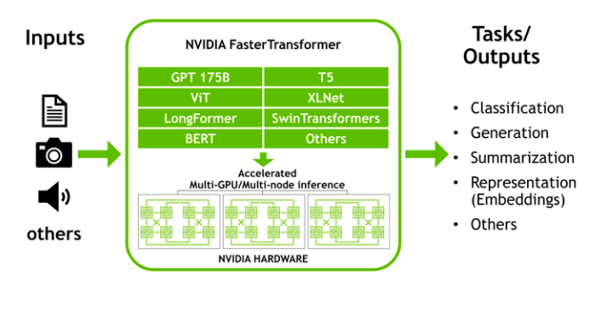
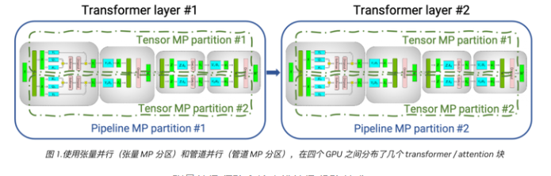
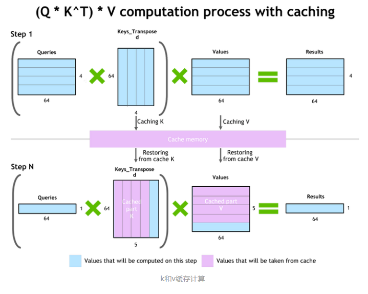

# LLM（大语言模型）部署加速方法——Faster Transformer篇

- [LLM（大语言模型）部署加速方法——Faster Transformer篇](#llm大语言模型部署加速方法faster-transformer篇)
  - [一、为什么需要 FasterTransformer？](#一为什么需要-fastertransformer)
  - [二、FasterTransformer 介绍一下？](#二fastertransformer-介绍一下)
  - [三、FasterTransformer 核心是什么？](#三fastertransformer-核心是什么)
  - [四、FasterTransformer 优化？](#四fastertransformer-优化)
    - [4.1 推理缓存优化](#41-推理缓存优化)
    - [4.2 内存优化](#42-内存优化)
    - [4.3 使用MPI 和 NCCL通信优化](#43-使用mpi-和-nccl通信优化)
    - [4.4 MatMul 内核自动调整（GEMM 自动调整）](#44-matmul-内核自动调整gemm-自动调整)
    - [4.5 量化推理](#45-量化推理)
  - [致谢](#致谢)

## 一、为什么需要 FasterTransformer？

## 二、FasterTransformer 介绍一下？

NVIDIA FasterTransformer (FT) 是一个库，用于实现基于Transformer的神经网络推理的加速引擎，特别强调大型模型，以分布式方式跨越许多 GPU 和节点。

FasterTransformer 包含Transformer块的高度优化版本的实现，其中包含编码器和解码器部分。

使用此模块，您可以运行完整的编码器-解码器架构（如 T5）以及仅编码器模型（如 BERT）或仅解码器模型（如 GPT）的推理。 它是用 C++/CUDA 编写的，依赖于高度优化的 cuBLAS、cuBLASLt 和 cuSPARSELt 库。 这使您可以在 GPU 上构建最快的Transformer推理流程。

> Faster Transformer模型加速推理应用

## 三、FasterTransformer 核心是什么？

> 张量并行 (TP) 和流水线并行 (PP) 技术

跟之前的tensorRT的加速方法对比，**Faster Transformer可以利用多gpu加载Transformer不同的块，推理时更好的利用了gpu运算**。

**当每个张量被分成多个块时，就会发生张量并行性，并且张量的每个块都可以放置在单独的 GPU 上。在计算过程中，每个块在不同的 GPU 上单独并行处理，并且可以通过组合来自多个 GPU 的结果来计算结果（最终张量）**。

**当模型被深度拆分并将不同的完整层放置到不同的 GPU/节点上时，就会发生流水线并行**。

**在底层，启用节点间/节点内通信依赖于 MPI 和 NVIDIA NCCL。使用此软件堆栈，您可以在多个 GPU 上以张量并行模式运行大型Transformer，以减少计算延迟**。

同时，TP 和 PP 可以结合在一起，在多 GPU 和多节点环境中运行具有数十亿和数万亿个参数（相当于 TB 级权重）的大型 Transformer 模型。

除了 C 中的源代码，FasterTransformer 还提供 TensorFlow 集成（使用 TensorFlow 操作）、PyTorch 集成（使用 PyTorch 操作）和 Triton 集成作为后端。

目前，TensorFlow op 仅支持单 GPU，而 PyTorch op 和 Triton 后端都支持多 GPU 和多节点。

为了避免为模型并行性而拆分模型的额外工作，FasterTransformer 还提供了一个工具，用于将模型从不同格式拆分和转换为 FasterTransformer 二进制文件格式。然后 FasterTransformer 可以直接以二进制格式加载模型。

## 四、FasterTransformer 优化？

### 4.1 推理缓存优化

- 动机：因为自回归在推理的时候，像上面vllm的时候讲的会产生非常多的key和value的值，每次都需要重复计算
- 优化策略：对这些产生的缓存分块存储，避免重复计算。

### 4.2 内存优化

- 动机：大模型往往带来极大参数量,就算量化到int4也是个不小的内存占用，GPT-3 175b 使用半精度存储也需要 350 GB；
- 优化策略：Faster Transformer会缓存激活值和输出，在进行新sentence推理时可以重新利用缓存激活值和输出，避免多层反复计算和保存激活值和输出信息，例如GPT-3 中的层数为 96，因此我们只需要 1/96 的内存量用于激活

### 4.3 使用MPI 和 NCCL通信优化

- 张量并行性: FasterTransformer 遵循了 [Megatron](https://arxiv.org/pdf/1909.08053.pdf) 的思想。 **对于自注意力块和前馈网络块，FT 按行拆分第一个矩阵的权重，并按列拆分第二个矩阵的权重。 通过优化，FT 可以将每个 Transformer 块的归约操作减少到两倍**;
- 流水线并行性：FasterTransformer 将整批请求拆分为多个微批，隐藏了通信的泡沫。 FasterTransformer 会针对不同情况自动调整微批量大小;

### 4.4 MatMul 内核自动调整（GEMM 自动调整）

矩阵乘法是基于Transformer的神经网络中主要和最繁重的操作。 **FT 使用来自 CuBLAS 和 CuTLASS 库的功能来执行这些类型的操作**。 重要的是要知道 MatMul 操作可以在“硬件”级别使用不同的低级算法以数十种不同的方式执行。

GemmBatchedEx 函数实现 MatMul 操作，并以“cublasGemmAlgo_t”作为输入参数。 使用此参数，您可以选择不同的底层算法进行操作。

FasterTransformer 库使用此参数对所有底层算法进行实时基准测试，并为模型的参数和您的输入数据（注意层的大小、注意头的数量、隐藏层的大小）选择最佳的一个。 此外，FT 对网络的某些部分使用硬件加速的底层函数，例如 __expf、__shfl_xor_sync。

### 4.5 量化推理

FT 的内核支持使用 fp16 和 int8 中的低精度输入数据进行推理。 由于较少的数据传输量和所需的内存，这两种机制都允许加速。 同时，int8 和 fp16 计算可以在特殊硬件上执行，例如张Tensor Core（适用于从 Volta 开始的所有 GPU 架构），以及即将推出的 Hopper GPU 中的Transformer引擎。

## 致谢

1. LLM（大语言模型）部署加速方法: https://zhuanlan.zhihu.com/p/644001250
2. [NVIDIA/FasterTransformer/](https://github.com/NVIDIA/FasterTransformer/)

