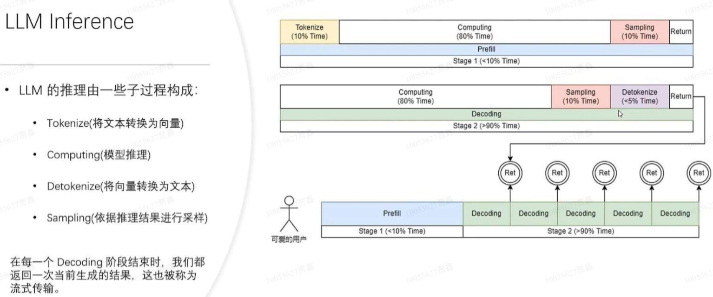
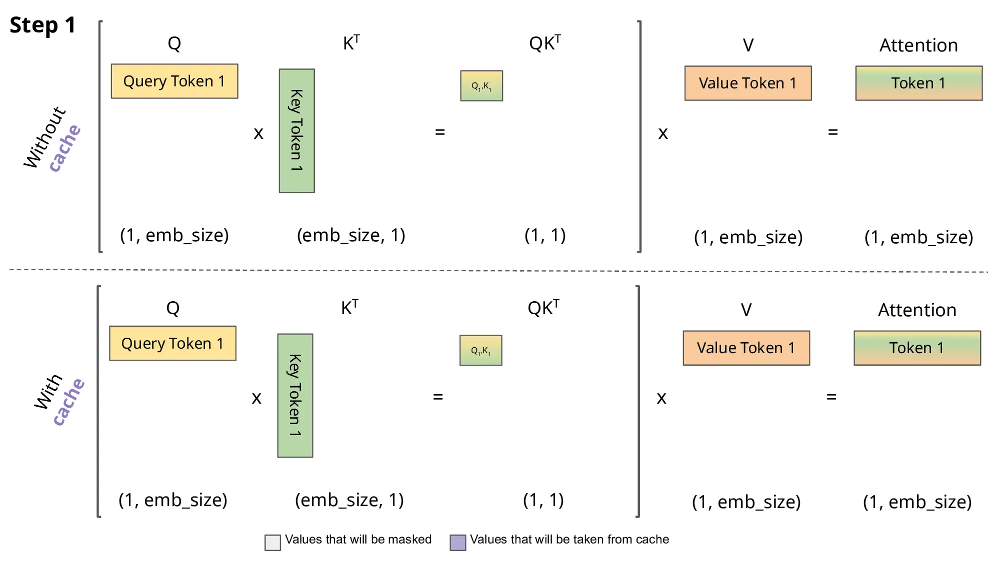
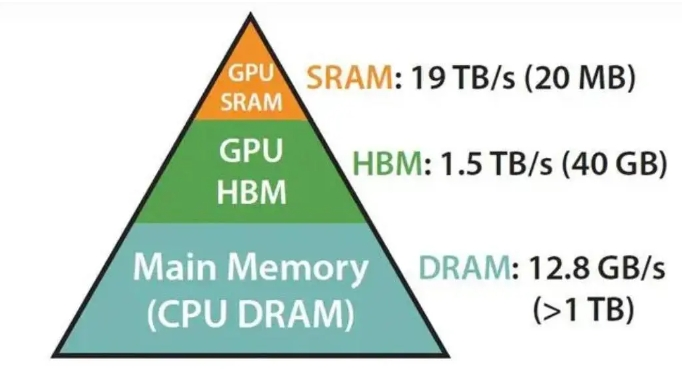
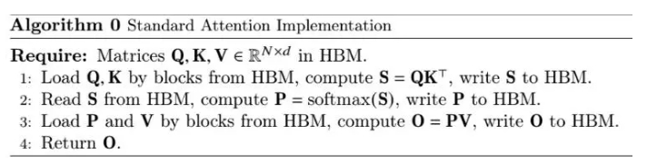
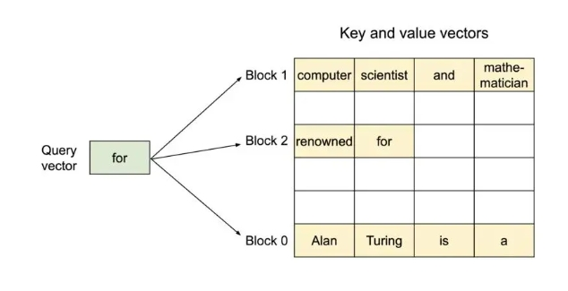
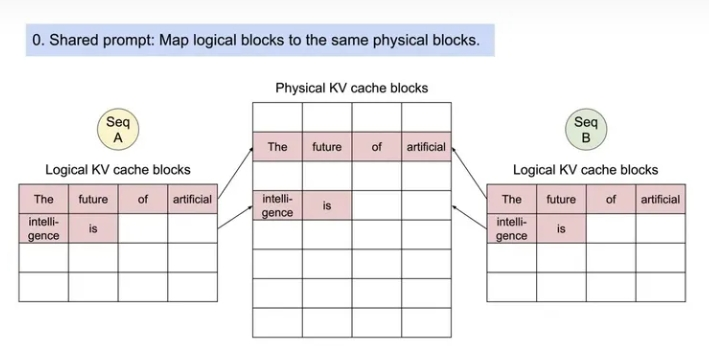

# 大模型（LLMs）推理加速篇

- [大模型（LLMs）推理加速篇](#大模型llms推理加速篇)
  - [1. 推理过程 分哪些阶段？](#1-推理过程-分哪些阶段)
    - [1.1 Prefill（输入理解与初始化）阶段](#11-prefill输入理解与初始化阶段)
    - [1.2 Decoding（递归推理与解码输出）阶段](#12-decoding递归推理与解码输出阶段)
  - [2. 推理性能的评价指标？](#2-推理性能的评价指标)
    - [2.1 Throughput（吞吐量）](#21-throughput吞吐量)
    - [2.2 First Token Latency（首字延迟）](#22-first-token-latency首字延迟)
    - [2.3 Latency（延迟）](#23-latency延迟)
    - [2.4 QPS（每秒请求数）](#24-qps每秒请求数)
  - [3. 当前优化模型最主要技术手段有哪些？](#3-当前优化模型最主要技术手段有哪些)
    - [3.1 KVCache](#31-kvcache)
    - [3.2 分布式推理](#32-分布式推理)
    - [3.3 流水线处理](#33-流水线处理)
    - [3.4 动态批处理](#34-动态批处理)
    - [3.5 低比特量化](#35-低比特量化)
    - [3.6 System Prompt](#36-system-prompt)
    - [3.7 预测生成长度](#37-预测生成长度)
    - [3.8 Flash Attention](#38-flash-attention)
    - [3.9 Paged Attention](#39-paged-attention)
    - [3.10 精简Attention的MHA\\GQA\\MQA技术](#310-精简attention的mhagqamqa技术)
    - [3.11 选择合适的硬件](#311-选择合适的硬件)
  - [4. 推理加速框架有哪一些？都有什么特点？](#4-推理加速框架有哪一些都有什么特点)
  - [5 vLLM 篇](#5-vllm-篇)
    - [5.1 vLLM 的 功能有哪些？](#51-vllm-的-功能有哪些)
    - [5.2 vLLM 的 优点有哪些？](#52-vllm-的-优点有哪些)
    - [5.3 vLLM 的 缺点有哪些？](#53-vllm-的-缺点有哪些)
    - [5.4 vLLM 离线批量推理？](#54-vllm-离线批量推理)
    - [5.5 vLLM API Server？](#55-vllm-api-server)
  - [6 Text generation inference 篇](#6-text-generation-inference-篇)
    - [6.1 介绍一下 Text generation inference？](#61-介绍一下-text-generation-inference)
    - [6.2 Text generation inference 的 功能有哪些？](#62-text-generation-inference-的-功能有哪些)
    - [6.3 Text generation inference 的 优点有哪些？](#63-text-generation-inference-的-优点有哪些)
    - [6.4 Text generation inference 的 缺点有哪些？](#64-text-generation-inference-的-缺点有哪些)
    - [6.5 Text generation inference 的 使用docker运行web server？](#65-text-generation-inference-的-使用docker运行web-server)
  - [致谢](#致谢)


## 1. 推理过程 分哪些阶段？

推理会分成 prefill 和 decoding 两个阶段。

- Prefill ：每一个请求发起后产生的推理过程都会先经历一个 Prefill 过程，prefill 过程会计算用户所有的输入，并生成对应的 KV 缓存；
- decoding：再经历若干个 decoding 过程，每一个 decoding 过程服务器都会生成一个字符，并将其放入到 KV 缓存当中，推理出来的预测结果又放入输入中，如此循环往复，直到推理出最终结果。

新的请求进来在进行完 prefill 之后会不断迭代进行 decoding，每一个 decoding 阶段结束之后都会将结果当场返回给客户。这样的生成过程称为流式传输。



### 1.1 Prefill（输入理解与初始化）阶段

需要计算整个prompt的自注意力。 Embedding 曾将用户提问构建 Word Embedding Matrix，之后会被分成 Q、K、V，其中 Q 在经过 Rotary Embedding 之后直接进入后续 Attention 计算，而 K 在经过 Rotary Embedding 之后会和先前的 V 一同进入 KV cache 之中，以待后续计算。随后进入 Attention 的计算，先前处理完成之后的 Q、K、V 会计算得出 self-attention。具体如下：

1. 用户输入向量化，tokenize 过程将用户输入的文本转换为向量，相对于 prefill 整个阶段来说，大概要占掉 10% 的时间，这是有代价的。
2. 进行真正的 prefill 计算，这一过程会占掉大概 80% 的时间。
3. 进行 sampling，这个过程在 Pytorch 里面一般会用 sample、top p。在大语言模型推理当中会用 argmax。是根据模型的结果生成最后词的一个过程。这个过程会占掉 10% 的时间。
4. 最后将 refill 的结果返回给客户，这需要的时间会比较短，大概占 2% 到 5% 的时间。

### 1.2 Decoding（递归推理与解码输出）阶段

每生成一个token就要计算一次。模型理解了初始序列之后便会开始逐词预测后续文本，每次预测时模型都会基于已知的输入序列和上一步预测出来的词计算出下一个最可能的词汇的概率分布，输入过后，执行和 Prefill 前期一样的操作，随后计算 Attention，此时的 Q 就只是一行向量了（因为只有一个词作为输入），K，V 则依旧是矩阵（新输入的 Embedding 生成的 K，V 向量嵌入 KV cache 原本有的矩阵中，和隐状态融合），一样的计算过程可以得出下一步的输出。这个预测过程会一直持续到达到预设的终止条件，例如生成特定长度的文本、遇到终止符，或是满足某种逻辑条件为止。

Decoding 阶段不需要 tokenize，每一次做 decoding 都会直接从计算开始，整个decoding 过程会占掉 80% 的时间，而后面的 sampling也就是采样生成词的过程，也要占掉 10% 的时间。但它会有一个 detokenize 的时间，detokenize 是指生成了一个词之后，这个生成的词是个向量，需要把它解码回文本，这一操作大概会占掉 5% 的时间，最后将这个生成的词返回给用户。

Decoder 中的 Multi-Head Self-Attention 结构的运算量是极其巨大的，模型宽度、Layer 数量倍增之后，参数量更是急速扩张，推理速度很慢很吃资源。

## 2. 推理性能的评价指标？

### 2.1 Throughput（吞吐量）

吞吐量是指当系统的负载达到最大的时候，在单位时间内能够执行多少个 decoding，即生成多少个字符。

测试吞吐量的方法是，假设所有用户都会在同一时刻到来，并且这些用户问的都是一样的问题，这些用户可以同时启动和结束，且他们生成的文本的长度和输入的文本长度都是一样的。通过使用完全相同的输入，组成一个完整的 batch。在这种情况下，系统的吞吐量会达到最高。

如果用户输入的长度和生成的长度很长，那么系统吞吐量不会很高。

### 2.2 First Token Latency（首字延迟）

当一批用户进入到推理系统之后用户完成 Prefill 阶段的过程需要花多长时间。这也是系统生成第一个字符所需的响应时间。

希望用户在系统上输入问题后得到回答的时间小于 2~3 秒。

与首字延迟最相关的就是用户的输入长度，用户输入的长度越长，首字延迟也会越高

### 2.3 Latency（延迟）

每一个 decoding 所需要的时长。它反映的是大模型每生成一个字符的间隔是多长时间，也就是生成的过程有多么流畅。

大部分情况下希望生成的延迟小于 50 毫秒，也就是一秒钟生成 20 个字符。这样生成是比较流畅的。

主要受到 batch size 的影响，batch size 越大推理延迟也会越大

### 2.4 QPS（每秒请求数）

一秒钟能够处理多少个用户的请求。表示系统中每秒可以处理多少个请求。

有些用户会提前生成完，而有些用户要生成很多长度之后才会结束。所以有很多地方的 GPU 会空闲。因此QPS 并不能够发挥完全的吞吐量优势。吞吐量可能很大，但实际的处理能力可能会很差。

## 3. 当前优化模型最主要技术手段有哪些？

### 3.1 KVCache

在decoding phase中需要计算当前token和之前所有已生成token的attention，因此需要计算所有token的k和v向量，但是前面的token的kv值在每轮decoding中都被重复计算了，因此我们可以把它们存下来，存成两个[seq_len-1, inner_dim]的Tensor，在每轮计算中只需要计算当前token的kv值即可。

KVCache是最简单直接的优化手段，一般模型的默认实现都会自带KVCache因此并不需要额外实现。



### 3.2 分布式推理

在大模型的训练和推理过程中有以下几种主流的分布式并行方式：

- 数据并行（DataParallel）：将模型放在多个GPU上，每个GPU都包含完整的模型，将数据集切分成多份，每个GPU负责推理一部分数据。不需要像训练一样聚合推理结果更新参数，因此我们只需要将模型单独部署在多个GPU上推理即可。
- 流水线并行（PipelineParallel）：将模型纵向拆分，每个GPU只包含模型的一部分层，数据在一个GPU完成运算后，将输出传给下一个GPU继续计算。一般是一台GPU内存无法放下整个模型的妥协之举，各层之间仍然是顺序运行的并不能加速模型的计算，而另外两种并行则可以加速模型的推理。
- 张量并行（TensorParallel）：将模型横向拆分将模型的每一层拆分开，放到不同的GPU上，每一层的计算都需要多个GPU合作完成。张量并行一般使用NVIDIA的Megatron库。

### 3.3 流水线处理

流水线优化是尽可能让显卡利用率占满。推理过程中tokenize、fast sample 和 detokenize 这些过程都与模型的计算无关。在执行 prefill 的过程中，当拿到了 fast sample 的词向量之后就可以立刻开始下一个阶段 decoding不用等到结果返回，因为结果已经在 GPU 上了。而当完成了一次 decoding 后不用等待 detokenize 的完成，可以立刻开始下一次的 decoding。因为 detokenize 是个 CPU 过程，在执行完采样过程之后就已经知道下一个生成的词是什么了，可以立刻开始下一次运算。

### 3.4 动态批处理

在第二个请求进入的时间点，把它的 prefill 阶段和第一个请求对应的decoding 阶段进行混合，生成一个新的阶段称为 Merge Step。在这个 Merge Step 中，不仅会进行第一个请求的 decoding，同时会进行第二个请求的 Prefill。

第一个请求生成过程进行了一半意味着它在进行 decoding 时会有一个长度为 1 的输入，而第二个请求是新进入的在进行 Prefill 的过程当中会有一个长度为 48 的输入。将这两个输入沿着第一个维度相互拼接，拼接完的输入长度为 49，并且 hidden dimension 是 4096 的输入。在这长度为 49 的输入当中，第一个词是第一个请求的，剩下的 48 个词是第二个请求的。

在执行 self attention 算子的过程当中会做一次数据分流，将所有做 decoding 的请求分流成一波，把所有做 prefill 的请求分流到另外一波，执行两个不同的运算。在分流执行完 attention 算子之后，这些用户的输入会再一次被拼接到一起，完成其它算子的计算。

### 3.5 低比特量化

量化(Quantization)是指使用精度更低的单位来表示模型的权重或中间层变量，以节省空间和加速模型推理速度。通过使用更少的位表示数值来显著地减少内存消耗，加速在硬件平台上的推理过程

从时机分类量化分为：

1. 训练时量化（Quantization-Aware Training, QAT)，需要模型重新训练，QAT一般效果是更好的，但是它需要重训模型所以成本会大一些，在fintune阶段会用的比较多一些
2. 训练后量化（Post Training Quantization，PTQ），可以量化预训练好的模型。不需要重新训练。对模型权重值和激活值进行INT8/INT4量化
由于大模型重新训练成本太高一般使用PTQ。一个例外是QLora它是在Lora微调阶段进行量化。

从量化的范围上可以分为：

1. 只量化权重（Weight Only）：只量化模型权重，推理时是INT乘FLOAT
2. 权重与激活同时量化（Weight and Activation）：这里的激活实际是就是每一层的输入，对于矩阵乘法Y = WX，同时量化W和X，推理时是INT乘INT

INT4的Weight Only量化当大模型推理过程中 batch 比较小时在矩阵乘法的计算过程中，90% 的时间都会用来加载权重。前提是 batch 足够的小，使用 INT4 的量化每一次加载权重之后会紧接着进行一个解量化的过程会把权重从 INT4 解量化成 FP16，后面的计算和 FP16 是完全一样的，也就是说 INT4 量化适用于访存密集性的矩阵乘法，其计算过程还是由 FP16 的运算器件去完成的。

当 batch 足够大比如 64 或者 128 时，INT4 Weight Only量化将不会带来任何性能提升。因为如果 batch 足够大，那计算时间会被拉得很长。并且解量化过程所需要的计算量是会随着 batch 提升而提升的，当 batch 达到 128 之后，INT4 的矩阵量化不会比 FP16 矩阵量化快。

对于 INT8 来说，它不需要任何解量化的过程，并且它的计算是可以压缩一倍时间的。在 batch 等于 128 时，从 FP16量化到 INT8，加载权重的时间将会减半，计算的时间也会减半，这会带来百分之百的加速。

一般情况下使用FP8精度推理比使用INT8精度推理可以获得更好的模型效果。

NVIDIA的Ampere架构支持了INT8和INT4的tensor core，Hopper架构支持了FP8的tensor core。

- **权重精度格式（Weight precision format）**：这是指定权重值的数值精度。权重量化的目的是减少模型大小，提高内存效率和加速计算。选择合适的权重精度格式对于保持模型性能和减小模型体积至关重要。
- **激活精度格式（Activation precision format）**：激活值是神经网络层与层之间传递的数据。和权重精度一样，激活精度的选择对于模型的性能和效率有重要影响。

具体到不同的批量推理场景，选择合适的量化方法有不同的考量：

- **小批量推理（batch size ≤ 4）**：在这种场景下，主要考虑的是内存带宽。因此，通常推荐只对权重进行量化的方法，因为这有助于减少模型的内存占用，同时也能加快推理速度。
- **大批量推理，如服务场景（batch size ≥ 16）**：在这种场景下，内存带宽和计算密度都是重要的考量因素。建议选择同时对权重和激活进行量化的方法。对于大于或等于16的批量大小，量化方法的选择可能具体依赖于模型。首先推荐尝试使用FP8格式，因为通常它能提供最佳的性能和准确性。如果结果不符合特定用例的要求，可以进一步尝试使用Int8 SmoothQuant（Int8 SQ）、AWQ或GPTQ。

### 3.6 System Prompt

大模型推理一般都采用流式输出（streaming），LLM推理的首token时延就是用户感受到的LLM推理服务的响应时间，直接影响用户体验。在LLM推理过程中，生成首token是计算密集型任务。在通常应用中，对LLM的每一次请求都可能带着相同的System Prompt作为输入（作为Prompt的一部分）。这样就导致对于用户多次请求，LLM推理需要重复计算System Prompt，造成GPU资源浪费，特别是增加了不必要的首token时延。如果能省去对于System Prompt的重复计算，那将会显著提升首token生成速度。

如果用户每次请求都带有相同的System Prompt (Shared Prefix)，那么可以一次处理System Prompt计算其对应的Key和Value值并缓存在GPU显存中。在处理用户其他请求时对于相同的System Prompt，就不用再重复计算，而是直接从显存中加载就可以显著减少Prefill 计算时间，可以显著减少生成首token的时间。

相对高级的用法是对整个输入Prompt对应的Key和Value值进行Caching操作，不局限于shared prefix。这种方式需要使用Prompt Cache模板，可以针对Prompt的不同部分分别执行KV Cache。

### 3.7 预测生成长度

为每一个请求预测一个它所需的生成长度。每个请求进来之后，都会直接为其分配一个连续的空间，这个连续空间的长度是预测出来的。推荐训练一个模型去做这件事情。

Page Attention 在运行的过程中，具体到一个特定的时间点，比如当前系统上已经有了四个请求，系统里面还剩余 6 块显存没有被分配。这时法知道是否会有新的请求进来能否为其继续提供服务，因为当前的四个请求还没有结束可能未来还要继续为它们追加新的显存块。所以还是需要预测每一个用户实际的生成长度。这样才知道在具体的一个时间点上能不能接受一个新的用户的输入。

### 3.8 Flash Attention

通常的计算任务主要有计算密集型任务和访存密集型任务。

1. 计算密集型：计算耗时集中在计算本身，忽略显存读写。例如：矩阵乘法、大核卷积操作等。这些操作的时常直接取决于 FLOPS
2. 访存密集型：计算耗时集中在访存操作，计算本身耗时较短。例如：ReLU、Dropout、求和、Softmax、BN 操作。这类操作的时常取决于 MAC

GPU也有类似L1、L2这样的分级缓存（SRAM和HBM）。Flash attention推理加速技术是利用GPU硬件非均匀的存储器层次结构实现内存节省和推理加速，致力于将 Attention 计算更多地放到 SRAM 上，从而让计算过程更少对 HBM 访存，从而提升整体性能。



观察下图Attention计算分为三步：

1. 从HBM读取QK，计算S = QK^T，将S写回HBM
2. 从HBM读出S，计算P = softmax(S)，将P写回HBM
3. 从HBM读出P和V，计算O=PV，将O写回HBM



整个计算过程中HBM读三次写三次，有没有办法只读写一次呢？FlashAttention可以在一个循环中计算出一个分块的最终结果，需要不断地对中间结果进行重新计算，但是得益于整个过程不需要读HBM，再增大了计算量的情况下仍然可以提升运算速度。

Flash Attention 的设计理念和我们熟悉的 RISC-V 的设计理念很相似。就像寄存器存取数据快一样，SRAM 也比 HBM 存取快。RISC-V 使用了比 x86 更多的寄存器量用以提升运行效率，Flash Attention 也更多地利用了存取快速的 SRAM 来提升整体的运算速度。

### 3.9 Paged Attention

允许生成过程中不断为用户追加显存。类似于操作系统中的页式存储或者内存分页。当一个请求来到之后，系统会为这个请求分配一小块显存，这一小块显存通常只够生成 8 个字符，当请求生成了 8 个字符之后，系统会追加一块显存，可以把结果再写到这块显存里面，同时系统会维护一个显存块和显存块之间的链表，从而使得算子可以正常地进行输出。当生成的长度不断变长时，会不断地给用户追加显存块的分配。

灵感来自OS系统中虚拟内存和分页的思想。可以实现在不连续的空间存储连续的kv键值。分页注意力将连续的 keys 和 values 散列存储。它将存储每个序列的 KV cache 分成 KV blocks，每个块存储固定长度 tokens 对应的 k、v 向量。每次运算，query（"forth"）向量 qi 与块中 Kj 相乘得出注意力分数Aij，然后将Aij与值向量 Vj 相乘，得出最终的注意力输出 oi。

所有键值都是分布存储的，需要通过分页管理彼此的关系。序列的连续逻辑块通过 block table 映射到非连续物理块。

Paged Attention 带来的分块存储机制使得 vLLM 拥有更加灵活的分页内存管理机制。用户可以通过官方的vLLM库使用Paged Attention


> keys 和 values 散列存储

同一个prompt生成多个输出序列，可以共享计算过程中的attention键值，实现copy-on-write机制，即只有需要修改的时候才会复制从而大大降低显存占用。


> 同一个prompt生成多个输出序列

### 3.10 精简Attention的MHA\GQA\MQA技术

MQA 让所有的头之间共享同一份 Key 和 Value 矩阵，每个头只单独保留了一份 Query 参数从而大大减少 Key 和 Value 矩阵的参数量。

GQA将查询头分成N组，每个组共享一个Key 和 Value 矩阵。

GQA和MQA都可以实现一定程度的Key value的共享，从而可以使模型体积减小，这两种技术的加速原理是（1）减少了数据的读取（2）减少了推理过程中的KV Cache。需要注意的是GQA和MQA需要在模型训练的时候开启，按照相应的模式生成模型。

### 3.11 选择合适的硬件

使用SOTA推理服务框架，对不同硬件不同负载做全面的评估。目前可以批量供给的GPU卡包括 Nvidia H20、L20、A10，以及国产AI芯片（如昇腾910、邃思2.0、昆仑芯XPU 2代等等）。当然还有存量的Nvidia A800、H800、L40S、A30等GPU卡可用于LLM推理服务

## 4. 推理加速框架有哪一些？都有什么特点？

- FasterTransformer：英伟达推出的FasterTransformer不修改模型架构而是在计算加速层面优化 Transformer 的 encoder 和 decoder 模块。具体包括如下： 
  - 尽可能多地融合除了 GEMM 以外的操作
  - 支持 FP16、INT8、FP8
  - 移除 encoder 输入中无用的 padding 来减少计算开销

- TurboTransformers：腾讯推出的 TurboTransformers 由 computation runtime 及 serving framework 组成。加速推理框架适用于 CPU 和 GPU，最重要的是，它可以无需预处理便可处理变长的输入序列。具体包括如下：
  - 与 FasterTransformer 类似，它融合了除 GEMM 之外的操作以减少计算量
  - smart batching，对于一个 batch 内不同长度的序列，它也最小化了 zero-padding 开销
  - 对 LayerNorm 和 Softmax 进行批处理，使它们更适合并行计算
  - 引入了模型感知分配器，以确保在可变长度请求服务期间内存占用较小

## 5 vLLM 篇

### 5.1 vLLM 的 功能有哪些？

- Continuous batching：有iteration-level的调度机制，每次迭代batch大小都有所变化，因此vLLM在大量查询下仍可以很好的工作；
- PagedAttention：受操作系统中虚拟内存和分页的经典思想启发的注意力算法，这就是模型加速的秘诀

### 5.2 vLLM 的 优点有哪些？

1. **文本生成的速度**：实验多次，发现vLLM的推理速度是最快的；
2. **高吞吐量服务**：支持各种解码算法，比如parallel sampling, beam search等；
3. **与OpenAI API兼容**：如果使用OpenAI API，只需要替换端点的URL即可；

### 5.3 vLLM 的 缺点有哪些？

1. **添加自定义模型**：虽然可以合并自己的模型，但如果模型没有使用与vLLM中现有模型类似的架构，则过程会变得更加复杂。例如，增加Falcon的支持，这似乎很有挑战性；
2. **缺乏对适配器（LoRA、QLoRA等）的支持**：当针对特定任务进行微调时，开源LLM具有重要价值。然而，在当前的实现中，没有单独使用模型和适配器权重的选项，这限制了有效利用此类模型的灵活性。
3. **缺少权重量化**：有时，LLM可能不需要使用GPU内存，这对于减少GPU内存消耗至关重要。

### 5.4 vLLM 离线批量推理？

```s
# pip install vllm
from vllm import LLM, SamplingParams


prompts = [
    "Funniest joke ever:",
    "The capital of France is",
    "The future of AI is",
]
sampling_params = SamplingParams(temperature=0.95, top_p=0.95, max_tokens=200)
llm = LLM(model="huggyllama/llama-13b")
outputs = llm.generate(prompts, sampling_params)

for output in outputs:
    prompt = output.prompt
    generated_text = output.outputs[0].text
    print(f"Prompt: {prompt!r}, Generated text: {generated_text!r}")
```

### 5.5 vLLM API Server？

```s
# Start the server:
python -m vllm.entrypoints.api_server --env MODEL_NAME=huggyllama/llama-13b

# Query the model in shell:
curl http://localhost:8000/generate \
    -d '{
        "prompt": "Funniest joke ever:",
        "n": 1,
        "temperature": 0.95,
        "max_tokens": 200
    }'
```

## 6 Text generation inference 篇

### 6.1 介绍一下 Text generation inference？

Text generation inference是用于文本生成推断的Rust、Python和gRPC服务器，在HuggingFace中已有LLM 推理API使用。

### 6.2 Text generation inference 的 功能有哪些？

- 内置服务评估：可以监控服务器负载并深入了解其性能；
- 使用flash attention（和v2）和Paged attention优化transformer推理代码：并非所有模型都内置了对这些优化的支持，该技术可以对未使用该技术的模型可以进行优化；

### 6.3 Text generation inference 的 优点有哪些？

- 所有的依赖项都安装在Docker中：会得到一个现成的环境；
- 支持HuggingFace模型：轻松运行自己的模型或使用任何HuggingFace模型中心；
- 对模型推理的控制：该框架提供了一系列管理模型推理的选项，包括精度调整、量化、张量并行性、重复惩罚等；

### 6.4 Text generation inference 的 缺点有哪些？

- 缺乏对适配器的支持：需要注意的是，尽管可以使用适配器部署LLM（可以参考https://www.youtube.com/watch?v=HI3cYN0c9ZU），但目前还没有官方支持或文档；
- 从源代码（Rust+CUDA内核）编译：对于不熟悉Rust的人，将客户化代码纳入库中变得很有挑战性；
- 文档不完整：所有信息都可以在项目的自述文件中找到。尽管它涵盖了基础知识，但必须在问题或源代码中搜索更多细节；

### 6.5 Text generation inference 的 使用docker运行web server？

```s
mkdir data
docker run --gpus all --shm-size 1g -p 8080:80 \
-v data:/data ghcr.io/huggingface/text-generation-inference:0.9 \
  --model-id huggyllama/llama-13b \
  --num-shard 1
```

## 致谢

- [LLM推理部署（一）：LLM七种推理服务框架总结](https://zhuanlan.zhihu.com/p/653352979)
- AI大模型推理过程和优化技术  https://zhuanlan.zhihu.com/p/689773196

