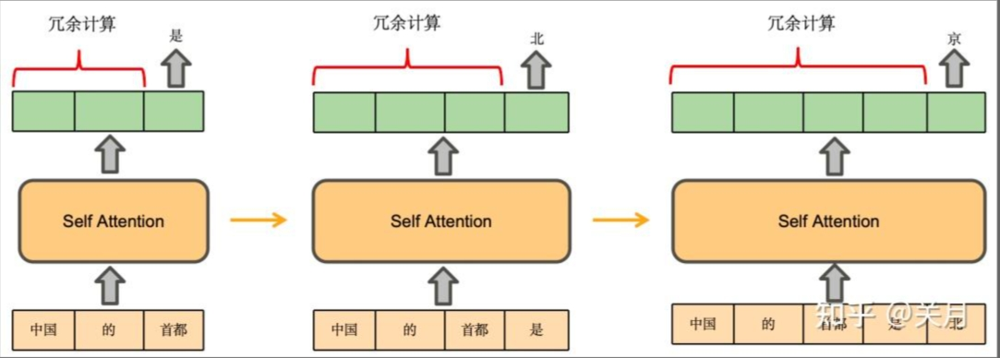
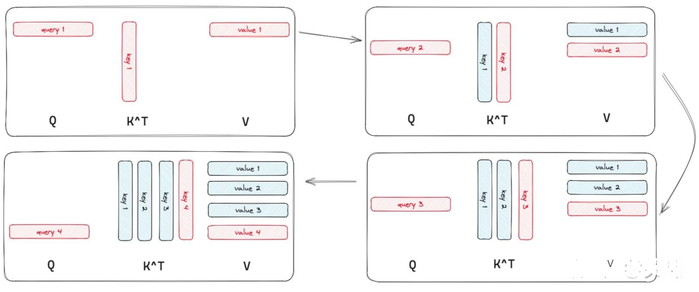
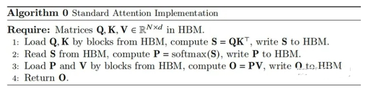
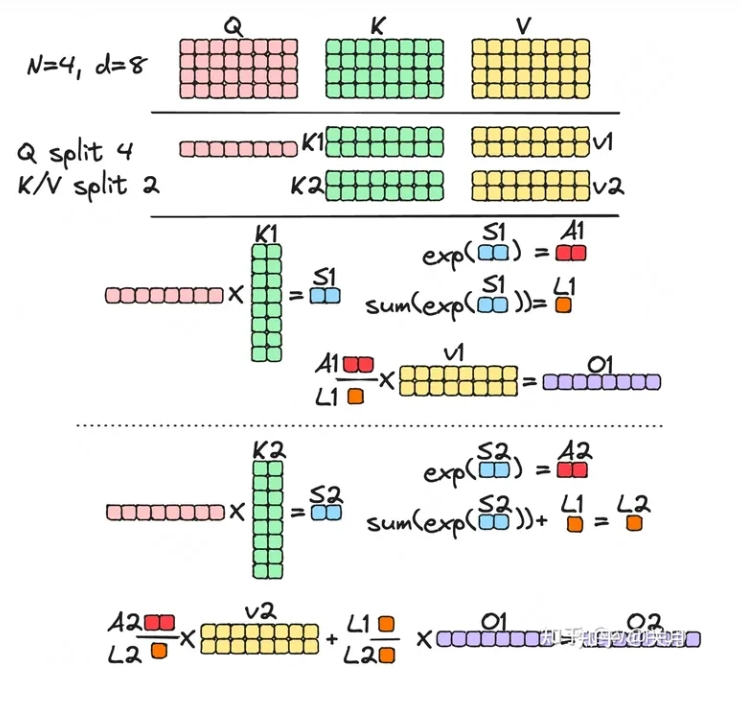
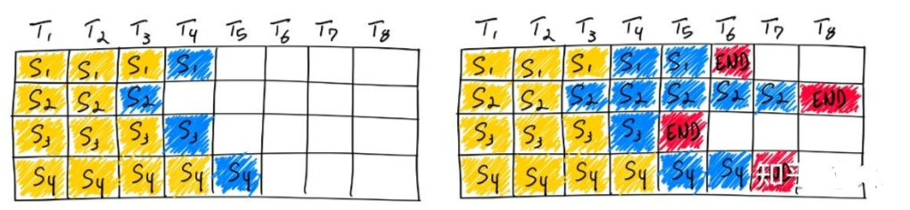
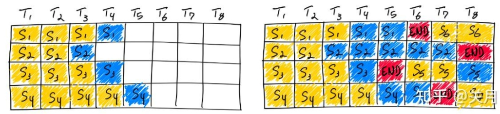
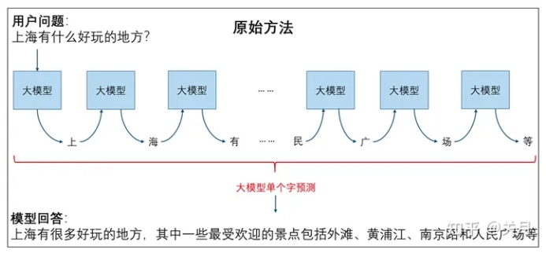
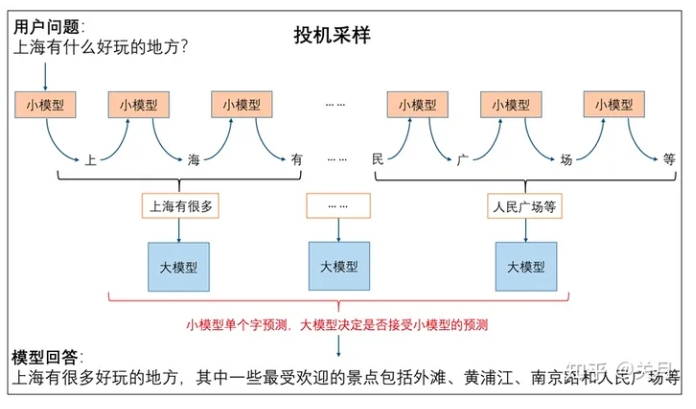
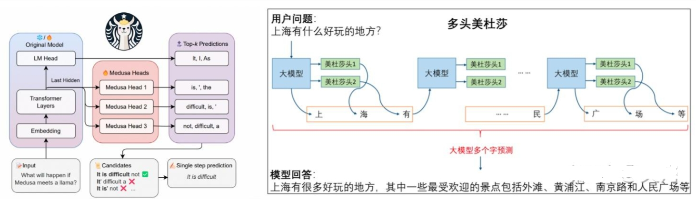
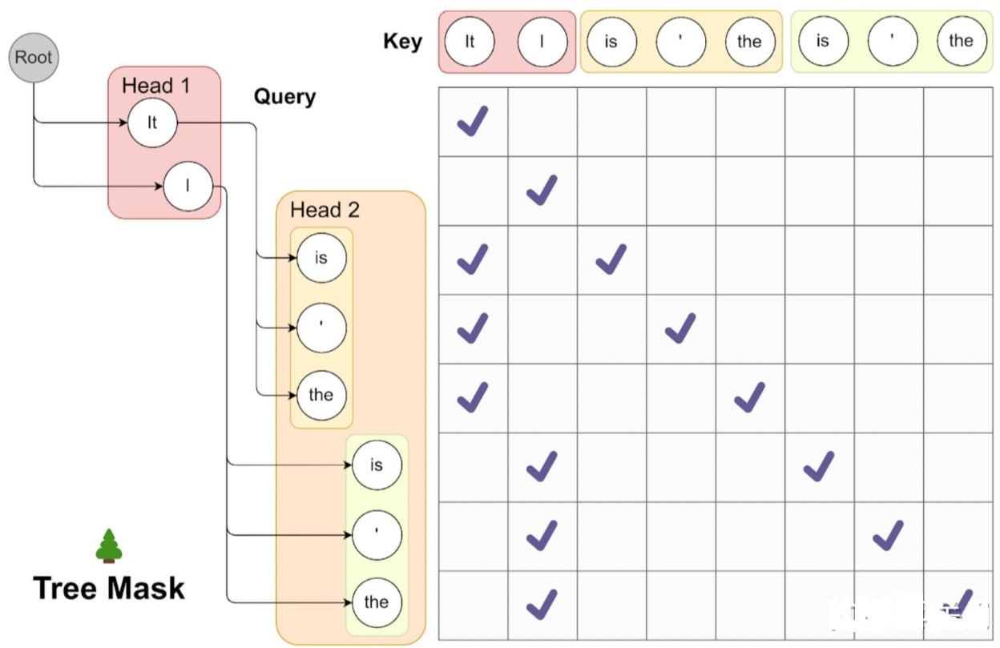

# 大模型(LLM)部署框架对比篇

- [大模型(LLM)部署框架对比篇](#大模型llm部署框架对比篇)
  - [一、为什么需要对大模型推理加速？](#一为什么需要对大模型推理加速)
  - [二、大模型(LLM)部署框架对比总览](#二大模型llm部署框架对比总览)
  - [三、大模型(LLM)部署优化策略](#三大模型llm部署优化策略)
    - [3.1 大模型(LLM)部署优化策略——量化](#31-大模型llm部署优化策略量化)
      - [3.1.1 介绍一下 大模型(LLM)量化方法？](#311-介绍一下-大模型llm量化方法)
      - [3.1.2 一般会对大模型(LLM)中哪些模块进行量化？](#312-一般会对大模型llm中哪些模块进行量化)
      - [3.1.3 大模型(LLM)量化方法](#313-大模型llm量化方法)
    - [3.2 大模型(LLM)部署优化策略——KV Cache](#32-大模型llm部署优化策略kv-cache)
      - [3.2.1 介绍一下 大模型(LLM) KV Cache 方法？](#321-介绍一下-大模型llm-kv-cache-方法)
      - [3.2.2 为什么需要 大模型(LLM) KV Cache 方法？](#322-为什么需要-大模型llm-kv-cache-方法)
    - [3.3 大模型(LLM)部署优化策略——Flash Attention](#33-大模型llm部署优化策略flash-attention)
      - [3.3.1 介绍一下 大模型(LLM) Flash Attention 方法？](#331-介绍一下-大模型llm-flash-attention-方法)
    - [3.4 大模型(LLM)部署优化策略——Paged Attention](#34-大模型llm部署优化策略paged-attention)
      - [3.4.1 介绍一下 大模型(LLM) Paged Attention 方法？](#341-介绍一下-大模型llm-paged-attention-方法)
    - [3.5 大模型(LLM)部署优化策略——Continuous batching](#35-大模型llm部署优化策略continuous-batching)
      - [3.5.1 介绍一下 大模型(LLM) Continuous batching 方法？](#351-介绍一下-大模型llm-continuous-batching-方法)
    - [3.6 大模型(LLM)部署优化策略——Speculative Decoding](#36-大模型llm部署优化策略speculative-decoding)
      - [3.6.1 介绍一下 大模型(LLM) Speculative Decoding 方法？](#361-介绍一下-大模型llm-speculative-decoding-方法)
    - [3.7 大模型(LLM)部署优化策略——Medusa](#37-大模型llm部署优化策略medusa)
      - [3.7.1 介绍一下 大模型(LLM) Medusa 方法？](#371-介绍一下-大模型llm-medusa-方法)
  - [致谢](#致谢)

## 一、为什么需要对大模型推理加速？

大模型推理加速的目标是高吞吐量、低延迟。

- 吞吐量：一个系统可以并行处理的任务量。
- 延时：指一个系统串行处理一个任务时所花费的时间。

## 二、大模型(LLM)部署框架对比总览

<table>
    <tr>
        <td>框架</td>
        <td>llama.cpp</td>
        <td>rtp-llm</td>
        <td>vllm</td>
        <td>TensorRT-LLM</td>
        <td>LMDeploy</td>
        <td>fastllm</td>
    </tr>
    <tr>
        <td>语言</td>
        <td>C++ <a url="https://github.com/ggerganov/llama.cpp">ggerganov/llama.cpp</a></td>
        <td>Python <a url="https://github.com/alibaba/rtp-llm">alibaba/rtp-llm</a></td>
        <td>Python <a url="https://github.com/vllm-project/vllm">vllm-project/vllm</a></td>
        <td>TensorRT-LLM <a url="https://github.com/NVIDIA/TensorRT-LLM">NVIDIA/TensorRT-LLM</a></td>
        <td>LMDeploy <a url="https://github.com/InternLM/lmdeploy/blob/main/README_zh-CN.md">InternLM/lmdeploy</a> </td>
        <td>fastllm <a url="https://github.com/ztxz16/fastllm">ztxz16/fastllm</a> </td>
    </tr>
    <tr>
        <td>特点</td>
        <td>
            1、纯C++推理加速，无任何额外依赖
            2、F16 和 F32混合精度
            3、支持4bit量化
            4、无需GPU、可只用CPU运行
        </td>
        <td>
            1、高性能的 cuda kernel
            2、支持 paged attention 、flash attention2、和 kv cache 量化
        </td>
        <td>
            1、PagedAttention
            2、高性能的 cuda kernel
        </td>
        <td>
            1、高性能CUDA Kernel
            2、量化
        </td>
        <td>
            Continuous Batch，Blocked K/V Cache，动态拆分和融合，张量并行，高性能 kernel等重要特性。推理性能是 vLLM 的 1.8 倍可靠的量化支持权重量化和 k/v 量化。
        </td>
        <td>
            1、纯c++实现
            2、浮点模型（FP32）, 半精度模型(FP16), 量化模型(INT8, INT4) 加速
            3、多卡部署，支持GPU + CPU混合部署支持并发计算时动态拼Batch全平台支持
        </td>
    </tr>
    <tr>
        <td>多模态支持</td>
        <td>✓(llava、mobileVLM、Obsidian等)</td>
        <td>✓(llava、Qwen-VL)</td>
        <td>×</td>
        <td>×</td>
        <td>✓（InternLM、Qwen-VL）</td>
        <td>×</td>
    </tr>
    <tr>
        <td>多平台支持</td>
        <td>✓</td>
        <td>×</td>
        <td>×</td>
        <td>×</td>
        <td>×</td>
        <td>✓</td>
    </tr>
    <tr>
        <td>KV Cache</td>
        <td>✓</td>
        <td>✓</td>
        <td>✓</td>
        <td>✓</td>
        <td>✓</td>
        <td>✓</td>
    </tr>
    <tr>
        <td>量化方法</td>
        <td>int8、int4等各种精度的量化</td>
        <td>kv cache 量化支持 weight only INT8 量化。支持加载时自动量化</td>
        <td>GPTQ、AWQ、SqueezeLLM、FP8 KV 缓存</td>
        <td>INT4/INT8 Weight-Only Quantization (W4A16 & W8A16)SmoothQuantGPTQAWQFP8</td>
        <td>INT4 权重量化K/V 量化W8A8 量化</td>
        <td>INT8, INT4</td>
    </tr>
    <tr>
        <td>高性能Cuda Kernal</td>
        <td>✓</td>
        <td>✓</td>
        <td>✓</td>
        <td>✓</td>
        <td>✓</td>
        <td>✓</td>
    </tr>
    <tr>
        <td>Flash Attention</td>
        <td>✓</td>
        <td>✓</td>
        <td>✓</td>
        <td>✓</td>
        <td>✓</td>
        <td>✓</td>
    </tr>
    <tr>
        <td>Paged Attention</td>
        <td>✓</td>
        <td>✓</td>
        <td>✓</td>
        <td>✓</td>
        <td>✓</td>
        <td>×</td>
    </tr>
    <tr>
        <td>Continuous Batching</td>
        <td>✓</td>
        <td>✓</td>
        <td>✓</td>
        <td>✓</td>
        <td>✓</td>
        <td>✓</td>
    </tr>
    <tr>
        <td>Speculative Decoding（投机采样）</td>
        <td>✓</td>
        <td>✓</td>
        <td>✓</td>
        <td>✓</td>
        <td>×</td>
        <td>×</td>
    </tr>
    <tr>
        <td>Medusa</td>
        <td>✓</td>
        <td>✓</td>
        <td>×</td>
        <td>✓</td>
        <td>×</td>
        <td>×</td>
    </tr>
</table>

## 三、大模型(LLM)部署优化策略

### 3.1 大模型(LLM)部署优化策略——量化

#### 3.1.1 介绍一下 大模型(LLM)量化方法？

大模型量化将16位、32位浮点数的模型参数或激活量化为4位或8位整数能够有效降低模型存储空间和计算资源需求，同时加速推理速度。

#### 3.1.2 一般会对大模型(LLM)中哪些模块进行量化？

量化对象包含**权重、激活、KV Cache量化**

- **仅权重量化**，如：W4A16、AWQ及GPTQ中的W4A16，W8A16（权重量化为INT8，激活仍为BF16或FP16）
- **权重、激活量化**，如：SmoothQuant中的W8A8
- **KV Cache INT8 量化**，LLM 推理时，为了避免冗余计算，设计了 KV Cache 缓存机制，本质上是空间换时间，由于 KV Cache 的存在，对于支持越长的文本长度的 LLM， KV Cache 的显存占用越高。 KV Cache 的量化也是有很必要的。

#### 3.1.3 大模型(LLM)量化方法

weight only INT8、KV Cache量化、int4量化、int8量化

### 3.2 大模型(LLM)部署优化策略——KV Cache

#### 3.2.1 介绍一下 大模型(LLM) KV Cache 方法？

KV Cache 采用**以空间换时间的思想**，复用上次推理的 KV 缓存，可以极大降低内存压力、提高推理性能，而且不会影响任何计算精度。

#### 3.2.2 为什么需要 大模型(LLM) KV Cache 方法？



以 GPT 为代表的一个 token 一个 token 往外蹦的 AIGC 大模型为例，里面最主要的结构就是 transformer 中的 self-attention 结构的堆叠，**实质是将之前计算过的 key-value 以及当前的 query 来生成下一个 token，LM 用于推理的时候就是不断基于前面的所有 token 生成下一个 token，每一轮用上一轮的输出当成新的输入让 LLM 预测，一般这个过程会持续到输出达到提前设定的最大长度或者是 LLM 自己生成了特殊的结束 token**。**其中有存在很多的重复计算，比如token的Key Value的计算，一个方法就是将过去token得到的Key Value存起来，Query不需要存，Q矩阵是依赖于输入的，因此每次都不同，无法进行缓存，因此Q矩阵通常不被缓存**。



### 3.3 大模型(LLM)部署优化策略——Flash Attention

#### 3.3.1 介绍一下 大模型(LLM) Flash Attention 方法？

当输入序列（sequence length）较长时，Transformer的计算过程缓慢且耗费内存，这是因为self-attention的time和memory complexity会随着sequence length的增加成二次增长。GPU中存储单元主要有HBM和SRAM，GPU将数据从显存（HBM）加载至on-chip的SRAM中，然后由SM读取并进行计算，计算结果再通过SRAM返回给显存, HBM容量大但是访问速度慢，SRAM容量小却有着较高的访问速度。普通的Attention的计算过程如下，需要多次访问HBM，Flash Attention的目的就是通过分片+算子融合（矩阵乘法和Softmax）减少对HBM的访问。



将矩阵分片运算，矩阵乘法这些简单，直接拆分计算就可以，但是softmax算子分片计算出来的不是最终的，Flash Attention的通过另外的变量，将softmax优化成了一个可以分片运算的算子。



### 3.4 大模型(LLM)部署优化策略——Paged Attention

#### 3.4.1 介绍一下 大模型(LLM) Paged Attention 方法？

PagedAttention是对kv cache所占空间的分页管理，是一个典型的以内存空间换计算开销的手段，虽然kv cache很重要，但是kv cache所占的空间也确实是大且有浪费的，所以出现了pagedattention来解决浪费问题。kv cache大小取决于seqlen，然而这个东西对于每个batch里面的seq来说是变化的，毕竟不同的人输入不同长度的问题，模型有不同长度的答案回答，kv cache统一按照max seq len来申请，造成现有decoder推理系统浪费了很多显存。

PagedAttention将每个序列的KV缓存分成多个块，每个块包含固定数量的标记的键和值。在注意力计算过程中，PagedAttention Kernel高效地识别和获取这些块，采用并行的方式加速计算。（和ByteTransformer的思想有点像）PagedAttention的核心是一张表，类似于OS的page table，这里叫block table，记录每个seq的kv分布在哪个physical block上，通过把每个seq的kv cache划分为固定大小的physical block，每个block包含了每个句子某几个tokens的一部分kv，允许连续的kv可以不连续分布。在attention compute的时候，pagedattention CUDA kernel就通过block table拿到对应的physical block序号，然后CUDA线程ID计算每个seq每个token的offset从而fetch相应的block，拿到kv，继续做attention的计算。

### 3.5 大模型(LLM)部署优化策略——Continuous batching

#### 3.5.1 介绍一下 大模型(LLM) Continuous batching 方法？



静态批处理：在第一遍迭代（左）中，每个序列从提示词（黄）中生成一个标记（蓝色）。经过几轮迭代（右）后，完成的序列具有不同的尺寸，因为每个序列在不同的迭代结束时产生不同的结束序列标记（红色）。尽管序列3在两次迭代后完成，但静态批处理意味着 GPU 将在批处理中的最后一个序列完成。



动态批处理：一旦批中的一个序列完成生成，就可以在其位置插入一个新的序列，从而实现比静态批处理更高的GPU利用率。

### 3.6 大模型(LLM)部署优化策略——Speculative Decoding

#### 3.6.1 介绍一下 大模型(LLM) Speculative Decoding 方法？





投机采样的关键在于利用小模型多次推理单个字，让大模型进行多字预测，从而提升整体推理效率。每次小模型的单字推理耗时远远小于大模型，因此投机采样能够有效地提高推理效率。这种方法的优 势在于，通过蒸馏学习和投机采样，可以在减小模型规模的同时，保持较高的预测效果和推理速度，从而在实际部署中获得更好的性能优化。

```s
from transformers import AutoModelForCausalLM, AutoTokenizer
import torch

prompt = "Alice and Bob"
checkpoint = "EleutherAI/pythia-1.4b-deduped"
assistant_checkpoint = "EleutherAI/pythia-160m-deduped"
device = "cuda" if torch.cuda.is_available() else "cpu"

tokenizer = AutoTokenizer.from_pretrained(checkpoint)
inputs = tokenizer(prompt, return_tensors="pt").to(device)
# ------------------------------------------------------------------------------------
model = AutoModelForCausalLM.from_pretrained(checkpoint).to(device)
assistant_model = AutoModelForCausalLM.from_pretrained(assistant_checkpoint).to(device)
# ------------------------------------------------------------------------------------
outputs = model.generate(**inputs, assistant_model=assistant_model)
print(tokenizer.batch_decode(outputs, skip_special_tokens=True))
# ['Alice and Bob are sitting in a bar. Alice is drinking a beer and Bob is drinking a']
```

### 3.7 大模型(LLM)部署优化策略——Medusa

#### 3.7.1 介绍一下 大模型(LLM) Medusa 方法？

一次生成多个词，相对于投机采样使用一个小模型一次生成多个词，主要思想是在正常的LLM的基础上，增加几个解码头，并且每个头预测的偏移量是不同的，比如原始的头预测第i个token，而新增的medusa heads分别为预测第i+1，i+2...个token。如上图，并且每个头可以指定topk个结果，这样可以将所有的topk组装成一个一个的候选结果，最后选择最优的结果。



1. 多头美杜莎预测，记录logits
2. 预测的token组合输入大模型，token的组合太多了，每个分别输入大模型判断耗时太长，Madusa提出了下图所示的树形注意力机制，预测的所有token可以同时输入进大模型，输出logits概率进行判别是否接受以及接收长度。
3. 选择最优，重复1



多头美杜莎还会面临的一个问题是随着美杜莎头数量增加，top-k的树状分支也将会以指数增长，造成庞大的计算开销。此外，许多基础和微调模型并没有开放其训练数据集，因此多头美杜莎面临的另一大问题是使用什么数据来训练美杜莎头。

## 致谢

- 大模型推理加速调研（框架、方法）  https://zhuanlan.zhihu.com/p/683986024
 