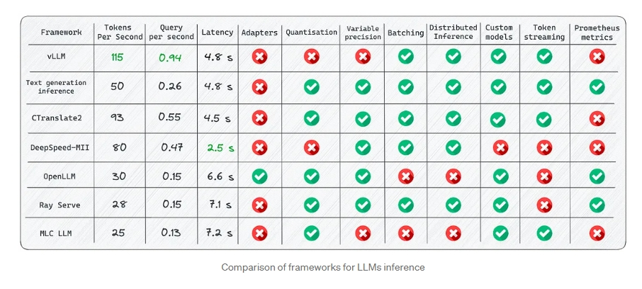
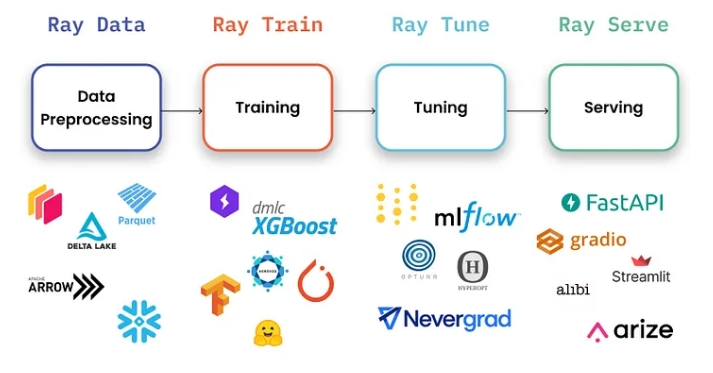
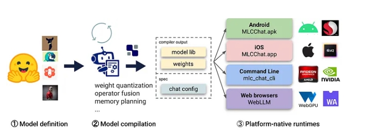
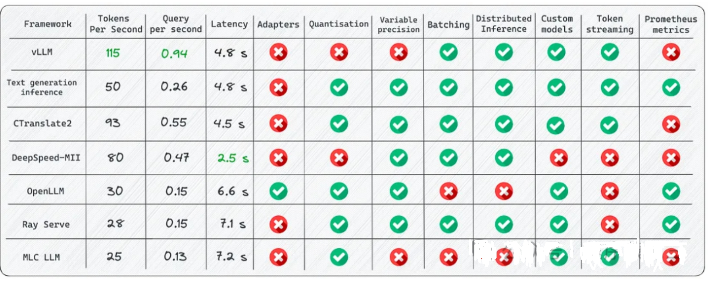
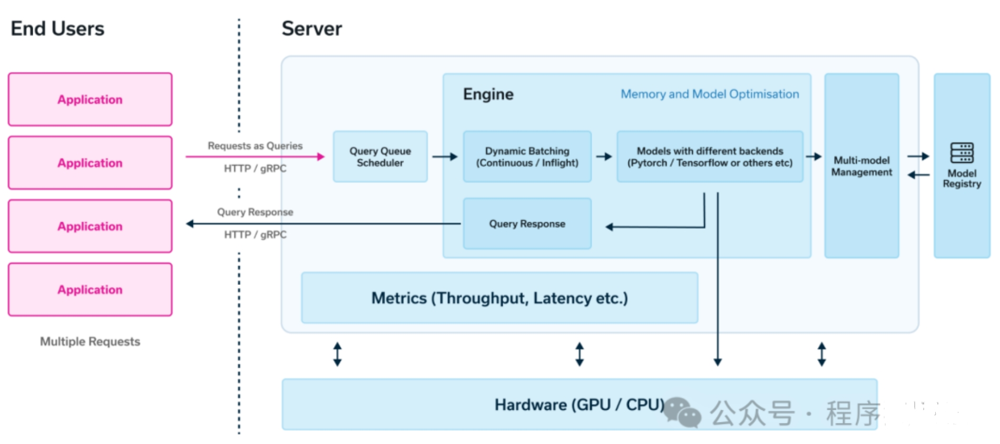

# 大模型(LLM)部署框架对比

## 一、你知道都有哪些 LLMs 部署框架，能不能简单介绍一下？

1. vLLM[1]：适用于大批量Prompt输入，并对推理速度要求高的场景；
2. Text generation inference[2]：依赖HuggingFace模型，并且不需要为核心模型增加多个adapter的场景；
3. CTranslate2[3]：可在CPU上进行推理；
4. OpenLLM[4]：为核心模型添加adapter并使用HuggingFace Agents，尤其是不完全依赖PyTorch；
5. Ray Serve[5]：稳定的Pipeline和灵活的部署，它最适合更成熟的项目；
6. MLC LLM[6]：可在客户端（边缘计算）（例如，在Android或iPhone平台上）本地部署LLM；
7. DeepSpeed-MII[7]：使用DeepSpeed库来部署LLM；



## 二、大模型(LLM)部署框架对比篇

### 2.1 vLLM 篇

> 使用vLLM的开发路线可以参考：https://github.com/vllm-project/vllm/issues/244

#### 2.1.1 vLLM 特点介绍

一个开源的大模型推理加速框架，通过PagedAttention高效地管理attention中缓存的张量，实现了比HuggingFace Transformers高14-24倍的吞吐量。它兼容OpenAI的接口服务，并与HuggingFace模型无缝集成。


> vLLM 评分

vLLM的吞吐量比HuggingFace Transformers（HF）高14x-24倍，比HuggingFace Text Generation Inference（TGI）高2.2x-2.5倍。

#### 2.1.2 vLLM 使用介绍

##### 2.1.2.1 vLLM 离线批量推理

```s
# pip install vllm
from vllm import LLM, SamplingParams

prompts = [
    "Funniest joke ever:",
    "The capital of France is",
    "The future of AI is",
]
sampling_params = SamplingParams(temperature=0.95, top_p=0.95, max_tokens=200)
llm = LLM(model="huggyllama/llama-13b")
outputs = llm.generate(prompts, sampling_params)

for output in outputs:
    prompt = output.prompt
    generated_text = output.outputs[0].text
    print(f"Prompt: {prompt!r}, Generated text: {generated_text!r}")
```

##### 2.1.2.2 vLLM API Server

```s
# Start the server:
python -m vllm.entrypoints.api_server --env MODEL_NAME=huggyllama/llama-13b

# Query the model in shell:
curl http://localhost:8000/generate \
    -d '{
        "prompt": "Funniest joke ever:",
        "n": 1,
        "temperature": 0.95,
        "max_tokens": 200
    }'
```

#### 2.1.3 vLLM 功能介绍

- Continuous batching[9]：有iteration-level的调度机制，每次迭代batch大小都有所变化，因此vLLM在大量查询下仍可以很好的工作。
- PagedAttention[10]：受操作系统中虚拟内存和分页的经典思想启发的注意力算法，这就是模型加速的秘诀。

#### 2.1.4 vLLM 优点

- **高效的服务吞吐量**：vLLM可以快速处理大量的并发请求。
- **支持模型种类多**。
- **内存高效**：vLLM使用了一种名为PagedAttention的技术，可以高效地管理注意力键和值的内存
- **文本生成的速度**：实验多次，发现vLLM的推理速度是最快的；
- **高吞吐量服务**：支持各种解码算法，比如parallel sampling, beam search等；
- **与OpenAI API兼容**：如果使用OpenAI API，只需要替换端点的URL即可；

#### 2.1.5 vLLM 缺点

- 你需要确保你的设备有GPU，CUDA或者RoCm.
- **添加自定义模型**：虽然可以合并自己的模型，但如果模型没有使用与vLLM中现有模型类似的架构，则过程会变得更加复杂。例如，增加Falcon的支持，这似乎很有挑战性；
- **缺乏对适配器（LoRA、QLoRA等）的支持**：当针对特定任务进行微调时，开源LLM具有重要价值。然而，在当前的实现中，没有单独使用模型和适配器权重的选项，这限制了有效利用此类模型的灵活性。
- **缺少权重量化**：有时，LLM可能不需要使用GPU内存，这对于减少GPU内存消耗至关重要。

这是LLM推理最快的库。得益于其内部优化，它显著优于竞争对手。尽管如此，它在支持有限范围的模型方面确实存在弱点。

### 2.2 Text generation inference 篇

> 使用Text generation inference的开发路线可以参考：https://github.com/huggingface/text-generation-inference/issues/232

#### 2.2.1 Text generation inference 特点介绍


> Text generation inference 评分

#### 2.2.2 Text generation inference 使用介绍

##### 2.2.2.1 使用docker运行web server

```s
mkdir data
docker run --gpus all --shm-size 1g -p 8080:80 \
-v data:/data ghcr.io/huggingface/text-generation-inference:0.9 \
  --model-id huggyllama/llama-13b \
  --num-shard 1
```

##### 2.2.2.2 查询实例

```s
mkdir data
docker run --gpus all --shm-size 1g -p 8080:80 \
-v data:/data ghcr.io/huggingface/text-generation-inference:0.9 \
  --model-id huggyllama/llama-13b \
  --num-shard 1
```

#### 2.2.3 Text generation inference 功能介绍

- **内置服务评估**：可以监控服务器负载并深入了解其性能；
- **使用flash attention（和v2）和Paged attention优化transformer推理代码**：并非所有模型都内置了对这些优化的支持，该技术可以对未使用该技术的模型可以进行优化；

#### 2.2.4 Text generation inference 优点

- **所有的依赖项都安装在Docker中**：会得到一个现成的环境；
- **支持HuggingFace模型**：轻松运行自己的模型或使用任何HuggingFace模型中心；
- **对模型推理的控制**：该框架提供了一系列管理模型推理的选项，包括精度调整、量化、张量并行性、重复惩罚等；

#### 2.2.5 Text generation inference 缺点

- **缺乏对适配器的支持**：需要注意的是，尽管可以使用适配器部署LLM（可以参考https://www.youtube.com/watch?v=HI3cYN0c9ZU），但目前还没有官方支持或文档；
- **从源代码（Rust+CUDA内核）编译**：对于不熟悉Rust的人，将客户化代码纳入库中变得很有挑战性；
- **文档不完整**：所有信息都可以在项目的自述文件中找到。尽管它涵盖了基础知识，但必须在问题或源代码中搜索更多细节；

### 2.3 CTranslate2 篇

#### 2.3.1 CTranslate2 特点介绍


CTranslate2是一个C++和Python库，用于使用Transformer模型进行高效推理。

#### 2.3.2 CTranslate2 使用介绍

##### 2.3.2.1 CTranslate2 转换模型

```s
pip install -qqq transformers ctranslate2

# The model should be first converted into the CTranslate2 model format:
ct2-transformers-converter --model huggyllama/llama-13b --output_dir llama-13b-ct2 --force
```

##### 2.3.2.2 CTranslate2 查询实例

```s
import ctranslate2
import transformers

generator = ctranslate2.Generator("llama-13b-ct2", device="cuda", compute_type="float16")
tokenizer = transformers.AutoTokenizer.from_pretrained("huggyllama/llama-13b")

prompt = "Funniest joke ever:"
tokens = tokenizer.convert_ids_to_tokens(tokenizer.encode(prompt))
results = generator.generate_batch(
    [tokens], 
    sampling_topk=1, 
    max_length=200, 
)
tokens = results[0].sequences_ids[0]
output = tokenizer.decode(tokens)
print(output)
```

#### 2.3.3 CTranslate2 功能介绍

- **在CPU和GPU上快速高效地执行**：得益于内置的一系列优化：层融合、填充去除、批量重新排序、原位操作、缓存机制等。推理LLM更快，所需内存更少；
- **动态内存使用率**：由于CPU和GPU上都有缓存分配器，内存使用率根据请求大小动态变化，同时仍能满足性能要求；
- **支持多种CPU体系结构**：该项目支持x86–64和AArch64/ARM64处理器，并集成了针对这些平台优化的多个后端：英特尔MKL、oneDNN、OpenBLAS、Ruy和Apple Accelerate；

#### 2.3.4 CTranslate2 优点介绍

- **并行和异步执行**--可以使用多个GPU或CPU核心并行和异步处理多个批处理；
- **Prompt缓存**——在静态提示下运行一次模型，缓存模型状态，并在将来使用相同的静态提示进行调用时重用；
- **磁盘上的轻量级**--量化可以使模型在磁盘上缩小4倍，而精度损失最小；

#### 2.3.5 CTranslate2 缺点介绍

- **没有内置的REST服务器**——尽管仍然可以运行REST服务器，但没有具有日志记录和监控功能的现成服务
- **缺乏对适配器（LoRA、QLoRA等）的支持**

### 2.4 DeepSpeed-MII 篇

#### 2.4.1 DeepSpeed-MII 特点介绍

微软出品的高性能推理框架，DeepSpeed-MII 利用分块 KV 缓存和动态分割融合连续批处理，提供了比vLLM更好的吞吐。


在DeepSpeed支持下，DeepSpeed-MII可以进行低延迟和高通量推理。

#### 2.4.2 DeepSpeed-MII 使用介绍

##### 2.4.2.1 运行web服务

```s
# DON'T INSTALL USING pip install deepspeed-mii
# git clone https://github.com/microsoft/DeepSpeed-MII.git
# git reset --hard 60a85dc3da5bac3bcefa8824175f8646a0f12203
# cd DeepSpeed-MII && pip install .
# pip3 install -U deepspeed

# ... and make sure that you have same CUDA versions:
# python -c "import torch;print(torch.version.cuda)" == nvcc --version
import mii

mii_configs = {
    "dtype": "fp16",
    'max_tokens': 200,
    'tensor_parallel': 1,
    "enable_load_balancing": False
}
mii.deploy(task="text-generation",
           model="huggyllama/llama-13b",
           deployment_name="llama_13b_deployment",
           mii_config=mii_configs)
```

##### 2.4.2.2 查询实例

```s
import mii

generator = mii.mii_query_handle("llama_13b_deployment")
result = generator.query(  
  {"query": ["Funniest joke ever:"]}, 
  do_sample=True,
  max_new_tokens=200
)
print(result)
```

##### 2.4.2.3 DeepSpeed-MII 功能介绍

- **多个副本上的负载平衡**：这是一个非常有用的工具，可用于处理大量用户。负载均衡器在各种副本之间高效地分配传入请求，从而缩短了应用程序的响应时间。
- **非持久部署**：目标环境的部署不是永久的，需要经常更新的，这在资源效率、安全性、一致性和易管理性至关重要的情况下，这是非常重要的。

#### 2.4.3 DeepSpeed-MII 优点介绍

- **支持不同的模型库**：支持多个开源模型库，如Hugging Face、FairSeq、EluetherAI等；
- **量化延迟和降低成本**：可以显著降低非常昂贵的语言模型的推理成本；
- **Native和Azure集成**：微软开发的MII框架提供了与云系统的出色集成；

#### 2.4.4 DeepSpeed-MII 缺点介绍

- **支持模型的数量有限**：不支持Falcon、LLaMA2和其他语言模型；
- **缺乏对适配器（LoRA、QLoRA等）的支持**；

### 2.5 OpenLLM 篇

#### 2.5.1 OpenLLM 特点介绍


OpenLLM是一个用于在生产中操作大型语言模型（LLM）的开放平台。

#### 2.5.2 OpenLLM 使用介绍

##### 2.5.2.1 运行web服务

```s
pip install openllm scipy
openllm start llama --model-id huggyllama/llama-13b \
  --max-new-tokens 200 \
  --temperature 0.95 \
  --api-workers 1 \
  --workers-per-resource 1
```

##### 2.5.2.2 查询实例

```s
import openllm

client = openllm.client.HTTPClient('http://localhost:3000')
print(client.query("Funniest joke ever:"))
```

#### 2.5.3 OpenLLM 功能介绍

- **适配器支持**：可以将要部署的LLM连接多个适配器，这样可以只使用一个模型来执行几个特定的任务；
- **支持不同的运行框架**：比如Pytorch（pt）、Tensorflow（tf）或Flax（亚麻）；
- **HuggingFace Agents**[11]：连接HuggingFace上不同的模型，并使用LLM和自然语言进行管理；

#### 2.5.4 OpenLLM 优点介绍

- **良好的社区支持**：不断开发和添加新功能；
- **集成新模型**：可以添加用户自定义模型；
- **量化**：OpenLLM支持使用bitsandbytes[12]和GPTQ[13]进行量化；
- **LangChain集成**：可以使用LangChian与远程OpenLLM服务器进行交互；

#### 2.5.5 OpenLLM 缺点介绍

- 缺乏批处理支持：对于大量查询，这很可能会成为应用程序性能的瓶颈；
- 缺乏内置的分布式推理——如果你想在多个GPU设备上运行大型模型，你需要额外安装OpenLLM的服务组件Yatai[14]；

### 2.6 Ray Serve 篇

#### 2.6.1 Ray Serve 特点介绍


Ray Serve是一个可扩展的模型服务库，用于构建在线推理API。Serve与框架无关，因此可以使用一个工具包来为深度学习模型的所有内容提供服务。



#### 2.6.2 Ray Serve 使用介绍

##### 2.6.2.1 运行web服务

```s
# pip install ray[serve] accelerate>=0.16.0 transformers>=4.26.0 torch starlette pandas
# ray_serve.py
import pandas as pd

import ray
from ray import serve
from starlette.requests import Request

@serve.deployment(ray_actor_options={"num_gpus": 1})
class PredictDeployment:
    def __init__(self, model_id: str):
        from transformers import AutoModelForCausalLM, AutoTokenizer
        import torch

        self.model = AutoModelForCausalLM.from_pretrained(
            model_id,
            torch_dtype=torch.float16,
            device_map="auto",
        )
        self.tokenizer = AutoTokenizer.from_pretrained(model_id)

    def generate(self, text: str) -> pd.DataFrame:
        input_ids = self.tokenizer(text, return_tensors="pt").input_ids.to(
            self.model.device
        )
        gen_tokens = self.model.generate(
            input_ids,
            temperature=0.9,
            max_length=200,
        )
        return pd.DataFrame(
            self.tokenizer.batch_decode(gen_tokens), columns=["responses"]
        )

    async def __call__(self, http_request: Request) -> str:
        json_request: str = await http_request.json()
        return self.generate(prompt["text"])

deployment = PredictDeployment.bind(model_id="huggyllama/llama-13b")

# then run from CLI command:
# serve run ray_serve:deployment
```

##### 2.6.2.2 查询实例

```s
import requests
sample_input = {"text": "Funniest joke ever:"}
output = requests.post("http://localhost:8000/", json=[sample_input]).json()
print(output)
```

#### 2.6.3 Ray Serve 功能介绍

- **监控仪表板和Prometheus度量**：可以使用Ray仪表板来获得Ray集群和Ray Serve应用程序状态；
- **跨多个副本自动缩放**：Ray通过观察队列大小并做出添加或删除副本的缩放决策来调整流量峰值；
- **动态请求批处理**：当模型使用成本很高，为最大限度地利用硬件，可以采用该策略；

#### 2.6.4 Ray Serve 优点

- **文档支持**：开发人员几乎为每个用例撰写了许多示例；
- **支持生产环境部署**：这是本列表中所有框架中最成熟的；
- **本地LangChain集成**：您可以使用LangChian与远程Ray Server进行交互；

#### 2.6.5 Ray Serve 缺点

- **缺乏内置的模型优化**：Ray Serve不专注于LLM，它是一个用于部署任何ML模型的更广泛的框架，必须自己进行优化；
- **入门门槛高**：该库功能多，提高了初学者进入的门槛；

如果需要最适合生产的解决方案，而不仅仅是深度学习，Ray Serve是一个不错的选择。它最适合于可用性、可扩展性和可观察性非常重要的企业。此外，还可以使用其庞大的生态系统进行数据处理、模型训练、微调和服务。最后，从OpenAI到Shopify和Instacart等公司都在使用它。

### 2.7 MLC LLM 篇

#### 2.7.1 MLC LLM 特点介绍


LLM的机器学习编译（MLC LLM）是一种通用的部署解决方案，它使LLM能够利用本机硬件加速在消费者设备上高效运行。



#### 2.7.2 MLC LLM 使用介绍

##### 2.7.2.1 运行web服务

```s
# 1. Make sure that you have python >= 3.9
# 2. You have to run it using conda:
conda create -n mlc-chat-venv -c mlc-ai -c conda-forge mlc-chat-nightly
conda activate mlc-chat-venv

# 3. Then install package:
pip install --pre --force-reinstall mlc-ai-nightly-cu118 \
  mlc-chat-nightly-cu118 \
  -f https://mlc.ai/wheels

# 4. Download the model weights from HuggingFace and binary libraries:
git lfs install && mkdir -p dist/prebuilt && \
  git clone https://github.com/mlc-ai/binary-mlc-llm-libs.git dist/prebuilt/lib && \
  cd dist/prebuilt && \  
  git clone https://huggingface.co/huggyllama/llama-13b dist/ && \
  cd ../..
  
# 5. Run server:
python -m mlc_chat.rest --device-name cuda --artifact-path dist
```

##### 2.7.2.2 查询实例

```s
import requests

payload = {
   "model": "lama-30b",
   "messages": [{"role": "user", "content": "Funniest joke ever:"}],
   "stream": False
}
r = requests.post("http://127.0.0.1:8000/v1/chat/completions", json=payload)
print(r.json()['choices'][0]['message']['content'])
```

#### 2.7.3 MLC LLM 功能介绍

- **平台本机运行时**：可以部署在用户设备的本机环境上，这些设备可能没有现成的Python或其他必要的依赖项。应用程序开发人员只需要将MLC编译的LLM集成到他们的项目中即可；
- **内存优化**：可以使用不同的技术编译、压缩和优化模型，从而可以部署在不同的设备上；

#### 2.7.4 MLC LLM 优点介绍

- **所有设置均可在JSON配置中完成**：在单个配置文件中定义每个编译模型的运行时配置；
- **预置应用程序**：可以为不同的平台编译模型，比如C++用于命令行，JavaScript用于web，Swift用于iOS，Java/Kotlin用于Android；

#### 2.7.5 MLC LLM 缺点介绍

- **使用LLM模型的功能有限**：不支持适配器，无法更改精度等，该库主要用于编译不同设备的模型；
- **只支持分组量化**[15]：这种方法表现良好，但是在社区中更受欢迎的其他量化方法（bitsandbytes和GPTQ）不支持；
- **复杂的安装**：安装需要花几个小时，不太适合初学者开发人员；

如果需要在iOS或Android设备上部署应用程序，这个库正是你所需要的。它将允许您快速地以本机方式编译模型并将其部署到设备上。但是，如果需要一个高负载的服务器，不建议选择这个框架。

### 2.8 transformers 篇

#### 2.8.1 transformers 介绍

Hugging Face推出的库

#### 2.8.2 transformers 优点

- 自动模型下载
- 提供代码片段
- 非常适合实验和学习

#### 2.8.3 transformers 缺点

- 需要对ML和NLP有深入了解
- 需要编码和配置技能

### 2.9 HuggingFace TGI (Text Generation Inference) 篇

#### 2.9.1 HuggingFace TGI (Text Generation Inference) 介绍

作为支持HuggingFace Inference API的工具，旨在支持大型语言模型的优化推理。它支持多GPU多节点扩展，可推理万亿规模参数

#### 2.9.2 HuggingFace TGI (Text Generation Inference) 优点

- 简单的启动LLM
- 使用Flash Attention和Paged Attention进行推理的优化的transformers代码
- 使用bitsandbytes GPT-Q EETQ AWQ Safetensors进行量化
- 使用 Open Telemetry，Prometheus 指标进行分布式跟

#### 2.9.3 HuggingFace TGI (Text Generation Inference) 缺点

需要处理的任务或数据与TGI的优化技巧不匹配时，使用传统的Transformer推理可能会更合适。目前测试效果TGI的推理速度不如vLLM。

- **缺乏对适配器的支持**：需要注意的是，尽管可以使用适配器部署LLM但目前还没有官方支持或文档；
- **从源代码（Rust+CUDA内核）编译**：对于不熟悉Rust的人，将客户化代码纳入库中变得很有挑战性；
- **文档不完整**：所有信息都可以在项目的自述文件中找到。尽管它涵盖了基础知识，但必须在问题或源代码中搜索更多细节；

#### 2.9.4 HuggingFace TGI (Text Generation Inference) 和 Transformer 区别

Text Generation Inference（TGI）和Transformer模型的推理方式有一些区别，主要体现在以下几个方面：

- **并行计算**：TGI和Transformer都支持并行计算，但TGI更进一步，它使用了Rust和Python联用的方式，实现了服务效率和业务灵活性的平衡。这使得TGI在处理大型语言模型时，能够更有效地利用计算资源，提高推理效率。
- **优化技巧**：TGI引入了一些优化技巧，如continuous batching、Flash Attention和Paged Attention等，这些技巧可以进一步提高推理的效率和性能1。而传统的Transformer模型可能没有这些优化技巧。
- **模型支持**：TGI支持部署GPTQ模型服务，这使得我们可以在单卡上部署拥有continuous batching功能的，更大的模型。而传统的Transformer模型可能没有这样的支持。

### 2.10 Llama.cpp 篇

#### 2.10.1 Llama.cpp 介绍

Llama.cpp是一个基于C++的推理引擎，专门为Apple Silicon优化，可以运行Meta的Llama2模型。它针对GPU和CPU都做了推理优化。

#### 2.10.2 Llama.cpp 优点

性能高于基于Python的解决方案，支持在适度的硬件上运行大型模型，如Llama 7B，并提供绑定，可以用其他语言构建AI应用程序，同时通过Llama.cpp运行推理。

#### 2.10.3 Llama.cpp 缺点

模型支持有限，需要构建工具。

### 2.11 Llamafile 篇

#### 2.11.1 Llamafilep 介绍

由Mozilla开发，基于C++开发,它使用了llama.cpp，这是一个C++库，提供了运行自托管大型语言模型（LLMs）所需的各种功能。通过llama.cpp，开发人员可以轻松地创建、加载和运行LLM模型，而无需担心底层环境的复杂性。此外，Llamafile还提供了一个简洁的API接口，使得开发人员可以更加方便地与LLM进行交互，从而实现各种复杂的应用场景.

#### 2.11.2 Llamafile 优点

与Llama.cpp相同的速度优势，你可以构建一个嵌入模型的单个可执行文件。

#### 2.11.3 Llamafile 缺点

项目仍处于早期阶段，不是所有模型都支持，只支持Llama.cpp支持的模型。

### 2.12 Ollama 篇

#### 2.12.1 Ollama 介绍

是Llama.cpp和Llamafile的一个更加用户友好的替代品。你下载一个可执行文件，它会在你的机器上安装一个服务。安装完成后，你打开一个终端并运行。

#### 2.12.2 Ollama 优点

易于安装和使用，可以运行llama和vicuña模型，运行速度非常快。

#### 2.12.3 Ollama 缺点

提供有限的模型库，自己管理模型，你不能重用自己的模型，无法调整选项来运行LLM，暂时没有Windows版本。

### 2.13 TensorRT-LLM 篇

#### 2.13.1 TensorRT-LLM 介绍

英伟达新推出了TensorRT-LLM，相对来说更加易用，后续FasterTransformer将不再维护了。

#### 2.13.2 TensorRT-LLM 优点

- 层融合（Layer fusion）
- 自回归模型的推理优化(激活缓存)
- Attention 机制按照演进顺序可以分为 MHA（Multi-head Attention）、MQA（Multi-query Attention）以及 GQA（Group-query Attention）机制
- Graph Rewriting，TensorRT-LLM提供了一组 Python API 用于定义 LLMs，并且使用最新的优化技术将 LLM 模型转换为 TensorRT Engines，在将 LLM 模型编译为 TensorRT Engines 时会对神经网络进行优化，推理时直接使用优化后的 TensorRT Engines。

#### 2.13.3 TensorRT-LLM 缺点

- TensorRT-LLM目前还不是完全开源的
- 需要支持基于RESTFul API的流式输出（例如，类似OpenAI的LLM推理API接口），还需要进一步配合FastAPI才能支持流式输出

### 2.14 MLC LLM 篇

#### 2.14.1 MLC LLM 介绍

Machine Learning Compilation for Large Language Models (MLC LLM) 是一个高性能的通用部署解决方案，支持任何大语言模型的原生部署。MLC LLM支持以下平台和硬件：AMD GPU、 NVIDIA GPU、 Apple GPU、 Intel GPU、 Linux / Win、 macOS、 Web 浏览器、 iOS / iPadOS、 Android.

#### 2.14.2 MLC LLM 优点

- 可以部署到iOS 和 Android 设备上。
- 在浏览器上运行SD模型和LLM模型。

#### 2.14.3 MLC LLM 缺点

- **使用LLM模型的功能有限**：不支持适配器，无法更改精度等，该库主要用于编译不同设备的模型；
- **只支持分组量化**： 这种方法表现良好，但是在社区中更受欢迎的其他量化方法（bitsandbytes和GPTQ）不支持；
- **复杂的安装**：安装需要花几个小时，不太适合初学者开发人员；

## 三、大模型(LLM)推理框架适用场景

上面列出那么多推理框架,是不是被搞懵逼了,虽然从文字说明各个推理框架优缺点,但是依然显得有些干涩. 国外有些伙伴从不同维度对比了各个主流(不是上面的全部)推理框架, 方便大家快速理解,不同框架的优势和劣势, 其中vLLM在Tokens吞吐量优势明显。



上图说明各个推理框架某些特质各有千秋,不同推理引擎在不同平台，硬件和模式下分别具有各自的优势.我们可以从不同应用场景去推荐推理框架。

- (1) **DeepSpeed**：如果你的任务需要高性能的推理，那么DeepSpeed可能是一个好选择。DeepSpeed提供了一系列优化技术，如ZeRO（零冗余优化器），3D并行（数据并行、模型并行和流水线并行的结合），1比特Adam等，这些技术可以显著提升大模型训练和推理的效率。
- (2) **ollama**：如果你需要一个易于使用的工具，那么ollama可能更适合你。ollama的主要优点在于其易用性，用户可以通过简单的命令行界面运行模型。
- (3)**Llamafile**：如果你需要创建一个嵌入模型的单个可执行文件，那么Llamafile可能是一个好选择。Llamafile以其便携性和创建单文件可执行文件的能力而闻名。
- (4)**TGI (Text Generation Inference)**：如果需要本机 HuggingFace 支持并且不打算为核心模型使用多个适配器，选择文本生成推理。如果你的任务需要在多种硬件环境下进行高效推理，那么TGI可能是一个好选择。TGI提供了一系列优化技术，如模型并行、张量并行和流水线并行等，这些技术可以显著提升大模型推理的效率。
- (5)**vLLM**：当需要批处理和最大速度时，请使用vLLM, 如果你的任务需要处理大规模的自然语言处理任务，如文本分类、情感分析等，那么使用vLLM可能是一个好选择。vLLM是一个大规模的预训练模型，可以在各种自然语言处理任务上实现优秀的性能。
- (6)**llama.cpp** : 如果CPU推理，llama.cpp 结合模型int4量化，会是一个比较好的选择。
- (7)MLCM: 手机终端推理，MLC LLM是不错的选择, 可在客户端（边缘计算）（例如，在Android或iPhone平台上）本地部署LLM。

## 四、总结

LLM和LLM 推理的技术如雨后春笋发展, 现在业界尚不存在各方面都远超其同类产品的推理框架. 针对不同需求和应用场景,不同推理框架优势不一样. 有些推理不仅仅只提供引擎的功能(Engine)、也提供http/rpc api的接口,比如Text Generation Inference。

同时仅仅依靠推理引擎功能,离一个完整大模型应用开发平台还有一段距离, 大模型应用开发平台的工具除了支持基本的模型推理，还有标准化的api，以及配套管理工具，可以方便去开发和管理AI应用。



## 致谢

- 7 Frameworks for Serving LLMs https://betterprogramming.pub/frameworks-for-serving-llms-60b7f7b23407
- 大模型(LLM)部署  https://zhuanlan.zhihu.com/p/673476422?utm_psn=1733241945424592896