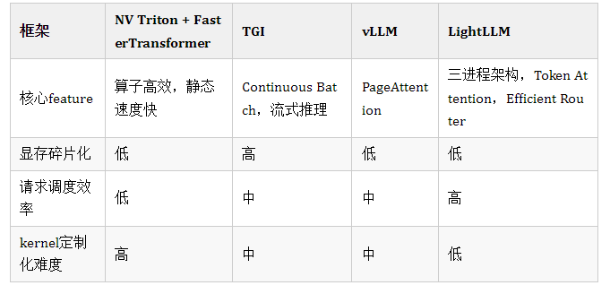
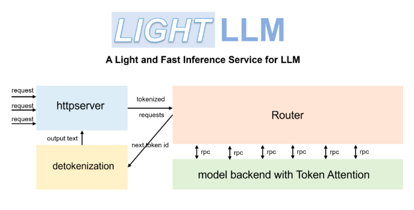
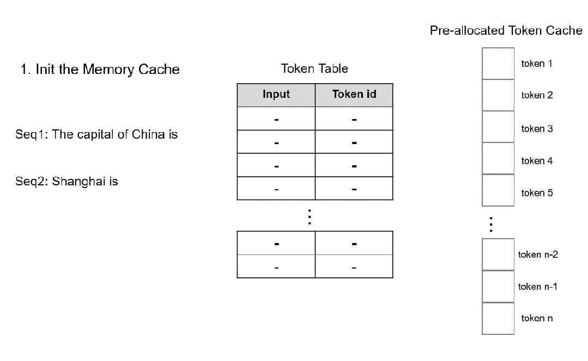
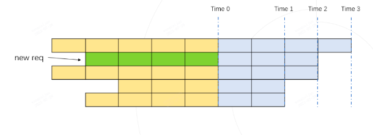
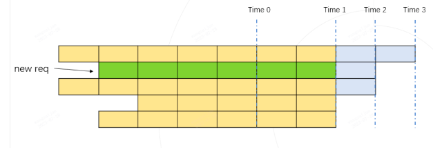
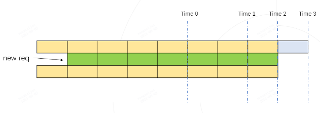
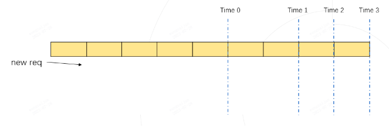
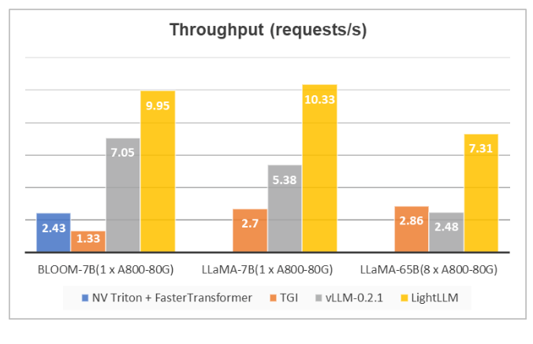
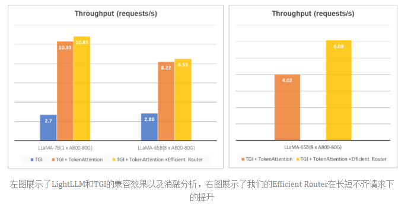

# 纯Python超轻量高性能LLM推理框架 —— LightLLM

> 官方 Documentation: 
> Source Code: https://github.com/ModelTC/lightllm

- [纯Python超轻量高性能LLM推理框架 —— LightLLM](#纯python超轻量高性能llm推理框架--lightllm)
  - [一、引言](#一引言)
    - [1.1 前言](#11-前言)
    - [1.2 为什么 需要 LightLLM ?](#12-为什么-需要-lightllm-)
    - [1.3 目前 LLM推理框架 有 哪些?](#13-目前-llm推理框架-有-哪些)
  - [二、LightLLM 介绍一下？](#二lightllm-介绍一下)
    - [2.1 什么是 LightLLM ？](#21-什么是-lightllm-)
    - [2.2 Token Attention 介绍？](#22-token-attention-介绍)
    - [2.3 Efficient Router 介绍？](#23-efficient-router-介绍)
  - [三、LightLLM 性能表现 介绍？](#三lightllm-性能表现-介绍)
  - [四、LightLLM 依赖包 有哪些？](#四lightllm-依赖包-有哪些)
  - [五、LightLLM  如何安装？](#五lightllm--如何安装)
    - [5.1 下载 LightLLM](#51-下载-lightllm)
    - [5.2 安装 LightLLM 依赖](#52-安装-lightllm-依赖)
    - [5.3 安装 LightLLM](#53-安装-lightllm)
  - [六、LightLLM 如何使用？](#六lightllm-如何使用)
    - [6.1 启动 LightLLM 服务](#61-启动-lightllm-服务)
  - [填坑笔记](#填坑笔记)
    - [LightLLM 支持模型 LLMs 模型？](#lightllm-支持模型-llms-模型)
  - [致谢](#致谢)

## 一、引言 

### 1.1 前言

随着ChatGPT的火爆出圈，大语言模型受到越来越多的关注。这类模型的出现极大的提高了人们的工作效率，然而，如何低成本、高吞吐的将参数量动辄千亿的模型部署到各类服务器上，成为将技术进一步大范围推广的关键。为了提高大模型服务的吞吐量，同时让更多感兴趣的人快速上手参与其中，一个轻量化的LLM推理服务框架LightLLM应运而生。**LightLLM引入了一种更细粒度的kv cache管理算法 TokenAttention，并设计了一个与TokenAttention高效配合的Efficient Router调度实现。在TokenAttention 和 Efficient Router的相互作用下，LightLLM在大部分场景下都能获得比vLLM 和 Text Generation Inference 得到更高的吞吐，部分场景下可以得到4倍左右的性能提升。LightLLM灵活、易用、高效，感兴趣的同学不妨点开上方项目链接上手一试**。

### 1.2 为什么 需要 LightLLM ?

大语言模型由于其出色的对话性能受到了研究人员的广泛关注，其中比较有代表性的模型结构有BLOOM, LLaMA等。这些模型不仅可以和人类进行日常对话，同时可以帮助人们完成一些生产工作，提高工作效率。然而，虽然这些模型已经表现出来了卓越的性能，但是部署大模型提升服务性能，存在以下挑战：

- **显存碎片化严重**：几十乃至上百GB的网络权重以及推理时不断动态产生的KV Cache，极易造成显存利用率低的问题。
- **请求调度效率低**：请求的长度随时间动态变化，易造成GPU空转或是利用率低的问题。
- **kernel定制化难度高**：为了高效利用显存，提高服务吞吐量，需要为网络定制化cuda c kernel，对于普通研究员来说，难度较高。

### 1.3 目前 LLM推理框架 有 哪些?

为了应对以上挑战，目前目前涌现了很多优秀的LLM推理框架，例如FasterTransformer，Text-Generation-Inference(简称TGI)，vLLM等。他们的核心feature和能力矩阵如下表所示：



这些推理框架都具有自己独特的特色: 

- FasterTransformer 具有优秀的静态推理性能，但是没有良好的服务调度处理功能，并且主体用C++开发而成，二次开发成本较高。
- TGI 具有优秀的服务接口和服务调度特性如 Continuous Batch，但是推理性能，调度策略，显存管理亦有缺憾。
- vLLM显存管理优秀，但是请求调度效率不高，且整体实现细节更适合于小模型的部署。

## 二、LightLLM 介绍一下？

### 2.1 什么是 LightLLM ？

为了解决这些问题，我们**开发了一套基于纯Python语言的大模型推理部署框架LightLLM，方便研究员进行轻量级的本地部署和定制修改，用于快速扩展对不同模型的支持，吸纳层出不穷的优秀开源特性，探索最优服务架构**。LightLLM的核心feature如下：

- **三进程架构**。主要用于异步化处理 tokenize 和 detokenize操作， 可以避免这些耗时的cpu处理阻碍模型推理时gpu的调度执行，降低gpu的使用率，进而降低了整体服务性能。
- **Token Attention**。一种以Token为粒度进行kv cache 显存管理的特性，并实现了高性能的管理方法。
- **Efficient Router**。配合 Token Attention 用于精确的管理调度请求的合并推理。

配合基于OpenAI Triton 开发的与服务调度高度配合的高效算子，LightLLM实现了优秀的吞吐性能。



目前 支持模型：

- BLOOM：https://huggingface.co/bigscience/bloom
- LLaMA：https://github.com/facebookresearch/llama
- LLaMA V2：https://huggingface.co/meta-llama

### 2.2 Token Attention 介绍？

目前的大语言模型都是基于transformer架构的，且对问题的回复是通过自回归解码逐token产生的。**为了快速的生成下一个token，这些模型会把自回归解码的过程中会把历史上下文token在注意力模块产生的key和value缓存到GPU中，以便于能快速的生成下一个token。这些缓存会占据大量的显存空间，且由于每个问题的长短不一，其大小也是高度变化和不可预测的，如果没有合理的显存管理手段，这将会显存碎片化严重，造成极大的显存浪费**。

因此我们设计了一种以Token为粒度进行kv cache 显存管理的注意力计算方法 TokenAttention，并实现了高性能的算子和高效的显存申请释放方式。TokenAttention的计算过程如下图所示：



1. 具体地，在模型初始化时，系统根据用户设置的 max_total_token_num 预先分配 KV Cache，并创建 Token Table 来记录输入 token 的实际存储位置。其中，max_total_token_num为部署环境的硬件显存一次最多能容纳的token总量。
2. 当请求到来时，系统首先检查预分配的Token Cache中是否有可用的连续空间用于存储请求的KV 缓存。系统倾向于为请求分配连续的显存，以最大限度地减少推理过程中的访存时间，仅当连续空间不足时，才会为请求分配非连续显存。分配的空间会记录到Token Table中，以便于后续的注意力计算。
3. 对于自回归过程新生成的 token 的缓存，仅需从预先分配的 Token 缓存中找到未使用的空间，并将相应的记录添加到 Token Table 中即可。

为了高效的进行Cache的分配和释放， 我们利用torch Tensor在GPU上的并行计算特性来对预分配的Token Cache 的状态进行管理，首先是状态定义

```s
self.mem_state = torch.ones((size,), dtype=torch.bool, device="cuda")
self._mem_cum_sum = torch.empty((size,), dtype=torch.int32, device="cuda")
self.indexes = torch.arange(0, size, dtype=torch.long, device="cuda")
self.can_use_mem_size = size
```

其中 mem_state 是使用状态数组，1为未使用，0为已经使用。_mem_cum_sum数组用于mem_state的累加和，以此用于高效的筛选出未使用的空间，用于cache的分配，分配过程如下：

```s
torch.cumsum(self.mem_state, dim=0, dtype=torch.int32, out=self._mem_cum_sum)
select_index = torch.logical_and(self._mem_cum_sum <= need_size, self.mem_state == 1)
select_index = self.indexes[select_index]
self.mem_state[select_index] = 0
self.can_use_mem_size -= len(select_index)
```

可以看到，我们的cahce 状态管理只在GPU上完成，充分利用了torch在GPU上的并行特性，从而使得系统能够非常高效的进行Cache空间的申请和释放。

4. 对于已经完成的请求，仅需删除Token Table 中的记录，就可以完成空间的高效释放

释放代码如下：

```s
self.can_use_mem_size += free_index.shape[0]
self.mem_state[free_index] = 1
```

5. 由于Token Attention是以Token为粒度进行显存的管理，所以其可以做到显存空间的零浪费，且能够准确的计算出系统还能容纳多少新Token的计算。因此，配合一个高性能的Router对请求进行管理，可以在推理过程中，不断的加入新请求，充分压榨GPU的每一块显存，最大化 GPU 利用率。

### 2.3 Efficient Router 介绍？

Router 的主要功能是管理到达的请求，并动态的判断该请求能否可以和已经在运行Batch融合到一起进行推理。这个判断的核心就是估计合并后的整个推理过程中，Token 的最大占用量是否小于可以容纳的容量，这里我们将这个最大容量设为 max_total_token_num, 由于有 Token Attention 特性的支持，我们可以精确的管理 Token 的使用量， 合理的配置可以使其永远没有发生 OOM 的风险。



如上图所示，每行代表一个请求当前的运行状态，深色代表已经运行完的历史 kv cache token， 每个格子代表一个token，灰色代表待生成的token，待生成的token数由每个请求设置的最大输出长度和已经生成的token数决定。上图中的第二行绿色格子所在的行代表一个新到达的请求，图中将所有请求按照待输出的长度进行从大到小的顺序排列。

如果我们假设将新请求融合到Batch中进行推理，那token的最大使用量必然在 时刻 Time 1， Time 2， Time 3 中某个时刻到来。我们只需要计算这三个时刻对应的token使用量都不超过 max_total_token_num, 则代表新的请求可以加入到Batch中进行融合推理。

Time 1 token 的总占用量为：黄色格子数量 + 绿色格子数量 （下图）



Time 2 token 的总占用量为：黄色格子数量 + 绿色格子数量（下图）



Time 3 token 的总占用量为：黄色格子数量（下图）



实际的 token 最大使用量，必然是 Time 1， Time 2， Time 3 其中之一。

只要保证动态推理过程中的最大token使用量  <= max_total_token_num, 说明新的请求可以进行合并Batch推理。

为了快速的计算一个Batch的所有请求需要的最大token使用量，我们利用numpy实现了一个高效的示例实现，下面是python伪代码：

```s
import numpy as np

def demo():
    max_total_token_num = 100
    req_list = [(5, 4), (4, 3), (5, 3), (3, 2), (4, 2)]  # (run_len, left_output_len)
    req_list.sort(key=lambda x: -x[1])

    left_out_len_array = np.array([e[1] for e in req_list])
    has_run_len_array = np.array([e[0] for e in req_list])
    cum_run_len_array = np.cumsum(has_run_len_array)
    size_array = np.arange(1, len(req_list) + 1, 1)
    need_max_token_num = (left_out_len_array * size_array + cum_run_len_array).max()

    if need_max_token_num <= max_total_token_num:
        print("ok")
    else:
        print("oom")
```

## 三、LightLLM 性能表现 介绍？

我们在数据集ShareGPT_Vicuna_unfiltered上和目前主流的推理框架 TGI，NV Triton + FasterTransformer以及vLLM进行了性能对比，结果如下图所示。

可以看到，LightLLM在不同大小的模型下都获得了更高的吞吐量。

- **TGI由于显存碎片化严重，所以很难达到较高的吞吐量**；
- **vLLM因引入了PageAttention，但是由于整体实现细节更利于小模型推理，所以在大模型上的并发性能并不是十分理想（使用的默认配置）**；
- 相比之下，**LightLLM则可以在各种大小的模型下都保持稳健的性能，在大模型上（LLaMA-65B）相对TGI和vLLM实现了3倍左右的2提升**。



- **TGI兼容&消融分析**：为了进一步**验证TokenAttention和Router的有效性**，我们同样**将这些特性接入到了TGI中，来改善其显存碎片化的问题**，结果如下图（左）所示。可以看到，**在引入TokenAttention以及Router以后，可以给原始TGI带来4倍以上的性能提升**。
- **长短不齐请求情况下的提升**：从下图（左）中可以发现，Router的引入并未带来较为明显的性能提升，这是由于ShareGPT_Vicuna_unfiltered的数据集问题长短差异并不显著，为此我们构建了一个问题差异更大的请求集合，对我们的Efficient Router的性能进行了验证，结果如下图（右）所示。可以看到，我们的**高性能Router可以更好的利用GPU资源，在问题长度差异很大的请求下，可以带来近50%的性能提升**。




## 四、LightLLM 依赖包 有哪些？

- Pytorch>=1.3
- CUDA 11.8
- Python 3.9

## 五、LightLLM  如何安装？

### 5.1 下载 LightLLM

```s
    $ git clone https://github.com/ModelTC/lightllm
    $ cd lightllm
```

### 5.2 安装 LightLLM 依赖

```s
    $ pip install -r requirements.txt
```

### 5.3 安装 LightLLM

```s
    $ python setup.py install
```

> 注：该代码已在一系列GPU上进行了测试，包括A100、A800、4090和H800。如果您在A100、A800等上运行代码，我们建议使用triton==2.0.0.dev20221202。如果您在4090、H800等平台上运行代码，则需要从GitHub存储库编译并安装triton==2.1.0的源代码。如果代码在其他GPU上不起作用，请尝试修改模型推理中使用的triton内核。

## 六、LightLLM 如何使用？

通过高效的路由器和TokenAttention，LightLLM可以作为一项服务进行部署，并实现最先进的吞吐量性能。

### 6.1 启动 LightLLM 服务

> 启动 LightLLM 服务
```s
    $ python -m lightllm.server.api_server --model_dir /path/llama-7B --tp 1 --max_total_token_num 120000 
```

- 参数说明：
  - max_total_token_num：受部署环境的GPU存储器的影响。此参数的值越大，允许处理更多并发请求，从而提高系统并发性

> 调用 LightLLM 服务
```s
    $ curl 127.0.0.1:8000/generate \
    -X POST \
    -d '{"inputs":"What is AI?","parameters":{"max_new_tokens":17, "frequency_penalty":1}}' \
    -H 'Content-Type: application/json'
```

> 使用 python 调用 LightLLM 服务
```s
    import time
    import requests
    import json

    url = 'http://localhost:8000/generate'
    headers = {'Content-Type': 'application/json'}
    data = {
        'inputs': 'What is AI?',
        "parameters": {
            'do_sample': False,
            'ignore_eos': False,
            'max_new_tokens': 1024,
        }
    }
    response = requests.post(url, headers=headers, data=json.dumps(data))
    if response.status_code == 200:
        print(response.json())
    else:
        print('Error:', response.status_code, response.text)
```

## 填坑笔记

### LightLLM 支持模型 LLMs 模型？

目前 支持模型：

- BLOOM：https://huggingface.co/bigscience/bloom
- LLaMA：https://github.com/facebookresearch/llama
- LLaMA V2：https://huggingface.co/meta-llama

## 致谢

- LightLLM：https://github.com/ModelTC/lightllm
- LightLLM：纯Python超轻量高性能LLM推理框架: https://mp.weixin.qq.com/s/-wMLMGAHkxeyDYkixqni9Q
- OpenAI Triton. https://github.com/openai/triton
- Faster Transformer: https://github.com/NVIDIA/FasterTransformer
- Text Generation Inference: https://github.com/huggingface/text-generation-inference/
- vLLM: https://github.com/vllm-project/vllm
- Flash Attention: https://github.com/Dao-AILab/flash-attention/
