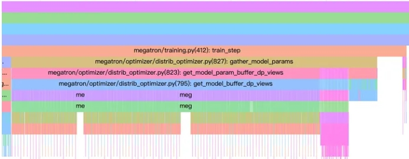

# 大规模分布式训练框架Megatron-LM面

## 大规模分布式训练框架Megatron-LM 潜在的问题或优化方向

### 潜在的问题或优化方向

1. 分布式通信优化 - 需要大量参数和梯度同步,通信成本高,需要优化通信策略、通信并行度等。
2. 内存优化 - 分批策略、梯度积累、混合精度、渐进加载等技术整合应用,减少内存开销。
3. 计算效率 - 模型并行、流水线并行划分,充分利用硬件资源,也需要调优Finding the optimal balance。
4. 负载均衡 - 给各个GPU分配合理的批大小分片,防止出现运算力不均的情况。
5. Fault tolerance - 分布式环境下的容错和错误处理机制需要增强,防止单点故障。
6. 参数服务器的稳定性 - 参数聚合可能存在一致性、同步等问题,是否会损耗性能。
7. 框架集成性 - 是否方便兼容集成其他分布式训练组件,降低移植和升级成本。
8. 模型并行 - 是否会对activation具有侵入性,给模型移植带来额外工作。

### 1. Tied Embedding场景下使用Distributed Optimizer会有问题

- 什么是 Tied Embedding？

Tied Embedding即Word Embedding层和后续的LM Head层共享参数，从理论上讲都是或取对应token的Embedding表示，共享参数也许是比较合理的。Untied Embedding相比之下，最后优化参数不一致，input tokens和output tokens对应的Embedding表示不一致，相当于学习了两套分类表示，理论上capacity更高，效果更好。

从模型优化和训练效率优化的角度来看，个人有如下几点思考：

1. tied embedding会保证word embedding层优化较快，不然训练前一阶段，word embedding层的梯度过小。理论上感觉先使用tied embedding，收敛一段时候之后使用untied embedding，既不损失模型的capacity，又能够加速word embedding层训练

2. tied embedding在和zero1结合的时候，不能通过reduce-scatter做最后一步的overlapping gradient reduce，会在最后同步word embedding和lm head梯度的时候造成错位，这种情况下使用all-reduce代替reduce-scatter，性能损失还是相当严重的

总结一下，也许tied embedding在加速收敛这块有点用，但是在训练效率优化这块基本没有用，如果非要说有点用，那就是少了一层参数，在非pipeline训练场景下内存占用小…

### 2. Distributed Optimizer(ZERO) 存在哪些问题？

Distributed Optimizer(ZERO) 随DP组可扩展性不足，DP组增大，overlap gradient all-reduce效果反而会变差。

原因如下：

1. ZERO1会存在DP组梯度的all-reduce/reduce-scatter，由于魔改了DDP，所以一般实现没有跟最后一个step的backward做overlap，然后是sharded parm-state更新完参数后需要all gather所有的parameters，这一步常见的实现也是没有跟下一个batch的第一个step的前向做overlap的。

2. 现在部分框架已经能够支持一个batch的最后一个step的backward同all-reduce/reduce-scatter做分桶overlap，但是非常坑爹的是，对于较小模型，如7B/13B，在DP组越来越大的时候，对应bucket的通信是越来越慢的，多次切分通信开销大于单次。那么大到一定程度上，overlap的加速效果就慢慢没有了，到了最后就坑了，反而更慢了。

3. 除此之外，还有一个神坑，那就是DP组越大，bucket分的越细，最后在聚合处理时GPU的空闲时间越长，下一个通信算子的时间也会变长

## 致谢

- 扒一扒Nvidia大规模分布式训练框架Megatron-LM的坑和优化点？ https://www.zhihu.com/question/633778272
- 关于LLM结构中Tied Embedding的相关思考 https://zhuanlan.zhihu.com/p/667504988
- 谈一谈Distributed Optimizer(ZERO)坑爹的地方  https://zhuanlan.zhihu.com/p/668237252