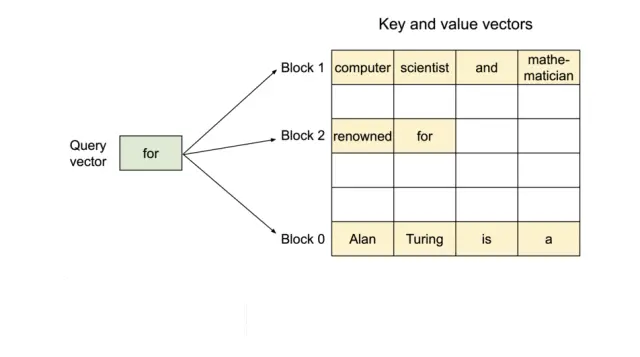
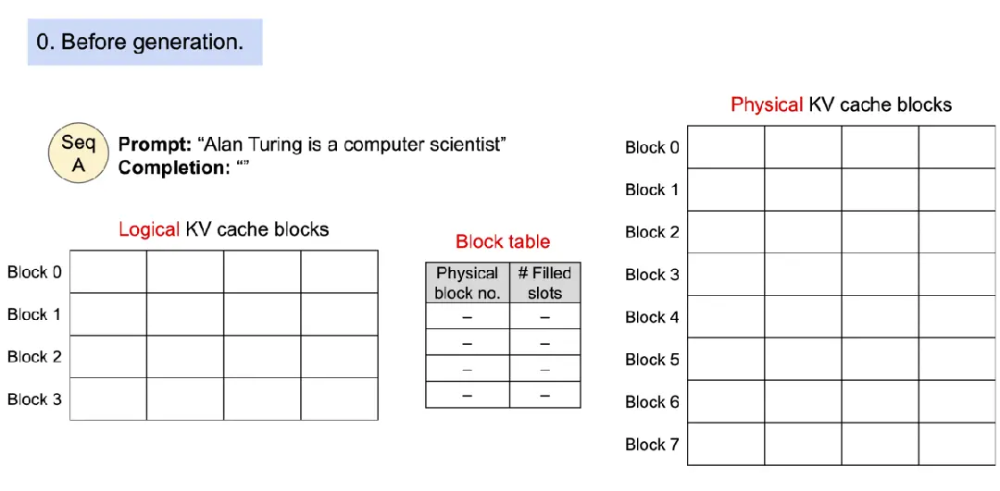
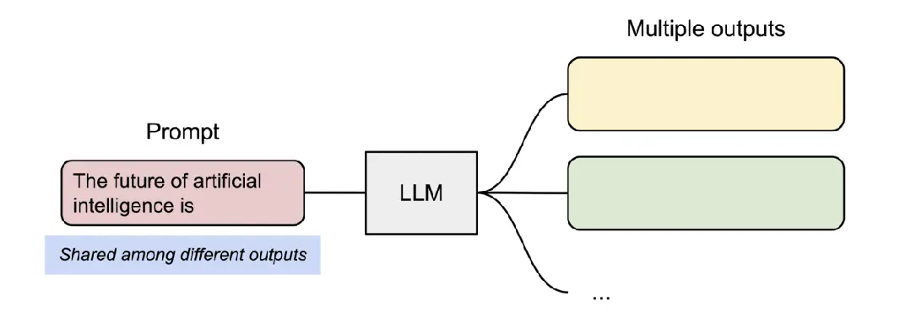
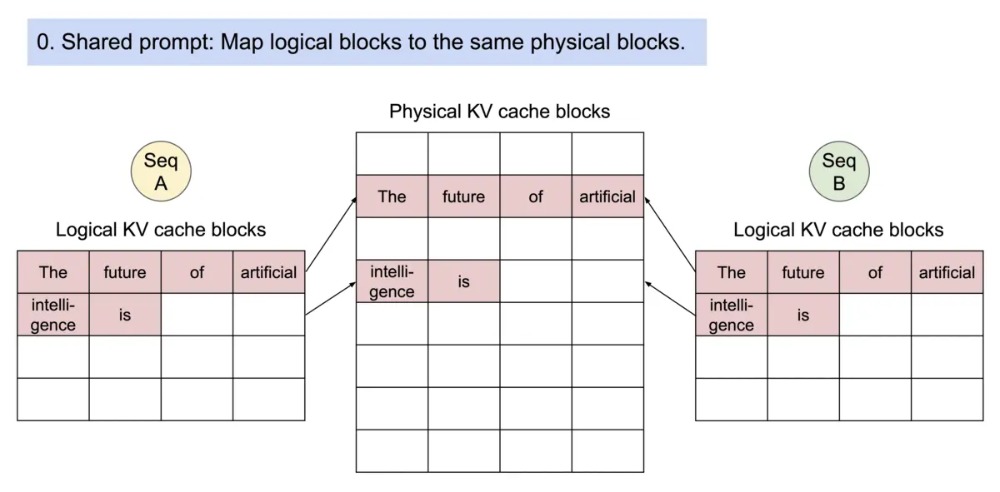
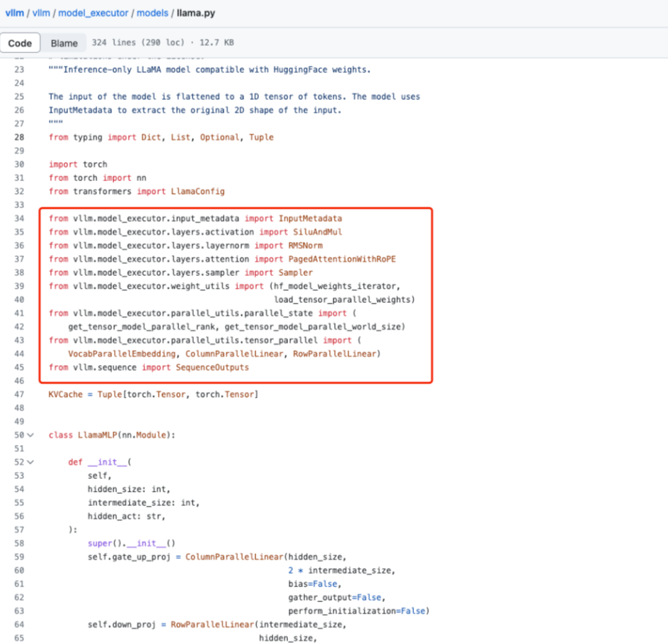

# LLM（大语言模型）部署加速方法——PagedAttention篇

- [LLM（大语言模型）部署加速方法——PagedAttention篇](#llm大语言模型部署加速方法pagedattention篇)
  - [一、vLLM 用于大模型并行推理加速 存在什么问题？](#一vllm-用于大模型并行推理加速-存在什么问题)
  - [二、vLLM 如何 优化 大模型并行推理加速？](#二vllm-如何-优化-大模型并行推理加速)
  - [三、什么是 PagedAttention？](#三什么是-pagedattention)
  - [四、 PagedAttention 如何存储 连续的key和value？](#四-pagedattention-如何存储-连续的key和value)
  - [五、 PagedAttention 技术细节？](#五-pagedattention-技术细节)
  - [六、 PagedAttention 如何 实现安全共享？](#六-pagedattention-如何-实现安全共享)
  - [七、 PagedAttention 源码介绍？](#七-pagedattention-源码介绍)
  - [致谢](#致谢)

## 一、vLLM 用于大模型并行推理加速 存在什么问题？

vLLM 用于大模型并行推理加速，其中**核心改进是PagedAttention算法**，在 vLLM 中，我们发现 **LLM 服务的性能受到内存的瓶颈**。**在自回归解码过程中，LLM 的所有输入标记都会生成其key和value张量，并且这些张量保存在 GPU 内存中以生成下一个token。这些缓存的key和value张量通常称为 KV 缓存**。KV缓存是：

- 占用大： LLaMA-13B 中的单个序列最多占用 1.7GB。
- 动态变化：其大小取决于序列长度，序列长度变化很大且不可预测。因此，有效管理 KV 缓存提出了重大挑战。我们发现现有系统由于碎片和过度预留而浪费了60% - 80%的内存。

## 二、vLLM 如何 优化 大模型并行推理加速？

vllm引入了**PagedAttention**，这是一种**受操作系统中虚拟内存和分页的经典思想启发的注意力算法**。

## 三、什么是 PagedAttention？

与传统的注意力算法不同，**PagedAttention 允许在不连续的内存空间中存储连续的key和value**。

## 四、 PagedAttention 如何存储 连续的key和value？

具体来说，**PagedAttention 将每个序列的 KV 缓存划分为块，每个块包含固定数量token的key和value**。在注意力计算过程中，PagedAttention 内核有效地识别并获取这些块。

> 图一：PagedAttention

因为块在内存中不需要是连续的，所以我们可以像在操作系统的虚拟内存中一样以更灵活的方式管理key和value：可以**将块视为页面，将token视为字节，将序列视为进程**。序列的连续逻辑块通过块表映射到非连续物理块。当新代币生成时，物理块会按需分配。

## 五、 PagedAttention 技术细节？

1. 在 PagedAttention 中，**内存浪费仅发生在序列的最后一个块中**。实际上，这会**导致内存使用接近最佳，浪费率低于 4%**。事实证明，内存效率的提高非常有益：它允许系统将更多序列一起批处理，提高 GPU 利用率，从而显着提高吞吐量，如上面的性能结果所示；
2. PagedAttention 还有另一个关键优势：**高效的内存共享**。例如，在并行采样中，从同一提示生成多个输出序列。在这种情况下，提示的计算和内存可以在输出序列之间共享。

> 图二： 采样过程

PagedAttention 自然可以通过其块表实现内存共享。与进程共享物理页的方式类似

## 六、 PagedAttention 如何 实现安全共享？

- 动机：PagedAttention 中的不同序列可以通过将其逻辑块映射到同一物理块来共享块。这个时候就 设计到 如何 安全共享问题；
- 思路：PagedAttention 跟踪物理块的引用计数并实现Copy-on-Write机制

> 图三 对多个输出进行采样的请求的示例生成过程

PageAttention 的内存共享极大地降低了复杂采样算法的内存开销，例如并行采样和波束搜索，将其内存占用降低高达 55%。这可以将吞吐量提高高达 2.2 倍。

## 七、 PagedAttention 源码介绍？

PagedAttention 是 vLLM 背后的核心技术，vLLM 是 LLM 推理和服务引擎，支持各种具有高性能和易于使用的界面的模型。

从vllm的源码中我们可以看出来，vllm是怎么样对于huggingface models上的模型进行推理优化的。

## 致谢

1. LLM（大语言模型）部署加速方法: https://zhuanlan.zhihu.com/p/644001250
2. 比HuggingFace快24倍！伯克利神级LLM推理系统开源，碾压SOTA，让GPU砍半: https://zhuanlan.zhihu.com/p/638678439

