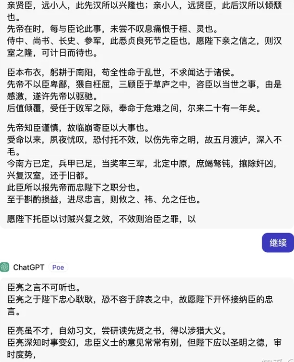
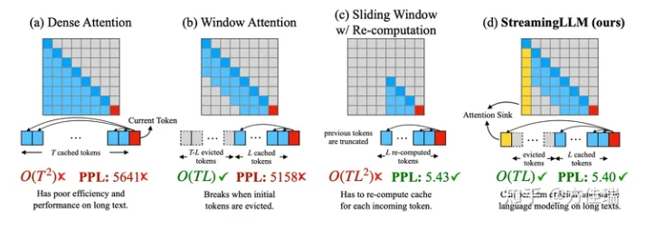
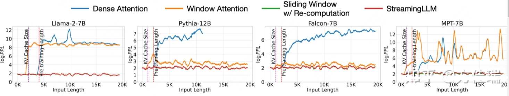
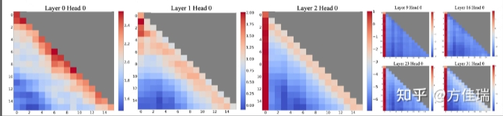
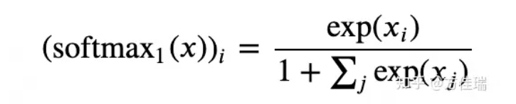
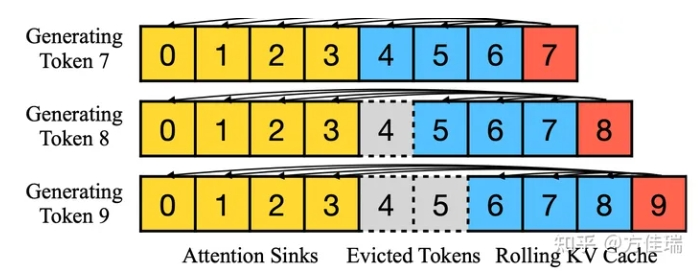

# LLM推理技术之StreamingLLM：如何拥有无限长生成能力

> 论文名称：Efficient Streaming Language Models with Attention Sinks
> 
> 论文地址：https://arxiv.org/abs/2309.17453
> 
> Github 地址：https://github.com/mit-han-lab/streaming-llm

- [LLM推理技术之StreamingLLM：如何拥有无限长生成能力](#llm推理技术之streamingllm如何拥有无限长生成能力)
  - [一、前言](#一前言)
    - [1.1 大型语言模型（LLM）存在什么问题？](#11-大型语言模型llm存在什么问题)
    - [1.2 StreamingLLM 背景介绍](#12-streamingllm-背景介绍)
    - [1.3 StreamingLLM 核心问题？](#13-streamingllm-核心问题)
    - [1.4 StreamingLLM 存在哪些挑战？](#14-streamingllm-存在哪些挑战)
    - [1.5 目前主流地增加输入文本长度的方法有哪些？](#15-目前主流地增加输入文本长度的方法有哪些)
  - [二、StreamingLLM 的思路是什么？](#二streamingllm-的思路是什么)
  - [总结](#总结)
  - [参考](#参考)

## 一、前言

### 1.1 大型语言模型（LLM）存在什么问题？

当前，**大型语言模型（LLM）在推理时只能记住有限的上下文**。例如，LLama2只能处理4K的上下文，这不仅导致其无法记住超过最近4K上文的内容，而且在生成文本达到4K时就会停止。理想的AI对话助手可以不受输出长度的限制，并且需要记住历史的对话。

### 1.2 StreamingLLM 背景介绍

MIT，Meta AI，CMU的研究人员最近提出了一种StreamingLLM，声称可以使得经过有限序列长度训练的大型语言模型能够在无需任何微调的情况下，推广到无限序列长度的输入和输出。**不过这里值得强调的是，这个方法并没有增加LLM的对上文的记忆，只是让它输入输出无限长**。一个显而易见的好处就是，在对话机器人生成一个很长的回答时，你不需要再输入“继续”了。

> 让ChatGPT生成出师表会出现截断

### 1.3 StreamingLLM 核心问题？

核心问题：**能否在不牺牲效率和性能的情况下，部署一个能处理无限输入的LLM？**

以**实现流式LLM应用部署的效果。也就是可以不受长度限制不停地输出**，具体效果可参考StreamingLLM的主页视频。这个需要说明，**无限长输入和无限长上下文还不同，前者不需要对所有输入有记忆**。

### 1.4 StreamingLLM 存在哪些挑战？

1. 模型性能瓶颈：**在解码阶段，由于KV Cache存在导致内存使用或延迟增加，内存上线和推理服务SLA存在，导致KV Cache不能无限大**，这是性能瓶颈。
2. 模型能力瓶颈：**现有模型的外推（extrapolation）能力有限，也就是说当序列长度超过pretraining时设定的注意力窗口大小时，它们的表现会下降**，这是模型能力的瓶颈。如下图1所示，Dense Attention具有O(T^2)的时间和内存复杂度。当文本长度超过预训练文本长度时，其运行的性能会下降。

### 1.5 目前主流地增加输入文本长度的方法有哪些？

1. **长度外推（Length Extrapolation）**：该方法让训练在较短文本上的LLM能够在推理时处理较长的文本。比如，大家经常听到的编码方法RoPE，ALiBi等都归于此类。然而，目前尚未有方法实现无限长度的外推，还无法满足作者流式应用的需求。

> 参考：Transformer升级之路：7、长度外推性与局部注意力
> 链接：https://kexue.fm/archives/9431

2. **上下文窗口扩展（Context Window Extension）**：该方法实打实地去扩大LLM的上下文窗口长度，也就是序列长度。因为Attention的计算量和内存需求都随着序列长度增加而成平方增长，所以增加序列长度很难，一些实现方法包括：
   1. 训练时用FlashAttention等工程优化，以打破内存墙的限制；
   2. 一些approximate attention方法，比如Longformer这种Window Attention方法。如图1所示，Window Attention缓存最近的L个token的KV。虽然在推理过程的效率高，但一旦开头的token的KV被驱逐出Cache，模型推理的表现就会急剧下降（PPL约高模型表现越差）。在图2中橘色PPL曲线在token数目超过KVCache Size后出现跃升。
   3. 一个降低内存需求的优化是，让Window Attention重新计算从每个新令牌的L个最近令牌中重建KVCache。虽然它在长文本上表现良好，但由于上下文重新计算中的二次注意力导致的O(T*L^2)复杂性，使其相当慢。

> 图1. Illustration of StreamingLLM vs. existing methods

> 图2. 将输入的文本长度增加到20K进行推理时的困惑度（PPL）

通常，**使用这些技术后，大型语言模型（LLM）的推理输入长度会受到一定的限制**。然而，这篇论文通过使用approximate attention的方法，放松了对全部输入记忆的限制，仍然只记住最近的上下文，但实现了处理无限输入并获得无限输出的效果。可以说是没有和外推发和长下法文硬钢，另辟蹊径。

## 二、StreamingLLM 的思路是什么？

对于Window Attention在超长文本输入时失败的原因，需要深入研究。如图2的橘色曲线所示，**即使窗口大小只比KVCache Size大1，也就是说，注意力计算只减少了第一个token，模型推理的PPL值却会急剧上升**。这个现象确实令人感到诧异，因为直觉告诉我们，随着窗口大小的增大，模型推理的表现应该逐渐变差。然而，仅仅少输入一个token，模型的性能就一触即溃，这似乎暗示着开头的第一个token可能具有关键的作用。事出反常必有妖，这似乎在暗示我们，也许开头的第一个token非常关键。

于是乎，作者们把attention每一层每一个Head经过softmax输出后的logits值翻出来观察。这一看，不得了，果然发现了问题。如图3所示，作者们发现：

1. 第一和第二layer（0和1 layer）的注意力图展示了"local"模式，离当前处理token最近的token收到了更多的attention，即attention矩阵对角线位置值相对更大。
2. 除了最网络前面的两层外，模型在所有layer和head都重点对于initial token（开头的几个tokens）给予更多的attention值。

> 图3. 使用Llama-2-7B时，对256个句子的平均注意力logits进行的可视化，每个句子的长度为16

给予如上观察，作者提出了”attention sink“概念来解释Window Attention失败的原因。输入给LLM推理开头的几个intial tokens是非常特殊的，仿佛水池（sink）中的排水口一样，吞噬了大量的attention。而且intial tokens与被预测token的距离如何，语义信息如何都不重要，重要的只是它的绝对位置。也就是说前几个位置上的token不管是啥，对维持LLMs推理的稳定性都很关键。好家伙，attention机制是相当不忘初心，”看齐意识”很强的。

那么Attention sink是什么原因造成的呢？作者尝试给出一些解释，原来这和前一段沸沸扬扬一段公案有关。不知道读者们收到过如下公众号文章的推送，其标题很耸人听闻。

> 文章：Attention机制竟有bug，Softmax是罪魁祸首，影响所有Transformer
> 地址：https://zhuanlan.zhihu.com/p/645844743

这件事简单讲是这样的：高通AI Research的人研究LLM量化方法时发现Attention Head激活张量里有一些值异常突出（常被称为outliner），追查发现是Softmax引发的。这个问题引起了网红程序员Evan Miller的注意，他研究发现softmax函数存在Bug，并发表了一篇博客[《Attention Is Off By One》](https://www.evanmiller.org/attention-is-off-by-one.html)。

个人理解：在Attention机制中，Softmax的输出代表了key/query的匹配程度的概率。因此，如果softmax在某个位置的值非常大，那么在反向传播时，这个位置的权重就会被大幅度地更新。然而，有时候attention机制并不能确定哪个位置更值得关注，但由于Softmax需要所有位置的值的总和为1，因此必须“表态”给某些位置较大的权重，这就可能导致错误的权重更新，而这个错误在后续的过程中很难被纠正。如下是Miller的原话：

> The problem with using softmax is that it forces each attention head to make an annotation, even if it has no information to add to the output vector

于是乎，他改进了一下Softmax，也就是把softmax的分母加了个1仅此而已，这样所有位置值可以加和不为1，这样Attention就有了可以不对任何位置“表态”的权利。

StreamingLLM的作者采用了类似的观点解释attention sink现象。SoftMax函数的性质使得所有经过attention结构的激活张量不能全部为零，虽然有些位置其实不需要给啥注意力。因此，模型倾向于将不必要的注意力值转嫁给特定的token，作者发现就是initial tokens。在量化异常值的领域也有类似的观察（这里引用了一些Song Han组的文职），导致Miller大佬提出了SoftMax-Off-by-One作为可能的解决方案。

有了这个洞见，作者设计Window Attention的改进版。思路也是很直接，在当前滑动窗口方法基础上，重新引入了一些initial tokens的KV在注意力计算中使用。StreamingLLM中的KV缓存可以概念上分为两部分，如图4所示：（1）attention sink是4个initial tokens，稳定了注意力计算；（2）Rolling KV缓存保留了最近的token，这个窗口值是固定的，图中为3。

> 图4. The KV cache of StreamingLLM.

还需要有些小改动来给attention注入位置信息，StreamingLLM就可以无缝地融入任何使用相对位置编码的自回归语言模型，如RoPE和ALiBi。方法很直接大家去看原文。目前为止，StreamingLLM不需要做训练，把initial tokens数目设置为4就可以获得不错的长输入下的推理表现了。

如过我们接解除不能训练模型限制，可以通过Pre-training LLMs with attention sinks获得更好的表现。作者提出两种方法（1）指定一个全局可训练的attention sink token，称之为“Sink Token”，它将作为不必要的注意力的存储库，从而把initial tokens作为attention sink的作用转移到sink token上。（2）用类似Miller提出的SoftMax-off-by-One的变体替换传统的SoftMax函数，作者称之为Zero Sink方法。

## 总结

StreamingLLM 最大好处就是无限长的输出，而不能记忆超长的输入。

## 参考

- LLM推理技术之StreamingLLM：如何拥有无限长生成能力 https://zhuanlan.zhihu.com/p/659875511