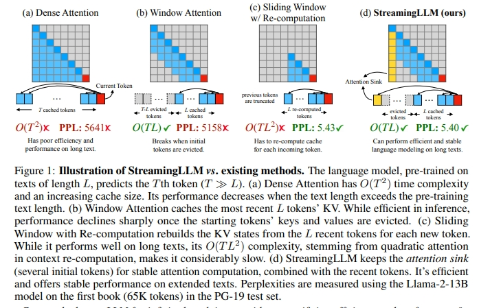
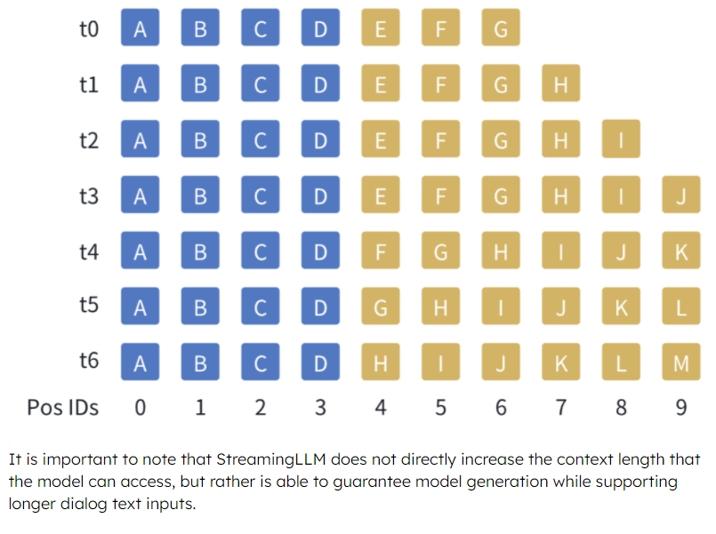
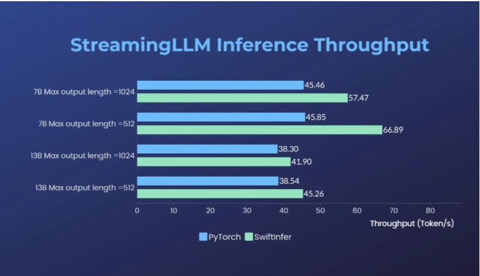

# SwiftInfer —— 大模型无限流式输入推理飙升46%，打破多轮对话长度限制

- [SwiftInfer —— 大模型无限流式输入推理飙升46%，打破多轮对话长度限制](#swiftinfer--大模型无限流式输入推理飙升46打破多轮对话长度限制)
  - [StreamingLLM 篇](#streamingllm-篇)
    - [一、为什么需要 StreamingLLM？](#一为什么需要-streamingllm)
    - [二、StreamingLLM 思路是什么？](#二streamingllm-思路是什么)
    - [三、StreamingLLM 优点是什么？](#三streamingllm-优点是什么)
  - [SwiftInfer 篇：基于TensorRT的StreamingLLM实现](#swiftinfer-篇基于tensorrt的streamingllm实现)
    - [一、为什么需要 SwiftInfer？](#一为什么需要-swiftinfer)
    - [二、SwiftInfer 思路是什么？](#二swiftinfer-思路是什么)
    - [三、SwiftInfer 优点是什么？](#三swiftinfer-优点是什么)
  - [致谢](#致谢)

## StreamingLLM 篇

> EFFICIENT STREAMING LANGUAGE MODELS WITH ATTENTION SINKS : https://arxiv.org/pdf/2309.17453.pdf

### 一、为什么需要 StreamingLLM？

1. **大语言模型能够记住的上下文长度问题**，对ChatGPT等大模型应用与用户互动的质量的影响；
2. **LLM在预训练期间只能在有限的注意力窗口的限制下进行训练**；
3. 常见的KV Cache机制能够节约模型计算的时间，但是在多轮对话的情景下，**key和value的缓存会消耗大量的内存，无法在有限的显存下无限扩展上下文**；
4. **二次微调后的模型无法很好地泛化到比训练序列长度更长的文本**，导致生成效果糟糕；

### 二、StreamingLLM 思路是什么？

**通过观察注意力模块中Softmax的输出，发现了attention sink的现象**。

注意力机制会为每一个token分配一个注意力值，而文本最初的几个token总是会分配到很多无用的注意力。

**当我们使用基于滑动窗口的注意力机制时，一旦这几个token被踢出了窗口，模型的生成效果就会迅速崩溃。但只要一直把这几个token保留在窗口内，模型就能稳定地生成出高质量的文本**。

比起密集注意力（Dense Attention）、窗口注意力（Window Attention）以及带重计算的滑动窗口注意力(Sliding Window w/ Re-computing)，StreamingLLM基于attention sink的注意力机制无论是在计算复杂度还是生成效果上都表现优异。

在不需要重新训练模型的前提下，StreamingLLM能够直接兼容目前的主流大语言模型并改善推理性能。

### 三、StreamingLLM 优点是什么？

StreamingLLM 能够在不牺牲推理速度和生成效果的前提下，可实现多轮对话总共400万个token的流式输入，22.2倍的推理速度提升。

## SwiftInfer 篇：基于TensorRT的StreamingLLM实现

### 一、为什么需要 SwiftInfer？

StreamingLLM使用原生PyTorch实现，对于多轮对话推理场景落地应用的低成本、低延迟、高吞吐等需求仍有优化空间。

### 二、SwiftInfer 思路是什么？

1. 将StreamingLLM方法与TensorRT推理优化结合，使 SwiftInfer 不仅拥有 原始StreamingLLM的所有优点，而且还具有更高的运行效率；
2. 重新实现了KV Cache机制以及带有位置偏移的注意力模块；

如下图所示，假设窗口大小为10个token，随着生成的token增加（由黄色方块表示），我们在KV缓存中将中间的token踢出，与此同时，始终保持着文本开始的几个token（由蓝色方块表示）。由于黄色方块的位置会发生变化，在计算注意力时，我们也需要重新注入位置信息。

需要注意的是，StreamingLLM不会直接提高模型能访问的上下文窗口，而是能够在支持流式超多轮对话的同时保证模型的生成效果。

### 三、SwiftInfer 优点是什么？

原版本的StreamingLLM可以可靠地实现超过400万个token的流式输入，实现了比带重计算的滑动窗口注意力机制高出22.2倍的速度提升。

Colossal-AI团队发布的SwiftInfer可以进一步提升推理性能，最多带来额外的最多46%的推理吞吐速度提升，为大模型多轮对话推理提供低成本、低延迟、高吞吐的最佳实践。TensorRT-LLM团队也在同期对StreamingLLM进行了类似支持。

## 致谢

- Inference Performance Improved by 46%, Open Source Solution Breaks the Length Limit of LLM for Multi-Round Conversations https://hpc-ai.com/blog/Colossal-AI-SwiftInfer
- Colossal-AI开源地址：https://github.com/hpcaitech/ColossalAI

