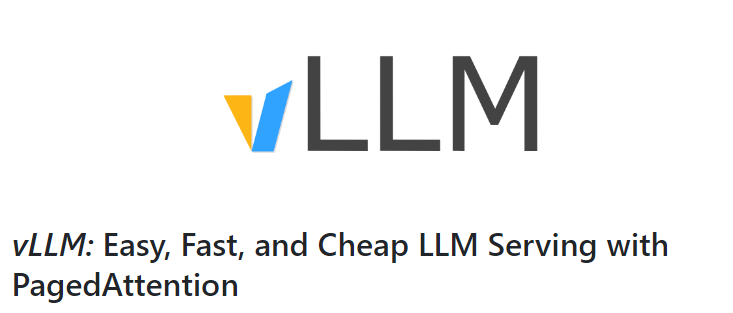
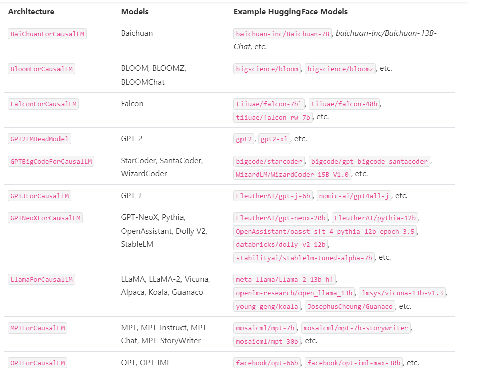
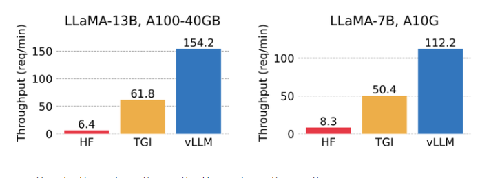
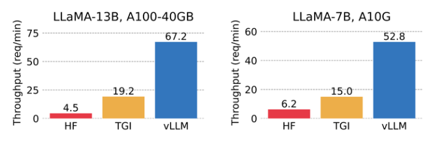

# 大模型推理加速工具 —— vLLM

> vLLM 官网 https://vllm.ai/
> vLLM 官方 Documentation: https://vllm.readthedocs.io/en/latest/getting_started/installation.html
> Source Code: https://github.com/vllm-project/vllm



- [大模型推理加速工具 —— vLLM](#大模型推理加速工具--vllm)
  - [一、引言](#一引言)
    - [1.1 前言](#11-前言)
    - [1.2 为什么 需要 vLLM ?](#12-为什么-需要-vllm-)
    - [1.3 vLLM 具有哪些特点 ?](#13-vllm-具有哪些特点-)
    - [1.4 vLLM 支持哪些 Huggingface 模型 ?](#14-vllm-支持哪些-huggingface-模型-)
  - [二、vLLM 性能如何？](#二vllm-性能如何)
  - [三、vLLM 依赖包](#三vllm-依赖包)
  - [四、vLLM 安装](#四vllm-安装)
    - [4.1 构建环境](#41-构建环境)
    - [4.2 vLLM 安装](#42-vllm-安装)
      - [4.2.1 使用 pip 安装 vLLM](#421-使用-pip-安装-vllm)
      - [4.2.2 使用 source 安装 vLLM](#422-使用-source-安装-vllm)
  - [五、vLLM 使用](#五vllm-使用)
    - [5.1 vLLM 离线推理](#51-vllm-离线推理)
    - [5.2 vLLM 在线推理](#52-vllm-在线推理)
    - [5.3 OpenAI-Compatible Server](#53-openai-compatible-server)
  - [六、vLLM 分布式推理与服务](#六vllm-分布式推理与服务)
  - [填坑笔记](#填坑笔记)
  - [致谢](#致谢)

## 一、引言 

### 1.1 前言

随着大语言模型（LLM）的不断发展，这些模型在很大程度上改变了人类使用 AI 的方式。然而，实际上为这些模型提供服务仍然存在挑战，即使在昂贵的硬件上也可能慢得惊人。

现在这种限制正在被打破。最近，来自加州大学伯克利分校的研究者开源了一个项目 vLLM，该项目主要用于快速 LLM 推理和服务。vLLM 的核心是 PagedAttention，这是一种新颖的注意力算法，它将在操作系统的虚拟内存中分页的经典思想引入到 LLM 服务中。

配备了 PagedAttention 的 vLLM 将 LLM 服务状态重新定义：它比 HuggingFace Transformers 提供高达 24 倍的吞吐量，而无需任何模型架构更改。

### 1.2 为什么 需要 vLLM ?

简之，vLLM是一个开源的LLM推理和服务引擎。它利用了全新的注意力算法「PagedAttention」，有效地管理注意力键和值。

配备全新算法的vLLM，重新定义了LLM服务的最新技术水平：

与HuggingFace Transformers相比，它提供高达24倍的吞吐量，而无需进行任何模型架构更改。
值得一提的是，「小羊驼」Vicuna在demo中用到的就是FastChat和vLLM的一个集成。

正如研究者所称，vLLM最大的优势在于——提供易用、快速、便宜的LLM服务。

这意味着，未来，即使对于像LMSYS这样计算资源有限的小型研究团队也能轻松部署自己的LLM服务。

### 1.3 vLLM 具有哪些特点 ?

- 最先进的服务吞吐量；
- PagedAttention 可以有效的管理注意力的键和值；
- 动态批处理请求；
- 优化好的 CUDA 内核；
- 与流行的 HuggingFace 模型无缝集成；
- 高吞吐量服务与各种解码算法，包括并行采样、beam search 等等；
- 张量并行以支持分布式推理；
- 流输出；
- 兼容 OpenAI 的 API 服务。

### 1.4 vLLM 支持哪些 Huggingface 模型 ?

- GPT-2 (gpt2、gpt2-xl 等)；
- GPTNeoX (EleutherAI/gpt-neox-20b、databricks/dolly-v2-12b、stabilityai/stablelm-tuned-alpha-7b 等)；
- LLaMA (lmsys/vicuna-13b-v1.3、young-geng/koala、openlm-research/open_llama_13b 等)
- OPT (facebook/opt-66b、facebook/opt-iml-max-30b 等)。



## 二、vLLM 性能如何？

该研究将 vLLM 的吞吐量与最流行的 LLM 库 HuggingFace Transformers （HF），以及之前具有 SOTA 吞吐量的 HuggingFace Text Generation Inference（TGI）进行了比较。此外，该研究将实验设置分为两种：LLaMA-7B，硬件为 NVIDIA A10G GPU；另一种为 LLaMA-13B，硬件为 NVIDIA A100 GPU (40GB)。他们从 ShareGPT 数据集中采样输入 / 输出长度。结果表明，vLLM 的吞吐量比 HF 高 24 倍，比 TGI 高 3.5 倍。


> vLLM 的吞吐量比 HF 高 14 倍 - 24 倍，比 TGI 高 2.2 倍 - 2.5 倍。


> vLLM 的吞吐量比 HF 高 8.5 - 15 倍，比 TGI 高 3.3 - 3.5 倍。

## 三、vLLM 依赖包

- OS: Linux
- Python: 3.8 or higher
- CUDA: 11.0 – 11.8
- GPU: compute capability 7.0 or higher (e.g., V100, T4, RTX20xx, A100, L4, etc.)

## 四、vLLM 安装

### 4.1 构建环境

```s
    $ conda create -n py310_chat python=3.10       # 创建新环境
    $ source activate py310_chat                   # 激活环境
```

### 4.2 vLLM 安装

#### 4.2.1 使用 pip 安装 vLLM

通过 利用 pip 安装 vllm

```s
    $ pip install vllm
```

#### 4.2.2 使用 source 安装 vLLM

通过 从 github 上面 clone vllm，并 安装

```s
    $ git clone https://github.com/vllm-project/vllm.git
    $ cd vllm
    $ pip install -e .  # This may take 5-10 minutes.
```

## 五、vLLM 使用

### 5.1 vLLM 离线推理

在使用 vLLM 进行离线推理任务时，你需要导入 vLLM 并在 Python 脚本中使用 LLM 类。

```s
# 导包
from vllm import LLM, SamplingParams
# 定义 输入 prompt
prompts = [
    "Hello, my name is",
    "The president of the United States is",
    "The capital of France is",
    "The future of AI is",
]
# 采样温度设置为0.8，原子核采样概率设置为0.95。
sampling_params = SamplingParams(temperature=0.8, top_p=0.95)
# 初始化 vLLM engine 
llm = LLM(model="facebook/opt-125m")
# 使用 llm.generate 生成结果
outputs = llm.generate(prompts, sampling_params)

# Print the outputs. 它将输入提示添加到vLLM引擎的等待队列中，并执行vLLM发动机以生成具有高吞吐量的输出。输出作为RequestOutput对象的列表返回，其中包括所有输出标记。
for output in outputs:
    prompt = output.prompt
    generated_text = output.outputs[0].text
    print(f"Prompt: {prompt!r}, Generated text: {generated_text!r}")
```

> 注：目前 LLMs 并没有支持 所有 LLMs，具体可以查看 [supported-models](https://vllm.readthedocs.io/en/latest/models/supported_models.html#supported-models)


### 5.2 vLLM 在线推理

vLLM可以作为LLM服务进行部署。我们提供了一个FastAPI服务器示例。检查服务器实现的vllm/entrypoints/api_server.py。服务器使用AsyncLLMEngine类来支持异步处理传入请求。

> 启动 服务
```s
    $ python -m vllm.entrypoints.openai.api_server --model lmsys/vicuna-7b-v1.3
```

默认情况下，此命令在启动服务器http://localhost:8000OPT-125M型号。

> 调用服务
```s
curl http://localhost:8000/generate \
    -d '{
        "prompt": "San Francisco is a",
        "use_beam_search": true,
        "n": 4,
        "temperature": 0
    }'
```

### 5.3 OpenAI-Compatible Server

vLLM可以部署为模仿OpenAI API协议的服务器。这允许vLLM被用作使用OpenAI API的应用程序的插入式替换。

> 启动 服务
```s
    python -m vllm.entrypoints.openai.api_server \
        --model facebook/opt-125m
```

默认情况下，它在启动服务器http://localhost:8000.

可以使用--host和--port参数指定地址。

服务器当前一次承载一个模型（上面命令中的OPT-125M），并实现列表模型和创建完成端点。我们正在积极添加对更多端点的支持。

此服务器可以使用与 OpenAI API 相同的格式进行查询。例如，列出 models:

```s
    $ curl http://localhost:8000/v1/models
```

> Query the model with input prompts:
```s
curl http://localhost:8000/v1/completions \
    -H "Content-Type: application/json" \
    -d '{
        "model": "facebook/opt-125m",
        "prompt": "San Francisco is a",
        "max_tokens": 7,
        "temperature": 0
    }'
```

> 由于此服务器与OpenAI API兼容，因此可以将其用作任何使用OpenAI API的应用程序的临时替代品。例如，查询服务器的另一种方式是通过openai python包：
```s
import openai
# Modify OpenAI's API key and API base to use vLLM's API server.
openai.api_key = "EMPTY"
openai.api_base = "http://localhost:8000/v1"
completion = openai.Completion.create(model="facebook/opt-125m",
                                      prompt="San Francisco is a")
print("Completion result:", completion)
```

## 六、vLLM 分布式推理与服务

vLLM支持分布式张量并行推理和服务。目前，支持  Megatron-LM’s tensor parallel algorithm。使用Ray管理分布式运行时。要运行分布式推理，请使用以下软件安装Ray：

```s
    $ pip install ray
```

要使用LLM类运行 multi-GPU 推理，请将 tensor_parallel_size 参数设置为要使用的 GPU 数量。例如，要在4个GPU上运行推理：

```s
    from vllm import LLM
    llm = LLM("facebook/opt-13b", tensor_parallel_size=4)
    output = llm.generate("San Franciso is a")
```

要运行多GPU服务，请在启动服务器时传入--tensor并行大小参数。例如，要在4个GPU上运行API服务器：

```s
    python -m vllm.entrypoints.api_server \
        --model facebook/opt-13b \
        --tensor-parallel-size 4
```

要将vLLM扩展到单机之外，请在运行vLLM之前通过CLI启动Ray运行时：

```s
    # On head node
    ray start --head

    # On worker nodes
    ray start --address=<ray-head-address>
```

之后，可以在多台机器上运行推理和服务，方法是在head节点上启动vLLM进程，将tensor_paralle_size设置为GPU数量，即所有机器上的GPU总数。


## 填坑笔记


## 致谢

- vLLM 官网 https://vllm.ai/
- vLLM 官方 Documentation: https://vllm.readthedocs.io/en/latest/getting_started/installation.html
- vllm github : https://github.com/vllm-project/vllm
- 大模型推理加速工具：vLLM: https://zhuanlan.zhihu.com/p/642802585
- LLM 高速推理框架 vLLM 源代码分析 / vLLM Source Code Analysis: https://zhuanlan.zhihu.com/p/641999400
- 比HuggingFace快24倍！伯克利神级LLM推理系统开源，碾压SOTA，让GPU砍半: https://zhuanlan.zhihu.com/p/638678439
- LLM推理框架2：vLLM源码学习: https://zhuanlan.zhihu.com/p/643336063
- vllm vs TGI 部署 llama v2 7B 踩坑笔记: https://zhuanlan.zhihu.com/p/645732302
