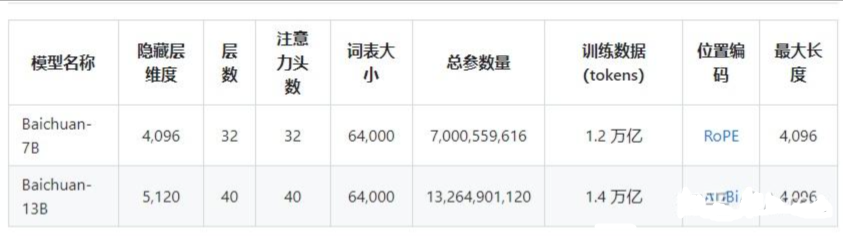
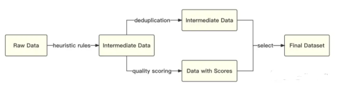
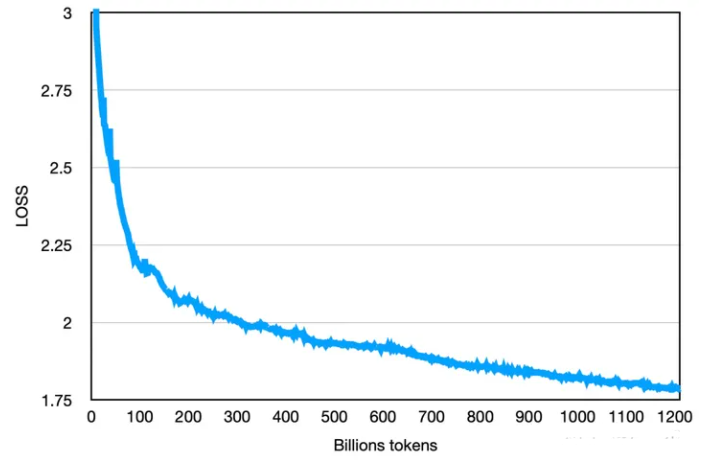
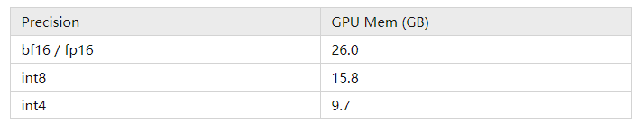
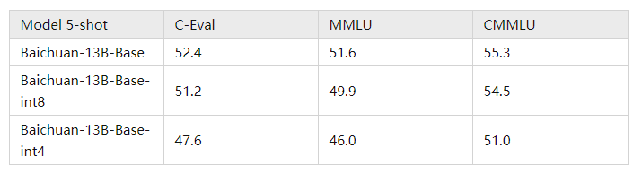
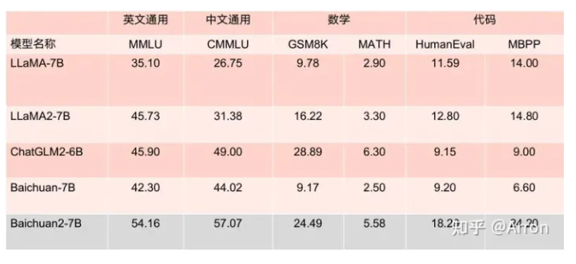
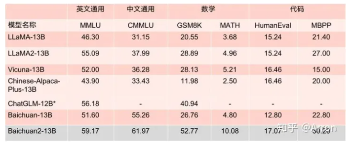
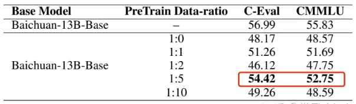
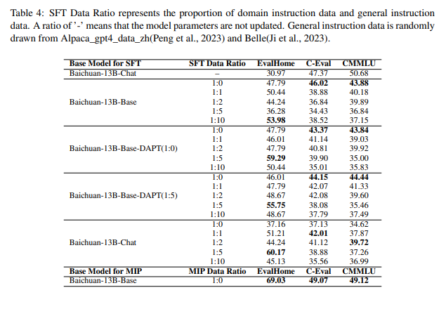

# 百川智能baichuan7B、13B、53B、baichuan2 总结篇

- [百川智能baichuan7B、13B、53B、baichuan2 总结篇](#百川智能baichuan7b13b53bbaichuan2-总结篇)
  - [一、baichuan-7B篇](#一baichuan-7b篇)
    - [1. 你了解baichuan-7B解构么？介绍一下？](#1-你了解baichuan-7b解构么介绍一下)
    - [2. baichuan-7B 如何 收集原始数据并 构建 训练数据？](#2-baichuan-7b-如何-收集原始数据并-构建-训练数据)
    - [3. baichuan-7B 如何 提高 训练稳定性和吞吐？](#3-baichuan-7b-如何-提高-训练稳定性和吞吐)
  - [二、baichuan-13B篇](#二baichuan-13b篇)
    - [1. 相比于 baichuan-7B，baichuan-13B 的 特点体现在哪里？](#1-相比于-baichuan-7bbaichuan-13b-的-特点体现在哪里)
    - [2. 如何 对 baichuan-13B 进行推理和部署？](#2-如何-对-baichuan-13b-进行推理和部署)
      - [环境安装](#环境安装)
      - [2.1 GPU直接部署](#21-gpu直接部署)
        - [方法一：Python代码方式](#方法一python代码方式)
        - [方法二：命令行方式](#方法二命令行方式)
      - [2.2 量化部署](#22-量化部署)
      - [2.3  CPU部署](#23--cpu部署)
    - [3. 如何 对 baichuan-13B 进行微调？](#3-如何-对-baichuan-13b-进行微调)
      - [3.1 全量微调](#31-全量微调)
      - [3.2 LoRA微调](#32-lora微调)
  - [三、baichuan-53B篇](#三baichuan-53b篇)
    - [3.1 baichuan-53B 相比于 baichuan-7B 和 baichuan-13B 有哪些优势？](#31-baichuan-53b-相比于-baichuan-7b-和-baichuan-13b-有哪些优势)
    - [3.2 baichuan-53B 如何对 预训练数据 做处理？](#32-baichuan-53b-如何对-预训练数据-做处理)
    - [3.3 baichuan-53B 如何进行 搜索增强？](#33-baichuan-53b-如何进行-搜索增强)
  - [四、baichuan2篇](#四baichuan2篇)
    - [4.1 baichuan2 与 其他大模型 对比](#41-baichuan2-与-其他大模型-对比)
  - [五、baichuan 数据构建篇](#五baichuan-数据构建篇)
    - [5.1 baichuan 进行微调时，领域数据：通用数据配比？](#51-baichuan-进行微调时领域数据通用数据配比)
  - [致谢](#致谢)



## 一、baichuan-7B篇

> 项目地址：https://github.com/baichuan-inc/baichuan-7B
> 预训练模型：https://huggingface.co/baichuan-inc/baichuan-7B
> modelscope：https://modelscope.cn/models/baichuan-inc/baichuan-7B/

### 1. 你了解baichuan-7B解构么？介绍一下？

baichuan-7B 基于 Transformer 结构，在大约1.2万亿 tokens 上训练的70亿参数模型，支持中英双语，上下文窗口长度为4096。

### 2. baichuan-7B 如何 收集原始数据并 构建 训练数据？

- 原始数据收集：开源的中英文数据和自行抓取的中文互联网数据，以及部分高质量知识性数据；
- 数据预处理：**频率和质量是数据处理环节重点考虑的两个维度**。**baichuan-7B 基于启发式规则和质量模型打分，对原始数据集进行篇章和句子粒度的过滤**。在全量数据上，利用局部敏感哈希方法，对篇章和句子粒度做滤重。

> 数据处理流程图


- 如何对数据进行配比：使用了一个**基于自动学习的数据权重策略，对不同类别的数据进行配比**

### 3. baichuan-7B 如何 提高 训练稳定性和吞吐？

在原本的 LLaMA 框架上进行诸多修改以提升训练时的吞吐，具体包括：

1. **算子优化技术**：采用更高效算子，如 Flash-Attention，NVIDIA apex 的 RMSNorm 等；
2. **算子切分技术**：将部分计算算子进行切分，减小内存峰值；
3. **混合精度技术**：降低在不损失模型精度的情况下加速计算过程；
4. **训练容灾技术**：训练平台和训练框架联合优化，IaaS + PaaS 实现分钟级的故障定位和任务恢复；
5. **通信优化技术**，具体包括：
   1. 采用拓扑感知的集合通信算法，避免网络拥塞问题，提高通信效率；
   2. 根据卡数自适应设置 bucket size，提高带宽利用率；
   3. 根据模型和集群环境，调优通信原语的触发时机，从而将计算和通信重叠；

- 效果：基于上述的几个优化技术，我们在千卡 A800 显卡上达到了 7B 模型 182 TFLOPS 的吞吐，GPU 峰值算力利用率高达 58.3%。

> 最终的loss如下图：


## 二、baichuan-13B篇

> 项目地址：https://github.com/Baichuan-inc/Baichuan-13B
> 预训练模型：https://huggingface.co/baichuan-inc/Baichuan-13B-Base
> 对话模型：https://huggingface.co/baichuan-inc/Baichuan-13B-Chat
> modelscope：https://modelscope.cn/models/Baichuan-inc/Baichuan-13B-Chat/summary

### 1. 相比于 baichuan-7B，baichuan-13B 的 特点体现在哪里？

1. **更大尺寸、更多数据**：**Baichuan-13B 在 Baichuan-7B 的基础上进一步扩大参数量到 130 亿，并且在高质量的语料上训练了 1.4 万亿 tokens，超过 LLaMA-13B 40%**，是当前开源 13B 尺寸下训练数据量最多的模型。**支持中英双语，使用 ALiBi 位置编码，上下文窗口长度为 4096**；
2. **同时开源预训练和对齐模型**：预训练模型是适用开发者的『 基座 』，而广大普通用户对有对话功能的对齐模型具有更强的需求。因此本次开源我们同时发布了对齐模型（Baichuan-13B-Chat），具有很强的对话能力，开箱即用，几行代码即可简单的部署；
3. **更高效的推理**：为了支持更广大用户的使用，同时开源了 int8 和 int4 的量化版本，相对非量化版本在几乎没有效果损失的情况下大大降低了部署的机器资源门槛，可以部署在如 Nvidia 3090 这样的消费级显卡上；

### 2. 如何 对 baichuan-13B 进行推理和部署？

#### 环境安装

```s
    $ pip install -r requirements.txt
```

#### 2.1 GPU直接部署

##### 方法一：Python代码方式

```s
>>> import torch
>>> from transformers import AutoModelForCausalLM, AutoTokenizer
>>> from transformers.generation.utils import GenerationConfig
>>> tokenizer = AutoTokenizer.from_pretrained("baichuan-inc/Baichuan-13B-Chat", use_fast=False, trust_remote_code=True)
>>> model = AutoModelForCausalLM.from_pretrained("baichuan-inc/Baichuan-13B-Chat", device_map="auto", torch_dtype=torch.float16, trust_remote_code=True)
>>> model.generation_config = GenerationConfig.from_pretrained("baichuan-inc/Baichuan-13B-Chat")
>>> messages = []
>>> messages.append({"role": "user", "content": "世界上第二高的山峰是哪座"})
>>> response = model.chat(tokenizer, messages)
>>> print(response)
乔戈里峰。世界第二高峰———乔戈里峰西方登山者称其为k2峰，海拔高度是8611米，位于喀喇昆仑山脉的中巴边境上
```

> 注：模型加载指定 device_map='auto'，会使用所有可用显卡。如需指定使用的设备，可以使用类似 export CUDA_VISIBLE_DEVICES=0,1（使用了0、1号显卡）的方式控制。

##### 方法二：命令行方式

```s
    $ python cli_demo.py
```

#### 2.2 量化部署

Baichuan-13B 支持 int8 和 int4 量化，用户只需在推理代码中简单修改两行即可实现。

> 注：如果是为了节省显存而进行量化，应加载原始精度模型到 CPU 后再开始量化；避免在from_pretrained时添加device_map='auto'或者其它会导致把原始精度模型直接加载到 GPU 的行为的参数。

- int8量化

```s
model = AutoModelForCausalLM.from_pretrained(
    "baichuan-inc/Baichuan-13B-Chat", 
    torch_dtype=torch.float16, 
    trust_remote_code=True
)
model = model.quantize(8).cuda()
```

- int4量化

```s
model = AutoModelForCausalLM.from_pretrained(
    "baichuan-inc/Baichuan-13B-Chat", 
    torch_dtype=torch.float16, 
    trust_remote_code=True
)
model = model.quantize(4).cuda()
```

- 量化前后占用显存情况如下：



- 量化后在各个 benchmark 上的结果和原始版本对比如下：



#### 2.3  CPU部署

使用CPU进行推理大概需要 60GB 内存

```s
    model = AutoModelForCausalLM.from_pretrained(
        "baichuan-inc/Baichuan-13B-Chat", 
        torch_dtype=torch.float32, 
        trust_remote_code=True
    )
```

### 3. 如何 对 baichuan-13B 进行微调？

> 注：开发者可以对 Baichuan-13B-Base 或 Baichuan-13B-Chat 进行微调使用。团队测试了与 Baichuan-13B 兼容的微调工具 LLaMA Efficient Tuning，并给出全量微调和 LoRA微调的两种示范。

- 数据格式

输入数据为放置在项目data目录下的 json 文件，用--dataset选项指定（参考下面示例），多个输入文件用,分隔。json 文件示例格式和字段说明如下：

```s
    [
        {
            "instruction": "What are the three primary colors?",
            "input": "",
            "output": "The three primary colors are red, blue, and yellow."
        },
        ....
    ]
```

> json 文件中存储一个列表，列表的每个元素是一个 sample。其中instruction代表用户输入，input是可选项，如果开发者同时指定了instruction和input，会把二者用\n连接起来代表用户输入；output代表期望的模型输出。

#### 3.1 全量微调

- 微调环境：8 * Nvidia A100 80 GB + deepspeed

```s
deepspeed --num_gpus=8 src/train_bash.py \
    --stage sft \
    --model_name_or_path baichuan-inc/Baichuan-13B-Base \
    --do_train \
    --dataset alpaca_gpt4_en,alpaca_gpt4_zh \
    --finetuning_type full \
    --output_dir path_to_your_sft_checkpoint \
    --overwrite_cache \
    --per_device_train_batch_size 4 \ 
    --per_device_eval_batch_size 4 \ 
    --gradient_accumulation_steps 8 \ 
    --preprocessing_num_workers 16 \
    --lr_scheduler_type cosine \
    --logging_steps 10 \
    --save_steps 100 \
    --eval_steps 100 \
    --learning_rate 5e-5 \
    --max_grad_norm 0.5 \
    --num_train_epochs 2.0 \
    --dev_ratio 0.01 \
    --evaluation_strategy steps \
    --load_best_model_at_end \
    --plot_loss \
    --fp16 \
    --deepspeed deepspeed.json
```

deep_speed.json 配置示例：

```s
{
  "train_micro_batch_size_per_gpu": "auto",
  "zero_allow_untested_optimizer": true,
  "fp16": {
    "enabled": "auto",
    "loss_scale": 0,
    "initial_scale_power": 16, 
    "loss_scale_window": 1000,
    "hysteresis": 2,
    "min_loss_scale": 1
  },  
  "zero_optimization": {
    "stage": 2,
    "allgather_partitions": true,
    "allgather_bucket_size": 5e8,
    "overlap_comm": false,
    "reduce_scatter": true,
    "reduce_bucket_size": 5e8,
    "contiguous_gradients" : true
  }
}
```

#### 3.2 LoRA微调

- 微调环境：1 * Nvidia A100 80 GB

```s
CUDA_VISIBLE_DEVICES=0 python src/train_bash.py \
    --stage sft \
    --model_name_or_path baichuan-inc/Baichuan-13B-Base \
    --do_train \
    --dataset alpaca_gpt4_en,alpaca_gpt4_zh \
    --finetuning_type lora \
    --lora_rank 8 \ 
    --lora_target W_pack \
    --output_dir path_to_your_sft_checkpoint \
    --overwrite_cache \
    --per_device_train_batch_size 4 \ 
    --per_device_eval_batch_size 4 \ 
    --gradient_accumulation_steps 8 \ 
    --preprocessing_num_workers 16 \
    --lr_scheduler_type cosine \
    --logging_steps 10 \
    --save_steps 100 \
    --eval_steps 100 \
    --learning_rate 5e-5 \
    --max_grad_norm 0.5 \
    --num_train_epochs 2.0 \
    --dev_ratio 0.01 \
    --evaluation_strategy steps \
    --load_best_model_at_end \
    --plot_loss \
    --fp16
```

## 三、baichuan-53B篇

### 3.1 baichuan-53B 相比于 baichuan-7B 和 baichuan-13B 有哪些优势？

 Baichuan-53B 的三个技术优势：**预训练数据、搜索增强和对齐能力**，其中前两者与百川团队中丰富的搜索引擎经验有较强相关性。

### 3.2 baichuan-53B 如何对 预训练数据 做处理？

- 百川希望构建一个全面的世界知识体系，覆盖各个领域和学科的知识，通过**整合各类信息源，确保文化、科学、技术等方面广泛的知识覆盖**；
- 目前百川已经**建立了一套系统的数据质量体系**，包括低质、优质、类别等，确保整个预训练过程中维持高标准的数据质量，以让数据为最终模型训练的目标服务；
- **为保证数据的多样性并有效处理重复信息**，百川**设计了一个多粒度的大规模聚类系统。通过使用先进的聚类算法和方法，识别和整合相似或相关的数据，为去重、采样提供支撑**；
- 百川还开发了一种**细粒度的自动化匹配算法**，**自动配比各类任务，例如课程学习。从而实现个性化的模型学习，使预训练数据能够更精确地匹配用户需求**；

### 3.3 baichuan-53B 如何进行 搜索增强？

1. **动态响应策略**，依赖 Prompt，将指令任务细化为 16 个独立类别，覆盖各种用户指令的场景。
2. **智能化搜索词生成**，通过对问答样本进行精细化的人工标注，捕捉和理解用户多元化的志林需求。
3. **高质量搜索结果筛选**，百川构建了一个搜索结果相关性模型，对从搜索内容和知识库中获取的信息进行相关性频分，从而筛选出高质量的搜索引用内容，减少在知识抽取阶段引入的无关、低质量的信息。
4. **回答结果的搜索增强**，RLHF，让 Baichuan 大模型参照搜索结果，针对用户请求生成高价值且具有实时性的回答。

## 四、baichuan2篇

> Baichuan 2 大模型开原链接：https://github.com/baichuan-inc/Baichuan2
> 技术报告：https://cdn.baichuan-ai.com/paper/Baichuan2-technical-report.pdf

### 4.1 baichuan2 与 其他大模型 对比

Baichuan2-13B-Base 相比上一代 13B 模型，数学能力提升 49%，代码能力提升 46%，安全能力提升 37%，逻辑推理能力提升 25%，语义理解能力提升 15%。





## 五、baichuan 数据构建篇

### 5.1 baichuan 进行微调时，领域数据：通用数据配比？

基于base预训练模型，发现 领域数据：通用数据配比是1:5的时候效果最好





从这张表里可以得出几个结论：

1. 基于baichuan-13B base 预训练模型做fine-tune时， 领域数据：通用数据配比是1:10时在领域指标上最好
2. 基于baichuan-13B base 上继续做预训练（不用通用领域数据）时，领域数据：通用数据配比是1:5时在领域指标上最好
3. 基于baichuan-13B base 上继续做预训练（领域数据：通用数据配比是1:5）时，领域数据：通用数据配比是1:5时在领域指标上最好
4. 基于baichuan-13B chat（做过多轮对话和指令微调），领域数据：通用数据配比是1:5时在领域指标上最好
5. 基于baichuan-13B base 上做预训练和SFT finetune时（无通用数据），效果最好。【缺少了基于baichuan-13B base 上做预训练和SFT finetune时（领域数据：通用数据配比是1:5）的对比】

- 参考：ChatHome: Development and Evaluation of a Domain-Specific Language Model for Home Renovation  https://arxiv.org/abs/2307.15290


## 致谢

- LLM（一）| 百川智能baichuan7B、13B、53B以及baichuan2总结 https://zhuanlan.zhihu.com/p/656857636


