# LLMs 对比篇

- [LLMs 对比篇](#llms-对比篇)
  - [一、谈谈你对当前出现的各种大模型的见解？](#一谈谈你对当前出现的各种大模型的见解)
  - [二、目前大模型常见的 base 模型训练和 chat 模型训练 方式 的区别么？](#二目前大模型常见的-base-模型训练和-chat-模型训练-方式-的区别么)
  - [三、llama、baichuan、ChatGLM、Bloom 和 qwen 等开源大模型技术对比篇](#三llamabaichuanchatglmbloom-和-qwen-等开源大模型技术对比篇)
    - [3.1 llama 系列篇](#31-llama-系列篇)
      - [3.1.1 llama 篇](#311-llama-篇)
        - [3.1.1.1 llama 训练数据 介绍](#3111-llama-训练数据-介绍)
        - [3.1.1.2 llama 模型参数量 介绍](#3112-llama-模型参数量-介绍)
        - [3.1.1.3 llama 模型结构 介绍](#3113-llama-模型结构-介绍)
        - [3.1.1.4 llama 训练目标 介绍](#3114-llama-训练目标-介绍)
        - [3.1.1.5 llama tokenizer 介绍](#3115-llama-tokenizer-介绍)
        - [3.1.1.6 llama 衍生模型 介绍](#3116-llama-衍生模型-介绍)
        - [3.1.1.7 llama 词表扩展: Chinese LLaMA](#3117-llama-词表扩展-chinese-llama)
      - [3.2.1 llama2 篇](#321-llama2-篇)
        - [3.2.1 llama2 系列 数据预处理方式？](#321-llama2-系列-数据预处理方式)
        - [3.2.2 llama2 系列 Tokenizer 处理方式？](#322-llama2-系列-tokenizer-处理方式)
        - [3.2.3 llama2 系列 Architectural？](#323-llama2-系列-architectural)
        - [3.2.4 llama2 系列 content长度？](#324-llama2-系列-content长度)
    - [3.2 Mistral 7B 系列篇](#32-mistral-7b-系列篇)
      - [3.2.1  Mistral 7B Architectural？](#321--mistral-7b-architectural)
    - [3.3 Qwen 系列篇](#33-qwen-系列篇)
      - [3.3.1 Qwen 系列 数据预处理方式？](#331-qwen-系列-数据预处理方式)
      - [3.3.2 Qwen 系列 Tokenizer 处理方式？](#332-qwen-系列-tokenizer-处理方式)
      - [3.3.3 Qwen 系列 ARCHITECTURE？](#333-qwen-系列-architecture)
    - [3.4 Baichuan 系列篇](#34-baichuan-系列篇)
      - [3.4.1 Baichuan2 篇](#341-baichuan2-篇)
        - [3.4.1.1 Baichuan2 系列 数据预处理方式？](#3411-baichuan2-系列-数据预处理方式)
        - [3.4.1.2 Baichuan2 系列 Tokenizer 处理方式？](#3412-baichuan2-系列-tokenizer-处理方式)
        - [3.4.1.2 Baichuan2 系列 Architecture ？](#3412-baichuan2-系列-architecture-)
    - [3.5 GLM 系列篇](#35-glm-系列篇)
      - [3.5.1 ChatGLM-6B 篇](#351-chatglm-6b-篇)
        - [3.5.1.1 ChatGLM-6B 结构特点？](#3511-chatglm-6b-结构特点)
        - [3.5.1.2 ChatGLM-6B 训练目标？](#3512-chatglm-6b-训练目标)
        - [3.5.1.3 ChatGLM-6B  tokenizer？](#3513-chatglm-6b--tokenizer)
    - [3.6 BLOOM 系列篇](#36-bloom-系列篇)
      - [3.6.1 BLOOM 篇](#361-bloom-篇)
        - [3.6.1.1 BLOOM 训练数据构建？](#3611-bloom-训练数据构建)
        - [3.6.1.2 BLOOM 模型参数量？](#3612-bloom-模型参数量)
        - [3.6.1.3 BLOOM 模型结构？](#3613-bloom-模型结构)
        - [3.6.1.4 BLOOM 训练目标？](#3614-bloom-训练目标)
        - [3.6.1.5 BLOOM tokenizer?](#3615-bloom-tokenizer)
  - [四、分析与总结？](#四分析与总结)
    - [4.1 大模型训练共同点？](#41-大模型训练共同点)
    - [4.2 大模型训练不同点？](#42-大模型训练不同点)
  - [五、对比](#五对比)
    - [5.1 LLaMA、ChatGLM 和 BLOOM 对比](#51-llamachatglm-和-bloom-对比)
    - [5.2 LLaMA、ChatGLM 和 BLOOM 的 tokenizer 比较](#52-llamachatglm-和-bloom-的-tokenizer-比较)
    - [5.3LLaMA、ChatGLM 和 BLOOM 的 结果 比较](#53llamachatglm-和-bloom-的-结果-比较)
  - [致谢](#致谢)

## 一、谈谈你对当前出现的各种大模型的见解？

- 相同点：目前开源了各式各样的大模型，大家用到的基础架构基本一致，都是基于transformer架构
- 不同点：
  - **大模型使用的架构不同**。 encoder or decoder？

## 二、目前大模型常见的 base 模型训练和 chat 模型训练 方式 的区别么？

chat模型对齐训练使用的方式比较一致，SFT的微调或者RLHF(RM模型+PPO)。**chat模型回答效果好坏，主要还是靠base模型效果提供，并且不同开源模型的base模型训练方式也不一样**。

## 三、llama、baichuan、ChatGLM、Bloom 和 qwen 等开源大模型技术对比篇

### 3.1 llama 系列篇

#### 3.1.1 llama 篇

> 论文： Llama: Open and efficient foundation language models
> 论文地址：https://arxiv.org/pdf/2302.13971.pdf

##### 3.1.1.1 llama 训练数据 介绍

LLaMA 是 Meta 提出的大语言模型。训练数据是以英语为主的拉丁语系，另外还包含了来自 GitHub 的代码数据。训练数据以英文为主，不包含中韩日文，所有训练数据都是开源的，分词之后大约有 1400B 的 tokens。

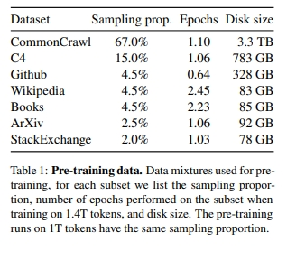

##### 3.1.1.2 llama 模型参数量 介绍

按照模型参数量，LLaMA 模型有 7B、13B、33B、65B 这四个不同参数规模的模型版本。

- 7B 和 13B 版本使用了 1T 的 tokens 进行训练
- 33B 和 65B 的版本使用了 1.4T 的 tokens 进行训练。

证明了在给定训练预算的情况下，即使减少模型参数量，只要增加预训练的数据大小和训练时长（更多的训练 tokens 数），可以达到甚至超过原始大小模型的效果。作为对比，280B 的 Gopher 模型只训练了 300B 的 tokens，176B 的 BLOOM 模型只训练了 350B 的 tokens，GLM-130B 只训练了 400B 的 tokens，LLaMA 模型则训练了 1T/1.4T 的 tokens，显著增大了训练数据量。从结果来看，虽然 LLaMA-13B 模型参数量只有 GPT3 的不到 1/10，但在大部分任务上效果都超过了 GPT3。

##### 3.1.1.3 llama 模型结构 介绍

与 GPT 相同，LLaMA 采用了 causal decoder-only 的 transformer 模型结构。

- layer normalization：为了提升训练的稳定性，没有使用传统的 post layer norm，而是使用了 pre layer Norm。具体地，去除了 layer normalization 中的偏置项，采用了 RMS Norm（即均方根 Norm）。
- 激活函数：没有采用 ReLU 激活函数，而是采用了 SwiGLU 激活函数。FFN 通常有两个权重矩阵，先将向量从维度 d 升维到中间维度 4d，再从 4d 降维到 d。而使用 SwiGLU 激活函数的 FFN 增加了一个权重矩阵，共有三个权重矩阵，为了保持参数量一致，中间维度采用了 $2/3⋅4d\frac{2}{3}\cdot4d$ ，而不是 4d。
- 位置编码：去除了绝对位置编码，采用了旋转位置编码 RoPE。

##### 3.1.1.4 llama 训练目标 介绍

在训练目标上，LLaMA 的训练目标是语言模型，即根据已有的上文去预测下一个词。

##### 3.1.1.5 llama tokenizer 介绍

关于 tokenizer，LLaMA 的训练语料以英文为主，使用了 Sentence Piece 作为 tokenizer，词表大小只有 32000。词表里的中文 token 很少，只有几百个，LLaMA tokenizer 对中文分词的编码效率比较低。

##### 3.1.1.6 llama 衍生模型 介绍

- Alpaca：斯坦福大学在 52k 条英文指令遵循数据集上微调了 7B 规模的 LLaMA。
- Vicuna：加州大学伯克利分校在 ShareGPT 收集的用户共享对话数据上，微调了 13B 规模的 LLaMA。
- baize：在 100k 条 ChatGPT 产生的数据上，对 LLaMA 通过 LoRA 微调得到的模型。
- StableLM：Stability AI 在 LLaMA 基础上微调得到的模型。
- BELLE：链家仅使用由 ChatGPT 生产的数据，对 LLaMA 进行了指令微调，并针对中文进行了优化。

##### 3.1.1.7 llama 词表扩展: Chinese LLaMA

1. 为什么需要 词表扩展？

LLaMA 原模型的词表大小是 32000，tokenizer 主要是在英文语料上进行训练的，在中文上和多语种上效果比较差。LLaMA 在中文上效果差，一方面是由于 LLaMA 模型是在以英文为主的拉丁语系语料上进行训练的，训练语料不包含中文；另一方面，与 tokenizer 有关，词表规模小，可能将一个汉字切分为多个 token，编码效率低，模型学习难度大。LLaMA 词表中只包含了很少的中文字符，在对中文文本进行分词时，会将中文切分地更碎，需要多个 token 才能表示一个汉字，编码效率很低。扩展中文词表后，单个汉字倾向于被切分为 1 个 token，避免了一个汉字被切分为多个 token 的问题，提升了中文编码效率。

2. 如何扩展词表呢？

尝试扩展词表，将中文 token 添加到词表中，提升中文编码效率，具体方式如下。

1. 在中文语料上使用 Sentence Piece 训练一个中文 tokenizer，使用了 20000 个中文词汇。然后将中文 tokenizer 与原始的 LLaMA tokenizer 合并起来，通过组合二者的词汇表，最终获得一个合并的 tokenizer，称为 Chinese LLaMA tokenizer。词表大小为 49953。
2. 为了适应新的 tokenizer，将 transformer 模型的 embedding 矩阵从 $V×hV\times h$ 扩展到 $V^{'}×hV^{'}\times h $，新加入的中文 token 附加到原始 embedding 矩阵的末尾，确保原始词表表的 embedding 矩阵不受影响。
3. 在中文语料上进一步预训练，冻结和固定 transformer 的模型参数，只训练 embedding 矩阵，学习新加入中文 token 的词向量表示，同时最小化对原模型的干扰。
4. 在指令微调阶段，可以放开全部模型参数进行训练。

3. 扩展词表后 效果怎么样？

 从 Chinese-LLaMA-Alpaca 和 BELLE 的结果来看，扩充中文词表，可以提升中文编码效率，并提升模型性能。

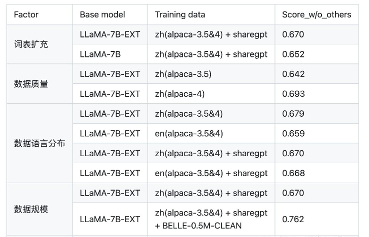

#### 3.2.1 llama2 篇

> 论文：https://arxiv.org/abs/2307.09288

##### 3.2.1 llama2 系列 数据预处理方式？

由于llama2开源的公司为Facebook，业务主要为社交的软件，社交数据都是ugc编辑的对于大模型提升知识能力没太多作用并且都是隐私的数据不能用于大模型训练。

为此llama2仅仅使用公开的数据来源，**对具有事实性的来源加权，以增加权威的知识并减少幻想**。最终使用**2 trillion token** 数据上进行了训练。

##### 3.2.2 llama2 系列 Tokenizer 处理方式？

使用 **bytepair encoding (BPE)** 算法 进行分词。针对连续数字分会拆为单独的数字并且未在词典中的词使用bytes替换，最终**词典大小为32k**。

##### 3.2.3 llama2 系列 Architectural？

- 位置编码：rotary positional embeddings
- 激活函数：SwiGLU
- normal方法：RMSNorm

##### 3.2.4 llama2 系列 content长度？

**grouped-query attention(GQA)**：将llama1 长度2048 提升至 4096

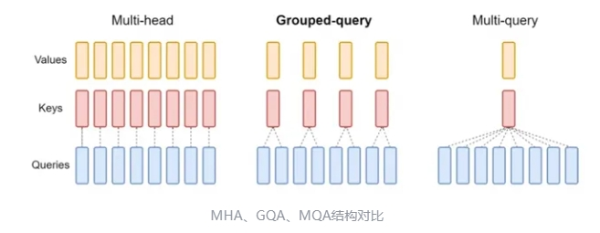

如上图所示，传统的transformer为多头注意力(MHA)模型，分组查询注意力变体为GQA模型，另外还有MQA模型，该结构为特殊的GQA模型，group 为1。

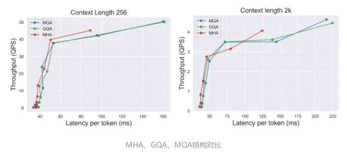

MHA 方式out-of-memory分别在batch size 为 1024 ， 256 tokens和 batch size 为 128，2k context，而MQA 和 GQA 都成功执行完毕。

### 3.2 Mistral 7B 系列篇

> 论文：https://arxiv.org/abs/2310.06825

#### 3.2.1  Mistral 7B Architectural？

1. **Sliding Window Attention**

**attention 中的操作数量与序列长度呈二次关系，通过Sliding Window Attention，可减少计算，但是会牺牲一点的效果**。

做法如下，第2层中的位置4的隐藏状态，关注来自前一层中位置在4- W和4之间的所有隐藏状态，下图中w=3

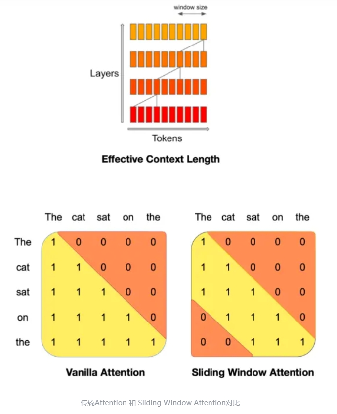

2. **Rolling Buffer Cache**

显存消耗与序列长度呈二次关系。当长度比较长时，显存的消耗是比较多的

Rolling Buffer Cache使用的是LRU算法，选择最久未使用的数据予以淘汰，相当于缓存最新数据。

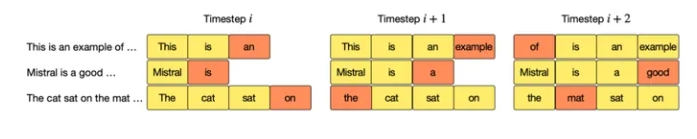

> 效果：

从下面可看出同一个数量级的参数 Mistral 都比llama2效果好，而从公开的论文来看，仅仅是提到了大模型content长度加速，对效果比llama2好的原因未提及。

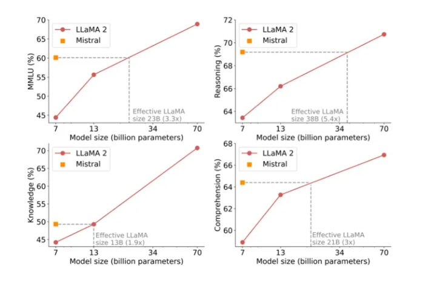

### 3.3 Qwen 系列篇

> 论文：https://arxiv.org/abs/2309.16609

#### 3.3.1 Qwen 系列 数据预处理方式？

- **去重**：标准化后进行完全匹配重复数据删除,以及使用 MinHash 和 LSH 算法进行模糊重复数据删除
- **过滤质量低**：过滤低质量的数据,采用了规则型和基于机器学习的方法的组合。多个模型对内容进行评分,包括语言模型,文本质量评分模型以及用于识别潜在的攻击性或不适当内容的模型。人工从各种来源中对文本进行抽样并审阅,以确保其质量。
- **高质量指令**：由于多任务指令可以增强他们的零样本和少样本性能，预训练过程中加入了高质量的指令数据。

#### 3.3.2 Qwen 系列 Tokenizer 处理方式？

使用基于 **bytepair encoding (BPE)** 的tiktoken算法，其相当于BPE tokenizer分词更快。首先使用cl100k作为base token，针对连续数字分会拆为单独的数字，最终**词典大小为152K**。

编码压缩率越小，则传递的信息就更多，每种语言100万个文档语料库来测试和比较不同模型的编码压缩率，

可看到qwen编码压缩率是比较低的

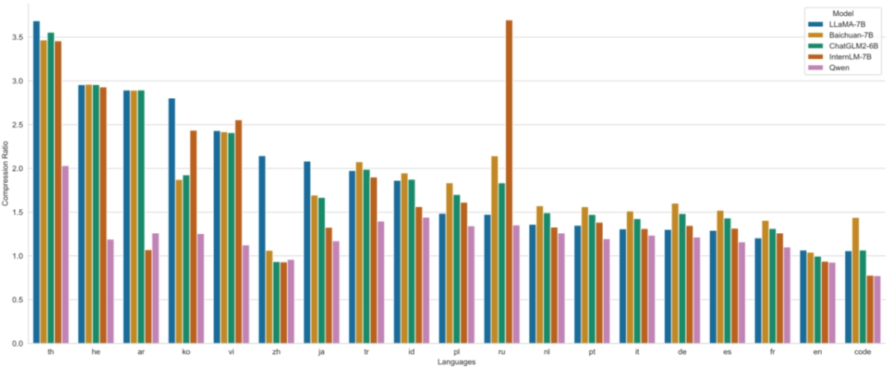

#### 3.3.3 Qwen 系列 ARCHITECTURE？

- **Embedding和output 投影层**：解开输入嵌入和输出投影的权重，这一决定是为了以内存成本为代价获得更好的性能
- **位置嵌入**：RoPE，选择使用FP32精度的逆频率矩阵,而不是BF16或FP16,以优先考虑模型性能并获得更高的准确性。
- **激活函数**：SwiGLU
- **normal方法**：RMSNorm，前馈网络(FFN)的维度从隐藏大小的4倍减少到隐藏大小的83倍
- **content长度**：长度外推，苏剑林发现，https://spaces.ac.cn/archives/9577 在QKV注意力层中添加bias以增强模型的外推能力。下图可看到加上了bias，长度大于1024效果下降不是很多。

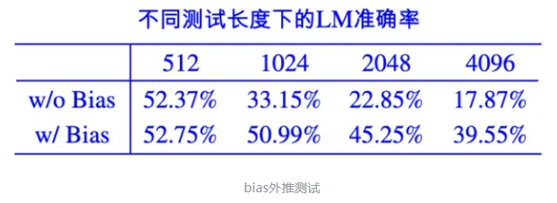

```s
    self.c_attn = nn.Linear(config.hidden_size, 3 * self.projection_size) #Linear 默认bias=True
    mixed_x_layer = self.c_attn(hidden_states)
    query, key, value = mixed_x_layer.split(self.split_size, dim=2)
```

- **NTK-aware interpolation**：动态 NTK-aware 插值,则每个块比例不同。
- **LogN-Scaling**：q和v乘以一个系数，context length和training length的长度关系，来保持注意力的稳定。
- **window attention**：将注意力限制在有限的上下文窗口内,防止模型关注距离太远的标记。基于这一发现,我们为每个层分配不同的窗口大小,对较低层使用较短的窗口,对较高层使用较长的窗口。

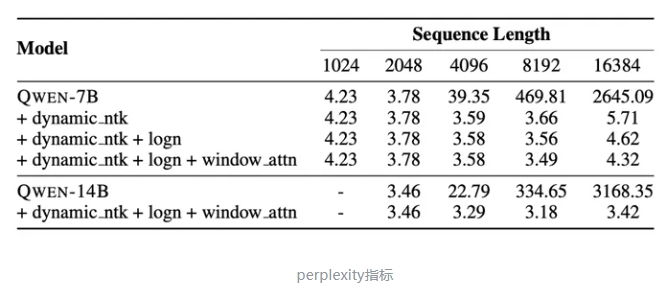

### 3.4 Baichuan 系列篇

#### 3.4.1 Baichuan2 篇

> 论文：[Baichuan2](https://arxiv.org/abs/2309.10305)

##### 3.4.1.1 Baichuan2 系列 数据预处理方式？

- **数据来源**。来源收集数据,包括常规互联网网页、书籍、研究论文、代码库等,以构建一个广泛的世界知识体系。
- **数据去重**。构建了一个大规模的重复数据删除和聚类系统,支持LSH类似特征和稠密嵌入特征。最终只保留原始数据的31.68%的数据进行训练。

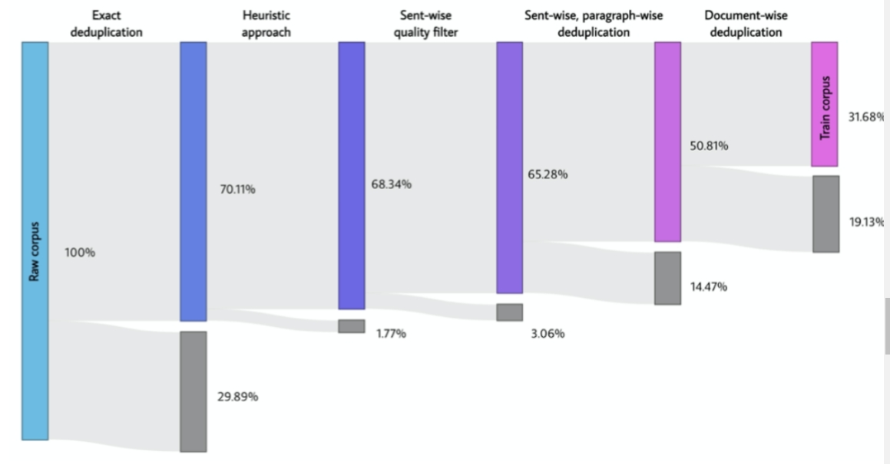

##### 3.4.1.2 Baichuan2 系列 Tokenizer 处理方式？

字节对编码(BPE)，**不对输入文本应用任何规范化,也不添加虚拟前缀**。将数字拆分为单独的数字，处理额外空格的代码数据,向分词器添加仅空格标记，最大标记长度设置为32,以处理长中文词组。

##### 3.4.1.2 Baichuan2 系列 Architecture ？

- **位置嵌入**：RoPE
- **激活函数**：SwiGLU
- **注意力层**：xFormers减少内存。
- **normal方法**：RMSNorm，并且**规范化输出嵌入lm_head**。在我们规范化头部之后(蓝色),在刚开始训练的2000step左右训练变得非常稳定,这导致了更好的性能。

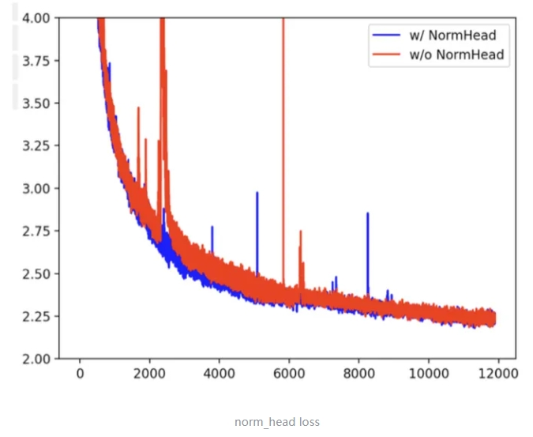

- **最大z损失**，在训练过程中,发现LLM的logits可能变得非常大。添加了一个最大z损失来规范化logits。其中z是最大logit值,这有助于稳定训练,并使推理更加稳健地适应超参数。

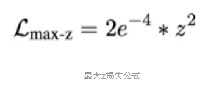

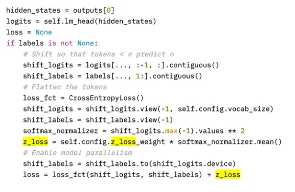

### 3.5 GLM 系列篇

#### 3.5.1 ChatGLM-6B 篇

> 论文：[ChatGLM-6B]()

##### 3.5.1.1 ChatGLM-6B 结构特点？

ChatGLM-6B 采用了 prefix decoder-only 的 transformer 模型框架，在输入上采用双向的注意力机制，在输出上采用单向注意力机制。在模型细节上，做了以下几点改动：

- embedding 层梯度缩减：为了提升训练稳定性，减小了 embedding 层的梯度。具体地， $word_embedding=word_embedding∗α+word_embedding.detach()∗(1−α)$ ，其中 α = 0.1  ，这里 detach() 函数的作用是返回一个新的 tensor，并从计算图分离出来。梯度缩减的效果相当于把 embedding 层的梯度缩小了 10 倍，减小了梯度的范数。
- layer normalization：采用了基于 Deep Norm 的 post layer norm。
- 激活函数：采用了 GeGLU 激活函数。相比于普通的 FFN，使用线形门控单元的 GLU 新增了一个权重矩阵，共有三个权重矩阵，为了保持参数量一致，中间维度采用了 $8/3 * d\frac{8}{3}d ，而不是 4d。
- 位置编码：去除了绝对位置编码，采用了旋转位置编码 RoPE。

##### 3.5.1.2 ChatGLM-6B 训练目标？

ChatGLM-6B 的训练任务是自回归文本填空。相比于采用 causal decoder-only 结构的大语言模型，采用 prefix decoder-only 结构的 ChatGLM-6B 存在一个劣势：训练效率低。causal decoder 结构会在所有的 token 上计算损失，而 prefix decoder 只会在输出上计算损失，而不计算输入上的损失。在有相同数量的训练 tokens 的情况下，prefix decoder 要比 causal decoder 的效果差，因为训练过程中实际用到的 tokens 数量要更少。另外，ChatGPT 的成功已经证明了 causal decoder 结构的大语言模型可以获得非常好的 few-shot 和 zero-shot 生成能力，通过指令微调可以进一步激发模型的能力。至于 prefix decoder 结构的大语言模型能否获得相当的 few-shot 和 zero-shot 能力还缺少足够的验证。

##### 3.5.1.3 ChatGLM-6B  tokenizer？

ChatGLM 在 25GB 的中英双语数据上训练了 SentencePiece 作为 tokenizer，词表大小为 130528。

### 3.6 BLOOM 系列篇

#### 3.6.1 BLOOM 篇

> 论文：[BLOOM]()

##### 3.6.1.1 BLOOM 训练数据构建？

BLOOM 系列模型是由 BigScience 团队训练的大语言模型。训练数据包含了英语、中文、法语、西班牙语、葡萄牙语等共 46 种语言，另外还包含 13 种编程语言。1.5TB 经过去重和清洗的文本，转换为 350B 的 tokens。训练数据的语言分布如下图所示，可以看到中文语料占比为 16.2%。

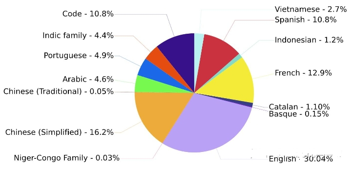

##### 3.6.1.2 BLOOM 模型参数量？

BLOOM 模型有 560M、1.1B、1.7B、3B、7.1B 和 176B 这几个不同参数规模的模型。BLOOMZ 系列模型是在 xP3 数据集上微调得到的，推荐用于英语提示的场景。BLOOMZ-MT 系列模型是在 xP3mt 数据集上微调得到的，推荐用于非英语提示的场景。

##### 3.6.1.3 BLOOM 模型结构？

模型结构上，与 GPT 相同，BLOOM 采用了 causal decoder-only 的 transformer 模型结构。在模型细节上，做了以下几点改动：

- embedding layer norm：在 embedding 层后添加了一个 layer normalization，来使训练更加稳定。
- layer normalization：为了提升训练的稳定性，没有使用传统的 post layer norm，而是使用了 pre layer Norm。
- 激活函数：采用了 GeLU 激活函数。
- 位置编码：去除了绝对位置编码，采用了相对位置编码 ALiBi。相比于绝对位置编码，ALiBi 的外推性更好，即虽然训练阶段的最大序列长度为 2048，模型在推理过程中可以处理更长的序列。

##### 3.6.1.4 BLOOM 训练目标？

BLOOM 的训练目标是语言模型，即根据已有的上文去预测下一个词。

##### 3.6.1.5 BLOOM tokenizer?

BLOOM 在多语种语料上使用 Byte Pair Encoding(BPE) 算法进行训练得到 tokenizer，词表大小为 250880。

## 四、分析与总结？

llama2、qwen和baichuan2的论文从数据到技术结构详细公开其实现方式，Mistral 只是公开了针对content长度较长时如果修改和优化网络结果。

### 4.1 大模型训练共同点？

llama2、qwen和baichuan2的论文 都提到使用RoPE位置嵌入、SwiGLU激活函数、RMSNorm方法。并且都在**尽可能实现更长长度的预测**

### 4.2 大模型训练不同点？

数据上，qwen和baichuan2去重上做了许多工作。并且qwen在数据质量上做了两方面工作首先过滤低质量语料，其次加入高质量指令提高预训练效果。

模型结构上：都在更长预测上下文长度进行提升，只是每个模型使用方式不一样。llama2使用GQA，Mistral 使用 Sliding Window Attention 和 Rolling Buffer Cache。qwen在QKV注意力层中添加bias以增强模型的外推能力、NTK-aware interpolation、LogN-Scaling和window attention。

另外，baichuan2使用规范化输出嵌入lm_head和最大z损失提升模型稳定性。qwen在核心的矩阵计算中使用FP32换取更好效果。

## 五、对比

### 5.1 LLaMA、ChatGLM 和 BLOOM 对比

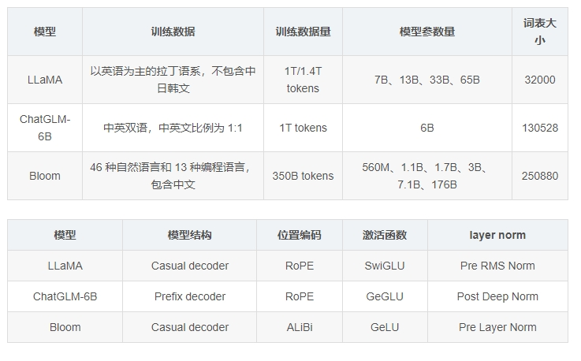

### 5.2 LLaMA、ChatGLM 和 BLOOM 的 tokenizer 比较

以上几个基座模型的 tokenizer 的词表大小不同，对同一个中文文本的分词结果会产生不同的结果。在 news_commentary 的 6.9 万条中英文平行语料上进行分词处理，对比分词结果和分词耗时，结果如下。“中文平均 token 数” 表示了 tokenizer 分词后，每个中文字符对应的平均 token 数。

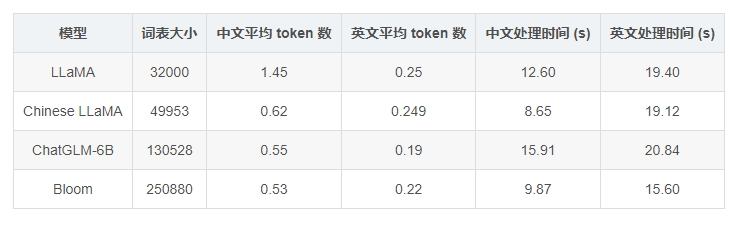

### 5.3LLaMA、ChatGLM 和 BLOOM 的 结果 比较

- LLaMA 的词表是最小的，LLaMA 在中英文上的平均 token 数都是最多的，这意味着 LLaMA 对中英文分词都会比较碎，比较细粒度。尤其在中文上平均 token 数高达 1.45，这意味着 LLaMA 大概率会将中文字符切分为 2 个以上的 token。
- Chinese LLaMA 扩展词表后，中文平均 token 数显著降低，会将一个汉字或两个汉字切分为一个 token，提高了中文编码效率。
- ChatGLM-6B 是平衡中英文分词效果最好的 tokenizer。由于词表比较大，中文处理时间也有增加。
- BLOOM 虽然是词表最大的，但由于是多语种的，在中英文上分词效率与 ChatGLM-6B 基本相当。需要注意的是，BLOOM 的 tokenizer 用了 transformers 的 BloomTokenizerFast 实现，分词速度更快。

> eg:从两个例子上，来直观对比不同 tokenizer 的分词结果。“男儿何不带吴钩，收取关山五十州。” 共有 16 字。几个 tokenizer 的分词结果如下：

> LLaMA 分词为 24 个 token：

```s
 [ '男', '<0xE5>', '<0x84>', '<0xBF>', '何', '不', '<0xE5>', '<0xB8>', '<0xA6>', '<0xE5>', '<0x90>', '<0xB4>', '<0xE9>', '<0x92>', '<0xA9>', '，', '收', '取', '关', '山', '五', '十', '州', '。'] 
```

> Chinese LLaMA 分词为 14 个 token：

```s
[ '男', '儿', '何', '不', '带', '吴', '钩', '，', '收取', '关', '山', '五十', '州', '。']
```

> ChatGLM-6B 分词为 11 个 token：

```s
[ '男儿', '何不', '带', '吴', '钩', ',', '收取', '关山', '五十', '州', '。'] 
```

> Bloom 分词为 13 个 token：

```s
 ['男', '儿', '何不', '带', '吴', '钩', '，', '收取', '关', '山', '五十', '州', '。'] 
```

## 致谢

- llama、baichuan和qwen等开源大模型技术对比 https://zhuanlan.zhihu.com/p/680260131
- 大模型基础知识点综述  https://zhuanlan.zhihu.com/p/679793253
- LLaMA, ChatGLM, BLOOM的参数高效微调实践 https://blog.csdn.net/sinat_39620217/article/details/131162919
