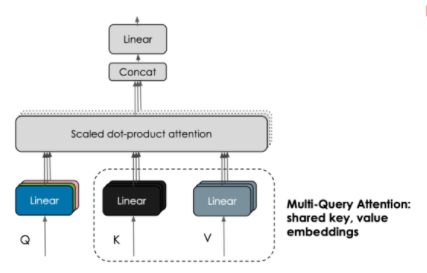
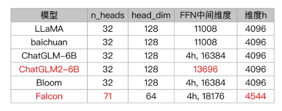
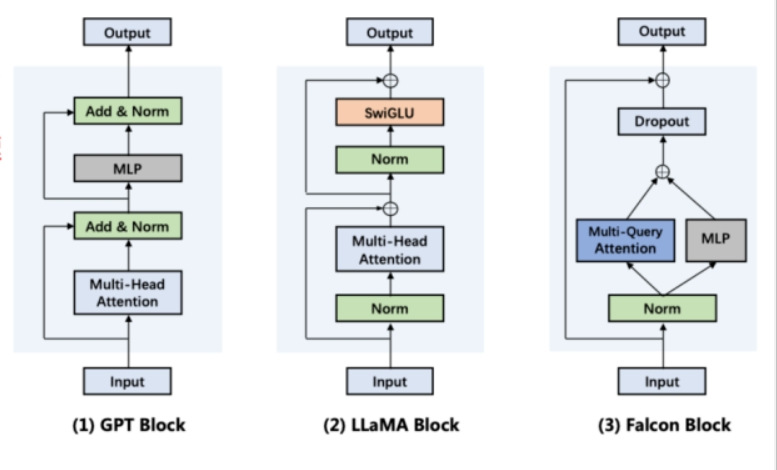

# Attention 升级面

- [Attention 升级面](#attention-升级面)
  - [1 传统 Attention 存在哪些问题？](#1-传统-attention-存在哪些问题)
  - [2 Attention 有哪些 优化方向？](#2-attention-有哪些-优化方向)
  - [3 Attention 变体有哪些？](#3-attention-变体有哪些)
  - [4 Multi-Query Attention 篇](#4-multi-query-attention-篇)
    - [4.1 Multi-head Attention 存在什么问题？](#41-multi-head-attention-存在什么问题)
    - [4.2 介绍一下 Multi-Query Attention？](#42-介绍一下-multi-query-attention)
    - [4.3 对比一下 Multi-head Attention 和 Multi-Query Attention？](#43-对比一下-multi-head-attention-和-multi-query-attention)
    - [4.4 Multi-Query Attention 这样做的好处是什么？](#44-multi-query-attention-这样做的好处是什么)
    - [4.5 有 哪些模型 是 使用 Multi-Query Attention？](#45-有-哪些模型-是-使用-multi-query-attention)
  - [5 Grouped-query Attention](#5-grouped-query-attention)
    - [5.1 什么是 Grouped-query Attention？](#51-什么是-grouped-query-attention)
    - [5.2 有哪些大模型使用 Grouped-query Attention？](#52-有哪些大模型使用-grouped-query-attention)
  - [6 FlashAttention](#6-flashattention)
    - [6.1 为什么需要  FlashAttention？](#61-为什么需要--flashattention)
    - [6.2 简单介绍一下 FlashAttention？](#62-简单介绍一下-flashattention)
    - [6.3 简单介绍一下 FlashAttention 核心？](#63-简单介绍一下-flashattention-核心)
    - [6.4 介绍一下 FlashAttention 优点？](#64-介绍一下-flashattention-优点)
    - [6.5 介绍一下 FlashAttention 代表模型？](#65-介绍一下-flashattention-代表模型)
  - [7 并行 transformer block](#7-并行-transformer-block)
  - [8 attention计算复杂度以及如何改进？](#8-attention计算复杂度以及如何改进)
  - [9 Paged Attention篇](#9-paged-attention篇)
    - [9.1 简单介绍一下 Paged Attention？](#91-简单介绍一下-paged-attention)
  - [对比篇](#对比篇)
    - [1、MHA，GQA，MQA 三种注意力机制是否了解?区别是什么?](#1mhagqamqa-三种注意力机制是否了解区别是什么)

## 1 传统 Attention 存在哪些问题？

1. 传统 Attention 存在 上下文长度 约束问题；
2. 传统 Attention 速度慢，内存占用大；

## 2 Attention 有哪些 优化方向？

1. 提升上下文长度
2. 加速、减少内存占用

## 3 Attention 变体有哪些？

- **稀疏 attention**。将稀疏偏差引入 attention 机制可以降低了复杂性；
- **线性化 attention**。解开 attention 矩阵与内核特征图，然后以相反的顺序计算 attention 以实现线性复杂度；
- **原型和内存压缩**。这类方法减少了查询或键值记忆对的数量，以减少注意力矩阵的大小；
- **低阶 self-Attention**。这一系列工作捕获了 self-Attention 的低阶属性；
- **Attention 与先验**。该研究探索了用先验 attention 分布来补充或替代标准 attention；
- **改进多头机制**。该系列研究探索了不同的替代多头机制。

## 4 Multi-Query Attention 篇

### 4.1 Multi-head Attention 存在什么问题？

- **训练过程**：不会显著影响训练过程，训练速度不变，会引起非常细微的模型效果损失；
- **推理过程**：反复加载 巨大 的 KV cache , 导致 内存开销大，性能是内存受限；

### 4.2 介绍一下 Multi-Query Attention？

Multi-QueryAttention(MQA)：19年提出的一种新的 注意力 机制，是MHA的变体形式，**K，V只有一个头，Q是多头，通过共享K得到注意力得分**。

### 4.3 对比一下 Multi-head Attention 和 Multi-Query Attention？

- Multi-head Attention：每个注意力头都有各自的query、key和value。
- Multi-query Attention: 在所有的注意力头上共享key和value。

Falcon、PaLM、ChatGLM2-6B都使用了Multi-query Attention，但有细微差别。

- 为了保持参数量一致，
  - Falcon: 把隐藏维度从4096增大到了4544。多余的参数量分给了Attention块和FFN块
  - ChatGLM2: 把FFN中间维度从11008增大到了13696。多余的参数分给了FFN块

### 4.4 Multi-Query Attention 这样做的好处是什么？

减少 KV cache 的大小，减少显存占用，提升推理速度。

### 4.5 有 哪些模型 是 使用 Multi-Query Attention？

- 代表模型：PaLM、ChatGLM2、Falcon等

## 5 Grouped-query Attention

### 5.1 什么是 Grouped-query Attention？

Grouped query attention: 介于multi head和multi query之间，多个key和value。

### 5.2 有哪些大模型使用 Grouped-query Attention？

ChatGLM2，LLaMA2-34B/70B使用了Grouped query attention。

## 6 FlashAttention

### 6.1 为什么需要  FlashAttention？

传统的自注意力计算需要对每对输入序列元素进行配对，**计算复杂度为O(N^2)**，其中N是序列长度。

### 6.2 简单介绍一下 FlashAttention？

FlashAttention:是一种重新牌序注意力计算的算法，**它利用平铺、重计算等技术来显著提升计算速度**.

### 6.3 简单介绍一下 FlashAttention 核心？

- 核心：用分块softmax等价替代传统softmax

通过优化这一计算过程，减少了对内存的需求，并允许更大的序列或者更大批量的数据被同时处理。它通过巧妙地重新排列计算步骤和利用矩阵运算的特性，达到减少计算量和内存使用的目的。

### 6.4 介绍一下 FlashAttention 优点？

FlashAttention 能够显著**降低Transformer模型中自注意力部分的计算和内存开销**，**将序列长度中的内存使用实现从二次到线性减少**。

不仅 节约HBM，高效利用SRAM，省显存，提速度

### 6.5 介绍一下 FlashAttention 代表模型？

Meta推出的开源大模型LLaMA，阿联酋推出的开源大模型Falcon都使用了Flash Attention来加速计算和节省显存

## 7 并行 transformer block

用并行公式替换了串行，提升了15%的训练速度。

在8B参数量规模，会有轻微的模型效果损失;在62B参数量规模，就不会损失模型效果。

Falcon、PaLM都使用了该技术来加速训练

## 8 attention计算复杂度以及如何改进？

在标准的Transformer中，attention计算的时间复杂度为O(N^2)，其中N是输入序列的长度。为了降低计算复杂度，可以采用以下几种方法：

- 使用自注意力机制，减少计算复杂度。自注意力机制不需要计算输入序列之间的交叉关系，而是计算每个输入向量与自身之间的关系，从而减少计算量。
- 使用局部注意力机制，只计算输入序列中与当前位置相关的子序列的交互，从而降低计算复杂度。
- 采用基于近似的方法，例如使用随机化和采样等方法来近似计算，从而降低计算复杂度。
- 使用压缩注意力机制，通过将输入向量映射到低维空间来减少计算量，例如使用哈希注意力机制和低秩注意力机制等。

## 9 Paged Attention篇

### 9.1 简单介绍一下 Paged Attention？

Paged Attention: 是对kv cache所占空间的分页管理，是一个典型的以内存空间换计算开销的手段，vllm和tenorRT-llm都应用了这个手段来节约kv cache占用的显存。

## 对比篇

### 1、MHA，GQA，MQA 三种注意力机制是否了解?区别是什么?

- Multi-query Attention和Grouped-query Attention是两种不同的注意力机制变种，用于改进和扩展传统的自注意力机制。
- Multi-query Attention:在Multi-query Attention中，每个查询可以与多个键值对进行交互，从而捕捉更多的上下文信息。这种机制可以提高模型的表达能力和性能，特别是在处理长序列或复杂关系时。
- Grouped-query Attention:在Grouped-query Attention中，查询被分成多个组，每个组内的查询与对应的键值对进行交互。这种机制可以减少计算复杂度，提高效率，同时仍然保持较好的性能。
