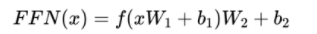
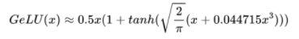
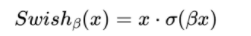
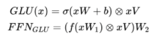
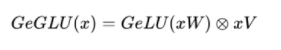
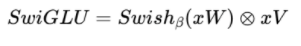
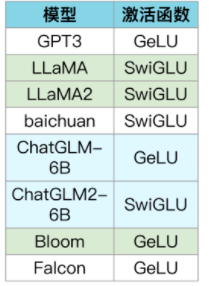
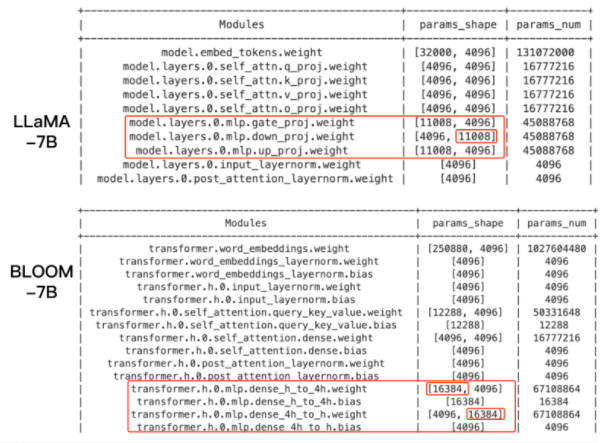

# LLMs 激活函数篇

- [LLMs 激活函数篇](#llms-激活函数篇)
  - [1 介绍一下 FFN 块 计算公式？](#1-介绍一下-ffn-块-计算公式)
  - [2 介绍一下 GeLU 计算公式？](#2-介绍一下-gelu-计算公式)
  - [3 介绍一下 Swish 计算公式？](#3-介绍一下-swish-计算公式)
  - [4 介绍一下 使用 GLU 线性门控单元的 FFN 块 计算公式？](#4-介绍一下-使用-glu-线性门控单元的-ffn-块-计算公式)
  - [5 介绍一下 使用 GeLU 的 GLU 块 计算公式？](#5-介绍一下-使用-gelu-的-glu-块-计算公式)
  - [6 介绍一下 使用 Swish 的 GLU 块 计算公式？](#6-介绍一下-使用-swish-的-glu-块-计算公式)
  - [7 各LLMs 都使用哪种激活函数？](#7-各llms-都使用哪种激活函数)
  - [8 Adam优化器和SGD的区别？](#8-adam优化器和sgd的区别)

## 1 介绍一下 FFN 块 计算公式？

## 2 介绍一下 GeLU 计算公式？

## 3 介绍一下 Swish 计算公式？

> 2个可训练权重矩阵，中间维度为 4h

## 4 介绍一下 使用 GLU 线性门控单元的 FFN 块 计算公式？

## 5 介绍一下 使用 GeLU 的 GLU 块 计算公式？

## 6 介绍一下 使用 Swish 的 GLU 块 计算公式？

> 3个可训练权重矩阵，中间维度为 4h*2/3

## 7 各LLMs 都使用哪种激活函数？

4h = 4*4096 = 16384

2/3 * 4h = 10022 -> 11008

11008/128 = 86

## 8 Adam优化器和SGD的区别？

Adam优化器和随机梯度下降（SGD）是两种常用的优化算法。它们的主要区别在于更新参数的方式和对梯度的处理方式。

Adam优化器使用了自适应学习率的方法，并结合了动量的概念。它维护了每个参数的自适应学习率，并使用动量来加速参数更新。Adam通过计算梯度的一阶矩估计（均值）和二阶矩估计（方差）来调整学习率。这种自适应学习率的调整可以帮助Adam更好地适应不同参数的特性，并且通常能够更快地收敛。

相比之下，SGD仅使用固定的学习率来更新参数。它直接使用当前的梯度来更新参数，而没有考虑其他信息。这种简单的更新方式可能导致收敛速度较慢，特别是在参数空间存在不同尺度的情况下。

总的来说，Adam相对于SGD来说更加智能化和自适应，能够更快地收敛到局部最优解，并且通常能够在训练过程中保持较小的学习率。

