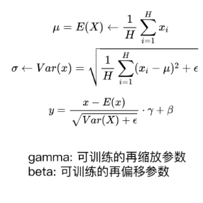
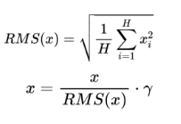
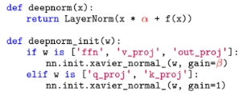
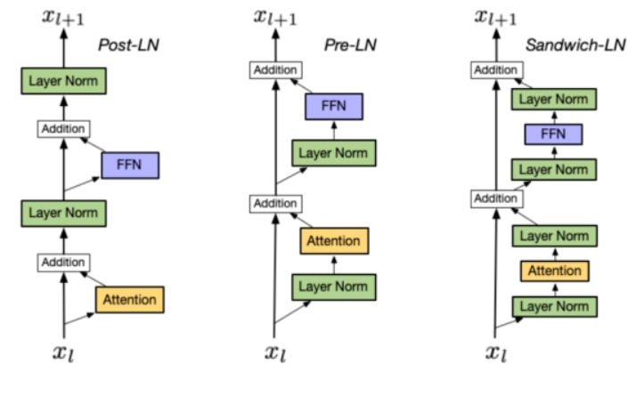
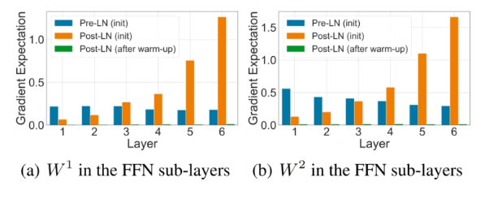
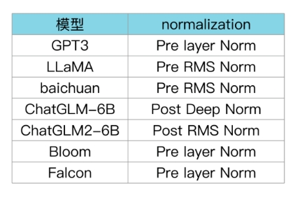

# Layer normalization 篇

- [Layer normalization 篇](#layer-normalization-篇)
  - [Layer normalization-方法篇](#layer-normalization-方法篇)
    - [Layer Norm 篇](#layer-norm-篇)
      - [Layer Norm 的计算公式写一下？](#layer-norm-的计算公式写一下)
    - [RMS Norm 篇 （均方根 Norm）](#rms-norm-篇-均方根-norm)
      - [RMS Norm 的计算公式写一下？](#rms-norm-的计算公式写一下)
      - [RMS Norm 相比于 Layer Norm 有什么特点？](#rms-norm-相比于-layer-norm-有什么特点)
    - [Deep Norm 篇](#deep-norm-篇)
      - [Deep Norm 思路？](#deep-norm-思路)
      - [写一下 Deep Norm 代码实现？](#写一下-deep-norm-代码实现)
      - [Deep Norm 有什么优点？](#deep-norm-有什么优点)
  - [Layer normalization-位置篇](#layer-normalization-位置篇)
    - [1 LN 在 LLMs 中的不同位置 有什么区别么？如果有，能介绍一下区别么？](#1-ln-在-llms-中的不同位置-有什么区别么如果有能介绍一下区别么)
  - [Layer normalization 对比篇](#layer-normalization-对比篇)
    - [LLMs 各模型分别用了 哪种 Layer normalization？](#llms-各模型分别用了-哪种-layer-normalization)

## Layer normalization-方法篇

### Layer Norm 篇

#### Layer Norm 的计算公式写一下？

### RMS Norm 篇 （均方根 Norm）

#### RMS Norm 的计算公式写一下？

#### RMS Norm 相比于 Layer Norm 有什么特点？

RMS Norm 简化了 Layer Norm ，去除掉计算均值进行平移的部分。

对比LN，RMS Norm的计算速度更快。效果基本相当，甚至略有提升。

### Deep Norm 篇

#### Deep Norm 思路？

Deep Norm方法在执行Layer Norm之前，up-scale了残差连接 (alpha>1)；另外，在初始化阶段down-scale了模型参数(beta<1)。

#### 写一下 Deep Norm 代码实现？

#### Deep Norm 有什么优点？

Deep Norm可以缓解爆炸式模型更新的问题，把模型更新限制在常数，使得模型训练过程更稳定。

## Layer normalization-位置篇

### 1 LN 在 LLMs 中的不同位置 有什么区别么？如果有，能介绍一下区别么？

回答：有，LN 在 LLMs 位置有以下几种：

1. Post LN：
   1. 位置：layer norm在残差链接之后
   2. 缺点：Post LN 在深层的梯度范式逐渐增大，导致使用post-LN的深层transformer容易出现训练不稳定的问题

2. Pre-LN：
   1. 位置：layer norm在残差链接中
   2. 优点：相比于Post-LN，Pre LN 在深层的梯度范式近似相等，所以使用Pre-LN的深层transformer训练更稳定，可以缓解训练不稳定问题
   3. 缺点：相比于Post-LN，Pre-LN的模型效果略差

3. Sandwich-LN：
   1. 位置：在pre-LN的基础上，额外插入了一个layer norm
   2. 优点：Cogview用来避免值爆炸的问题
   3. 缺点：训练不稳定，可能会导致训练崩溃。

## Layer normalization 对比篇

### LLMs 各模型分别用了 哪种 Layer normalization？

BLOOM在embedding层后添加layer normalization，有利于提升训练稳定性:但可能会带来很大的性能损失

