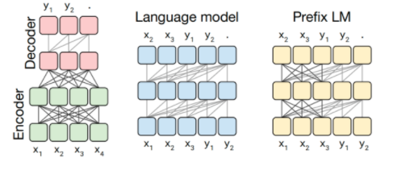
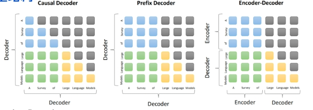
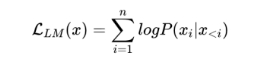
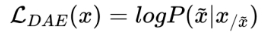

# 大模型（LLMs）基础面

- [大模型（LLMs）基础面](#大模型llms基础面)
  - [1 目前 主流的开源模型体系 有哪些？](#1-目前-主流的开源模型体系-有哪些)
  - [2 prefix Decoder 和 causal Decoder 和 Encoder-Decoder 区别是什么？](#2-prefix-decoder-和-causal-decoder-和-encoder-decoder-区别是什么)
  - [3 大模型LLM的 训练目标 是什么？](#3-大模型llm的-训练目标-是什么)
  - [4 涌现能力是啥原因？](#4-涌现能力是啥原因)
  - [5 为何现在的大模型大部分是Decoder only结构？](#5-为何现在的大模型大部分是decoder-only结构)
  - [6 简单 介绍一下 大模型【LLMs】？](#6-简单-介绍一下-大模型llms)
  - [7 大模型【LLMs】后面跟的 175B、60B、540B等 指什么？](#7-大模型llms后面跟的-175b60b540b等-指什么)
  - [8 大模型【LLMs】具有什么优点？](#8-大模型llms具有什么优点)
  - [9 大模型【LLMs】具有什么缺点？](#9-大模型llms具有什么缺点)
  - [10 encoder-only, decoder-only, encoder-decoder的区别?](#10-encoder-only-decoder-only-encoder-decoder的区别)
  - [11 BART、llama、gpt、t5、palm等主流模型异同点?](#11-bartllamagptt5palm等主流模型异同点)
  - [12 prefix LM 和 causal LM 区别是什么?](#12-prefix-lm-和-causal-lm-区别是什么)

## 1 目前 主流的开源模型体系 有哪些？

目前 主流的开源模型体系 分三种：

- 第一种：prefix Decoder 系
  - 介绍：输入双向注意力，输出单向注意力
  - 代表模型：ChatGLM、ChatGLM2、U-PaLM
- 第二种：causal Decoder 系
  - 介绍：从左到右的单向注意力
  - 代表模型：LLaMA-7B、LLaMa 衍生物
- 第三种：Encoder-Decoder
  - 介绍：输入双向注意力，输出单向注意力
  - 代表模型：T5、Flan-T5、BART

## 2 prefix Decoder 和 causal Decoder 和 Encoder-Decoder 区别是什么？

prefix Decoder 和 causal Decoder 和 Encoder-Decoder 区别 在于 attention mask不同：

- Encoder-Decoder：
  - 在输入上采用双向注意力，对问题的编码理解更充分
  - 适用任务：在偏理解的 NLP 任务上效果好
  - 缺点：在长文本生成任务上效果差，训练效率低；
- causal Decoder：
  - 自回归语言模型，预训练和下游应用是完全一致的，严格遵守**只有后面的token才能看到前面的token的规则**；
  - 适用任务：文本生成任务效果好
  - 优点：**训练效率高，zero-shot 能力更强，具有涌现能力**
- prefix Decoder：
  - 特点：**prefix部分的token互相能看到**，causal Decoder 和 Encoder-Decoder 折中；
  - 缺点：**训练效率低**

## 3 大模型LLM的 训练目标 是什么？

1. 语言模型

根据 已有词 预测下一个词，训练目标为最大似然函数：

**训练效率：Prefix Decoder < Causal Decoder**

**Causal Decoder 结构会在 所有 token 上计算损失，而 Prefix Decoder 只会在 输出上 计算损失。**

2. 去噪自编码器

随机替换掉一些文本段，训练语言模型去恢复被打乱的文本段。目标函数为:

去噪自编码器的实现难度更高。采用去噪自编码器作为训练目标的任务有GLM-130B、T5.

## 4 涌现能力是啥原因？

根据前人分析和论文总结，大致是2个猜想：

- 任务的评价指标不够平滑；
- 复杂任务 vs 子任务，这个其实好理解，比如我们假设某个任务 T 有 5 个子任务 Sub-T 构成，每个 sub-T 随着模型增长，指标从 40% 提升到 60%，但是最终任务的指标只从 1.1% 提升到了 7%，也就是说宏观上看到了涌现现象，但是子任务效果其实是平滑增长的。

## 5 为何现在的大模型大部分是Decoder only结构？

因为**decoder-only结构模型在没有任何微调数据的情况下，zero-shot的表现能力最好**。而**encoder-decoder则需要在一定量的标注数据上做multitask-finetuning才能够激发最佳性能**。

目前的Large LM的训练范式还是在大规模语料shang 做自监督学习，很显然zero-shot性能更好的decoder-only架构才能更好的利用这些无标注的数据。

**大模型使用decoder-only架构除了训练效率和工程实现上的优势外，在理论上因为Encoder的双向注意力会存在低秩的问题，这可能会削弱模型的表达能力**。就生成任务而言，引入双向注意力并无实质的好处。而Encoder-decoder模型架构之所以能够在某些场景下表现更好，大概是因为它多了一倍参数。所以在同等参数量、同等推理成本下，Decoder-only架构就是最优的选择了。

## 6 简单 介绍一下 大模型【LLMs】？

大模型：一般指**1亿以上参数的模型**，但是这个标准一直在升级，目前万亿参数以上的模型也有了。大语言模型（Large Language Model，LLM）是针对语言的大模型。

## 7 大模型【LLMs】后面跟的 175B、60B、540B等 指什么？

175B、60B、540B等：这些一般指参数的个数，B是Billion/十亿的意思，175B是1750亿参数，这是ChatGPT大约的参数规模。

## 8 大模型【LLMs】具有什么优点？

1. 可以利用大量的无标注数据来训练一个通用的模型，然后再用少量的有标注数据来微调模型，以适应特定的任务。这种预训练和微调的方法可以减少数据标注的成本和时间，提高模型的泛化能力；
2. 可以利用生成式人工智能技术来产生新颖和有价值的内容，例如图像、文本、音乐等。这种生成能力可以帮助用户在创意、娱乐、教育等领域获得更好的体验和效果；
3. 可以利用涌现能力（Emergent Capabilities）来完成一些之前无法完成或者很难完成的任务，例如数学应用题、常识推理、符号操作等。这种涌现能力可以反映模型的智能水平和推理能力。

## 9 大模型【LLMs】具有什么缺点？

1. 需要消耗大量的计算资源和存储资源来训练和运行，这会增加经济和环境的负担。据估计，训练一个GPT-3模型需要消耗约30万美元，并产生约284吨二氧化碳排放；
2. 需要面对数据质量和安全性的问题，例如数据偏见、数据泄露、数据滥用等。这些问题可能会导致模型产生不准确或不道德的输出，并影响用户或社会的利益；
3. 需要考虑可解释性、可靠性、可持续性等方面的挑战，例如如何理解和控制模型的行为、如何保证模型的正确性和稳定性、如何平衡模型的效益和风险等。这些挑战需要多方面的研究和合作，以确保大模型能够健康地发展。

## 10 encoder-only, decoder-only, encoder-decoder的区别?

在自然语言处理和机器学习领域，encoder-only、decoder-only和encoder-decoder是指不同的神经网络架构，它们在处理数据和学习任务时有着不同的特点和用途。下面是它们各自的主要区别:

- **Encoder-only 架构**：
  - 主要用途:用于处理分类、回归、实体识别等任务，其中模型需要从输入数据中提取特征并产生一个固定大小的输出。比如，BERT(Bidirectional Encoder Representations fromTransformers)是一个典型的encoder-only模型，它通过读取整个输入数据(如一段文本)来理解上下文中的每个单词。
  - 工作方式:这种架构只包含编码器部分，用于处理输入数据并提取特征，但不直接生成序列化输出。编码器通常包括多层自注意力和前馈神经网络。
- **Decoder-only 架构**：
  - 主要用途:主要用于生成任务，如文本生成、语言模型等。GPT(Generative PretrainedTransformer)是一个著名的decoder-only模型它可以基于给定的提示生成连贯的文本序列。
  - 工作方式:这种架构只包含解码器部分，它接收一个或多个输入(如一个起始令牌)并逐步生成输出序列。解码器层通过自注意力机制学习如何基于之前生成的输出来预测下一个输出。
- **Encoder-decoder架构**：
  - 主要用途:用于复杂的转换任务，如机器翻译文本摘要、语音识别等，其中模型需要将输入数据转换成一个新的形式或语言。Seq2Seq(Sequence to Sequence)模型和Transformer是典型的encoder-decoder模型。
  - 工作方式:这种架构包含编码器和解码器两部分。编码器处理输入数据并提取特征，解码器则基于编码器的输出生成序列化的输出。编码器和解码器之间通常还有一种机制(如注意力机制)，用于帮助解码器关注输入数据中的不同部分以更好地生成输出。

总的来说，encoder-only架构擅长理解和分类输入数据，decoder-only架构擅长基于某些输入生成数据而encoder-decoder架构能够将输入数据转换成另一种格式或语言，适用于更复杂的任务

## 11 BART、llama、gpt、t5、palm等主流模型异同点?

BART、Llama、GPT、T5和PaLM是自然语言处理领域的几种主流模型，它们各自采用了不同的架构和训练方法，适用于不同的任务。下面是这些模型的异同点:

- BART (Bidirectional and Auto-RegressiveTransformers)
  - 架构:BART采用encoder-decoder架构。
  - 训练方法:它结合了双向编码器(类似于BERT)的优势和自回归解码器(类似于GPT)的优势。BART主要用于文本生成任务，如摘要和翻译。它通过“破坏”输入文本(例如，通过删除单词或打乱句子顺序)然后训练模型来重建原始文本来进行训练。
- LLaMA (Large Language Model)
  - 架构:LLaMA是一个基于Transformer的大规模语言模型，它的具体架构取决于其各个版本的实现，但主要以decoder-only或类似于GPT的架构为主。
  - 训练方法:LLaMA通过海量文本数据进行预训练，优化了参数效率和计算效率，使其在多种自然语言处理任务上表现出色
- GPT(Generative Pre-trained Transformer)
  - 架构:GPT采用decoder-only架构:
  - 训练方法:GPT通过大规模文本数据进行自回归训练，首先在无监督任务上预训练，然后在特定任务上进行微调。它主要用于文本生成任务。
- T5 (Text-to-Text Transfer Transformer)
  - 架构:T5采用encoder-decoder架构，
  - 训练方法:T5的特点是将所有NLP任务转换为文本到文本的格式，无论是翻译、摘要还是问题回答。这种统一的方法简化了不同任务之间的处理流程。
- PaLM (Pathways Language Model)
  - 架构:PaLM也是基于最新的Transformer技术其具体架构细节取决于其版本和实现，但它旨在通过大规模模型和数据进行训练，以提高性能和通用性。
  - 训练方法:PaLM采用了类似于GPT的预训练和微调方法，通过大规模的文本数据进行训练，优化了多任务学习和参数效率

- 异同点总结
  - 架构:BART和T5使用encoder-decoder架构，适合于翻译和摘要等任务;GPT和LLaMA主要采用decoder-only架构，优于生成任务;PaLM的架构虽然基于Transformer，但其具体设计旨在通过大规模训练提升模型的通用性和效率。
  - 训练方法:BART通过文本破坏和重建进行训练，T5将所有任务转化为文本到文本格式;GPT和LLaMA通过大规模的无监督预训练和任务特定的微调进行训练;PaLM也采用了大规模预训练，强调在多任务学习中的性能提升。
  - 应用范围:虽然这些模型都可以处理多种NLP任务，但它们的设计和优化方法在生成、翻译、摘要、问答等任务上有所不同，反映了在处理不同类型任务时的特定优势和偏好。

## 12 prefix LM 和 causal LM 区别是什么?

Prefix Language Model(Prefix LM) 和 CausalLanguage Model(CausalLM)是两种自然语言处理中的语言模型类型，它们在处理文本和预测下一个词的方式上有所不同。下面是它们之间的主要区别:

- Causal Language Model (Causal LM)
  - 定义:CausalLM，也被称为自回归语言模型是一种根据前面的词序列预测下一个词的模型在这种模型中，每个词的预测只依赖于它之前的词(因果依赖)，这种模式模拟了自然语言的生成过程。
  - 特点:这种模型是单向的，因为它在预测下一个词时不会考虑当前词之后的词。这种方式适用于文本生成任务，如GPT系列模型所采用的。
- Prefix Language Model (Prefix LM)
  - 定义:Prefix LM是一种处理文本的模型，它在给定前缀(一系列已知词)的情况下预测接下来的词序列。与CausalLM不同，PrefixLM可以在预测时考虑整个前缀的上下文信息，而不仅仅是紧邻的前一个词。
  - 特点:PrefixLM通常用于条件文本生成任务，例如文本补全、机器翻译或任何需要根据给定的开始段落生成文本的场景。这种模型可以是单向的，也可以是双向的，具体取决于其设计和实现。

- 主要区别：
  - 依赖方向:CausalLM是单向的，仅考虑之前的词;而PrefixLM可以根据设计不同，同时考虑前缀中的全部上下文信息。
  - 应用场景:CausalLM主要用于纯文本生成，如写作、聊天机器人等，其生成的文本完全基于之前的词序列;PrefixLM则更适合于基于给定上下文条件生成文本的任务，如根据一段特定文本生成接下来的内容。
  - 上下文利用:PrefixLM通常能够利用更全面的上下文信息来进行预测，而CausalLM则严格限制在因果(即时间序列)上下文中

总之，这两种模型虽然在处理文本生成任务时都非常重要，但它们各自的设计哲学和应用场景有所不同,反映了在自然语言处理领域多样化的方法和需求。
