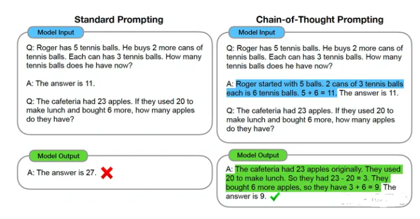
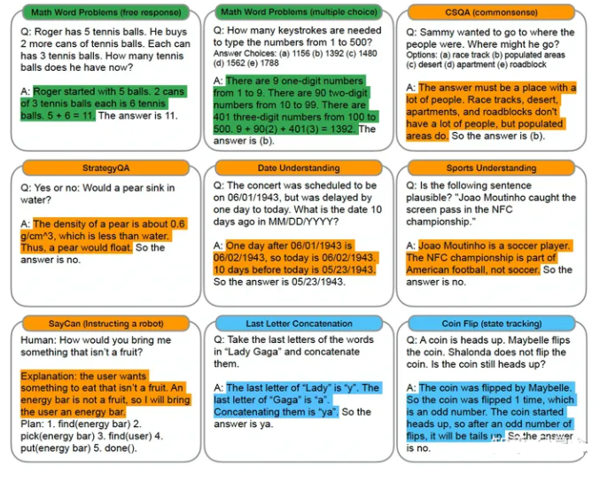
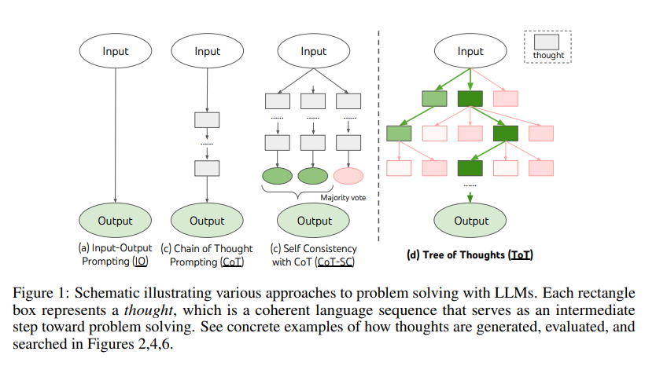
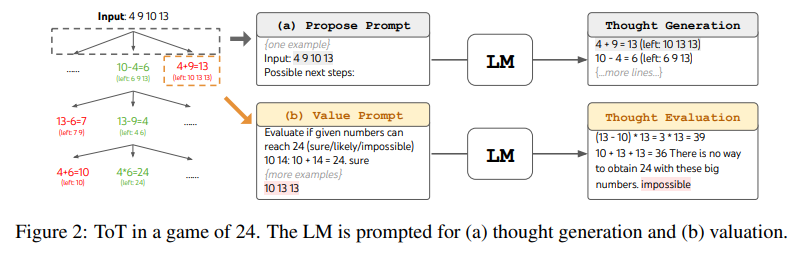
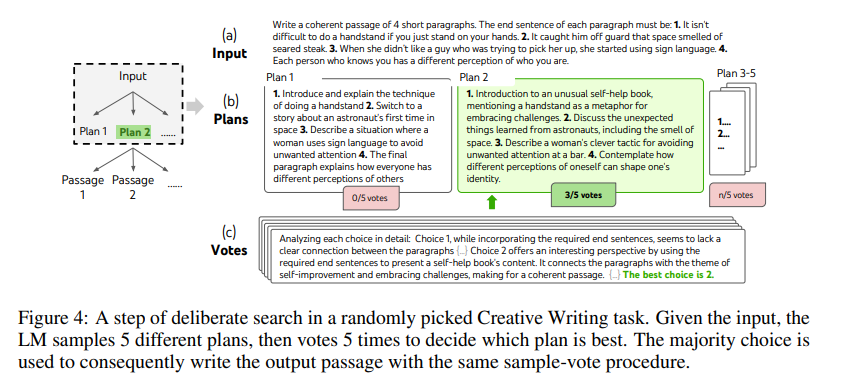
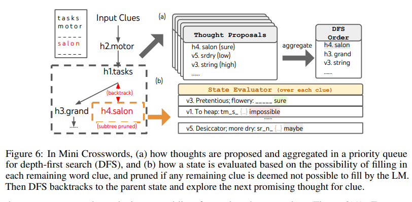
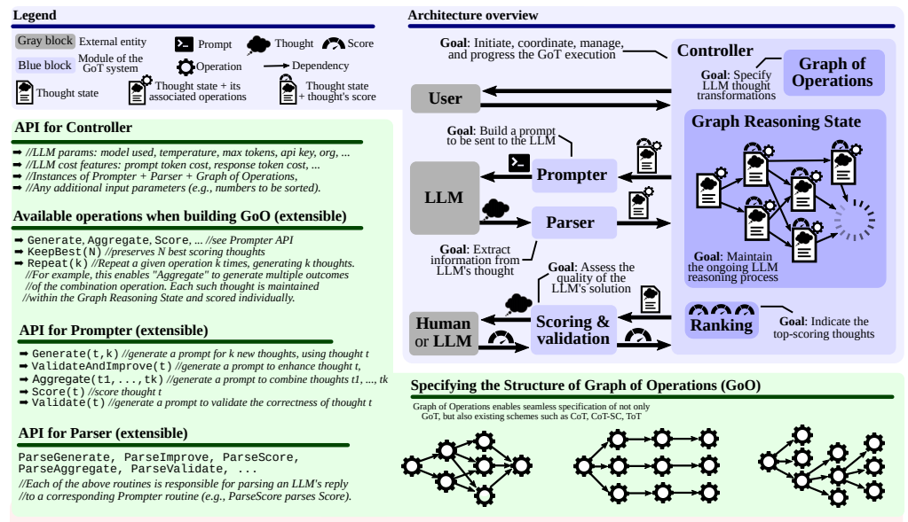
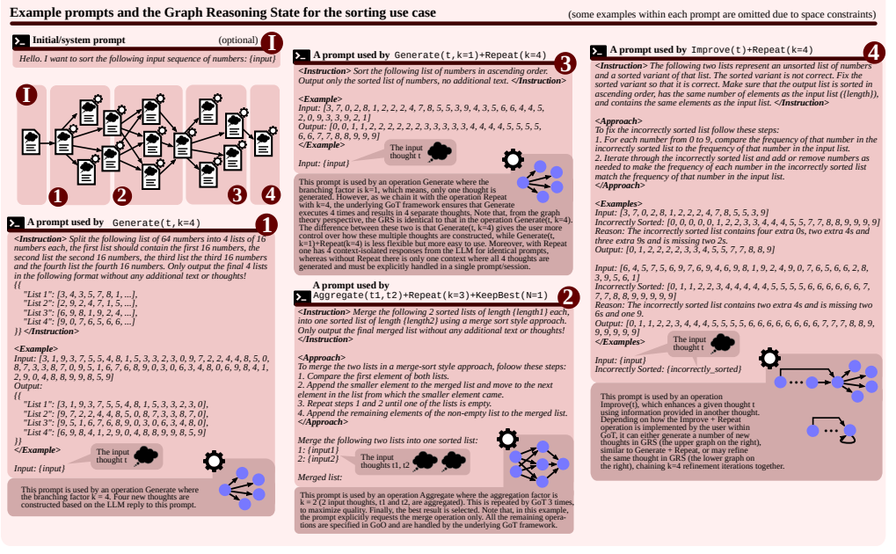
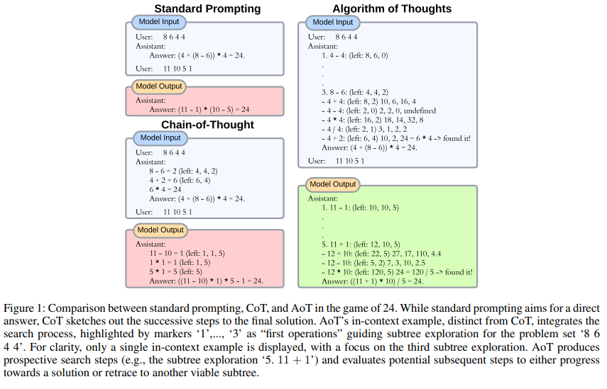
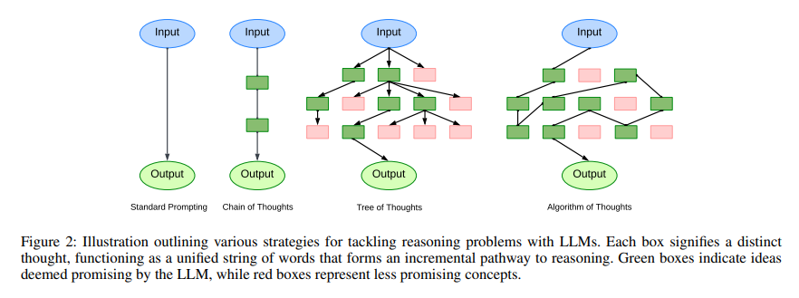

# 思维链 Chain-of-Thought（COT）变体篇

- [思维链 Chain-of-Thought（COT）变体篇](#思维链-chain-of-thoughtcot变体篇)
  - [思维链 Chain-of-Thought（COT）：思维链的启蒙](#思维链-chain-of-thoughtcot思维链的启蒙)
    - [1. 什么是 思维链 Chain-of-Thought（COT）？](#1-什么是-思维链-chain-of-thoughtcot)
    - [2. 思维链 Chain-of-Thought（COT）是思路是什么？](#2-思维链-chain-of-thoughtcot是思路是什么)
    - [3. 思维链 Chain-of-Thought（COT）存在问题？](#3-思维链-chain-of-thoughtcot存在问题)
  - [思维树 Tree of Thoughts（TOT）：一种用树结构解决复杂问题的方法](#思维树-tree-of-thoughtstot一种用树结构解决复杂问题的方法)
    - [1. 为什么需要 思维树 Tree of Thoughts（TOT）？](#1-为什么需要-思维树-tree-of-thoughtstot)
    - [2. 什么是 思维树 Tree of Thoughts（TOT）？](#2-什么是-思维树-tree-of-thoughtstot)
    - [3. 思维树 Tree of Thoughts（TOT）涉及问题有哪些？](#3-思维树-tree-of-thoughtstot涉及问题有哪些)
    - [思维树 Tree of Thoughts（TOT）解决复杂任务实例](#思维树-tree-of-thoughtstot解决复杂任务实例)
      - [example 1：LLMs to Game of 24](#example-1llms-to-game-of-24)
      - [example 2：LLMs to Create Writing](#example-2llms-to-create-writing)
      - [example 3：LLMs to 5x5个迷你填字游戏](#example-3llms-to-5x5个迷你填字游戏)
  - [思维图 Graph of Thoughts（GOT）：一种把思维链过程建模层图结构的方法](#思维图-graph-of-thoughtsgot一种把思维链过程建模层图结构的方法)
    - [1. 为什么 需要 思维图 Graph of Thoughts（GOT）？](#1-为什么-需要-思维图-graph-of-thoughtsgot)
    - [2. 什么是 思维图 Graph of Thoughts（GOT） ？](#2-什么是-思维图-graph-of-thoughtsgot-)
    - [3. 思维图 Graph of Thoughts（GOT）核心思想是什么 ？](#3-思维图-graph-of-thoughtsgot核心思想是什么-)
  - [思维算法 Algorithm of Thoughts（AOT）：一种用DFS/BFS示例解决问题的方法](#思维算法-algorithm-of-thoughtsaot一种用dfsbfs示例解决问题的方法)
    - [1. 为什么 需要 思维算法 Algorithm of Thoughts（AOT）？](#1-为什么-需要-思维算法-algorithm-of-thoughtsaot)
    - [2. 思维算法 Algorithm of Thoughts（AOT）思路是什么？](#2-思维算法-algorithm-of-thoughtsaot思路是什么)
    - [3. 思维算法 Algorithm of Thoughts（AOT） vs 其他 COT 的 区别？](#3-思维算法-algorithm-of-thoughtsaot-vs-其他-cot-的-区别)
  - [思维链 Chain-of-Thought（COT） 有哪些 应用场景？](#思维链-chain-of-thoughtcot-有哪些-应用场景)
    - [Task 1: 复杂任务求解](#task-1-复杂任务求解)
    - [Task 2: 增强特定任务可靠性](#task-2-增强特定任务可靠性)
  - [思维链 Chain-of-Thought（COT） 有哪些 局限性？](#思维链-chain-of-thoughtcot-有哪些-局限性)
  - [致谢](#致谢)

## 思维链 Chain-of-Thought（COT）：思维链的启蒙

> 论文名称：Chain-of-Thought Prompting Elicits Reasoning in Large Language Models
> 
> 论文地址：https://proceedings.neurips.cc//paper_files/paper/2022/hash/9d5609613524ecf4f15af0f7b31abca4-Abstract-Conference.html

### 1. 什么是 思维链 Chain-of-Thought（COT）？

思维链（Chain-of-thought）提示使大型语言模型能够处理复杂的算术、常识和符号推理任务。强调了Chain-of-thought推理过程。

> 如图：该模型产生了一个思想链来解决一个数学问题，否则它会变得不正确。

### 2. 思维链 Chain-of-Thought（COT）是思路是什么？

思维链 Chain-of-Thought（COT）类似于一个解决方案，它**模仿了一个逐步思考的过程来得出答案（或者solutions/explanations通常在final answer之后）**。

### 3. 思维链 Chain-of-Thought（COT）存在问题？

思维链 Chain-of-Thought（COT） 需要 LLM的参数量级必须大

> eg: 论文使用效果最好的是PaLM 540B的模型，看来模型越大对思维链的能力就越强

## 思维树 Tree of Thoughts（TOT）：一种用树结构解决复杂问题的方法

> 论文名称：Tree of Thoughts: Deliberate Problem Solving with Large Language Models
> 
> 论文地址：https://arxiv.org/abs/2305.10601
> 
> 论文 Github：https://github.com/princeton-nlp/tree-of-thought-llm

### 1. 为什么需要 思维树 Tree of Thoughts（TOT）？

CoT通常只有一条解决问题的路径，**但是 有一些复杂问题的答案 并不止 有一条解决问题的路径，而是由 多条 解决问题的路径 组成**。

### 2. 什么是 思维树 Tree of Thoughts（TOT）？

**思维树 Tree of Thoughts（TOT）把一条reasoning路径拓展至多条reasong paths，这样模型可以综合多条reasoning path的结果得到最终的结论**。

> 注：LLM解决问题的各种方法。每个矩形框代表一个thought，它是一个连贯的语言序列，是解决问题的中间步骤。ToT将任何问题定义为在树上的搜索，其中每个节点都是一个状态s=[x；z1i]，表示到目前为止具有输入和thought序列的部分解决方案

### 3. 思维树 Tree of Thoughts（TOT）涉及问题有哪些？

1. **Thought Decomposition**
   1. 问题描述：如何将中间过程分解为思维步骤；
2. **Thought Generator**
   1. 问题描述：如何从每种状态中产生潜在的thought；
   2. 任务定义：给定一个树的状态，从k个候选项中决定下一个step
   3. 实现方法：采用采样和投票的方法
3. **State Evaluator**
   1. 问题描述：如何启发式地评估状态；
   2. 任务定义：给定不同状态的边界，状态评估器**评估他们在解决问题方面取得的进展，并作为搜索算法的启发式算法，以确定要继续探索哪些状态以及以何种顺序进行探索**
   3. 实现方法：
      1. value类型的分类或者打分
      2. 投票的形式
4. **Search algorithms**
   1. 问题描述：使用什么搜索算法。
   2. 实现方法：可拔插式的使用不同的搜索算法

### 思维树 Tree of Thoughts（TOT）解决复杂任务实例

#### example 1：LLMs to Game of 24

- 任务介绍：Game of 24 游戏是数学推理游戏，目标是通过4个数，然后加减乘除得到24
- LLMs to Game of 24 思路：输入是“4 9 10 13”，最终得到的答案是“(10 - 4) * (13 - 9) = 24”，产生了3个intermediate thoughts可以是：“13 - 9 = 4 (left: 4 4 10); 10 - 4 = 6 (left: 4 6); 4 * 6 = 24 (left: 24)”，ToT会产生很多的这样的itermediate steps，然后我们采用BFS来执行这些steps。

#### example 2：LLMs to Create Writing

- 任务介绍：给定四个句子，然后产生4个paragraph，分别以这4个句子结尾
- LLMs to Create Writing 思路：
  - 首先产生k=5个候选的plan，投票选择最佳的passage，基于最佳的plan，产生5个passage；
  - 然后选择其中产生的最佳passage，投票的过程是一个zero-shot的过程

#### example 3：LLMs to 5x5个迷你填字游戏

- 任务介绍：
- LLMs to 5x5个迷你填字游戏 思路：探索LM作为一个探索自己思想的一般问题解决者的极限并以深思熟虑的推理作为启发法来指导自己的探索。

## 思维图 Graph of Thoughts（GOT）：一种把思维链过程建模层图结构的方法

> 论文名称：Tree of Thoughts: Deliberate Problem Solving with Large Language Models
> 
> 论文地址：https://arxiv.org/abs/2308.09687
> 
> 论文 Github：https://github.com/spcl/graph-of-thoughts

### 1. 为什么 需要 思维图 Graph of Thoughts（GOT）？

- CoT通常只有一条解决问题的路径；
- TOT 解决问题的路径类似一颗树；

但是 有时候 解决问题 的 父级 节点 不只有一个，而是 类似 拓扑图 的 形式。

### 2. 什么是 思维图 Graph of Thoughts（GOT） ？

思维图 Graph of Thoughts（GOT） **通过 构建了一个有向图来解决问题**。

### 3. 思维图 Graph of Thoughts（GOT）核心思想是什么 ？

GoT系统结构包含一系列的交互模块：

- **Prompter**：为LLM准备消息；
- **Parser**：从LLM的回复中提取信息；
- **Scoring module**：验证LLM回复并对其进行评分；
- **Controller**：
  - 介绍：协调整个推理过程，并决定如何进行推理
  - 重要元素：
    - **Graph of Operations（GoO）**：一种静态结构，它指定了给定任务的图分解，它规定了应用于LLM思想的转换，以及它们的顺序和依赖关系
    - **Graph Reasoning State（GRS）**：一个动态结构，它保持正在进行的LLM推理过程的状态（其思想及其状态的历史）

> 注：图中蓝色部分包含架构概述，绿色部分列出API

> 注：红色部分包含示例提示以及GRS和相关操作，具体是归并排序（先把list array，分解成sub array，sort后进行合并）任务的prompt的示例

## 思维算法 Algorithm of Thoughts（AOT）：一种用DFS/BFS示例解决问题的方法

> 论文名称：Algorithm of Thoughts: Enhancing Exploration of Ideas in Large Language Models
> 
> 论文地址：https://arxiv.org/abs/2308.10379
> 
> 论文 Github：https://github.com/kyegomez/Algorithm-Of-Thoughts

### 1. 为什么 需要 思维算法 Algorithm of Thoughts（AOT）？

- Standard Prompting 旨在直接回答
- CoT 给出了最终解决方案的连续步骤

### 2. 思维算法 Algorithm of Thoughts（AOT）思路是什么？

AoT的上下文示例与CoT不同，它集成了搜索过程，由标记“1”、…、“突出显示3’作为指导问题集子树探索的“第一次运算”8 6 4 4’。为了清楚起见，只显示了一个上下文中的示例，重点放在第三子树探索上。AoT产生预期的搜索步骤（例如子树探索’5。11+1'），并评估任何进展的潜在后续步骤找到一个解决方案或返回到另一个可行的子树。

### 3. 思维算法 Algorithm of Thoughts（AOT） vs 其他 COT 的 区别？

- AOT vs COT:
  - COT：为链式结构，也就是 问题答案 只能由 一条固定路径得到；
  - AOT：为有向图结构中寻找最优路径的过程；

- AOT vs TOT:
  - TOT：对节点进行剪枝，然后推理过程是一个树的结构；
  - AOT：利用示例的方式模仿DFS或者BFS，能够激发LLM的能力（论文说在GPT4上有很好的效果，估计对LLM本身的能力要求比较高），得到更好的结果；

## 思维链 Chain-of-Thought（COT） 有哪些 应用场景？

### Task 1: 复杂任务求解

从论文给的一些数学和算法的求解示例可以看出，这些复杂的思维链的prompts工程是为了增强模型在复杂推理任务的准确性，所以显而易见，后续的一个很大的应用方向是解决复杂的数学问题，组合优化问题等等，至于能不能求解NP-hard问题，找到一些启发式的算法，还有待探索。

### Task 2: 增强特定任务可靠性

除了解决LLM在复杂任务上的性能问题外，还有一个方向就是提升已有任务的准确性，比如现在检索+生成的问答方式只能达到80%的准确率了，通过应用思维链的方式+限制条件，一下子能够提升准确率到90%。这对于一些追求LLM稳定性结果输出的场景具有重要的作用。

## 思维链 Chain-of-Thought（COT） 有哪些 局限性？

CoT，AoT，ToT都需要你自己写instructions和in-context examples，这些都属于prompt工程的范畴，但是人工的寻找某些任务的最佳prompts就比较费脑子，因此自动化prompts工程会是未来一个潜在的方向，来弥补现在对复杂任务需要这种细粒度的prompt 工程的弊端。

## 致谢

- 2023年能够解决复杂问题的思维链技术：Cot，ToT，GoT，AoT https://zhuanlan.zhihu.com/p/654034193
- Chain-of-Thought Prompting Elicits Reasoningin Large Language Models：https://arxiv.org/pdf/2201.11903.pdf
- 关于思维链COT的n个问题：https://zhuanlan.zhihu.com/p/651502051
- 2023年能够解决复杂问题的思维链技术：Cot，ToT，GoT，AoT  https://zhuanlan.zhihu.com/p/654034193
