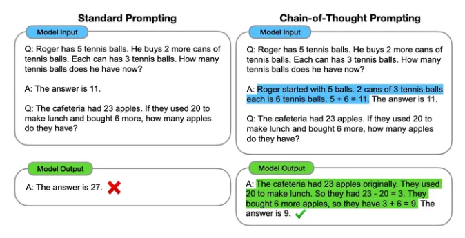

# 思维链 Chain-of-Thought（COT）

- [思维链 Chain-of-Thought（COT）](#思维链-chain-of-thoughtcot)
  - [一、什么是思维链提示？](#一什么是思维链提示)
  - [二、思维链提示本质是什么？](#二思维链提示本质是什么)
  - [三、思维链提示 与 标准的提示学习方法有什么不同?](#三思维链提示-与-标准的提示学习方法有什么不同)
  - [四、思维链提示 为什么可以提高语言模型的复杂推理能力?它的优势在哪里?](#四思维链提示-为什么可以提高语言模型的复杂推理能力它的优势在哪里)
  - [五、思维链提示 适用场景 有 哪些？](#五思维链提示-适用场景-有-哪些)
  - [六、思维链提示 目前还存在哪些不足点？](#六思维链提示-目前还存在哪些不足点)
  - [七、思维链提示 对推动语言模型复杂推理能力研究有哪些启发和影响?](#七思维链提示-对推动语言模型复杂推理能力研究有哪些启发和影响)
  - [八、思维链提示 对实现真正的通用人工智能仍面临哪些挑战?](#八思维链提示-对实现真正的通用人工智能仍面临哪些挑战)
  - [九、如何通过增加模型规模来获得语言模型强大的思路链推理能力的?这与模型获得的哪些能力有关?](#九如何通过增加模型规模来获得语言模型强大的思路链推理能力的这与模型获得的哪些能力有关)
  - [十、你认为可以在哪些其他方面应用“思路链提示”这一思路来提升语言模型的能力?](#十你认为可以在哪些其他方面应用思路链提示这一思路来提升语言模型的能力)
  - [十一、如果需要你对 思维链提示 进行改进，你觉得你会改进哪些地方？](#十一如果需要你对-思维链提示-进行改进你觉得你会改进哪些地方)
  - [十二、思维链提示 未来研究方向？](#十二思维链提示-未来研究方向)
  - [十三、常见面试题](#十三常见面试题)
    - [13.1 对COT(Chain-of-Thought Prompt)和Instruction Tuning的理解？](#131-对cotchain-of-thought-prompt和instruction-tuning的理解)
  - [致谢](#致谢)

## 一、什么是思维链提示？

思维链（Chain-of-Thought，CoT）：**通过让大语言模型（LLM）将一个问题拆解为多个步骤，一步一步分析，逐步得出正确答案。需指出，针对复杂问题，LLM直接给出错误答案的概率比较高**。思维链可以看成是一种指令微调。

> eg: 在一个算术词题的解答中,会给出每一步的计算过程,而不仅仅只给出最终答案。在一个需要常识推理的问题中,会给出一系列的语言推论步骤。

## 二、思维链提示本质是什么？

- 思维链的本质：利用模型的生成能力和涌现能力，来解决一些复杂或特殊的问题；即**将复杂任务拆解为多个简单的子任务，它指的是一个思维过程中的连续逻辑推理步骤或关联的序列，是思维过程中一系列相互关联的想法、观点或概念的串联**。思维链通常用于解决问题、做决策或进行推理。它可以按照逻辑顺序连接和组织思维，将复杂的问题分解为更简单的步骤或概念，从而更好地理解和解决问题。

## 三、思维链提示 与 标准的提示学习方法有什么不同?

与只给出最终输出的标准提示学习不同,**“思维链提示”提供了从输入到输出的完整推理路径。这模拟了人类逐步思考解决复杂问题的过程**。

当语言模型足够大时,这种提示方法可以显著提升它们在需要多步推理的任务上的表现,尤其是在标准提示效果不佳的情况下。这为进一步增强语言模型的复杂推理能力提供了一条新的思路。

## 四、思维链提示 为什么可以提高语言模型的复杂推理能力?它的优势在哪里?

"思维链提示"可以提高语言模型复杂推理能力的优势主要体现在以下几个方面:

1. 分解复杂问题。思维链可以将多步推理任务分解成多个简单的子任务,降低问题难度。
2. 提供步骤示范。思维链为每一推理步骤提供了语言表达,示范了如何逐步推理。
3. 引导组织语言。思维链的语言表达引导模型学习组织语言进行逻辑推理。
4. 加强逻辑思维。思维链让模型模拟人类逻辑思维的过程,强化逻辑推理能力。
5. 调动背景知识。思维链中的语言表达可以激活模型的背景常识,帮助推理。
6. 提供解释性。思维链使模型的推理过程可解释,便于 debugging。
7. 适用范围广。思维链原则上适用于任何文本到文本的任务。
8. 单模型多任务。基于同一模型就可以做思维链提示,无需针对每一个任务微调。
9. 少样本学习。只需要给出几个示范示例,不需要大量标注数据。

综上,“思维链提示”通过提供逐步推理思路,可以有效增强语言模型的复杂推理能力。

## 五、思维链提示 适用场景 有 哪些？

- 适用场景：数学应用题、常识推理、符号操作等

1. **算术推理**：在数学文本问题解答等任务上，**思维链提示可以大幅提高模型的算术推理能力**,例如在 GSM8K 数据集上准确率提高了两倍；
2. **常识推理**：在需要常识推理的 CSQA、StrategyQA 等数据集上,**思维链提示也显示出明显提升,证明其适用范围广**；
3. **符号推理**：在符号操作任务上,思维链提示可以帮助模型推广到更长的未见过的序列,实现长度泛化

相比标准提示学习,思维链提示可以显著提升大规模语言模型在需要复杂推理的任务上的表现,特别是在标准提示效果不佳的情况下,效果更加明显。

这证明了思维链提示可以有效增强语言模型的复杂推理能力,为语言模型注入人类式的逻辑思维模式,是一种有效的训练范式。

## 六、思维链提示 目前还存在哪些不足点？

“思维链提示”方法的局限性和给后续研究带来的改进方向:

1. 生成的思维链不一定事实准确,**需要进一步改进提高事实性**。
2. 思维链提示的成功**依赖于较大规模的语言模型,使用成本较高**。
3. 思维链的**标注成本较高,不易大规模应用。可以考虑自动生成思维链**。
4. 思维链的提示示例**易受提示工程影响,结果变化大。可以探索更稳健的提示方法**。
5. 思维链并**不能完全反映模型的计算过程,理解内在机制需要更深入研究**。
6. 思维链提示**在一些简单任务上的效果提升有限,可以扩展应用范围**。
7. 可以探索不同的模型架构、预训练方式对思维链的影响。
8. 可以研究如何在小模型上也取得思维链提示的效果等。

总体来说,后续研究可以在提高思路链质量、拓展适用范围、理解内在机制等方面开展,以推动这一新范式的发展。

## 七、思维链提示 对推动语言模型复杂推理能力研究有哪些启发和影响?

对推动语言模型复杂推理能力研究有以下几点启发:

1. 提出了思路链提示这一新颖的训练范式,为增强语言模型推理能力提供了新的思路。
2. 证明了语言表达的中间推理步骤对语言模型的重要作用。
3. 显示了模型规模增长对产生正确思路链的importance。
4. 表明了探索语言内在的逻辑结构的巨大价值和潜力。
5. 展示了语言模型的惊人推理潜力,通过简单提示就能实现强大的推理。

## 八、思维链提示 对实现真正的通用人工智能仍面临哪些挑战?

1. 思路链的质量和正确性仍需提高。
2. 对语言模型内在推理机制理解不够。
3. 在更复杂的场景中测试其推理能力。
4. 推广到更多不同类型的推理任务上。
5. 在实际应用中展示其推理能力。
6. 需要更大规模的模型作为支撑。
7. 提高样本效率,降低使用成本。

## 九、如何通过增加模型规模来获得语言模型强大的思路链推理能力的?这与模型获得的哪些能力有关?

通过不断增加模型规模(参数量)来获得语言模型更强大的思路链推理能力,主要与以下方面的能力获得有关

1. 算术运算能力的提升：参数量越大的语言模型,其基本的算数运算能力越强,可以更准确地完成思路链中的算术推理。
2. 语义理解能力的增强：模型规模越大,可以建立更丰富的词汇语义信息,有助于分析理解问题语义。
3. 逻辑推理能力的增强：参数量提升可以增强模型的逻辑推理建模能力,有助于构建合理的推理链。
4. 知识表示能力的扩展：规模更大的模型可以学习更丰富的知识,提供问题所需的相关背景常识。
5. 长依赖建模能力的提高：参数量的增加可以增强模型学习长距离依赖的能力,有利于推理链的生成。
6. 抽象建模和泛化能力增强：更大模型可以学到更抽象的知识表示,并应用到新问题上。
7. 计算资源和数据集规模的提升：计算资源增加可以支持训练更大模型,大数据集可以提供更丰富的学习素材。

## 十、你认为可以在哪些其他方面应用“思路链提示”这一思路来提升语言模型的能力?

可以通过在少量示例中给出自然语言“思路链”来提升大规模语言模型的推理能力。我认为“思路链提示”可以应用于以下几个方面来进一步提升语言模型:

1. 复杂问题解决:例如数学题或逻辑推理等需要多步推理的问题。思路链可以帮助语言模型分解问题,逐步解决。
2. 程序合成:可以提示语言模型先输出每一行代码的自然语言说明,然后再输出实际代码,从而合成程序。
3. 翻译:可以提示语言模型先输出源语言到目标语言的逐词翻译,然后整合生成完整的翻译结果。
4. 总结:可以提示语言模型先输出段落的主题句,然后输出段落的要点,最后生成完整的总结。
5. 创作:如创作故事或诗歌,可以提示思路链,让语言模型按照故事情节或诗歌主题逐步创作。
6. 问答:可以提示思路链让语言模型解释其推理过程,而不仅仅给出结果,提高问答的透明度。对话:在闲聊对话中提示思路链,让语言模型的回复更合理逻辑,而不仅是无意义的应答。
7. 可解释的预测:在进行预测任务时,让语言模型输出导致预测结果的推理链,提高可解释性。

总之,适当引导语言模型输出思路链,可以在多种任务中帮助其更好地推理和解决问题,是一种值得进一步探索的有趣思路。未来的研究可以在更多领域验证这种方法的有效性。

## 十一、如果需要你对 思维链提示 进行改进，你觉得你会改进哪些地方？

1. 提示的泛化能力有限:当前的提示方式过于依赖具体的示例,泛化能力有限,需要更多提示示例才能适应新的任务。未来研究可以探索如何用更少示例或从零示例中泛化；
2. 提示编写需要专业知识:思路链提示当前需要人工编写,需要一定专业知识。可以探索自动生成提示的方法。
3. 结果正确性无法保证:思路链不保证完全正确,可能导致错误结果。可以结合验证器提高正确性。
4. 评估任务范围有限:目前主要在算术推理上评估,可以拓展到更多语言任务上验证效果。
5. 模型规模需求大:当前只在百亿参数量级模型上见效,可以研究在小模型上应用的方法。

## 十二、思维链提示 未来研究方向？

1. 提高提示泛化能力,减少人工参与。
2. 在更多语言任务中验证效果,评估推理能力。
3. 在小型模型上也实现类似推理提升的技术。
4. 结合验证器等手段提高生成的事实准确性。
5. 用提示的思路探索不同的模型结构设计。

## 十三、常见面试题

### 13.1 对COT(Chain-of-Thought Prompt)和Instruction Tuning的理解？

- COT Prompt是一种用于自然语言生成的提示机制，它可以通过将一个文本片段（例如一段文章或一个问题）分解为一系列相关的语义单元，从而帮助自然语言生成模型更准确地理解文本的意义。这些语义单元可以按照它们的层次结构（例如句子、段落或章节）进行组织，并且可以用于为模型提供关于生成文本的结构和内容的提示。
- Instruction Tuning是一种用于调整自然语言生成模型的参数的技术，它可以通过向模型提供来自人类编辑或专家的指令来指导模型的生成过程。这些指令可以涵盖各种不同的方面，例如语法、风格、结构和内容等。通过使用Instruction Tuning，可以在不改变模型架构的情况下对其进行微调，从而使其更好地满足特定的生成需求。

## 致谢

- Chain-of-Thought Prompting Elicits Reasoningin Large Language Models：https://arxiv.org/pdf/2201.11903.pdf
- 关于思维链COT的n个问题：https://zhuanlan.zhihu.com/p/651502051
- 2023年能够解决复杂问题的思维链技术：Cot，ToT，GoT，AoT  https://zhuanlan.zhihu.com/p/654034193
