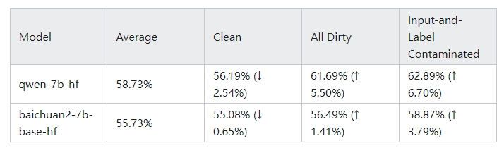

# LLMs 测试集 中 数据泄露 问题篇

- [LLMs 测试集 中 数据泄露 问题篇](#llms-测试集-中-数据泄露-问题篇)
  - [一、什么是 LLMs 测试集数据泄露 问题？](#一什么是-llms-测试集数据泄露-问题)
  - [二、如何解决 LLMs 测试集数据泄露 问题？](#二如何解决-llms-测试集数据泄露-问题)
  - [三、是否可以 避开训练集来处理 LLMs 测试集数据泄露 问题？](#三是否可以-避开训练集来处理-llms-测试集数据泄露-问题)
    - [3.1 如何 判断 网络上是否有原题？](#31-如何-判断-网络上是否有原题)
    - [3.2 如何 判断答案是否存在？](#32-如何-判断答案是否存在)
    - [3.3 性能差异对比](#33-性能差异对比)
  - [四、常见测试集有多少比例的数据泄露？](#四常见测试集有多少比例的数据泄露)
  - [致谢](#致谢)

## 一、什么是 LLMs 测试集数据泄露 问题？

数据泄露（data contamination）是**指模型测试集的数据被无意地(!)包含在了训练集中。（如果是故意的，比如train on测试集，那就是另一个话题了）。**

这种情况在大模型时代是很难避免的。其实在Common Crawl刚开始被用作训练集时就有不少人意识到了这个问题。

> 比如[这篇论文](https://arxiv.org/pdf/2104.08758.pdf)发现，在T5所用的C4数据集中，包含了2-50%不等的GLUE benchmark的原题。导致T5在GLUE极亮眼的数据在当时遭到了不小质疑。

在此之后基本所有的LLMs在论文或者report中都会有单独的一章Data contamination analysis来证明自己评测的可信性。这里我附上几个具有代表性的例子：[GPT-3](https://arxiv.org/abs/2005.14165)，[GPT-4](https://arxiv.org/abs/2303.08774)，[Llama-2](https://arxiv.org/abs/2307.09288).

## 二、如何解决 LLMs 测试集数据泄露 问题？

处理数据泄露最成熟的方法是**识别测试集中的已泄露样本和未泄露样本，分别构建dirty set和clean set，然后比较模型在这两个数据集上的性能差异**。

> 注：GPT-3在De->En WMT16翻译任务上获得了43 bleu score的优秀总体成绩。但如果区分dirty和clean set的结果，则GPT-3在未泄露样本（clean）上的分数只有40.8，而在泄露样本（dirty）上获得了47.4的超高分，这说明GPT-3通过强大的记忆里在评测集上取得了额外的优势。其真实的翻译水平应接近40.3，而不是43分的总分。

然而，**在我们实际研究或开发过程中，这种方法是很难复刻的。原因在于，这种方式需要获取base model完整的训练集，从而识别测试集里的干净和泄漏样本**。

我们大部分常用的基座模型，包括一众中文大模型和Llama-2，都没有开源其训练数据。

**即使拿到训练数据，其庞大的数据量也会使整个处理过程非常耗时**。例如，在Llama-2中为了识别测试集的数据泄露，在PySpark 1500核cluster运行了超过7个小时。

## 三、是否可以 避开训练集来处理 LLMs 测试集数据泄露 问题？

针对该问题，我们做出了一个假设：**任何在网络上能够找到的测试集题目，都有很大的风险被包含在LLMs的训练数据中。**

可以直接使用搜索引擎来区分测试集中的样例。把所有测试样例分为三类：

1. **干净样例**：网络上找不到对应测试样例的题目或答案；
2. **题目泄漏样例**：网络上能够找到原题，但答案并没有一起出现；
3. **题目-答案同时泄漏样例**：测试样例的原题和答案同时出现在同一网页上。

### 3.1 如何 判断 网络上是否有原题？

判断网络上**是否有原题**的标准是：有80%以上的字符与测试样例完全重叠（用meteor来测量）。

### 3.2 如何 判断答案是否存在？

判断**答案是否存在**的标准是：使用完整的字符串匹配。

### 3.3 性能差异对比

比较模型在以上三个类别的性能差异。以C-Eval为例：

这里Average是模型的总分，All Dirty包含了所有在网上能找到原题的测试样例，而Input-and-Label Contaminated则是网上能同时找到原题和答案的样例。

如果只看总分（Average），那么Qwen-7B在C-Eval上超越了Baichuan整整3%。

然而，模型能力的实际差距可能并没有那么大。结果显示Qwen在处理网上有原题的样本时性能格外出色，其准确率超越了clean set 整整5.5%。如此差距很可能说明Qwen在C-Eval上有潜在的过拟合现象。

相比之下，Baichuan在clean set和泄露样例两者之间的差距则小的多，只有1.41%。

如果只关注Qwen和Baichuan在clean set上的性能，那么两个模型实际上的差距只有1.1%。

## 四、常见测试集有多少比例的数据泄露？

仔细观察下来，常见的LLMs测试集均有很严重的数据泄露现象。

例如C-Eval有超过46.14%的测试样例能够直接在Common Crawl里找到原题。MMLU也有接近37%的测试样例完整地出现在Common Crawl里。

## 致谢

- 如何处理LLM测试集里的数据泄露？  https://zhuanlan.zhihu.com/p/666490713
- 开源的Llama系列模型的数据泄漏报告 https://arxiv.org/abs/2310.17589
- 数据泄露报告 https://github.com/liyucheng09/Contamination_Detector/tree/master/reports
