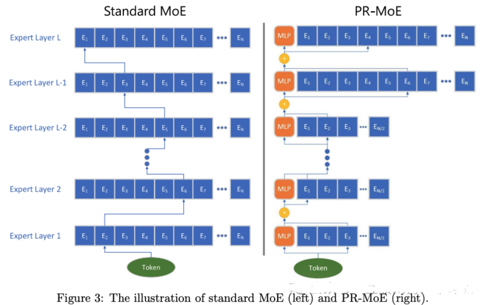
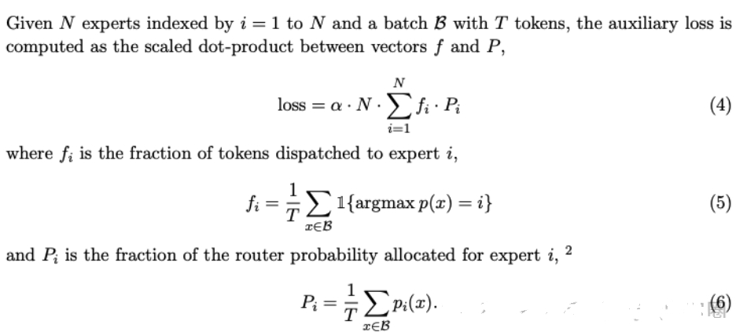
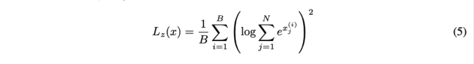
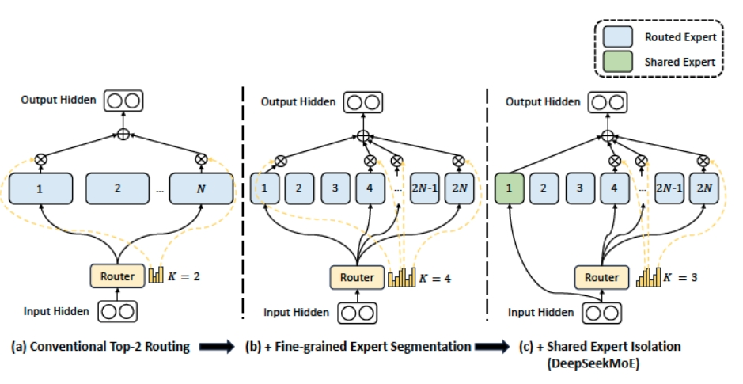

# MOE大模型对比篇

- [MOE大模型对比篇](#moe大模型对比篇)
  - [DeepSpeed-MoE](#deepspeed-moe)
  - [PAI-Megatron-Patch MoE](#pai-megatron-patch-moe)
  - [致谢](#致谢)

## DeepSpeed-MoE

- Pyramid-MoE：浅层放少量Experts，深层放更多Experts，形成Pyramid形状。这样能够一定程度上减少参数量（比如减少浅层Experts数量等方式）
- Residual-MoE：固定选择第一个expert，只让第二个expert参与gating选择，就能达到与Top2 gating相当的效果。而前者由于Experts选择分发部分只有Top2 gating的一半，所以能够达到更低latency。

结合Pyramid-MoE和Residual-MoE产生了PR-MoE。相对于左图标准的MoE模型，PR-MoE具有更少的参数量，更高的吞吐，以及不失精度的模型效果。

## PAI-Megatron-Patch MoE

- Load Balancing Loss (from switch transformer)

MoE 训练中一个容易出现的问题是大多数 token 被 route 到少数几个 expert，导致少数 expert 高度特化而其他 expert 学不到东西。为了避免这一局面的出现，现在普遍加入 load balancing loss 来鼓励 router 把 token 尽可能均匀地分配到不同的 expert。

- z-Loss (from ST-MoE)

模型训练不稳定因素之一是 router 在 softmax 操作前的 logits magnitude 过大，导致了大量 round-off error 的产生，这里通过 z-loss 来约束 logits 的 absolute magnitude。

z-loss会使得模型尽量产生数值较小的logits，从而产生较好的模型stability与quality的trade-off，而clipping logits通常会导致更大的round-off error和不连续性。

- Deepseek MoE

现有的MoE架构可能存在知识混杂（Knowledge Hybridity）和知识冗余（Knowledge Redundancy）的问题，限制了专家的专业化。

- 细粒度专家划分：不同于传统MoE直接从与标准FFN大小相同的N个专家里选择激活K个专家（如Mistral 7B*8 采取8个专家选2专家），我们把N个专家粒度划分更细，在保证激活参数量不变的情况下，从mN个专家中选择激活mK个专家（如DeepSeekMoE 16B 采取64个专家选8个专家），如此可以更加灵活地组合多个专家
- 共享专家分离：我们把激活专家区分为共享专家（Shared Expert）和独立路由专家（Routed Expert），如上图4(c)，此举有利于将共享和通用的知识压缩进公共参数，减少独立路由专家参数之间的知识冗余

## 致谢

- 现有开源MOE大模型对比 https://mp.weixin.qq.com/s/54tgjQWArMmwCHoHwnGUCg