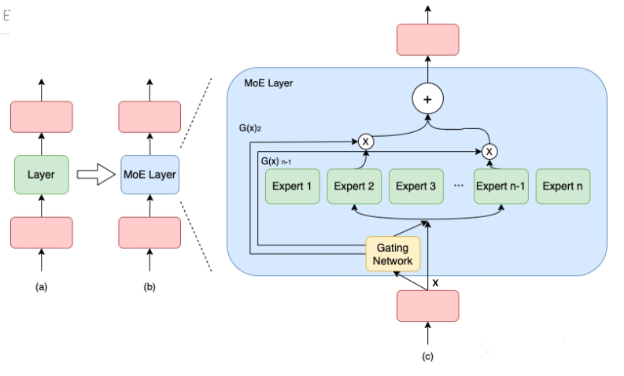
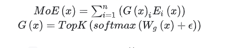
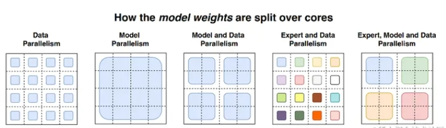
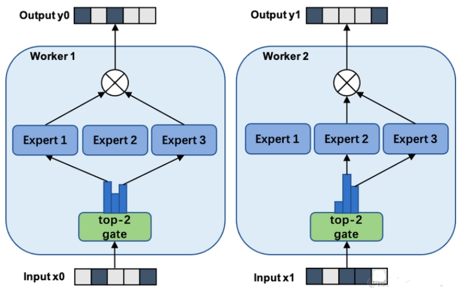
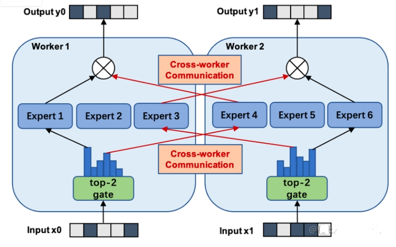
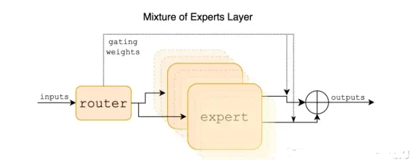

# MOE（Mixture-of-Experts）篇

- [MOE（Mixture-of-Experts）篇](#moemixture-of-experts篇)
  - [一、为什么需要 MOE（Mixture-of-Experts）？](#一为什么需要-moemixture-of-experts)
  - [二、MOE（Mixture-of-Experts）的思路是什么样的？](#二moemixture-of-experts的思路是什么样的)
  - [三、介绍一下 MOE（Mixture-of-Experts）分布式并行策略？](#三介绍一下-moemixture-of-experts分布式并行策略)
    - [3.1 MOE + 数据并行?](#31-moe--数据并行)
    - [3.2 MOE + 模型并行?](#32-moe--模型并行)
  - [四、MoE大模型具备哪些优势？](#四moe大模型具备哪些优势)
  - [五、MoE大模型具备哪些缺点？](#五moe大模型具备哪些缺点)
  - [六、MoE为什么可以实现更大模型参数、更低训练成本？](#六moe为什么可以实现更大模型参数更低训练成本)
  - [七、MoE如何解决训练稳定性问题？](#七moe如何解决训练稳定性问题)
  - [八、MoE如何解决Fine-Tuning过程中的过拟合问题？](#八moe如何解决fine-tuning过程中的过拟合问题)
  - [九、MOE算法在训练大语言模型时有哪些应用场景?](#九moe算法在训练大语言模型时有哪些应用场景)
  - [十、有哪些MoE模型？](#十有哪些moe模型)
  - [十一、介绍稀疏 MoE 层](#十一介绍稀疏-moe-层)
  - [十二、介绍门控网络或路由](#十二介绍门控网络或路由)
  - [十三、为什么门控网络要引入噪声呢](#十三为什么门控网络要引入噪声呢)
  - [十四、如何均衡专家间的负载](#十四如何均衡专家间的负载)
  - [十五、“专家”指什么](#十五专家指什么)
  - [十六、专家的数量对预训练有何影响？](#十六专家的数量对预训练有何影响)
  - [十七、什么是topK门控](#十七什么是topk门控)
  - [十八、MoE模型的主要特点](#十八moe模型的主要特点)
  - [十九、moe和稠密模型的对比](#十九moe和稠密模型的对比)
  - [二十、如何微调moe？](#二十如何微调moe)
  - [致谢](#致谢)

## 一、为什么需要 MOE（Mixture-of-Experts）？

- 模型和训练样本的增加，导致了训练成本的平方级增长；
- 如何在牺牲极少的计算效率的情况下，把模型规模提升上百倍、千倍？

## 二、MOE（Mixture-of-Experts）的思路是什么样的？

MOE（Mixture-of-Experts） 作为一种基于稀疏 MoE 层的深度学习模型架构，能够将大模型拆分成多个小模型(专家，expert)， 然后在每轮迭代过程中，根据样本数量决定激活一定量的专家用于计算，实现节省计算资源的目的； 同时，MOE（Mixture-of-Experts） 引入可训练并确保稀疏性的门( gate )机制，以保证计算能力的优化。

与密集模型不同，MoE 将模型的某一层扩展为多个具有相同结构的专家网络( expert )，并由门( gate )网络决定激活哪些 expert 用于计算，从而实现超大规模稀疏模型的训练。

以下图为例，模型包含 3 个模型层，如(a)到(b)所示，将中间层扩展为具有 n 个 expert 的 MoE 结构，并引入 Gating network 和 Top_k 机制，MoE 细节如下图(c)所示。

> MOE（Mixture-of-Experts） 细节

计算过程如下述公式：

> 注：上述第 1 个公式表示了包含 n 个专家的 MoE 层的计算过程。具体来讲，首先对样本 x 进行门控计算， W 表示权重矩阵；然后，由 Softmax 处理后获得样本 x 被分配到各个 expert 的权重； 然后，只取前 k (通常取 1 或者 2）个最大权重；最终，整个 MoE Layer 的计算结果就是选中的 k 个专家网络输出的加权和。

## 三、介绍一下 MOE（Mixture-of-Experts）分布式并行策略？

### 3.1 MOE + 数据并行?

在数据并行模式下包含MOE架构，门网络(gate)和专家网络都被复制地放置在各个运算单元上。下图展示了一个有三个专家的两路数据并行MoE模型进行前向计算的方式。

该方式通常来说，对于现有的代码侵入性较小。但该方式唯一的问题是，专家的数量受到单个计算单元(如：GPU)的内存大小限制。

### 3.2 MOE + 模型并行?

该策略门网络依然是复制地被放置在每个计算单元上， 但是专家网络被独立地分别放置在各个计算单元上。因此，需引入额外的通信操作，该策略可以允许更多的专家网络们同时被训练，而其数量限制与计算单元的数量(如：GPU数量)是正相关的。

下图展示了一个有六个专家网络的模型被两路专家并行地训练。注意：专家1-3被放置在第一个计算单元上，而专家4-6被放置在第二个计算单元上。

该模式针对不同的模型和设备拓扑需要专门的并行策略，同时会引入额外的通信，因此，相较于数据并行+MOE策略，侵入性更强。

除了上述两种MOE并行方案之外，还可以MOE+数据并行+模型并行、MOE+ZeRO增强的数据并行等。

## 四、MoE大模型具备哪些优势？

1. **训练速度更快，效果更好**。
2. **相同参数，推理成本低**。
3. **扩展性好**，允许模型在保持计算成本不变的情况下增加参数数量，这使得它能够扩展到非常大的模型规模，如万亿参数模型。
4. **多任务学习能力**：MoE在多任务学习中具备很好的新能（比如Switch Transformer在所有101种语言上都显示出了性能提升，证明了其在多任务学习中的有效性）。

## 五、MoE大模型具备哪些缺点？

1. **训练稳定性**：MoE在训练过程中可能会遇到稳定性问题。
2. **通信成本**：在分布式训练环境中，MoE的专家路由机制可能会增加通信成本，尤其是在模型规模较大时。
3. **模型复杂性**：MoE的设计相对复杂，可能需要更多的工程努力来实现和优化。
4. **下游任务性能**：MoE由于其稀疏性，使得在Fine-tuning过程中容易出现过拟合。

## 六、MoE为什么可以实现更大模型参数、更低训练成本？

MoE 使用了**混合精度的方法**，例如用 bfloat16 精度训练专家，同时**对其余计算使用全精度进行**。

**较低的精度可以减少处理器间的通信成本、计算成本以及存储 tensor 的内存**。

这主要是因为稀疏路由的原因，每个 token 只会选择 top-k 个专家进行计算。同时可以使用模型并行、专家并行和数据并行，优化 MoE 的训练效率。而负载均衡损失可提升每个 device 的利用率。

## 七、MoE如何解决训练稳定性问题？

可以通过混合精度训练、更小的参数初始化，以及 Router z-loss 提升训练的稳定性。

## 八、MoE如何解决Fine-Tuning过程中的过拟合问题？

可以通过更大的 dropout （主要针对 expert）、更大的学习率、更小的 batch size。目前看到的主要是预训练的优化，针对 Fine-Tuning 的优化主要是一些常规的手段。

## 九、MOE算法在训练大语言模型时有哪些应用场景?

MOE算法在训练大语言模型时有以下几个应用场景:

- **解决多模态问题**：在多模态大模型的开发中，每个数据集可能包含来自文本、图像、语音等不同模态的数据，这些数据之间的特征和标注关系可能也不同。MoE算法可以将不同模态的数据分发给专门的子模型(即“专家”)，让它们在各自擅长的领域内进行处理，并最后将结果汇总。
- **垂直领域应用**：随着应用场景的复杂化和细分化，大模型需要同时回答通识问题和解决专业领域问题。MOE算法可以将不同领域的专家集合起来，让它们各自负责解答特定问题，最后将结果汇总。这种方式可以提高模型的性价比，使其既能应对通用问题，又能在特定领域有更好的表现。
- **提高模型规模和效率**：MOE算法通过引入稀疏性来提高模型的规模和效率。稀疏混合专家模型技术可以将大模型拆分为多个子模型，每个子模型只处理部分训练数据，从而减少了每个子模型的参数量和计算量，提高了训练效率和推理速度。
- **自然语言处理领域**：MOE算法已经成功应用于自然语言处理领域。例如，谷歌在机器翻译方面引入MOE算法，通过在LSTM层之间增加MOE实现了性能的提升。此外，MOE技术还被应用于Transformer架构中，提供了高效的分布式并行计算架构，进一步挖掘了MOE在自然语言处理领域中的潜力。

## 十、有哪些MoE模型？

Switch Transformers、Mixtral、GShard、DBRX、Jamba DeepSeekMoE 等等。以Mixtral为例Mixtral 是一个稀疏的专家混合网络。它是一个decoder-only的模型，其中前馈块从一组 8 个不同的参数组中选择。在每一层，对于每个令牌，路由器网络选择其中两个组（“专家”）来处理令牌并附加地组合他们的输出。

混合专家层这种技术在控制成本和延迟的同时增加了模型的参数数量，因为模型只使用每个令牌总参数集的一小部分。具体来说，Mixtral 总共有 46.7B 个参数，但每个令牌只使用 12.9B 个参数。因此，它以与 12.9B 型号相同的速度和相同的成本处理输入和生成输出。Mixtral 基于从开放 Web 中提取的数据进行预训练——同时培训专家和路由器。

## 十一、介绍稀疏 MoE 层

稀疏 MoE 层一般用来替代传统 Transformer 模型中的前馈网络 (FFN) 层。MoE 层包含若干“专家”(例如 8 个)，每个专家本身是一个独立的神经网络。在实际应用中，这些专家通常是前馈网络 (FFN)，但它们也可以是更复杂的网络结构，甚至可以是 MoE 层本身，从而形成层级式的 MoE 结构。

## 十二、介绍门控网络或路由

门控网络接收输入数据并执行一系列学习的非线性变换。这一过程产生了一组权重，这些权重表示了每个专家对当前输入的贡献程度。通常，这些权重经过softmax等函数的处理，以确保它们相加为1，形成了一个概率分布。这样的分布表示了在给定输入情境下每个专家被激活的概率。一个典型的门控函数通常是一个带有 softmax 函数的简单的网络。

## 十三、为什么门控网络要引入噪声呢

为了专家间的负载均衡。也即防止一句话中的大部分token都只有一个专家来处理，剩下的七个专家（假设一共八个专家）“无所事事”。

## 十四、如何均衡专家间的负载

引入噪声、引入辅助损失（鼓励给予所有专家相同的重要性）、引入随机路由、设置一个专家能处理的token数量上限

## 十五、“专家”指什么

一个“专家”通常是前馈网络 (FFN)。数据经过门控网络选择后进入每个专家模型，每个专家根据其设计和参数对输入进行处理。每个专家产生的输出是对输入数据的一种表示，这些表示将在后续的步骤中进行加权聚合。或者通过单个专家模型进行处理。

## 十六、专家的数量对预训练有何影响？

增加更多专家可以提升处理样本的效率和加速模型的运算速度，但这些优势随着专家数量的增加而递减 (尤其是当专家数量达到 256 或 512 之后更为明显)。同时，这也意味着在推理过程中，需要更多的显存来加载整个模型。值得注意的是，Switch Transformers 的研究表明，其在大规模模型中的特性在小规模模型下也同样适用，即便是每层仅包含 2、4 或 8 个专家。

## 十七、什么是topK门控

选择前k个专家。为什么不仅选择最顶尖的专家呢？最初的假设是，需要将输入路由到不止一个专家，以便门控学会如何进行有效的路由选择，因此至少需要选择两个专家。

## 十八、MoE模型的主要特点

- 灵活性：每个专家可以是不同类型的模型，例如全连接层、卷积层或者递归神经网络。
- 可扩展性：通过增加专家的数量，模型可以处理更复杂的任务。
- 并行处理：不同的专家可以并行处理数据，这有助于提高模型的计算效率。
- 动态权重分配：门控网络根据输入数据的特点动态地为每个专家分配权重，这样模型可以更加灵活地适应不同的数据。
- 容错性：即使某些专家表现不佳，其他专家的表现也可以弥补，从而提高整体模型的鲁棒性。

## 十九、moe和稠密模型的对比

1. 预训练 相同计算资源，MoE 模型理论上可以比密集模型更快达到相同的性能水平。
2. 推理 moe：高显存，高吞吐量； 稠密模型：低显存，低吞吐量

## 二十、如何微调moe？

1. 冻结所有非专家层的权重，专门只训练专家层
2. 只冻结moe层参数，训练其它层的参数

## 致谢

- Adaptive Mixture of Local Experts https://www.cs.toronto.edu/~hinton/absps/jjnh91.pdf
- 大模型分布式训练并行技术（八）-MOE并行  https://zhuanlan.zhihu.com/p/662518387
- 群魔乱舞：MoE大模型详解 https://zhuanlan.zhihu.com/p/677638939
- 大模型面经——MoE混合专家模型总结 https://zhuanlan.zhihu.com/p/721410980