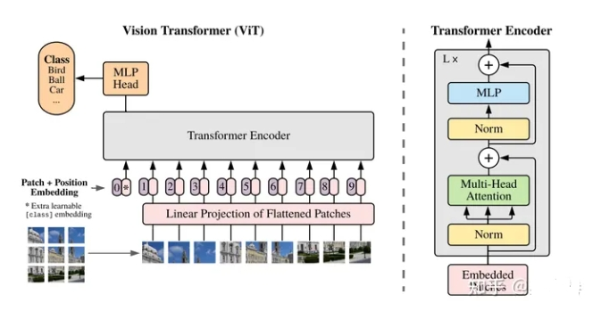

# VIT：Transformer视觉表征

- [VIT：Transformer视觉表征](#vittransformer视觉表征)
  - [一、介绍一下 VIT？](#一介绍一下-vit)
  - [二、介绍一下 VIT 预训练过程？](#二介绍一下-vit-预训练过程)

## 一、介绍一下 VIT？

1. VIT将输入图片平铺成2D的Patch序列（16x16）；
2. 通过线性投影层将Patch转化成固定长度的特征向量序列，对应自然语言处理中的词向量输入。
3. 同时，每个Patch可以有自己的位置序号，同样通过一个Embedding层对应到位置向量。
4. 最终Patch向量序列和视觉位置向量相加作为Transfomer Encoder的模型输入，这点与BERT模型类似。

## 二、介绍一下 VIT 预训练过程？

**VIT通过一个可训练的CLS token得到整个图片的表征，并接入全链接层服务于下游的分类任务**。

当经过大量的数据上预训练，迁移到多个中等或小规模的图像识别基准（ImageNet, CIFAR-100, VTAB 等）时，ViT取得了比CNN系的模型更好的结果，同时在训练时需要的计算资源大大减少。

按说，ViT的思路并不复杂，甚至一般人也不难想到，但是为什么真正有效的工作确没有很快出现？不卖关子，**VIT成功的秘诀在于大量的数据做预训练**，如果没有这个过程，在开源任务上直接训练，VIT网络仍会逊色于具有更强归纳偏置的CNN网络。

