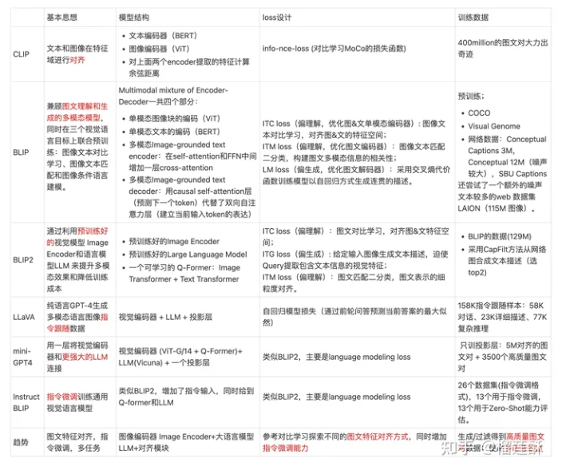
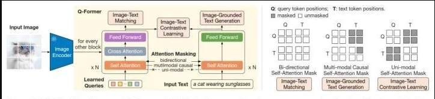

# 多模态常见面试篇

- [多模态常见面试篇](#多模态常见面试篇)
  - [多模态方法对比表](#多模态方法对比表)
  - [一、最近关注的论文，多模态视觉大模型(CLIP,DALLE)？](#一最近关注的论文多模态视觉大模型clipdalle)
  - [二、blip2的架构，优势和之前多模态模型的区别？](#二blip2的架构优势和之前多模态模型的区别)
  - [三、多模态融合后，怎样知道最终结果受哪种模态影响更大？](#三多模态融合后怎样知道最终结果受哪种模态影响更大)
  - [四、多模态中常见的SOTA模型有哪些？](#四多模态中常见的sota模型有哪些)
  - [五、介绍一下stable diffusion的原理？](#五介绍一下stable-diffusion的原理)
  - [六、介绍一下视觉+语言的多模态大模型目前主流方法？](#六介绍一下视觉语言的多模态大模型目前主流方法)
  - [致谢](#致谢)

## 多模态方法对比表

## 一、最近关注的论文，多模态视觉大模型(CLIP,DALLE)？

多模态视觉大模型是指可以处理多种感知模态数据（如图像和文本）的大型深度学习模型。CLIP和DALL·E都是这方面的重要研究。

CLIP（Contrastive Language-Image Pretraining）模型能够将图像和文本嵌入空间连接在一起，使得模型可以理解图像和文本之间的语义关系。

DALL·E是一个生成模型，可以根据文本描述生成与之相关的图像。

## 二、blip2的架构，优势和之前多模态模型的区别？

blip2是图像-语言多模态模型的预训练方法。这个架构是2023年才提出的，也看出来面试紧跟时事了。

blip2的一个常见模式是输入一张图片，输出这张图片的描述。

bilp2是在冻结的图像模型（负责从图像中提取特征，比如vit）和冻结的语言模型（负责生成语言）中间放入一个Q-Former，我们的目标就是训练这个Q-Former。Q-Former包含图像Transformer和语言Transformer，图像Transformer包含CA和SA，SA和语言Transformer共享参数，CA只接受图像模型提取的图像特征，图像模型的输入是一个查询值，这个查询值将在SA中和自己交互，在CA中和图像特征交互。最后图像Transformer输出一个综合图像特征的向量，同时语言Transformer输入一个文本，进行encode，得到一个文本的向量。然后根据具体的任务选择不同的方式对这两个向量进行操作。最后，Q-former把得到的向量传给冻结的语言模型。语言Transformer训练的时候做解码器，预测的时候是解码器。

训练的时候先训练Q-Former和图像模型的交互，然后把Q-Former的结果和语言模型连接（中间可以加入全连接，前缀词等操作）。如下图

## 三、多模态融合后，怎样知道最终结果受哪种模态影响更大？

在多模态融合后，了解最终结果受哪种模态影响更大可以使用特征重要性分析方法，如SHAP值、Permutation Importance等。这些方法可以帮助识别每个模态对最终结果的贡献程度。

## 四、多模态中常见的SOTA模型有哪些？

- Vision Transformer (ViT): 将自注意力机制引入计算机视觉领域，通过将图像划分为图像补丁并应用Transformer模型，实现了在图像分类和目标检测等任务上的出色表现。
- CLIP (Contrastive Language-Image Pretraining): 结合了图像和文本的对比学习，通过训练一个模型，使其能够根据图像和文本之间的相互关系进行推理，实现了图像与文本之间的联合理解和表示学习。
- UNITER (UNiversal Image-Text Representation): 使用Transformer架构，联合学习图像和文本表示，提供了一个通用的图像和文本特征提取框架，适用于多个视觉和语言任务。
- LXMERT (Cross-Modal Transformer): 结合了视觉和语言信息，通过Transformer模型对图像和文本进行交互学习，可以用于视觉问答、图像描述生成等任务。
- CoCa (Contrastive Captioners)：这是一种融合了单编码器、双编码器和编码器-解码器三种结构的多模态模型，既能生成图像侧和文本侧独立的表示，又能进行更深层次的图像、文本信息融合以及文本生成。CoCa在图像分类、图文检索、看图说话、VQA等多个任务上都取得了SOTA效果。

## 五、介绍一下stable diffusion的原理？

stable diffusion是一种生成模型，其原理基于Langevin动力学和扩散过程。其核心思想是通过多次迭代，逐渐将噪声信号演化为目标分布所对应的样本。具体原理如下：

- 初始化噪声信号为服从高斯分布的随机向量。
- 通过一系列的演化步骤，将噪声信号迭代地转化为目标分布的样本。每一步中，将当前噪声信号与目标分布的梯度信息结合，通过Langevin动力学方程进行更新，使噪声信号逐渐接近目标分布。
- 迭代的次数越多，噪声信号越接近目标分布，并最终生成目标分布的样本。

stable diffusion通过合理的选择演化步长和迭代次数，可以在生成样本的过程中平衡样本质量和生成速度。

## 六、介绍一下视觉+语言的多模态大模型目前主流方法？

借助预训练好的大语言模型和图像编码器，用一个图文特征对齐模块来连接，从而让语言模型理解图像特征并进行更深层的问答推理。

这样可以利用已有的大量单模态训练数据训练得到的单模态模型，减少对于高质量图文对数据的依赖，并通过特征对齐、指令微调等方式打通两个模态的表征。

## 致谢

- 多模态大模型 CLIP, BLIP, BLIP2, LLaVA, miniGPT4, InstructBLIP 系列解读 https://zhuanlan.zhihu.com/p/653902791
- 一文看完多模态：从视觉表征到多模态大模型 https://zhuanlan.zhihu.com/p/684472814

