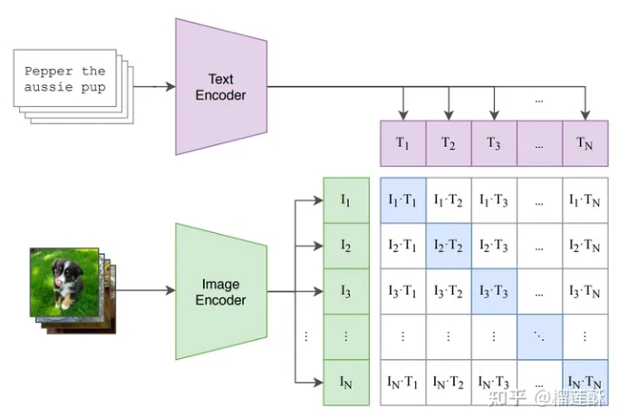
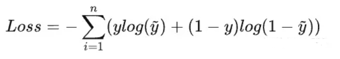
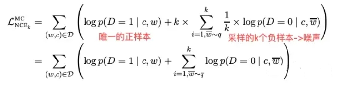
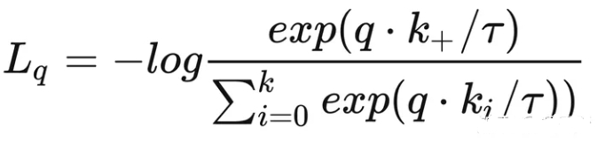

# CLIP (Contrastive Language-Image Pre-training)面试篇

> 论文名称：CLIP (Contrastive Language-Image Pre-training)
> 
> 论文地址：http://arxiv.org/abs/2103.00020
> 
> Github 地址：https://github.com/openai/CLIP

- [CLIP (Contrastive Language-Image Pre-training)面试篇](#clip-contrastive-language-image-pre-training面试篇)
  - [一、介绍一下 CLIP？](#一介绍一下-clip)
  - [二、介绍一下 CLIP 模型结构？](#二介绍一下-clip-模型结构)
    - [2.1 CLIP 如何对image和text进行特征提取？](#21-clip-如何对image和text进行特征提取)
    - [2.2 CLIP 如何对提取的文本特征和图像特征进行对比学习？](#22-clip-如何对提取的文本特征和图像特征进行对比学习)
    - [2.3 CLIP 如何用CLIP实现zero-shot分类？](#23-clip-如何用clip实现zero-shot分类)
  - [三、介绍一下 CLIP 模型 loss ？](#三介绍一下-clip-模型-loss-)
  - [四、CLIP可以做什么？](#四clip可以做什么)
  - [五、CLIP 存在哪些问题？](#五clip-存在哪些问题)
  - [其他细节](#其他细节)
  - [致谢](#致谢)

## 一、介绍一下 CLIP？

CLIP的核心思路是**通过对比学习的方法进行视觉和自然语言表征的对齐**。

## 二、介绍一下 CLIP 模型结构？

- （1）Contrastive pre-training

1. 分别对image和text进行特征提取：
   1. Image Encoder：image特征提取的backbone可以是resnet系列模型也可以是VIT系列模型；
   2. Text Encoder：text特征提取目前一般采用bert模型
2. 特征标准化（Normalize）：使用对比学习方法，计算Batch内图文Pair对之间的余弦距离，通过Triple Loss或InfoNCELoss等目标函数拉近正样本对之间的距离，同时使负样本对的距离拉远。


> 图1

- （2）Create dataset classifier from label text
- （3）Use for zero-shot prediction

利用clip进行图像分类有两种方式:

1. 一种是直接利用zero-shot 方式进行预测

> 如上图所示，对于一个图像分类任务，可以首先将所有的候选类别分别填充“A photo of a {object}”的模板，其中object为候选类别，对于一张待预测类别的图像，通过图像Encoder的到视觉表征后，与所有类别的模板文本Encoder表征进行相似度计算，最后选择相似度最高的类别即可作为预测结果。

2. 还有一种方式就是再重新finetune，同样也是对类别设计几种不同的文本，这样效果能够达到sota的水平！

### 2.1 CLIP 如何对image和text进行特征提取？

CLIP包括两个模型：Text Encoder和Image Encoder：

1. Text Encoder用来提取文本的特征，可以采用NLP中常用的bert模型；
2. Image Encoder用来提取图像的特征，可以采用resnet系列模型也可以是VIT系列模型。

### 2.2 CLIP 如何对提取的文本特征和图像特征进行对比学习？

对于一个包含N个文本-图像对的训练batch，将N个文本特征和N个图像特征两两组合，CLIP模型会预测出 $N^2$ 个可能的文本-图像对的相似度，这里的相似度直接计算文本特征和图像特征的余弦相似性(cosine similarity)，即图1所示的矩阵。

这里共有N个正样本，即真正属于一对的文本和图像(矩阵中的对角线元素)，而剩余的 $N^N$ 个文本-图像对为负样本，那么CLIP的训练目标就是最大N个正样本的相似度，同时最小化 $N^N$ 个负样本的相似度，对应的伪代码实现如下所示:

```s
# image_encoder - ResNet or Vision Transformer
# text_encoder - CBOW or Text Transformer
# I[n, h, w, c] - minibatch of aligned images
# T[n, l] - minibatch of aligned texts
# W_i[d_i, d_e] - learned proj of image to embed
# W_t[d_t, d_e] - learned proj of text to embed
# t - learned temperature parameter

# 分别提取图像特征和文本特征
I_f = image_encoder(I) #[n, d_i]
T_f = text_encoder(T) #[n, d_t]

# 对两个特征进行线性投射，得到相同维度的特征，并进行l2归一化
I_e = l2_normalize(np.dot(I_f, W_i), axis=1)
T_e = l2_normalize(np.dot(T_f, W_t), axis=1)

# 计算缩放的余弦相似度：[n, n]
logits = np.dot(I_e, T_e.T) * np.exp(t)

# 对称的对比学习损失：等价于N个类别的cross_entropy_loss
labels = np.arange(n) # 对角线元素的labels
loss_i = cross_entropy_loss(logits, labels, axis=0)
loss_t = cross_entropy_loss(logits, labels, axis=1)
loss = (loss_i + loss_t)/2
```

### 2.3 CLIP 如何用CLIP实现zero-shot分类？

**与CV中常用的先预训练然后微调不同，CLIP可以直接实现zero-shot的图像分类，即不需要任何训练数据，就能在某个具体下游任务上实现分类**，这也是CLIP亮点和强大之处。用CLIP实现zero-shot分类很简单，只需要简单的两步：

1. 根据任务的分类标签构建每个类别的描述文本：A photo of {label}，然后将这些文本送入Text Encoder得到对应的文本特征，如果类别数目为 N，那么将得到 N个文本特征；
2. 将要预测的图像送入Image Encoder得到图像特征，然后与 N个文本特征计算缩放的余弦相似度（和训练过程一致），然后选择相似度最大的文本对应的类别作为图像分类预测结果，进一步地，可以将这些相似度看成logits，送入softmax后可以到每个类别的预测概率。

## 三、介绍一下 CLIP 模型 loss ？

训练loss：参考对比学习损失，采用了info-nce-loss。

1. **交叉熵 loss 函数（cross entropy）**：最基础的有监督学习多分类损失函数，gt是n个类别的one-hot编码，**目标是最小化gt的one-hot标签和预测logits的负对数乘积在多个类别上的加和，从信息论的角度也就是最小化模型数据分布与训练数据之间的KL散度**；


> n个类别多分类的交叉熵代价函数

2. **NCE（noise contrastive estimation）**：和交叉熵类似，但是**把多分类问题转化成了二分类问题：一个类是数据类别 data sample，另一个类是噪声类别 noisy sample**，目标是**学习数据样本和噪声样本之间的区别，也就是“噪声对比（noise contrastive）**


> 噪声对比NCE-loss

3. **Info-NCE**：是NCE的一个简单变体，**把噪声样本从一个类别又划分为多个类看待**。公式中的temp是一个温度超参数（标量），如果忽略temp，那么infoNCE loss其实就是cross entropy loss，只是在cross entropy loss里，k指代的是数据集里类别的数量，而InfoNCE loss里，k指的是负样本的数量。公式分母中的sum是在1个正样本和k个负样本上做的，做的是一个k+1类的分类任务，目的就是想把query这个图片分到k+这个类。


> Info-NCE loss

> 注：温度系数temperature(本文固定0.07)：作用是控制logits的分布形状，对于既定的logits分布的形状，当temp值变大，则(q*k)/temp变小，指数运算之后更小，导致原来的logits分布更平滑。相反，如果temp取得值小，原来的logits分布里的数值就相应的变大，指数运算之后更大，则这个分布变得更集中，更peak。需要取一个合适的数值，既不会对所有的负样本一视同仁，也不会过度关注难样本。

## 四、CLIP可以做什么？

1. zero-shot检测。CLIP可以应用在目标检测任务上，实现zero-shot检测，即检测训练数据集没有包含的类别；
2. 图像检索。基于文本来搜索图像是CLIP最能直接实现的一个应用，其实CLIP也是作为DALL-E的排序模型，即从生成的图像中选择和文本相关性较高的；
3. 视频理解。CLIP是基于文本-图像对来做的，但是它可以扩展到文本-视频，比如VideoCLIP就是将CLIP应用在视频领域来实现一些zero-shot视频理解任务；
4. 图像编辑。CLIP可以用在指导图像编辑任务上；
5. 图像生成。CLIP还可以应用在图像生成上，比如StyleCLIP这篇工作用CLIP实现了文本引导的StyleGAN；
6. 自监督学习。MVP更是采用CLIP来进行视觉自监督训练；
7. VL任务。CLIP本身就是多模态模型，所以它也可以用在用图像-文本多模态任务，如图像描述（image caption）和视觉问答（Visual Question Answering）；

## 五、CLIP 存在哪些问题？

CLIP方法简单有效，双塔的网络结构对于下游应用也十分友好。

但是**如同表示型语义匹配类似，双塔结构同样也有交互不足的问题，内积或余弦距离的模态融合方式匹配能力上限较低，对于一些需要细粒度跨模态匹配的任务（VQA等）**有时力不从心。

## 其他细节

CLIP用了大量的训练数据以及训练资源，大力出奇迹。CLIP用了400million的image-text pair对进行训练，对于image backbone，CLIP尝试了两种结构，DN50x64 和 vit-L，分别用了592 个 V100 + 18天 的时间 和 256 个 V100 + 12天 的时间，非大公司直接劝退。

## 致谢

- 多模态大模型 CLIP, BLIP, BLIP2, LLaVA, miniGPT4, InstructBLIP 系列解读 https://zhuanlan.zhihu.com/p/653902791
- 对比学习损失（InfoNCE loss）与交叉熵损失的联系，以及温度系数的作用  https://zhuanlan.zhihu.com/p/506544456
- 神器CLIP：连接文本和图像，打造可迁移的视觉模型  https://zhuanlan.zhihu.com/p/493489688