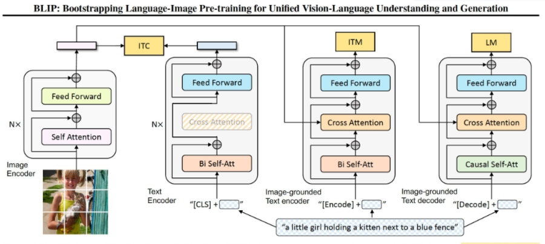
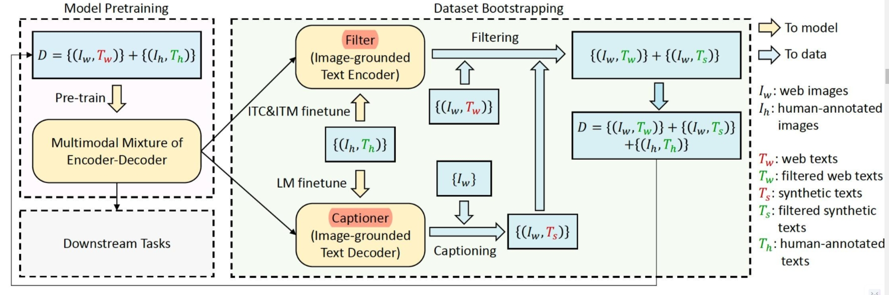
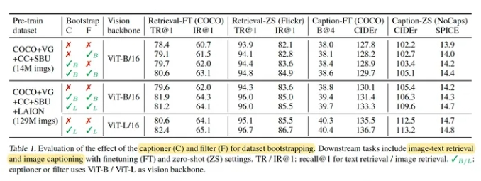

# BLIP（Bootstraping language image pre-training）

> 论文地址：https://icml.cc/virtual/2022/spotlight/16016
> 
> GitHub 地址：https://github.com/salesforce/BLIP

- [BLIP（Bootstraping language image pre-training）](#blipbootstraping-language-image-pre-training)
  - [一、为什么需要 BLIP?](#一为什么需要-blip)
  - [二、介绍一下 BLIP 思路？](#二介绍一下-blip-思路)
  - [三、介绍一下 BLIP 模型结构？](#三介绍一下-blip-模型结构)
  - [四、介绍一下 BLIP 模型 loss ？](#四介绍一下-blip-模型-loss-)
  - [五、介绍一下 BLIP 模型 中的 Captioning and Filtering ？](#五介绍一下-blip-模型-中的-captioning-and-filtering-)
  - [六、介绍一下 BLIP 模型 存在哪些不足？](#六介绍一下-blip-模型-存在哪些不足)
  - [其他细节](#其他细节)
    - [效果](#效果)
    - [数据集](#数据集)
  - [致谢](#致谢)

## 一、为什么需要 BLIP?

视觉语言预训练最近在各种多模态下游任务上取得了巨大成功。 然而，现有方法有两个主要限制：

- **从模型角度来看**：大多数方法要么采用基于编码器的模型，要么采用编码器-解码器模型。然而，基于编码器的模型不太容易直接转移到文本生成任务（例如图像字幕），而编码器-解码器模型尚未成功用于图像-文本检索任务。
- **从数据角度来看**：大多数最先进的方法（例如 CLIP、ALBEF、SimVLM）都对从网络收集的图像文本对进行预训练。 尽管通过扩大数据集获得了性能提升，但本论文表明，带噪的网络文本对于视觉语言学习来说并不是最优的。

## 二、介绍一下 BLIP 思路？

兼顾图文理解和生成的多模态模型（Multimodal mixture of Encoder-Decoder），同时在三个视觉语言目标上联合预训练：

1. **图像文本对比学习ITC**：*在图文模态深层融合之前，在对图文的表征序列Pooling后，通过对比学习Loss对图文单模态表征进行对齐*。这部分和CLIP模型的训练设置类似，不同的是文本的Encoder相对视觉Encoder层数更浅。
2. **图像文本匹配ITM**：*图文Encoder输出的表征序列深层交互后，判断输入图文对是否匹配*，与VILT一样是二分类任务。不同的是负样本对的构造，使用对比学习模块进行了Batch内的难负样本挖掘。主要思路是，对比学习模块中一个Batch中，模型认为最为相似的负样本对可以作为难负样本。
3. **图像条件语言建模LM**；

同时提出了一种高效利用网络收集的嘈杂图文对的采样+过滤机制。

bootstraping翻译成“自举”有点别扭，我还是习惯理解为有放回抽样/迭代优化。

## 三、介绍一下 BLIP 模型结构？

1. **图像块的编码（ViT）**：图像打成patches块后进行编码，增加cls token来记录全局的特征（作用类似位置编码，保留patches的空间特征）
2. **文本的编码（BERT）**：对句子进行编码，增加cls token记录句子的全局特征
3. **Image-grounded text encoder**：在文本embedding中注入了图像特征，通过在self-attention和FFN中间增加一层cross-attention来对齐text-encoder和img-encoder的特征。
4. **Image-grounded text decoder**：用causal self-attention层（预测下一个token）代替了双向自注意力层（建立当前输入token的表达）【和左边的encoder共享除了self-attention之外的层】

## 四、介绍一下 BLIP 模型 loss ？

预训练阶段同时优化3个loss项，每个图文对只过1次vision-transormer(算力消耗较大)，过3次text-transormer

1. **Image-Text Contrastive Loss (ITC)理解功能**：优化vision-transormer+text-transormer，让匹配的图文对有较高相似度的表达（用了soft labels），多模态中的经典loss->使其互信息最大化；
2. **Image-Text Matching Loss (ITM)理解功能** ：优化Image-grounded text encoder，学习图文的细粒度匹配的二分类，采用了hard negative mining strategy；
3. **Language Modeling Loss (LM)生成功能**：优化image-grounded text decoder，学习如何从给定图生成连贯的文本描述，采用交叉熵代价函数以自回归方式最大化对应文本概率。

## 五、介绍一下 BLIP 模型 中的 Captioning and Filtering ？

Captioning and Filtering：一种高效的数据集增强方法，从网页噪声图像文本对中学习，采样生成器+噪声过滤器，都是从相同的预训练模型初始化，并在小型人工注释数据集e.g.COCO上单独进行微调。

1. **采样生成器captioner**：基于图像的文本解码器（生成），用LM的loss进行微调
2. **噪声过滤器filter**：基于图像的文本编码器（判别），用ITC+ITM进行微调，判断图文是否匹配

## 六、介绍一下 BLIP 模型 存在哪些不足？

BLIP是通过合成字母和去除带噪的字幕，使用大规模带噪的图像文本对来预训练多模态模型。作者总结了有几个潜在的方向可以进一步提高 BLIP 的性能（会引入额外的计算成本）：

1. 多轮数据集引导；
2. 每张图片生成多个合成字幕，进一步扩大预训练语料库；
3. 通过训练多个不同的字幕器和滤波器并在 CapFilt 中组合它们的力量来建模集成。

## 其他细节

### 效果

从用人工标注的图文对得到的预训练模型开始初始化，captioner生成合成文本，filter过滤合成文本和网页描述文本，得到过滤后的相对干净的网页文本和合成文本->用来训练BLIP，往复进行。

### 数据集

图像编码器使用 ImageNet-1K 上预训练的 ViT 初始化，文本编码器以 BERT-Base 初始化，按照Vit-B 2880/ Vit-L 2400的batch-size训练 20 Epochs，预训练阶段图像尺寸224*224，微调阶段尺寸384*384.
用了以下3部分数据集预训练，加起来大概是 14M。

- COCO
- Visual Genome
- 网络数据：Conceptual Captions，Conceptual 12M（噪声较大），SBU Captions

还尝试了一个额外的噪声文本较多的web 数据集 LAION（115M 图像）。

## 致谢

- 多模态大模型 CLIP, BLIP, BLIP2, LLaVA, miniGPT4, InstructBLIP 系列解读 https://zhuanlan.zhihu.com/p/653902791
- 对比学习损失（InfoNCE loss）与交叉熵损失的联系，以及温度系数的作用  https://zhuanlan.zhihu.com/p/506544456