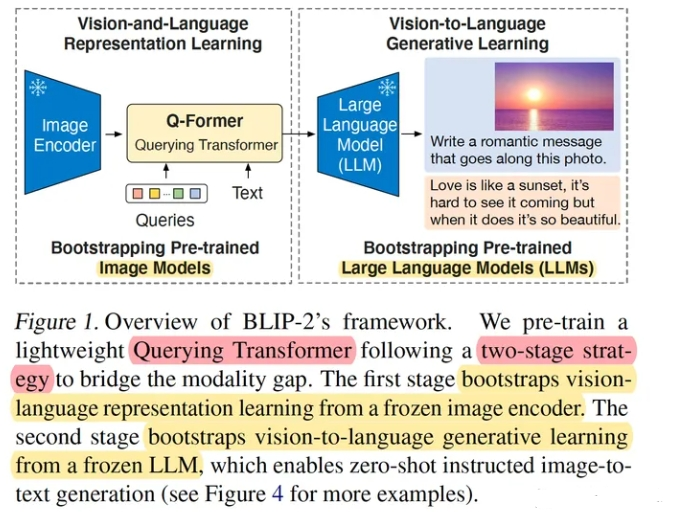
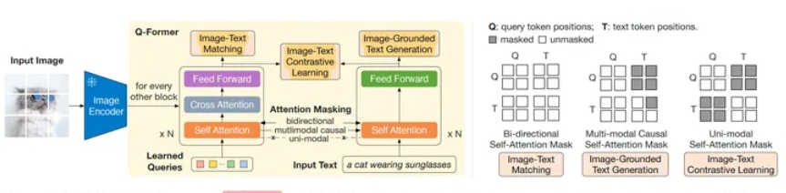
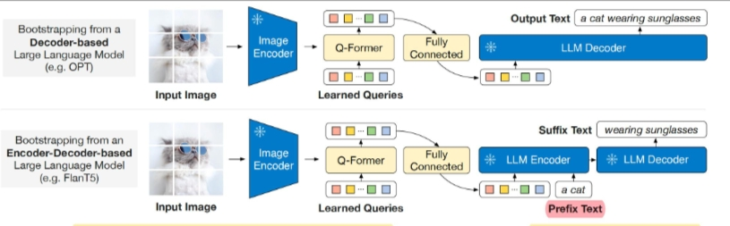
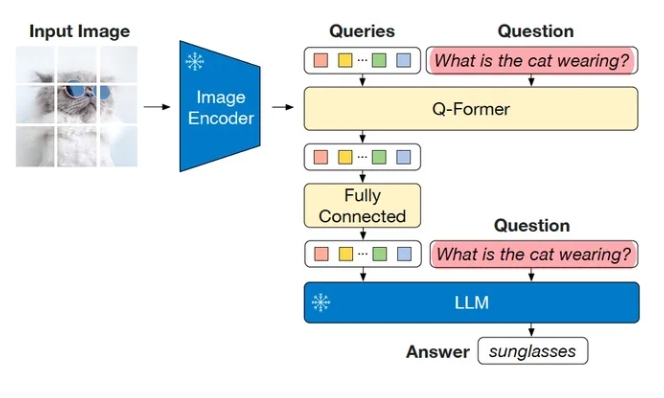
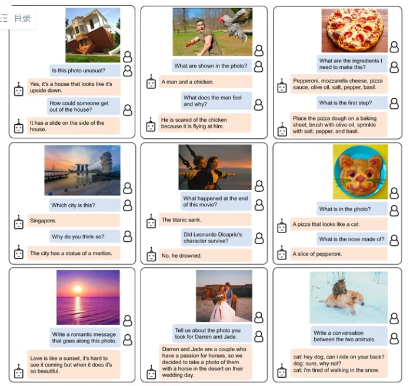

# BLIP2（Bootstraping language image pre-training）

> 论文名称：BLIP-2： Bootstrapping Language-Image Pre-training with Frozen Image Encoders and Large Language Models
> 
> 论文地址：https://arxiv.org/abs/2301.12597
> 
> GitHub 地址：https://github.com/salesforce/LAVIS/tree/main/projects/blip2

- [BLIP2（Bootstraping language image pre-training）](#blip2bootstraping-language-image-pre-training)
  - [一、为什么需要 BLIP2?](#一为什么需要-blip2)
  - [二、介绍一下 BLIP2？](#二介绍一下-blip2)
  - [三、介绍一下 BLIP2 模型结构？](#三介绍一下-blip2-模型结构)
  - [四、介绍一下 BLIP2 模型 Q-Former ？](#四介绍一下-blip2-模型-q-former-)
  - [五、介绍一下 BLIP2 模型 训练过程 ？](#五介绍一下-blip2-模型-训练过程-)
  - [六、介绍一下 BLIP2 模型中的 VQA任务微调结构？](#六介绍一下-blip2-模型中的-vqa任务微调结构)
  - [七、介绍一下 BLIP2 模型 存在哪些不足？](#七介绍一下-blip2-模型-存在哪些不足)
  - [其他细节](#其他细节)
  - [致谢](#致谢)

## 一、为什么需要 BLIP2?

使用大规模模型和数据集的端到端训练，**大多数最先进的视觉语言模型预训练都会产生很高的计算成本**【视觉-语言 多模态模型表现很好，但预训练成本都很高】。

## 二、介绍一下 BLIP2？

分两个阶段，通过**利用预训练好的视觉模型和语言模型来提升多模态效果和降低训练成本**。

## 三、介绍一下 BLIP2 模型结构？

1. **视觉编码层（Image Encoder）**：从输入图片中提取视觉特征，使用ViT模型，权重初始化通过CLIP预训练完成，并剔除最后一层提升输出特征的丰富性；训练过程中冻结权重，不更新；
2. **文本侧的大语言模型层（Large Language Model）**：大语言模型进行文本生成，尝试了接入decoder-based LLM 和 encoder-decoder-based LLM两种结构；这部分同样在训练过程中冻结权重，不更新；
3. **图文Adapter层（Q-Former）**：弥补视觉和语言两种模态的modality gap，可以理解为**固定图像编码器和固定LLM之间的信息枢纽**，选取最有用的视觉特征给LLM来生成文本。

## 四、介绍一下 BLIP2 模型 Q-Former ？

Q-Former由Image Transformer和Text Transformer两个子模块构成，它们共享相同自注意力层。

- **Image Transformer**：通过和image encoder交互来提取视觉特征，输入是一系列（文中用的32个*768长度）可学习的 Queries，这些Query通过自注意力层相互交互，并通过交叉注意力层与冻结的图像特征交互，还可以通过共享的自注意力层与文本进行交互；输出的query尺寸是32*768，远小于冻结的图像特征257*1024(ViT-L/14)。
- **Text Transformer**：既作为文本编码器也作为文本解码器，它的自注意力层与Image Transformer共享，根据预训练任务，用不同的self-attention masks来控制Query和文本的交互方式。

## 五、介绍一下 BLIP2 模型 训练过程 ？

- 动机：
  - 为了减少计算成本并避免灾难性遗忘，BLIP-2 在预训练时冻结预训练图像模型和语言模型
  - 由于简单地冻结预训练模型参数会导致视觉特征和文本特征难以对齐
- BLIP-2提出两阶段预训练 Q-Former 来弥补modality gap：

1. **第一个预训练阶段，vision-language表示学习**，将 Q-Former 连接到冻结的图像编码器image encoder，目标是Q-Former学习与文本最相关的视觉表示。和BLIP类似，通过联合优化 ITC + ITG + ITM 三个预训练loss，**并在Query和Text之间采用不同的注意力掩码策略，从而控制Image Transformer和Text Transformer的交互方式**。
   1. **ITC(Image-Text Contrastive Learning)**：优化目标是对齐图像特征和文本特征，也就是对齐image transformer输出的query representation与来自text transformer输出的text representation。为了避免信息泄漏，ITC采用了单模态自注意掩码，不允许query和text看到对方。计算时先计算每个query与文本embedding之间的相似度，然后选择最高的作为图文相似度。
   2. **ITG(Image-grounded Text Generation)**：优化目标是给定输入图像作为条件，训练 Q-Former 生成文本，迫使query提取包含所有文本信息的视觉特征。由于 Q-Former 的架构不允许冻结的图像编码器和文本标记之间的直接交互，因此生成文本所需的信息必须首先由query提取，然后通过自注意力层传给text token。ITG采用多模态causal attention mask来控制query和text的交互，query可以相互感知，但不能看见text token，每个text token都可以感知所有query及其前面的text标记【半矩阵，生成式任务的常见做法】。这里将 [CLS] 标记替换为新的 [DEC] 标记，作为第一个文本标记来指示解码任务。
   3. **ITM( Image-Text Matching)**：优化目标是进行图像和文本表示之间的细粒度对齐，学一个二分类任务，即图像-文本对是正匹配还是负匹配。这里将image transformer输出的每个query嵌入输入到一个二类线性分类器中以获得对应的logit，然后将所有的logit平均，再计算匹配分数。ITM使用双向自注意掩码，所有query和text都可以相互感知。
2. **第二个预训练阶段，vision-to-language生成学习**，将 Q-Former 连接到冻结的大语言模型LLM，将 Q-Former 的输出给到冻结的 LLM 来执行视觉到语言的生成学习，目标是训练Q-Former使其输出的视觉表示对LLM可用。
   1. 使用全连接层将输出的query embedding线性投影到与 LLM 的text embedding相同的维度，然后将投影的query embedding添加到输入text embedding前面。由于 Q-Former 已经过预训练，可以提取包含语言信息的视觉表示，因此它可以有效地充当信息枢纽，将最有用的信息提供给 LLM，同时删除不相关的视觉信息，减轻了 LLM 学习视觉语言对齐的负担【相当于soft visual prompts】。
   2. 尝试了decoder-based LLM 和 encoder-decoder-based LLM：对于decoder-based LLM，基于language modeling loss进行预训练，用Q-Former提取的视觉表示生成文本描述；对于encoder-decoder-based LLM，基于prefix language modeling loss进行预训练，把前缀和视觉表示一起输入LLM encoder，由LLM decoder生成后续文本。

## 六、介绍一下 BLIP2 模型中的 VQA任务微调结构？

把问题和Q-Former提取的视觉表示一起输入LLM从而得到答案，不过还多了一个把问题也加入了Q-Former的输入，使提取的图像特征和问题更相关。

## 七、介绍一下 BLIP2 模型 存在哪些不足？

1. **上下文学习能力缺失**：由于预训练数据集中的每个数据只包含一个图文对，LLM无法学习单个序列中多个图文对的相关性。
2. **冻结参数的 LLM 的风险**：比例输出攻击性语言，传播社会偏见，解决办法是指令微调，或者过滤掉有害的数据集。

## 其他细节

- 预训练数据集：
  - 沿用BLIP的数据集，加起来总共129M：COCO, Visual Genome, Conceptual Captions 3M+12M, SBU Captions, 额外的 web 数据集 LAION400M 的一部分，该数据集包含 115M 图像，具有更多的噪声文本；
  - 采用了 BLIP 里面提出的 CapFilt 方法从网络图像合成文本描述（选top2）。

- 预训练好的Image Encoder和 LLM：
  - 视觉模型：CLIP训练的 ViT-L/14；EVA-CLIP训练的 ViT-g/14
  - LLM ：基于解码器的LLM-OPT；基于编解码器的LLM-FlanT5

- 训练设定：第一阶段预训练250k步，第二阶段预训练80k步，图像输入尺寸224*224，更多细节看原文。
- 效果展示：可做到视觉知识推理、视觉常识推理、视觉对话、个性化图像到文本生成等，只需在视觉提示之后附加文本提示作为 LLM 的输入。

## 致谢

- 多模态大模型 CLIP, BLIP2, BLIP22, LLaVA, miniGPT4, InstructBLIP2 系列解读 https://zhuanlan.zhihu.com/p/653902791
- 对比学习损失（InfoNCE loss）与交叉熵损失的联系，以及温度系数的作用  https://zhuanlan.zhihu.com/p/506544456