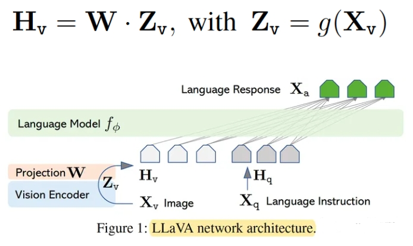
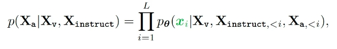
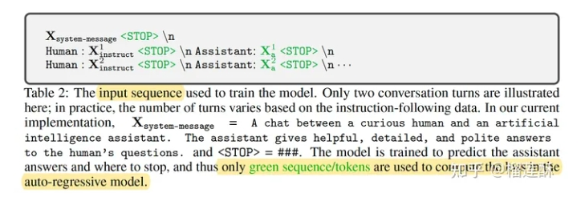
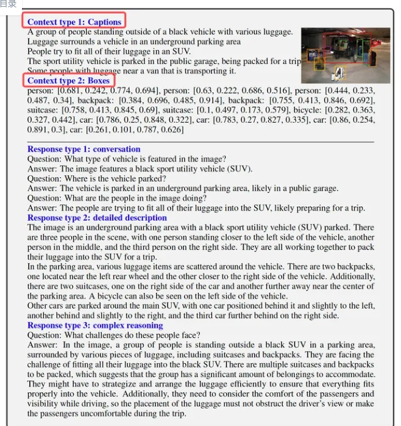

# LLaVA（Large Language and Vision Assistant）

> 论文名称：LLaVA（Large Language and Vision Assistant）
> 
> 论文地址：https://arxiv.org/pdf/2304.08485.pdf
> 
> GitHub 地址：https://github.com/haotian-liu/LLaVA

- [LLaVA（Large Language and Vision Assistant）](#llavalarge-language-and-vision-assistant)
  - [一、为什么需要 LLaVA?](#一为什么需要-llava)
  - [二、介绍一下 LLaVA？](#二介绍一下-llava)
  - [三、介绍一下 LLaVA 模型结构？](#三介绍一下-llava-模型结构)
  - [四、介绍一下 LLaVA 模型 训练过程 ？](#四介绍一下-llava-模型-训练过程-)
  - [其他细节](#其他细节)
  - [致谢](#致谢)

## 一、为什么需要 LLaVA?

1. 语言仅用于描述图像内容。虽然这使得语言在将视觉信号映射到语言语义（人类交流的常见渠道）方面发挥了重要作用，但它导致模型通常具有固定的界面，**在交互性和对用户指令的适应性上存在限制**;
2. Alpaca、Vicuna、GPT-4-LLM 利用各种机器生成的高质量指令跟踪样本来提高 LLM 的对齐能力，与专有 LLM 相比，展示出了令人印象深刻的性能。但遗憾的是，**这些模型的输入仅为文本**。

## 二、介绍一下 LLaVA？

使用仅限语言的GPT-4生成多模态语言图像指令跟随数据，提出一种**连接视觉编码器和LLM的端到端训练多模态大模型**。

## 三、介绍一下 LLaVA 模型结构？

使用视觉编码器CLIP ViT-L/14+语言解码器LLaMA构成多模态大模型，然后使用生成的数据进行指令微调。

输入图片X经过与训练好的视觉编码器的到图片特征Z，图片特征Z经过一个映射矩阵W转化为视觉Token H，这样Vison Token H_v与Language Token H_q指令就都在同一个特征空间，拼接后一起输入大模型。这里的映射层W也可以替换为更复杂的网络来提升性能，比如Flamingo中用的gated cross-attentio，BLIP-2中用的Q-former。

## 四、介绍一下 LLaVA 模型 训练过程 ？

- 训练：

使用如下图的方式组织每一轮的对话输入输出，训练模型预测助手的答案以及在哪里停止，因此仅使用绿色序列和标记来计算自回归模型中的损失，即根据所有前轮的指令和回答来预测当前目标回答X_a，也就是经典的next token prediction。

> 自回归损失-通过所有前轮的指令和回答来预测当前目标回答X_a

- 文中使用了两阶段的训练方式：

1. 预训练特征对齐模块（映射层W），冻结视觉编码器和LLM，只训练映射矩阵W得到上面公式的最大似然，相当于为冻结的 LLM 训练一个适配的visual tokenizer。
2. 端到端的微调语言模型+映射层。

## 其他细节

数据：

使用ChatGPT/GPT-4将数据转化为多模态指令跟随数据（multimodel instrustion-following data）。具体来说，为了将输入图像编码为视觉特征来作为纯文本 GPT的(soft) promt，文中用了两种类型的表达：

- caption描述：从不同角度描述视觉场景；
- bbox检测框：定位场景中的对象，每个框对对象概念及其空间位置进行编码。

通过这两类符合表示，将视觉内容传达给了语言大模型，然后人工设计了3种对话方式，利用GPT-4进行生成和扩充，分别是对话、细节描述和复杂推理。最后总共收集了158K独特的语言图像指令跟随样本，包括58K对话数据、23K详细描述数据、77K复杂推理数据。

## 致谢

- 多模态大模型 CLIP, LLaVA, LLaVA2, LLaVA, miniGPT4, InstructLLaVA 系列解读 https://zhuanlan.zhihu.com/p/653902791
- 对比学习损失（InfoNCE loss）与交叉熵损失的联系，以及温度系数的作用  https://zhuanlan.zhihu.com/p/506544456